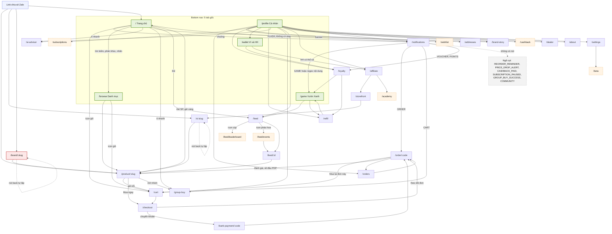
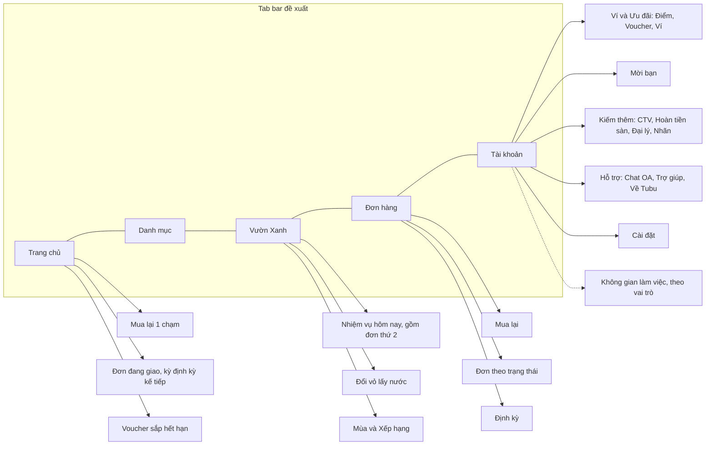

# A1 — Kiến trúc thông tin (IA) & điều hướng Zalo Mini App (`apps/miniapp`)

**Kết luận.** IA hiện tại được xây theo kiểu "mỗi tính năng một trang, mỗi trang một mục menu". Có 42 `<Route>`, nhưng chỉ khoảng 15 route phục vụ vòng mua cốt lõi. Phần còn lại (game, ví và 4 loại "tiền", cộng đồng, CTV, đại lý, chủ nhãn, công cụ nội bộ) cùng chen vào tầng 1: 5 tab và một hub Cá nhân có 17–21 mục. Vòng mua lại, thứ quyết định north-star, gần như vô hình. Home không có "Mua lại", và feed "Dành cho bạn" còn **loại trừ** mọi sản phẩm khách đã mua. Mua lại một đơn cũ tốn 6 chạm. Thông báo "sắp hết, đặt lại ngay" không có nút và chỉ nằm trong app. Tab thứ 4 dành cho "Ví & HH" chứ không cho Đơn hàng hay Giỏ. Song song là quá tải khái niệm: 4 loại tiền tiêu được, 2 lần điểm danh mỗi ngày, 3 bảng xếp hạng, chữ "vườn" gánh 6 nghĩa, và cộng đồng được viết cho một shop cây cảnh. Khung immersive thiếu tiêu đề trang. Trang lỗi 404 chỉ có "Thử lại". Nút back tự lặp khi khách mở gian hàng hoặc trang nhãn từ link chia sẻ. Không có link nào trỏ tới route không tồn tại, nhưng có nhiều link "đúng route, sai đích": thông báo cộng đồng dẫn vào Vườn Xanh, giờ vàng dẫn về Trang chủ, nút ở Hành trình nguyên liệu cho ra danh sách rỗng. Ngoài phạm vi IA thuần, khi lần theo các lối ra còn thấy 3 lỗi P0: phần thưởng nhiệm vụ không bao giờ được cộng, nút xoá tài khoản là giả, và nhắc mua lại là ngõ cụt.

> **Quy ước đường dẫn trong bằng chứng:** `pages/x.tsx`, `components/…`, `services/…`, `store/…`, `i18n/vi.ts`, `hooks/…`, `css/…` = `apps/miniapp/src/…`; `api/<module>/…` = `apps/api/src/modules/<module>/…`; `seed.ts`, `schema.prisma` = `apps/api/prisma/…`; `web/…` = `apps/web/src/…`; `app-config.json` = `apps/miniapp/app-config.json`. Trong bảng route, số trong ngoặc là số dòng của chính file trang đó. Mọi con số đếm đều lấy từ lệnh ở **Phụ lục A**.

---

## Hiện trạng

### 0. Số liệu tổng quan (lệnh ở Phụ lục A)

| Chỉ số | Giá trị |
|---|---|
| `<Route>` khai báo trong `components/app.tsx` | **42** (41 path + `*`). Đề bài ghi 44, thực tế là 42. |
| Page component | 41 (40 lazy + `HomePage` eager). `AcademyPage` phục vụ 2 route. |
| Dòng chứa `navigate(` trong src | 102 (trong đó có 1 dòng comment) |
| Tab bottom nav | 5: Trang chủ · Danh mục · **Vườn Xanh** (nút giữa) · **Ví & HH** · Cá nhân (`components/bottom-nav.tsx:19-25`) |
| Mục menu cố định ở Cá nhân | 17 (thêm tối đa 4 mục theo vai trò → 21) (`pages/profile.tsx:52-90, 125-152`) |
| Template thông báo trong seed | 39: **2 ZNS / 37 INAPP** (`seed.ts:627-672`) |
| Tổng dòng code của `pages/*.tsx` | 18.795. Lớn nhất: `game.tsx` 1.257, `dealer.tsx` 1.029, `loyalty.tsx` 1.003 |
| Phân bố 41 path theo nhóm | Mua sắm cốt lõi 15 · Thưởng/tương tác 12 · Nội dung thương hiệu 4 · CTV/đối tác 6 · Nội bộ 4 |

### 1. Kiểm kê route (42)

Đối tượng: **Tất cả** = kể cả chưa đăng nhập; **Khách** = đã đăng nhập Zalo hoặc khách vãng lai (`store/auth.ts:118-155` tự đăng nhập ngầm, fallback sang tài khoản khách).

| # | Route → trang | Mục đích | Đối tượng | Lối vào (entry points) | Lối ra chính | Guard |
|---|---|---|---|---|---|---|
| 1 | `/` → home.tsx | Trang chủ: tìm kiếm, phân khúc, nhãn, giờ vàng, gợi ý | Tất cả | Tab (`bottom-nav.tsx:20`); back fallback (`back-button.tsx:45`); 404 (`not-found.tsx:23`); "Tiếp tục mua sắm" (`checkout.tsx:207`); "Về trang chủ" (`bank-payment.tsx:149`); "Về Tubu Tree" (`storefront-context-bar.tsx:35`); thông báo FLASH không có slug (`notifications.tsx:300`); link `/?ref=` (`wallet.tsx:101`, `affiliate.tsx:282`) | /notifications (89), /cart (110), /browse (69, 128, 230, 265), /ai-advisor (157), /group-buy (180), /brand-story (339), /feed (375), PDP (`product-card.tsx:52`, `flash-sale.tsx:78`) | Không. "Dành cho bạn" cần đăng nhập (408) |
| 2 | `/browse` → browse.tsx | Danh mục (4 phân khúc) + tìm kiếm | Tất cả | Tab (`bottom-nav.tsx:21`); Home ×4; `brand-story.tsx:539`; `loyalty.tsx:651`; `game.tsx:1136`; empty state ở `cart.tsx:149,183`, `checkout.tsx:237`, `orders.tsx:100`, `subscriptions.tsx:160`, `group-buy.tsx:83`, `wishlist.tsx:36` | PDP (product-card), /cart (173) | Không |
| 3 | `/product/:slug` → product-detail.tsx | Trang sản phẩm (PDP) | Tất cả | `product-card.tsx:52` (Home, Danh mục, Yêu thích, SP liên quan); `flash-sale.tsx:78,315`; `cart.tsx:201`; `order-detail.tsx:194` (chỉ khi DELIVERED); `post-card.tsx:49`; `post-detail.tsx:356,386`; `ai-advisor.tsx:126`; `group-buy.tsx:71`; `storefront-view.tsx:77`; `brand-view.tsx:215`; link chia sẻ (238); Content Kit (`api/content-kit/content-kit.service.ts:50`) | /cart (703), /checkout (177), /group-buy (186), sheet Định kỳ (440), sheet Content Kit (547, chỉ CTV). **Không có link sang nhãn** | Cần đăng nhập khi thêm giỏ hoặc mua (212-230) |
| 4 | `/cart` → cart.tsx | Giỏ hàng | Khách | `home.tsx:110`; `browse.tsx:173`; `product-detail.tsx:703`; `order-detail.tsx:76` (Mua lại); `checkout.tsx:729`; `notifications.tsx:326` | /checkout (170), PDP (201), /browse (149, 183) | Query cần auth. Chưa đăng nhập thì hiện "giỏ trống" (138-153) |
| 5 | `/checkout` → checkout.tsx | Thanh toán | Khách | `cart.tsx:170`; `product-detail.tsx:177` | /bank-payment (181); màn thành công → /order (206), `/` hoặc gian hàng (`components/checkout/order-success.tsx:41-47`); /cart (729) | Auth; giỏ rỗng → empty state (228-241); ô thu gom chỉ hiện khi `recyclingEnabled` (49-50) |
| 6 | `/bank-payment/:code` → bank-payment.tsx | Hiện QR chuyển khoản | Khách, đại lý, CTV | `checkout.tsx:181`; `order-detail.tsx:534`; `dealer.tsx:370`; `components/affiliate/ctv-order-sheet.tsx:156` | /order (118, 143, 197), `/` (149) | Không có ở FE |
| 7 | `/orders` → orders.tsx | Danh sách đơn | Khách | `profile.tsx:56`; `notifications.tsx:285` (khi thiếu mã đơn); `order-detail.tsx:554` | /order (114), /browse (100) | Auth (45) |
| 8 | `/order/:code` → order-detail.tsx | Chi tiết đơn | Khách, đại lý, CTV | `orders.tsx:114`; `checkout.tsx:206`; `bank-payment.tsx:118,143,197`; `notifications.tsx:285`; `dealer.tsx:662`; `ctv-order-sheet.tsx:179` | /cart (76), /bank-payment (534), /orders (554), PDP (194), chat OA (489, chỉ khi có OA), tra cứu vận đơn (273), PDF hoá đơn (341) | Auth (48); 404 → ErrorState (106-112) |
| 9 | `/game` → game.tsx | Vườn Xanh (game) | Khách | Tab giữa (`bottom-nav.tsx:22`); `loyalty.tsx:339`; `refill.tsx:173`; `notifications.tsx:313` | /feed (325), /refill (365), /browse (1136) | Cổng đăng nhập (266-278) |
| 10 | `/feed` → feed.tsx | Cộng đồng hỏi đáp | Khách | `home.tsx:375`; `game.tsx:325`; `profile.tsx:63`; `post-card.tsx:67` (`?tag=`); `post-detail.tsx:137`; `feed.tsx:231` | /feed/leaderboard (117), /feed/events (138), /feed/:id (268), sheet đăng bài | Cổng đăng nhập (84-99) |
| 11 | `/feed/leaderboard` → community-leaderboard.tsx | Bảng xếp hạng điểm uy tín | Khách | **Chỉ** icon cúp không nhãn (`feed.tsx:117`) | **Không có** | Cổng đăng nhập (39-51) |
| 12 | `/feed/events` → community-events.tsx | Sự kiện / cuộc thi | Khách | **Chỉ** icon (`feed.tsx:138`) | /feed/:id (299), sheet dự thi | Cổng đăng nhập (61-73) |
| 13 | `/feed/:id` → post-detail.tsx | Chi tiết bài viết | Khách | `feed.tsx:268`; `community-events.tsx:299`. Thông báo COMMUNITY_* **không** dẫn tới đây | PDP (356, 386), /feed sau khi xoá (137) | Cổng đăng nhập (151-166) |
| 14 | `/ai-advisor` → ai-advisor.tsx | Chat AI tư vấn | Khách | `home.tsx:157`; `profile.tsx:60` | PDP (126) | Không |
| 15 | `/group-buy` → group-buy.tsx | Mua chung theo nhóm | Khách | `home.tsx:180`; `profile.tsx:58`; `product-detail.tsx:186` | PDP (71), /browse (83) | Tham gia nhóm cần đăng nhập (72) |
| 16 | `/refill` → refill.tsx | Đổi vỏ chai lấy 💧 (chờ quản lý duyệt) | Khách | `game.tsx:365`; `loyalty.tsx:376`; `profile.tsx:59` | /game (173) | Auth (34) |
| 17 | `/beta` → beta.tsx | Đăng ký beta + góp ý | Khách | **Chỉ** `settings.tsx:93` | **Không có** | Auth (24) |
| 18 | `/profile` → profile.tsx | Hub tài khoản | Khách | Tab (`bottom-nav.tsx:24`) | 17–21 mục menu (52-152), /edit-profile (222), /loyalty (296), /wallet (298) | Theo trạng thái auth (156-189) |
| 19 | `/loyalty` → loyalty.tsx | Hạng, điểm danh Điểm Xanh, đổi quà, kho voucher, thẻ QR | Khách | `profile.tsx:69,296`; `wallet.tsx:206`; `notifications.tsx:339` | /game (339), /refill (376), /browse (651) | Hiện skeleton khi chưa auth (165) |
| 20 | `/wallet` → wallet.tsx | Ví Tubu + TubuXu + Điểm Xanh + hoa hồng + hoàn tiền | Khách/CTV | Tab (`bottom-nav.tsx:23`); `profile.tsx:70,298` | /loyalty (206), /affiliate (291, chỉ khi có hoa hồng duyệt), chia sẻ mã (98) | Hiện skeleton khi chưa auth (110) |
| 21 | `/addresses` → addresses.tsx | Sổ địa chỉ | Khách | `profile.tsx:62`; `settings.tsx:92`; `components/subscribe-sheet.tsx:83` | (sheet thêm/sửa) | Auth |
| 22 | `/notifications` → notifications.tsx | Hộp thông báo | Khách | `home.tsx:89`; `profile.tsx:83` | /order, /orders, PDP hoặc `/`, /game, /cart, /loyalty, /storefront (278-357) | Auth (71-72) |
| 23 | `/affiliate` → affiliate.tsx | Đăng ký + dashboard CTV | Khách → CTV | `profile.tsx:76`; `wallet.tsx:291` | /storefront (503), /academy (509), sheet lên đơn hộ → /bank-payment hoặc /order | `isAffiliate` → Dashboard, ngược lại → RegisterGate (80) |
| 24 | `/academy` → academy.tsx | Danh sách khoá học CTV | CTV | `affiliate.tsx:509`; `academy.tsx:26` | /academy/:id (28) | Không |
| 25 | `/academy/:courseId` → academy.tsx | Chi tiết khoá học | CTV | `academy.tsx:28` | Back về danh sách (26, 143), video (203) | Không |
| 26 | `/cashback` → cashback.tsx | Hoàn tiền mua ở sàn ngoài | Khách | **Chỉ** `profile.tsx:77` | Link sàn ngoài (47) | Auth cho phần giao dịch (37) |
| 27 | `/dealer` → dealer.tsx | Đăng ký / kênh đại lý | Khách → đại lý | `profile.tsx:85` (126-129); `brand-view.tsx:253` | /bank-payment (370), /order (662) | Máy trạng thái (69-71) |
| 28 | `/about` → about.tsx | Giới thiệu, FAQ, hỗ trợ, chính sách, xoá tài khoản | Tất cả | **Chỉ** `profile.tsx:87` | Sheet chính sách (171-173) | Không |
| 29 | `/wishlist` → wishlist.tsx | Sản phẩm yêu thích | Khách | **Chỉ** `profile.tsx:61` | PDP, /browse (36) | Auth (14) |
| 30 | `/edit-profile` → edit-profile.tsx | Sửa hồ sơ | Khách | `profile.tsx:222`; `settings.tsx:91` | `navigate(-1)` sau khi lưu (125) | Auth |
| 31 | `/settings` → settings.tsx | Cài đặt | Khách | `profile.tsx:86` | /edit-profile (91), /addresses (92), /beta (93) | Không |
| 32 | `/brand-story` → brand-story.tsx | Bản đồ nguồn gốc 8 nhãn (nội dung chép cứng) | Tất cả | `home.tsx:339`; `profile.tsx:84` | `/browse?brand=` (539) | Không |
| 33 | `/subscriptions` → subscriptions.tsx | Quản lý đặt định kỳ | Khách | **Chỉ** `profile.tsx:57` | /browse (160) | Hiện skeleton khi chưa auth (75) |
| 34 | `/storefront` → storefront-builder.tsx | Dựng gian hàng CTV | CTV | `affiliate.tsx:503`; `notifications.tsx:352` | /s/:slug (446) | BE chỉ cho AFFILIATE/ADMIN (`api/storefront/storefront.service.ts:39-41`) |
| 35 | `/s/:slug` → storefront-view.tsx | Gian hàng CTV công khai | Khách (từ link) | `storefront-builder.tsx:446`; link chia sẻ (`components/share-sheet.tsx:32-36`); back fallback; `order-success.tsx:43` | PDP (77), chia sẻ (112). **Không có giỏ** | Không |
| 36 | `/brand/:slug` → brand-view.tsx | Trang nhãn | Khách (từ link) | `brand-owner.tsx:144`; link chia sẻ (281-288); back fallback; `order-success.tsx:43` | PDP (215), /dealer (253), theo dõi (272), chia sẻ (276). **Không có giỏ** | Không |
| 37 | `/brand-owner` → brand-owner.tsx | Chủ nhãn sửa thông tin và khuyến mãi | Chủ nhãn | `profile.tsx:138` (chỉ khi sở hữu nhãn) | /brand/:slug (144) | 404 → empty state (24-40) |
| 38 | `/admin` → admin.tsx | Nhân sự, duyệt ca, lương, duyệt đổi vỏ | Admin | `profile.tsx:150` | /admin/community (109) | role ADMIN (71) |
| 39 | `/admin/community` → community-moderation.tsx | Kiểm duyệt cộng đồng | Admin | **Chỉ** `admin.tsx:109` | — | role ADMIN (51) |
| 40 | `/staff` → staff.tsx | Ca làm & chấm công | Staff/Admin | `profile.tsx:146` | — | role STAFF/ADMIN (62) |
| 41 | `/my-payroll` → my-payroll.tsx | Lương của tôi | Staff/Admin | `profile.tsx:147` | — | role STAFF/ADMIN (35) |
| 42 | `*` → not-found.tsx | Trang 404 | — | URL không khớp route | `/` (23) | — |

**Cờ tính năng.** Toàn app chỉ có 3 cờ: `recyclingEnabled` (`checkout.tsx:49-50`, lấy từ public config), `seasonPass.active` (`game.tsx:635`) và `hasOA` (`services/zmp-bridge.ts:129-130`, theo env). Không có cơ chế ẩn hoặc hiện các tính năng phụ (AI, Mua chung, Hoàn tiền sàn, Beta…) theo cấu hình (`hooks/use-public-config.ts:8-17`).

**Link chia sẻ và deep link vào app.**
- PDP chia sẻ `/product/:slug` **không** gắn `?ref=` (`product-detail.tsx:232-242`).
- Content Kit chia sẻ `${app.miniapp_base_url}/product/:slug?ref=` (`api/content-kit/content-kit.service.ts:49-50`).
- Gian hàng và nhãn chia sẻ `/s/:slug?ref=` hoặc `/brand/:slug?ref=` (`components/share-sheet.tsx:32-36`).
- Mã giới thiệu chia sẻ `/?ref=CODE` (`wallet.tsx:101`, `affiliate.tsx:282`).
- Link CTV dạng web `shop.tubutree.com/?ref=&l=` (`affiliate.tsx:606-607`).
- `?s=` và `?ref=` được đọc ở cả search lẫn hash (`components/app.tsx:135-145`, `services/zmp-bridge.ts:142-157`).
- **ZNS:** chỉ ORDER_CONFIRMED và ORDER_SHIPPING dùng kênh ZNS, và seed không có `zaloTemplateId` (`seed.ts:627-628`, `schema.prisma:2000`). Nút deep link bên trong template ZNS được cấu hình phía Zalo, nên **UNKNOWN**.
- **OA:** chat OA chỉ có ở chi tiết đơn (`order-detail.tsx:486-499`). Repo không có giá trị `VITE_ZALO_OA_ID` (`apps/miniapp/.env` chỉ chứa `APP_ID`, `ZMP_TOKEN`).

### 2. Sơ đồ điều hướng app khách (hiện trạng)



Chú giải: đỏ = mồ côi với khách trong app; cam nét đứt = chỉ có 1 lối vào hoặc lối vào khuất; xám = ngõ cụt.

### 3. Mồ côi, ngõ cụt, link hỏng, xử lý tham số

**3a. Mồ côi hoặc khó tới**

| Route | Lối vào duy nhất | Nhận xét |
|---|---|---|
| `/brand/:slug` | Link chia sẻ; nút xem trước của chủ nhãn (`brand-owner.tsx:144`) | Khách trong app **không có đường tới**. Tên nhãn trên PDP chỉ là chữ (`product-detail.tsx:252-259, 666-668`). Chip nhãn ở Home (`home.tsx:67-70`) và nút ở Hành trình nguyên liệu (`brand-story.tsx:531-545`) đều dẫn sang `/browse?brand=`. Trong khi đó "Theo dõi nhãn" lại là đầu vào của "Dành cho bạn" (`api/catalog/catalog.service.ts:184-194`). |
| `/beta` | Cài đặt, ở tầng 3 (`settings.tsx:93`) | Trang không có tính năng nào để thử (xem A1-29). |
| `/feed/leaderboard`, `/feed/events` | Icon không nhãn trên header feed (`feed.tsx:111-152`) | Không có đường nào khác. |
| `/cashback`, `/wishlist`, `/subscriptions`, `/about` | Mỗi route 1 mục trong menu Cá nhân | Không có lối theo ngữ cảnh. Thẻ "Hoàn tiền đã duyệt" ở Ví không bấm được (`wallet.tsx:297`); tạo định kỳ xong không dẫn tới trang quản lý (`subscribe-sheet.tsx:34-39`). |
| `/academy/:courseId` | Danh sách khoá học | Comment nói CTV gửi được link tới từng khoá (`components/app.tsx:179-181`), nhưng trang không có nút chia sẻ khoá. |

**3b. Ngõ cụt** (trang hoặc trạng thái không có CTA đi tiếp)

| Trang / trạng thái | Bằng chứng |
|---|---|
| Chi tiết thông báo của 9 nhóm template: REORDER_REMINDER, PRICE_DROP_ALERT, CASHBACK_PAID, SUBSCRIPTION_PAUSED, SUBSCRIPTION_ORDER_FAILED, GROUP_BUY_SUCCESS, COMMUNITY_*, DEALER_*, REFILL_REJECTED | `notifications.tsx:236-245, 278-357` (không có nhánh CTA nào khớp); nội dung template ở `seed.ts:638-668` |
| Bảng xếp hạng cộng đồng: các dòng không bấm được | `community-leaderboard.tsx:93-135` |
| Beta: danh sách tính năng không có link | `beta.tsx:121-141` |
| Hỗ trợ ở `/about`: hotline, OA, email chỉ là chữ | `about.tsx:163-167` |
| Hồ sơ đại lý đang chờ duyệt / tài khoản "chưa có nhãn" / trang nội bộ khi sai vai trò: chỉ có dòng chữ | `dealer.tsx:161-175`; `brand-owner.tsx:28-36`; `admin.tsx:71-80`; `staff.tsx:62-72`; `my-payroll.tsx:35-44` |
| Kho voucher: các dòng không bấm được | `loyalty.tsx:576-601` |
| Thẻ lịch định kỳ: không bấm được, không mở PDP hay đơn | `subscriptions.tsx:84-151` |
| ErrorState chung chỉ có "Thử lại", kể cả với 404 | `components/ui/empty-state.tsx:107-131` |
| Lỗi tải dữ liệu CTV: chỉ có chữ, không có nút thử lại | `affiliate.tsx:70-77` |
| `/storefront` với người chưa là CTV: bấm "Tạo gian hàng" thì BE báo lỗi, không có lối sang đăng ký CTV | `storefront-builder.tsx:49-66`; `api/storefront/storefront.service.ts:39-41` |
| Hỗ trợ ở chi tiết đơn khi thiếu OA: chỉ còn dòng chữ "Cần hỗ trợ? Nhắn Tubu qua Zalo OA" | `order-detail.tsx:495-498`; `i18n/vi.ts:170` |

**3c. Link hỏng hoặc sai đích.** Mọi đích `navigate()` đều là route đã khai báo (lệnh A-4). Các lỗi dưới đây là **đúng route nhưng sai đích**:

| Link | Vấn đề | Bằng chứng |
|---|---|---|
| Thông báo COMMUNITY_NEW_ANSWER / EXPERT_REPLIED | Nhánh CTA chọn theo regex trên nội dung, khớp một trong các từ "cây", "vườn", "tưới", "khát", "chuỗi". Tiêu đề câu hỏi kiểu "Lá cây lưỡi hổ…" (chính là placeholder gợi ý) sẽ ra nút "Đến Vườn Xanh". Payload không có id bài nên không thể mở đúng bài. | `notifications.tsx:236`; `i18n/vi.ts:323`; `api/feed/community-feed.service.ts:643-647` |
| Thông báo FLASH_STARTING | FE chờ `product_slug`, nhưng BE chỉ gửi tên sản phẩm, nên khách bị đưa về Trang chủ | `notifications.tsx:243, 300`; `api/flash-sale/flash-sale.service.ts:322` |
| Nút "Khám phá sản phẩm …" ở Hành trình nguyên liệu | Tên nhãn chép cứng lệch với catalog seed ("Le Plateau" ≠ "Le Plateau Coffee", "Sokfarm" ≠ "Sokfram"), mà bộ lọc so khớp chính xác, nên danh sách có thể rỗng. Tên nhãn thật trên prod đến từ Pancake: UNKNOWN. | `brand-story.tsx:76, 98`; `seed.ts:469, 525`; `api/catalog/catalog.service.ts:57-62` |
| Hero "Khám phá vườn" ở Home | Nhãn gợi ý vào Vườn Xanh nhưng thực tế mở ô tìm kiếm | `home.tsx:224-246` |
| Chia sẻ trong Content Kit | Cùng một chuỗi vừa làm `path` cho `zmp_deep_link` vừa làm link để copy. Khi đặt base URL thì path tuyệt đối (sai với deep link); khi không đặt thì link copy là đường dẫn tương đối. Cần verify trên máy thật. | `api/content-kit/content-kit.service.ts:49-50`; `components/content-kit-sheet.tsx:85-99` |
| Nút back ở `/s/:slug` và `/brand/:slug` khi mở từ link | History idx = 0 nên back điều hướng tới `/s/${sfSlug}`, mà `sfSlug` chính là trang đang xem → vòng lặp | `components/back-button.tsx:43-45`; `storefront-view.tsx:26-28`; `brand-view.tsx:38-40` |

**3d. Tham số route và slug/code không tồn tại**

| Trường hợp | Hành vi hiện tại | Bằng chứng |
|---|---|---|
| `/product/<slug không có hoặc ngừng bán>` | 404 "Không tìm thấy sản phẩm." + nút "Thử lại" (gọi lại cũng vẫn 404). Không gợi ý SP tương tự, không có lối về Home. | `api/catalog/catalog.service.ts:102`; `product-detail.tsx:192-198` |
| `/order/<mã lạ hoặc của người khác>` | "Không tìm thấy đơn hàng." + "Thử lại". Không có link về /orders. | `api/orders/orders.service.ts:53`; `order-detail.tsx:106-112` |
| `/s/<lạ>`, `/brand/<lạ>`, `/feed/<lạ>` | Thông báo lỗi từ BE + "Thử lại" | `storefront-view.tsx:31`; `brand-view.tsx:77-85`; `post-detail.tsx:172-178` |
| `/bank-payment/<lạ>` | "Không tải được…" + "Xem đơn hàng" → lại rơi vào lỗi ở `/order/<lạ>` | `bank-payment.tsx:110-123` |
| `/browse?segment=<lạ>` | Chip hiện key thô `{segment} ✕`, danh sách rỗng, empty state không có CTA | `browse.tsx:302, 357` |
| Mở deep link khi chưa đăng nhập xong | Request bị giữ cho tới khi `restore()` xong (`store/auth.ts:113-163`). Riêng `OnboardingGate` phủ toàn màn trên **mọi** route (`components/app.tsx:203`, xem A1-18). | — |
| URL không khớp route nào | NotFound có nút "Về trang chủ" (tốt) | `not-found.tsx:22-27` |

**3e. Ma trận thông báo → CTA** (BE `notify()` → FE `notifications.tsx:231-357`)

| Template (seed) | Payload BE | CTA hiện tại | Đích nên có |
|---|---|---|---|
| ORDER_* (CONFIRMED, PACKED, SHIPPING, DELIVERED, CANCELLED, RETURNED), INVOICE_ISSUED, RETURN_*, SUBSCRIPTION_ORDER | `order_code` | "Xem chi tiết đơn" ✓ | DELIVERED nên thêm "Đánh giá" và "Mua lại" |
| CART_ABANDONED | item_count, product | "Xem giỏ hàng" ✓ | ✓ |
| GAME_CHECKIN_REMINDER / GAME_TREE_THIRSTY / GAME_WATER_GIFT | streak / — / amount | "Đến Vườn Xanh" ✓ | ✓ |
| WELCOME / BIRTHDAY / WINBACK / MILESTONE / VOUCHER_EXPIRING, POINTS_EXPIRING | code, value, expires | "Xem ưu đãi" → **đầu** /loyalty; voucher nằm ở khối thứ 7 | Voucher của tôi → Dùng ngay |
| FLASH_STARTING | chỉ có `product` (tên) | → `/` (`flash-sale.service.ts:322`) | PDP đúng phân loại |
| STOREFRONT_TRENDING_PRODUCTS | count, sample | → /storefront ✓ | ✓ |
| **REORDER_REMINDER** | chỉ có `product` (tên) (`lifecycle.service.ts:103`) | **Không có** | "Mua lại ngay" 1 chạm |
| PRICE_DROP_ALERT | chỉ có `product` (`lifecycle.service.ts:145`) | **Không có** (có thể sai sang Vườn nếu tên SP chứa "cây") | PDP |
| CASHBACK_PAID | amount (`cashback.service.ts:363`) | **Không có** | Ví |
| SUBSCRIPTION_PAUSED / _ORDER_FAILED | — / reason (`subscriptions.service.ts:191, 197, 275`) | **Không có** | Định kỳ |
| GROUP_BUY_SUCCESS | discount (`groupbuy.service.ts:162`) | **Không có** | PDP có mã |
| COMMUNITY_NEW_ANSWER / EXPERT_REPLIED / BEST_ANSWER / POST_APPROVED | author, title (không có id) | Không có, hoặc **sai sang Vườn** | /feed/:id |
| DEALER_*, REFILL_REJECTED | — | **Không có** | /dealer, /refill |

Nhánh `COMMISSION*` trong `notificationMeta` (`notifications.tsx:26`) là code chết: grep không thấy chỗ nào gửi template `COMMISSION_*` (lệnh A-7).

### 4. Chồng chéo và trùng lặp

| Cụm | Hiện trạng (bằng chứng) | Vấn đề | Ứng viên gộp / bỏ | Tác động north-star |
|---|---|---|---|---|
| Điểm danh ở game vs điểm danh loyalty vs Season Pass | Hai nút điểm danh và hai chuỗi riêng: `game.tsx:423-438` (💧) và `loyalty.tsx:252-331` (Điểm Xanh; dòng 328-330 nói rõ là tách riêng). XP của Season Pass cũng tính theo điểm danh (`i18n/vi.ts:421`). Thêm hứng sương (`game.tsx:485-493`), quiz (895-941), vòng quay tốn Điểm Xanh (`components/wheel.tsx:138`). | Ít nhất 5 việc "hằng ngày", 2 chuỗi, 3 loại tiền | Chỉ giữ 1 điểm danh trong Vườn Xanh, thưởng cả 💧 lẫn Điểm Xanh. Season Pass là thước tiến độ duy nhất. Widget ở loyalty đổi thành lối tắt. | Gián tiếp: điểm danh không tạo đơn, nhưng dọn chỗ cho nhiệm vụ gắn với mua hàng |
| Hoàn tiền vs Ví vs Loyalty | Tab Ví hiện 6 con số số dư (`wallet.tsx:137, 192, 224, 282, 287, 297`). Hoàn tiền đang chờ lặp ở `cashback.tsx:74-79`, Điểm Xanh lặp ở `loyalty.tsx:190`, Điểm + Ví lặp ở `profile.tsx:293-298`. | Ví là tab gốc nhưng 3/6 con số chỉ có nghĩa với CTV hoặc người dùng hoàn tiền | Gộp thành "Ví & Ưu đãi" trong Tài khoản: tab Ví (Ví + Xu + sổ giao dịch) và tab Điểm & Voucher. Hoàn tiền sàn chuyển vào hub "Kiếm thêm". Ẩn thẻ hoa hồng khi `!isAffiliate`. | Trung bình |
| Refill vs Đặt định kỳ | "Trạm Refill & Đổi vỏ" (`profile.tsx:59`) đứng cạnh "Đặt định kỳ" (57) trong nhóm "Mua sắm". Thực chất là yêu cầu đổi vỏ lấy 💧, chờ duyệt (`refill.tsx:37-49, 57-64`). | Chữ "Refill" gợi mua gói refill, nhưng không có SKU refill nào | Đổi tên thành "Đổi vỏ lấy nước" và chuyển vào Vườn Xanh. Dành chữ "Refill" cho gói refill và định kỳ. | Có, nếu làm gói refill định kỳ |
| Feed vs Sự kiện / BXH vs Chi tiết bài vs bảng tin game | BXH và Sự kiện chỉ vào được qua icon (`feed.tsx:111-152`). Có 3 bảng xếp hạng (`community-leaderboard.tsx`; `game.tsx:993-1006` và `1008-1061`). Feed trộn bài tự sinh từ game (Thu hoạch, Sưu tập, Mốc; `components/community/post-card.tsx:10-18`). | Khó tìm, BXH trùng nhau, Q&A bị loãng | /feed có 3 tab: Hỏi đáp (mặc định) · Sự kiện · BXH. Bài từ game về lại Vườn. Q&A hiện trên PDP. | Cao, với Q&A gắn sản phẩm |
| AI advisor / Mua chung / Beta | AI: `home.tsx:150-174` và `profile.tsx:60`. Mua chung: `home.tsx:176-197`, `profile.tsx:58`, `product-detail.tsx:499-536`. Beta: `settings.tsx:93`. | Chiếm đầu Home và nhóm "Mua sắm" | AI vào từ ô tìm kiếm và PDP. Mua chung chỉ ở PDP, cộng khối trên Home khi đang có nhóm mở. Beta gộp vào Cài đặt hoặc bỏ. | Thấp |
| About vs Hành trình nguyên liệu vs trang nhãn | Sứ mệnh, FAQ, hỗ trợ ở `about.tsx:70-90`; bản đồ 8 nhãn chép cứng ở `brand-story.tsx`; câu chuyện từng nhãn ở `brand-view.tsx:259-264`. Hai mục menu riêng (`profile.tsx:84, 87`). | 3 nơi cùng kể chuyện thương hiệu | "Về Tubu Tree" (câu chuyện + hành trình nguyên liệu) và "Trợ giúp" (FAQ từ `/faqs`, chính sách, liên hệ). Từng nhãn dẫn tới `/brand/:slug`. | Không |
| Trang admin/staff trong app khách | `profile.tsx:142-152`; `admin.tsx:84-120` | 4 route nội bộ và 3 route đối tác nằm chung hub khách | Một mục "Không gian làm việc". Chuyển phần quản trị sang web admin. | Không |
| Mã giới thiệu ở 3 nơi | `profile.tsx:268-288`; `wallet.tsx:239-278`; `affiliate.tsx:517-563`, cùng dùng `user.referralCode` (`api/wallet/coins.service.ts:50`, `api/affiliate/affiliate.service.ts:53`) | 3 lời hứa khác nhau | Một mục "Mời bạn" duy nhất | Gián tiếp |
| Voucher ở 3 nơi | Kho voucher ở `loyalty.tsx:565-609`; chip copy mã trên PDP (`product-detail.tsx:383-428`); `components/checkout/voucher-sheet.tsx` | Chỉ loyalty có kho voucher | Trang "Voucher của tôi" riêng | Cao |

**Tiền tệ và số dư khách phải tiếp xúc**

| Đơn vị | Loại | Kiếm từ | Tiêu vào | Hiện ở |
|---|---|---|---|---|
| **Điểm Xanh** | Điểm giảm giá, hạn 12 tháng (`about.tsx:19`) | Đơn đã giao (`checkout.tsx:652-659`), đánh giá (`components/reviews-section.tsx:300-302`), điểm danh loyalty (`loyalty.tsx:276-294`), vòng quay (`wheel.tsx:176`). Nhiệm vụ game **hứa** thưởng nhưng không cộng (A1-02). | Trừ tiền đơn (`checkout.tsx:417-453`), đổi voucher (`loyalty.tsx:461-563`), **quay vòng quay trong game** (`wheel.tsx:138`, `api/game/game.service.ts:104-120`) | `home.tsx:221`; `profile.tsx:293-297`; `wallet.tsx:224`; `loyalty.tsx:190`; `checkout.tsx:436-450`; `order-detail.tsx:210, 218-222`; `order-success.tsx:114-118` |
| **TubuXu** | Tiền trong app, không rút được | Đổi từ Ví ×1.2 (`wallet.tsx:311-351`), giới thiệu bạn (245-258), mốc CTV (`affiliate.tsx:219`), sự kiện cộng đồng (`community-events.tsx:186-189`), Season Pass (`i18n/vi.ts:430-431`) | Trả đơn (`checkout.tsx:258-262`), mua 💧, cây thật, lô đất (`game.tsx:549-558, 613-623`) | `wallet.tsx:192`; `checkout.tsx:260`; game |
| **💧 Nước** (trong code là `seeds`; loyalty gọi là "hạt giống", `loyalty.tsx:329`) | Tiền trong game | Điểm danh game, hứng sương, quiz, đổi vỏ (`refill.tsx:118`), bạn tặng, vòng quay, Season Pass | Tưới cây, vé giữ lửa, hồi sinh chuỗi, mở lô đất | `game.tsx` (25 dòng có 💧); `refill.tsx:118`; `profile.tsx:59` |
| **Ví Tubu** (VNĐ) | Tiền thật | Hoàn tiền sàn, tiền hoàn khi đổi trả (`order-detail.tsx:453`), hoa hồng nhận về | Trả đơn (`checkout.tsx:254-257`), rút về ngân hàng (`wallet.tsx:353-398`), đổi sang Xu | `profile.tsx:298`; `wallet.tsx:137`; `checkout.tsx:255` |
| Hoa hồng chờ duyệt / có thể rút | Số dư chờ (CTV) | Đơn qua link giới thiệu | Nhận về ví hoặc rút | `wallet.tsx:282, 287`; `affiliate.tsx:305-316, 461-470` |
| Hoàn tiền đã duyệt, chờ về Ví | Số dư chờ | Sàn ngoài | Tự vào Ví | `wallet.tsx:297`; `cashback.tsx:77-79` |
| XP Chặng Mùa | Thước tiến độ | Điểm danh | Mở bậc thưởng | `game.tsx:641-657` |
| Điểm uy tín | Thước tiến độ cộng đồng | Trả lời, câu trả lời hay nhất | Xếp hạng | `community-leaderboard.tsx:131`; `i18n/vi.ts:385` |
| Vé giữ lửa 🧊 | Vật phẩm | Mua bằng 💧 | Giữ chuỗi | `game.tsx:472-483` |
| 2 chuỗi 🔥 | Thước tiến độ | Điểm danh game và điểm danh loyalty | — | `game.tsx:427`; `loyalty.tsx:278` |

**Đánh giá tải nhận thức.** Một khách thường gặp **4 loại tiền tiêu được** (Điểm Xanh, TubuXu, 💧, Ví), **4 thước tiến độ** (XP, điểm uy tín, 2 chuỗi) và **2 số dư chờ**, chưa kể voucher. Riêng tab Ví đã có 6 con số số dư. Màn thanh toán có 3 kho giá trị cộng voucher. Riêng Vườn Xanh dùng 💧, xu, Điểm Xanh và XP cùng lúc (nhãn nhiệm vụ "+20đ" còn đọc thành 20 đồng, `game.tsx:962-964`). Chữ "hạng" dùng cho 4 hệ: hạng thành viên (`seed.ts:230-260`), cấp cộng đồng (`i18n/vi.ts:386-389`, trong đó "Cổ thụ" trùng tên với hạng thành viên "Cổ Thụ" ở `loyalty.tsx:39`), bậc CTV và bậc đại lý (`seed.ts:271-274`). Mức phổ biến ở các app dẫn đầu là 1 loại điểm thưởng cộng 1 ví. Hệ hiện tại buộc khách tự làm phép quy đổi trước khi biết "mình còn bao nhiêu để dùng cho đơn sau", nên làm loãng động lực quay lại.

### 5. Khung chung (global chrome)

**5a. Header và nút back**
- `app-config.json:9` đặt `"actionBarHidden": true`. Nút back nổi 44px ở góc trên trái (`components/back-button.tsx:33-66`). CSS chừa 48px ở đầu mọi trang con (`css/tokens.css:162-168`), nhưng **không có component tiêu đề**.
- Các trang sau vào thẳng nội dung, không có tên trang (đã đọc code): giỏ (`cart.tsx:174-191`), thanh toán (`checkout.tsx:273-279`), đơn hàng (`orders.tsx:51-53`), thông báo (`notifications.tsx:111-121`), yêu thích (`wishlist.tsx:17-21`), sổ địa chỉ (`addresses.tsx:80-92`), cài đặt (`settings.tsx:52-54`), định kỳ (`subscriptions.tsx:60-67`), hoàn tiền (`cashback.tsx:53-76`), ví (`wallet.tsx:109-135`), hạng thành viên (`loyalty.tsx:163-187`), CTV (`affiliate.tsx:287-305`), đại lý (`dealer.tsx:186-197`), sửa hồ sơ (`edit-profile.tsx:142`), Hành trình nguyên liệu (`brand-story.tsx:113-118`), quản trị (`admin.tsx:91-92`).
- Có 3 kiểu nút back: nút nổi; link "‹" nằm trong trang (`academy.tsx:143`, `community-events.tsx:223-236`); thanh back riêng của overlay thông báo (`notifications.tsx:194-223`).
- `/wallet` là tab gốc nhưng vẫn hiện nút back khi đi từ Cá nhân, vì trang Cá nhân truyền `state.from` (`back-button.tsx:22-24`; `profile.tsx:298, 322`). Khi đó đầu trang bị đệm thêm 48px, nên layout khác nhau tuỳ cách vào.
- `wallet.tsx:2` là trang duy nhất dùng `useNavigate` của `react-router-dom` thay vì của `zmp-ui` (lệnh A-10).
- Thanh ngữ cảnh gian hàng chỉ có ở PDP và giỏ (`cart.tsx:176`, `product-detail.tsx:247`), không có ở checkout. Thanh chỉ có nút "Về Tubu Tree", không có "Về gian hàng" (`storefront-context-bar.tsx:28-39`).

**5b. Bottom nav** (`components/bottom-nav.tsx:19-25`)

Thứ tự: Trang chủ · Danh mục · **Vườn Xanh** (nút tròn nổi ở giữa) · **Ví & HH** · Cá nhân. Bottom nav ẩn trên mọi trang con (33). Không có tab Giỏ hay Đơn hàng. Giỏ chỉ cách 1 chạm ở Trang chủ, Danh mục và PDP (`home.tsx:106-115`, `browse.tsx:167-188`, `product-detail.tsx:699-719`). Ở Vườn Xanh, Ví và Cá nhân không có icon giỏ, và gian hàng CTV cũng như trang nhãn không có giỏ. "HH" là viết tắt của hoa hồng, khó hiểu với khách thường.

**5c. Hub Cá nhân hiện tại** (`pages/profile.tsx:52-152`)

| Nhóm | Các mục | Nhận xét |
|---|---|---|
| Mua sắm (56-63) | Đơn hàng, Đặt định kỳ, Mua chung, Trạm Refill & Đổi vỏ, Trợ lý AI, Yêu thích, Sổ địa chỉ, Cộng đồng hỏi đáp | 8 mục, trong đó 4 mục không phải mua sắm (đổi vỏ, AI, cộng đồng, sổ địa chỉ) |
| Tài sản (69-70) | Hạng & Điểm Xanh, Ví Tubu | Thiếu TubuXu và Voucher |
| Kiếm thưởng (76-77, 138) | CTV, Hoàn tiền sàn ngoài, (Quản lý nhãn) | Quản lý nhãn là vai trò kinh doanh, không phải "kiếm thưởng" |
| Khác (83-87) | Thông báo, Câu chuyện thương hiệu, Đăng ký đại lý, Cài đặt, Về Tubu & Hỗ trợ | Thông báo, mục dùng thường xuyên, bị đặt cuối. Đại lý (B2B) nằm lẫn với khách. |
| Công việc (146-150) | Ca làm, Lương, Quản trị | Theo vai trò |

Hub không có hàng trạng thái đơn (Chờ thanh toán / Đang giao / Chờ đánh giá): profile chỉ có 4 query, không query nào về đơn (lệnh A-9). Set `READY` (22-50) là code chết vì mục nào cũng đã READY. Đăng xuất xuất hiện ở 3 nơi (`profile.tsx:364`, `settings.tsx:97`, `about.tsx:236`).

**5d. Số chạm tới các lối vào mua lặp lại**

| Việc | Đường đi hiện tại | Số chạm | Bằng chứng |
|---|---|---|---|
| Mua lại đơn cũ tới lúc bấm Đặt hàng | Cá nhân → Đơn hàng của tôi → chọn đơn → "Mua lại đơn này" → (giỏ) Mua hàng → Đặt hàng | **6** | `bottom-nav.tsx:24`; `profile.tsx:56`; `orders.tsx:114`; `order-detail.tsx:541-549`; `cart.tsx:606-613`; `checkout.tsx:689-711` |
| Mua lại **một món** đã mua | Không có lối riêng: phải tìm lại SP hoặc mua lại cả đơn. "Dành cho bạn" còn loại SP đã mua. | ≥3 chạm + gõ | `api/catalog/catalog.service.ts:196` |
| Xem đơn đang giao | Cá nhân → Đơn hàng → tab Đang giao → chọn đơn | 3–4 | `orders.tsx:16-25` |
| Quản lý định kỳ | Cá nhân → Đặt định kỳ | 2 | `profile.tsx:57` |
| Đổi vỏ | Vườn Xanh → thẻ Đổi vỏ | 2 | `game.tsx:365` |
| Mở giỏ | 1 từ Trang chủ, Danh mục, PDP; 2 từ các tab khác | 1–2 | như 5b |
| Dùng voucher đang có | Cá nhân → Hạng & Điểm → cuộn qua 6 khối → dòng voucher không bấm được | 2 + cuộn, không thực hiện được | `loyalty.tsx:565-609` |
| Chat hỗ trợ | Chỉ có trong chi tiết đơn, và chỉ khi có OA | 3, hoặc không có | `order-detail.tsx:486-499` |
| Thẻ thành viên QR tại quầy | Cá nhân → Hạng & Điểm → nút QR | 3 | `loyalty.tsx:224-248` |

Home có 14 khối, trong đó 8 khối không phải sản phẩm đứng trước sản phẩm đầu tiên: thanh trên, tìm kiếm, 2 ô AI/Mua chung, hero, phân khúc, nhãn, banner Hành trình, thẻ Cộng đồng (`home.tsx:75-367`, lệnh A-8). Home có 7 query, không query nào về đơn hàng hay định kỳ.

---

## Phát hiện

| ID | Mức | Bề mặt/Trang | Phát hiện | Bằng chứng | Đề xuất | Công | Tác động north-star |
|---|---|---|---|---|---|---|---|
| A1-01 | **P0** | Thông báo REORDER_REMINDER | Thông báo "…dự kiến sắp hết. Đặt lại ngay" là ngõ cụt: chi tiết không có nút; payload chỉ có tên SP (không slug, không variationId, dù cron biết variationId); kênh INAPP nên khách chỉ thấy khi tự mở app và vào chuông. Nhịp nhắc mặc định 60 × 0.85 ≈ 51 ngày, nằm ngoài cửa sổ 30 ngày. | `api/lifecycle/lifecycle.service.ts:44-46, 103`; `seed.ts:639`; `notifications.tsx:231-357` (không có nhánh REORDER); `api/notifications/notifications.service.ts:57-58` | BE gửi `product_slug` và `variation_id`. FE thêm nút "Mua lại ngay" (thêm vào giỏ hoặc Mua ngay, hoặc mở PDP đã chọn sẵn phân loại). Chuyển template sang ZNS/OA có nút deep link. Cấu hình chu kỳ theo danh mục. | S (payload + FE); M nếu làm ZNS | Trực tiếp và lớn nhất: đây là cú hích mua lại tự động duy nhất đang chạy, nhưng hiện gần như không có đường chuyển đổi |
| A1-02 | **P0** | Vườn Xanh › Nhiệm vụ | Thẻ nhiệm vụ hiện "+20đ / +30đ / +15đ / +50đ" và dấu ✓ khi đạt, nhưng không có code nào cộng thưởng: `MissionProgress` không được dùng, `rewardCoupon` không được dùng, không có nút "Nhận". Chữ "đ" còn khiến khách đọc là VNĐ. | `game.tsx:943-991` (962-964); `api/game/game.service.ts:395-433`; `seed.ts:684-687`; `schema.prisma:1942-1965`; lệnh A-11 (0 kết quả) | Cộng thưởng idempotent kèm nút "Nhận", hoặc ẩn phần thưởng. Đổi nhãn thành "+20 Điểm Xanh". Thêm nhiệm vụ "Đơn thứ 2 trong 30 ngày". | M | Có: FIRST_ORDER là nhiệm vụ duy nhất gắn với mua hàng. Hứa mà không trả làm mất niềm tin; nhiệm vụ đơn 2 sẽ kéo thẳng metric. |
| A1-03 | **P0** | Về Tubu Tree › Xoá tài khoản | Nút "Gửi yêu cầu xóa" chỉ hiện snackbar "Đã ghi nhận…", không gọi API. BE không có endpoint xoá tài khoản, trong khi chính sách bảo mật hứa xoá được "trong mục Tài khoản". | `about.tsx:216-221, 50`; `api/users/users.controller.ts:16-50`; lệnh A-12 (0 kết quả) | Làm luồng thật (ghi yêu cầu, tạo ticket CSKH, xác nhận, xử lý dữ liệu), hoặc thay bằng nút chat OA/hotline có thật | M | Không trực tiếp. Rủi ro pháp lý về dữ liệu cá nhân và mất niềm tin. |
| A1-04 | P1 | Trang chủ / Dành cho bạn | Không có lối "Mua lại". Feed "Dành cho bạn" **loại trừ** SP đã mua. Home không có khối đơn đang giao hay định kỳ sắp tới. Mua lại cần 6 chạm và chỉ mua lại được nguyên đơn. | `api/catalog/catalog.service.ts:196`; `home.tsx:43-65, 401-423`; bảng 5d | Rail "Mua lại" ở đầu Home cho khách có ≥1 đơn: SP đã mua, ưu tiên món sắp hết theo chu kỳ, nút + 1 chạm. Endpoint `GET /me/buy-again`. | L | Lớn nhất về cấu trúc: đưa mua lại từ 6 chạm về 1–2 chạm ngay màn mở app (Amazon báo "Buy it again" tăng CTR khoảng 7%) |
| A1-05 | P1 | Bottom nav | Tab 4 "Ví & HH" phục vụ CTV và người dùng hoàn tiền; khách thường thấy 3/6 con số luôn là 0đ vì thẻ hoa hồng và hoàn tiền không lọc theo `isAffiliate`. Đơn hàng và Giỏ không có tab. Giỏ không có ở Vườn Xanh, Ví, Cá nhân. | `bottom-nav.tsx:19-25`; `wallet.tsx:281-298`; `game.tsx:43`; `home.tsx:106-115` | Thay "Ví & HH" bằng "Đơn hàng" (Mua lại · Trạng thái · Định kỳ). Ví về hub Tài khoản. Icon giỏ cố định trên header mọi trang mua sắm. | M | Cao: một tab cố định cho đơn và mua lại là điểm chạm lặp lại hằng tuần |
| A1-06 | P1 | Cá nhân (hub) | 17 mục cố định, tối đa 21. Nhóm lẫn lộn ("Mua sắm" chứa AI, cộng đồng, đổi vỏ; "Khác" chứa Thông báo và Đăng ký đại lý). Không có hàng trạng thái đơn. TubuXu và Kho voucher không có mục. | `profile.tsx:52-90, 125-152, 291-299`; lệnh A-5 | Tái cấu trúc theo IA mục tiêu: hàng trạng thái đơn có badge, 1 hàng tài sản (Điểm · Voucher · Ví), gom Hợp tác vào 1 mục | M | Cao: rút ngắn đường tới đơn, đánh giá, mua lại; badge "Chờ đánh giá" kéo review |
| A1-07 | P1 | Thông báo → CTA | CTA chọn theo regex trên nội dung. COMMUNITY_* có tiêu đề chứa "cây/vườn" sẽ ra "Đến Vườn Xanh". 9 nhóm template không có nút. Payload thiếu id. | `notifications.tsx:236-245, 278-357`; `api/feed/community-feed.service.ts:643-647`; `api/lifecycle/lifecycle.service.ts:145`; `api/groupbuy/groupbuy.service.ts:162`; `api/cashback/cashback.service.ts:363`; `api/subscriptions/subscriptions.service.ts:191, 197, 275` | Bảng định tuyến theo `templateCode` (bỏ regex) và payload chuẩn `{route, params}`. Chạm vào thông báo là mở thẳng đích. | M | Cao: PRICE_DROP (từ wishlist), SUBSCRIPTION_PAUSED, GROUP_BUY_SUCCESS đều là tín hiệu mua đang bị rơi |
| A1-08 | P1 | Kênh vào từ ngoài app | 37/39 template là INAPP. Chỉ ORDER_CONFIRMED và ORDER_SHIPPING là ZNS, và seed không có `zaloTemplateId`. Nhắc giỏ, nhắc mua lại, win-back, nhắc giờ vàng ("🔔 Nhắc tôi"), nhắc tưới cây chỉ hiện khi khách **đã** tự mở app. | `seed.ts:627-672`; lệnh A-6; `api/notifications/notifications.service.ts:57-58`; `schema.prisma:2000`; `components/flash-sale.tsx:253, 276-278` | Đưa 4–5 template tái kích hoạt lên ZNS/OA có nút deep link (REORDER, CART_ABANDONED, WINBACK, FLASH_STARTING, VOUCHER_EXPIRING) và đo bằng analytics | L | Rất cao: không có kênh kéo khách quay lại thì mọi vòng retention chỉ chạm tới người đã tự quay lại |
| A1-09 | P1 | Trang lỗi (slug/code không tồn tại) | ErrorState chỉ có "Thử lại" cho cả 404. PDP ngừng bán, đơn lạ, gian hàng/nhãn/bài viết không tồn tại đều không có lối "Về trang chủ" hay "SP tương tự". | `components/ui/empty-state.tsx:107-131`; `product-detail.tsx:192-198`; `api/catalog/catalog.service.ts:102`; `order-detail.tsx:106-112`; `storefront-view.tsx:31`; `brand-view.tsx:77-85`; `post-detail.tsx:172-178` | ErrorState nhận thêm `kind` (404 hay lỗi mạng). Với 404: "SP đã ngừng bán" + gợi ý cùng nhãn/danh mục + Về trang chủ. | S | Trung bình: link chia sẻ và thông báo cũ trỏ tới SP ngừng bán là lối mua lại đang bị mất |
| A1-10 | P1 | `/s/:slug`, `/brand/:slug` | Mở từ link chia sẻ thì nút back tự lặp về chính trang. Trang không có giỏ. CTA chính hiển thị cho mọi người là "Chia sẻ" (hành động của người bán). Không có lối về Tubu nếu chưa vào PDP. | `back-button.tsx:43-45`; `storefront-view.tsx:26-28, 107-116`; `brand-view.tsx:38-40, 266-279` | Ở trang gốc của ngữ cảnh: back về `/` hoặc hiện nút "Tubu Tree". Thêm giỏ nổi. CTA chia sẻ chỉ hiện cho chủ gian hàng. | S | Trung bình: khách từ link CTV là khách mới; giữ chân và chốt được đơn 1 là tiền đề cho đơn 2 |
| A1-11 | P1 | Trang nhãn | `/brand/:slug` mồ côi với khách. PDP, chip nhãn ở Home, Hành trình nguyên liệu đều không dẫn tới. Trong khi "Theo dõi nhãn" là đầu vào của "Dành cho bạn". | `product-detail.tsx:252-259, 666-668`; `home.tsx:67-70, 302-329`; `brand-story.tsx:531-545`; `api/catalog/catalog.service.ts:184-194` | Tên nhãn trên PDP, thẻ SP, chip Home dẫn tới `/brand/:slug`; trang nhãn có "Xem tất cả SP" dẫn tới `/browse?brand=` | S | Trung bình: theo dõi nhãn → gợi ý → mua lại cùng nhãn |
| A1-12 | P1 | Danh mục | Lưới "Danh mục" là 4 phân khúc chép cứng. App không gọi `GET /categories` (seed có 7 danh mục, gồm Cà phê & Đồ uống, Nông sản & Thực phẩm, nhưng các SP này bị xếp vào "Sống xanh"). Sort `best_seller`/`rating` có ở API nhưng không hiện ra. | `browse.tsx:19-24, 191-226`; `home.tsx:22-27`; `api/catalog/catalog.controller.ts:50-54`; `api/catalog/dto/product-query.dto.ts:6-12`; `seed.ts:278-284, 469-545` | Danh mục thật 2 cấp lấy từ `/categories`. Thêm sort "Bán chạy" và "Đánh giá cao". Phân khúc giữ làm bộ lọc phụ. | M | Cao: cà phê và thực phẩm là nhóm mua lặp nhanh nhất nhưng không có cửa vào theo danh mục |
| A1-13 | P1 | Vườn Xanh ↔ Hạng thành viên | 2 lần điểm danh mỗi ngày, 2 chuỗi, thêm hứng sương, quiz, vòng quay, Season Pass → ít nhất 5 việc "hằng ngày". Trang game dài 1.257 dòng, khoảng 20 khối, 11 Card, 12 query. | `game.tsx:423-438, 485-493, 634-751, 891-941`; `loyalty.tsx:252-331`; lệnh A-9 | Gộp 1 điểm danh. Gom quiz và vòng quay vào "Nhiệm vụ hôm nay". Vườn chia tab: Vườn · Nhiệm vụ · Mùa · Xếp hạng. | M | Trung bình: bớt tải để nhiệm vụ gắn mua hàng nổi lên |
| A1-14 | P1 | Hệ tiền tệ / số dư | 4 loại tiền tiêu được, 4 thước tiến độ, 2 số dư chờ. Tab Ví có 6 con số. Vòng quay trong game lại tiêu Điểm Xanh (10 điểm/lần, trong khi FAQ ghi 1 điểm = 1.000đ). | `wallet.tsx:137-297` (lệnh A-13); `checkout.tsx:248-263, 417-453`; `wheel.tsx:138`; `api/game/game.service.ts:104-120`; `about.tsx:19` | Quy về 2 kho giá trị: Điểm Xanh (giảm giá) và Ví (tiền, gồm cả xu). 💧 chỉ tồn tại trong Vườn. Ẩn hoa hồng và hoàn tiền với người không dùng. | L | Trung bình–cao: khách thấy rõ "còn bao nhiêu cho đơn sau" thì dễ quay lại hơn |
| A1-15 | P1 | Cộng đồng | Danh mục và copy viết cho shop cây cảnh: "Chăm sóc cây, Sâu bệnh, Phối cảnh/décor, Khoe vườn", placeholder "Lá cây lưỡi hổ bị vàng?", tag "sen đá, tưới nước", nút "Mua cây này" trên bài gắn SP. Catalog thực tế là mỹ phẩm, tẩy rửa, mẹ & bé, cà phê, thực phẩm. Bài tự sinh từ game trộn với Q&A. PDP không có Q&A. | `seed.ts:861-866`; `i18n/vi.ts:310-311, 317, 323, 340, 376`; `post-card.tsx:10-18`; `post-detail.tsx:383-391` | Đổi danh mục theo catalog (Da, Tóc & cơ thể, Mẹ & bé, Nhà sạch, Cà phê, Thực phẩm). Tách feed game. Thêm khối "Hỏi đáp về SP này" trên PDP. | M | Cao: Q&A gắn SP là bằng chứng xã hội ngay ở điểm ra quyết định mua |
| A1-16 | P1 | Khung trang immersive | Nhiều trang không có tiêu đề (xem 5a). Chỉ còn nút back nổi, còn dải 48px đã chừa thì để trống. | `app-config.json:9`; `css/tokens.css:158-168`; các dòng ở 5a | Component `PageHeader` chung: back + tiêu đề + hành động phải; trong suốt, chuyển sang nền đặc khi cuộn | M | Gián tiếp: định hướng rõ giúp giảm bỏ dở ở giỏ, thanh toán, đơn |
| A1-17 | P1 | Hỗ trợ & FAQ | FAQ chép cứng 6 câu, có thông tin sai (nói có ZaloPay trong khi checkout đã ẩn ZaloPay; bỏ sót cà phê và thực phẩm), dù đã có `GET /faqs` và tab FAQ trong web admin. Hotline "1900 1234", OA, email là chữ không bấm được. Chat OA chỉ có ở chi tiết đơn. | `about.tsx:10-41, 29, 163-167`; `checkout.tsx:250-252`; `api/faq/faq.controller.ts:6-15`; `web/lib/admin-client.ts:481`; `order-detail.tsx:486-499` | Trang "Trợ giúp" đọc từ `/faqs`. Nút Chat OA và Gọi hotline toàn cục (ở Cá nhân, PDP, đơn, thanh toán). | S–M | Trung bình: gỡ vướng về đổi trả, giao hàng giữ khách cho đơn sau |
| A1-18 | P1 | Onboarding | Quiz 4 câu phủ toàn màn trên **mọi** route khi chưa hoàn tất, kể cả khách mới mở link SP/gian hàng CTV. "Để sau" chỉ ẩn trong phiên nên lần mở sau lại hiện. Câu trả lời không được dùng ở đâu. Màn cuối hứa quà nhưng không dẫn tới quà. | `components/onboarding.tsx:64-71, 124, 129-131, 217-229`; `components/app.tsx:203`; `api/users/users.service.ts:98-107`; lệnh A-14 | Không chặn khi vào từ deep link. Lưu "Để sau" ít nhất 7 ngày. Dùng segment để sắp khối Home. Màn cuối dẫn tới "Xem voucher chào mừng". | S | Trung bình: gỡ rào cản ở lượt mở đầu từ link; cá nhân hoá tăng khả năng có đơn 2 |
| A1-19 | P1 | Cài đặt › Thông báo | 3 công tắc chỉ lưu local, BE không đọc. Tắt "Khuyến mãi" vẫn nhận win-back và nhắc giỏ. | `settings.tsx:43-49, 54-58`; lệnh A-15 | Lưu preference ở BE và cho `notify()` tôn trọng, hoặc bỏ các công tắc | M | Gián tiếp: niềm tin, và tránh khách chặn kênh |
| A1-20 | P1 | Kho voucher | Nằm ở khối thứ 7 của trang Hạng thành viên. Dòng voucher không có "Dùng ngay". Thông báo voucher dẫn về đầu `/loyalty`. | `loyalty.tsx:565-609`; `notifications.tsx:238, 332-343`; `profile.tsx:67-72` | Trang/section "Voucher của tôi" có "Dùng ngay" (áp vào giỏ, hoặc dẫn tới SP đủ điều kiện). Deep link thẳng tới đó. | S | Cao: voucher win-back và sinh nhật là đòn bẩy cho đơn 2 |
| A1-21 | P1 | Đặt định kỳ | Chỉ 1 lối vào. Tạo xong không dẫn tới trang quản lý. Thẻ lịch không bấm được; không đổi được chu kỳ, số lượng, địa chỉ, ngày; không có "Giao ngay" (API chỉ có status và skip). Premium của Season Pass đòi đăng ký định kỳ nhưng không có CTA. | `profile.tsx:57`; `subscribe-sheet.tsx:31-40`; `subscriptions.tsx:84-151`; `api/subscriptions/subscriptions.controller.ts:20-35`; `i18n/vi.ts:429`; `game.tsx:661-665` | Hub Định kỳ trong tab Đơn hàng, theo mẫu Subscribe & Save: đổi số lượng, chu kỳ, ngày giao; bỏ qua kỳ; giao ngay; nhắc trước mỗi kỳ. Nút "Đăng ký định kỳ" ngay trong Season Pass. | M | Rất cao: định kỳ là đơn lặp tự động |
| A1-22 | P1 | Ví | Không có lịch sử giao dịch cho Ví và TubuXu; API cũng không có endpoint. Đây là tab gốc mà không đối chiếu được tiền. | `wallet.tsx:108-309`; `services/account-api.ts:273-294`; `api/wallet/wallet.controller.ts:30-54` | Thêm sổ giao dịch (nguồn → số tiền → số dư) cho Ví và Xu | M | Trung bình: tin vào số dư thì mới dùng số dư cho đơn sau |
| A1-23 | P1 | Màn đặt hàng thành công | Chỉ có "Theo dõi đơn" và "Tiếp tục mua sắm". Không gợi ý đặt định kỳ món vừa mua, không mời bạn, không nối sang nhắc sắp hết. | `components/checkout/order-success.tsx:120-127`; `checkout.tsx:200-211` | Thêm khối "Đặt định kỳ món này −X%" và "Nhắc tôi khi sắp hết" | S | Cao: lúc ý định mua cao nhất là lúc dễ cam kết đơn 2 nhất |
| A1-24 | P1 | Đánh giá sau khi nhận hàng | Link "★ Đánh giá sản phẩm này" từ đơn mở ở **đầu** PDP. Form đánh giá nằm ở cuối trang, sau phần mô tả. Hồ sơ không có mục "Chờ đánh giá". | `order-detail.tsx:186-199`; `product-detail.tsx:619-622`; `components/reviews-section.tsx:63-74` | Mở sheet đánh giá ngay trong đơn, hoặc PDP nhận `?review=1` để tự cuộn và mở form | S | Trung bình: review tăng chuyển đổi và độ gắn bó |
| A1-25 | P1 | Chia sẻ Content Kit (CTV) | Một chuỗi dùng cho cả `path` deep link và link copy, nên một trong hai nút luôn hỏng tuỳ việc có đặt `app.miniapp_base_url` hay không (cần verify trên máy thật). | `api/content-kit/content-kit.service.ts:49-50`; `components/content-kit-sheet.tsx:85-99`; `services/zmp-bridge.ts:159-168` | BE trả riêng `{path, url}`. FE dùng `path` cho Zalo và `url` cho copy. | S | Gián tiếp: kéo khách mới qua CTV |
| A1-26 | P1 | Trang chủ | 8 khối không phải sản phẩm trước sản phẩm đầu tiên. Hero ghi "Khám phá vườn" nhưng mở ô tìm kiếm. Home giống hệt nhau cho khách mới và khách quay lại. | `home.tsx:75-367, 224-246`; lệnh A-8 | Với khách quay lại: Mua lại → Đơn đang giao/định kỳ → Voucher sắp hết → Giờ vàng → Gợi ý. Dời AI, Mua chung, Hành trình xuống dưới hoặc vào đúng ngữ cảnh. | M | Cao (cùng hướng với A1-04) |
| A1-27 | P2 | Đổi vỏ ("Refill") | Nằm trong nhóm "Mua sắm" nhưng thực chất là gửi yêu cầu đổi vỏ lấy 💧, chờ duyệt; không có danh sách cửa hàng. | `profile.tsx:59`; `refill.tsx:37-49, 57-64, 121-129` | Đổi tên "Đổi vỏ lấy nước", chuyển vào Vườn Xanh, thêm danh sách cửa hàng | S | Không trực tiếp |
| A1-28 | P2 | Mua chung / Trợ lý AI | Mua chung có 3 lối vào, AI có 2, nhưng AI không có ở tìm kiếm hay PDP. PDP tạo nhóm ngay sau 1 chạm, không có bước xem trước. | `home.tsx:150-198`; `profile.tsx:58, 60`; `product-detail.tsx:499-536` | AI: "Hỏi trợ lý" trong ô tìm kiếm và "Hỏi về SP này" trên PDP. Mua chung: PDP + khối Home khi có nhóm mở. | S | Thấp |
| A1-29 | P2 | Beta | Liệt kê tính năng không có link. Không có cờ nào trong app đọc trạng thái beta. Chỉ ai đã tham gia mới góp ý được. | `beta.tsx:121-166`; lệnh A-16 | Gộp vào Cài đặt (1 công tắc) cộng form góp ý chung, hoặc bỏ | S | Không |
| A1-30 | P2 | Admin/nhân sự trong app khách | 5 trang nội bộ hoặc vai trò riêng, cộng B2B và CTV, trong cùng hub. Web admin có 17 tab nhưng không có nhân sự, ca, lương, duyệt đổi vỏ, kiểm duyệt. | `profile.tsx:135-152`; `admin.tsx:84-120`; `web/app/admin/page.tsx:113-129`; lệnh A-17 | Giữ chấm công và lương (cần GPS điện thoại) sau 1 mục "Không gian làm việc". Chuyển quản trị sang web admin. | L | Không (giảm rối, an toàn hơn) |
| A1-31 | P2 | Thông báo | Chạm thông báo mở overlay chi tiết, thêm 1 chạm trước CTA. Overlay tự `pushState` ngoài router nên back có thể lệch khi rời bằng CTA. Danh sách giới hạn 50, không có "đọc tất cả". | `notifications.tsx:82-108, 177-363`; `api/notifications/notifications.service.ts:97-102` | Chạm là đi thẳng tới đích; bỏ overlay hoặc dùng route `/notifications/:id` | S | Thấp–trung bình |
| A1-32 | P2 | Nút back và điều hướng | 3 kiểu back khác nhau. `/wallet` hiện back khi vào từ Cá nhân (layout lệch 48px). `wallet.tsx` dùng `useNavigate` của react-router. | `back-button.tsx:22-24`; `profile.tsx:298, 322`; `academy.tsx:143`; `community-events.tsx:223-236`; `notifications.tsx:204-223`; `wallet.tsx:2` | Dùng 1 `PageHeader` chung; không truyền `state.from` tới tab gốc | S | Không |
| A1-33 | P2 | Mã giới thiệu | Cùng một mã ở 3 nơi với 3 lời hứa khác nhau. Chia sẻ từ PDP của khách thường không gắn `?ref=`. | `profile.tsx:268-288`; `wallet.tsx:95-106, 239-278`; `affiliate.tsx:277-284, 517-563`; `product-detail.tsx:232-242` | Một mục "Mời bạn", một thông điệp; chia sẻ PDP luôn kèm `?ref=` | S | Gián tiếp (khách mới) |
| A1-34 | P2 | Trùng lặp nhỏ | Đăng xuất ở 3 nơi, số phiên bản ở 2 nơi. Sửa hồ sơ và Sổ địa chỉ có ở cả Cá nhân lẫn Cài đặt. Set `READY` là code chết. | `profile.tsx:22-50, 320-324, 364-366`; `settings.tsx:91-103`; `about.tsx:231-239` | Chỉ giữ 1 nút Đăng xuất trong Cài đặt; bỏ `READY` | S | Không |
| A1-35 | P2 | Tên gọi | "Vườn" gánh 6 nghĩa: Vườn Xanh (game), Vườn Cây Tubu, "Khám phá vườn" (thực chất là tìm kiếm), "Mới về vườn", "Cộng đồng Vườn Tubu", "Khoe vườn". Cộng đồng có 4 tên khác nhau. "Cổ Thụ" trùng giữa 2 hệ hạng. 💧 lúc là "nước", lúc "giọt nước xanh", lúc "hạt giống". | `bottom-nav.tsx:22`; `loyalty.tsx:39, 329, 367`; `refill.tsx:201`; `home.tsx:245`; `i18n/vi.ts:42, 310, 317, 389`; `post-detail.tsx:158`; `game.tsx:350`; `profile.tsx:59, 63` | Lập bảng thuật ngữ trước Design System v2: "Vườn" chỉ dùng cho game; bên shop dùng "Mới về", "Khám phá" | S | Thấp |
| A1-36 | P2 | Hành trình nguyên liệu | Nội dung chép cứng 8 nhãn với tên lệch catalog seed, nên nút "Khám phá sản phẩm…" có thể cho danh sách rỗng. Home ghi "6 vùng đất" nhưng trang có 8 nhãn ở 7 tỉnh. | `brand-story.tsx:76, 98, 125-127, 531-545`; `seed.ts:469, 525`; `api/catalog/catalog.service.ts:57-62`; `home.tsx:360` | Lấy dữ liệu từ bảng Brand (origin và story đã có ở brand-owner) và link tới `/brand/:slug` | S | Thấp |
| A1-37 | P2 | Trạng thái chưa đăng nhập / lỗi auth | Sau khi đăng xuất, giỏ, đơn, checkout hiện "trống" thay vì mời đăng nhập. Loyalty, Ví, CTV, Định kỳ hiện skeleton vô hạn khi status là `idle` hoặc `error`. | `cart.tsx:138-153`; `orders.tsx:94-101`; `checkout.tsx:228-241`; `loyalty.tsx:165`; `wallet.tsx:110`; `affiliate.tsx:59-68`; `subscriptions.tsx:75`; `store/auth.ts:151-155, 186` | Một `AuthGate` chung xử lý loading / mời đăng nhập / lỗi kèm thử lại | S | Thấp (mặc định app tự đăng nhập ngầm) |
| A1-38 | P2 | Tìm kiếm | Ô tìm kiếm của khách không có gợi ý, dù API `/search/suggest` đã có (chỉ CTV và composer cộng đồng dùng). | `browse.tsx:157-162`; `services/shop-api.ts:195-196`; `components/affiliate/ctv-order-sheet.tsx:327`; `components/community/product-picker.tsx:27` | Gợi ý SP và "đã mua gần đây" ngay trong ô tìm kiếm | S | Trung bình: tìm lại SP đã mua nhanh hơn |
| A1-39 | P2 | Ngõ cụt phụ | BXH cộng đồng; đại lý chờ duyệt; "chưa có nhãn"; trang sai vai trò; `/storefront` với người chưa là CTV (xem 3b). | Các dòng ở 3b | Mỗi trạng thái rỗng hoặc bị khoá có 1 CTA (chat OA, đăng ký CTV, về trang chủ) | S | Thấp |
| A1-40 | P2 | Đơn hàng | Thẻ đơn không có ảnh và không có nút "Mua lại" hay "Đánh giá". Chi tiết đơn **không hiện mã đơn**. Dòng SP trong đơn không bấm được. | `orders.tsx:139-162`; `order-detail.tsx:133-140, 157-201`; lệnh A-18 | Thẻ đơn có ảnh và CTA theo trạng thái; hiện mã đơn kèm nút sao chép | S | Trung bình: mua lại 1 chạm ngay từ danh sách |
| A1-41 | P2 | Cờ tính năng | Không có remote config để ẩn tính năng chưa sẵn sàng (ví dụ Hoàn tiền sàn khi chưa có key AccessTrade) mà không phải deploy lại. | `hooks/use-public-config.ts:8-17`; lệnh A-16; `profile.tsx:77` | Thêm `features.*` vào public config; menu và Home đọc từ đó | M | Gián tiếp: cho phép tinh chỉnh IA theo từng nhóm khách |

**Tổng: 3 P0 · 23 P1 · 15 P2.**

---

## Đề xuất hàng đầu cho redesign

Xếp theo tác động lên north-star:

1. **Biến "Mua lại / Đơn hàng" thành trục điều hướng** (A1-01, A1-04, A1-05, A1-40, A1-26). Việc cần làm: rail "Mua lại" ở đầu Home cho khách đã có đơn; tab "Đơn hàng" (Mua lại · Trạng thái · Định kỳ · Đổi trả); nút "Mua lại" trên từng thẻ đơn; thông báo sắp hết có nút 1 chạm. BE cần `GET /me/buy-again`, payload REORDER có slug và variationId, và chu kỳ theo danh mục. **Tác động:** đưa mua lại từ 6 chạm về 1–2 chạm, đúng hành vi cho hàng tiêu hao. Đây là đòn bẩy trực tiếp nhất cho tỉ lệ có đơn 2 trong 30 ngày.
2. **Định tuyến thông báo theo mã và mở kênh vào từ ngoài app** (A1-07, A1-08, A1-20). Thay regex bằng bảng `templateCode → route` với payload `{route, params}`. Đưa 4–5 template tái kích hoạt lên ZNS/OA có deep link. Thêm trang "Voucher của tôi" có "Dùng ngay". **Tác động:** mỗi lần nhắc thành một phiên mua có đích rõ ràng, và nhắc được cả những khách chưa tự quay lại.
3. **Tab bar và hub Tài khoản mới** (A1-05, A1-06, A1-22, A1-33, A1-34). Ví, Hợp tác và công cụ nội bộ rời khỏi tầng 1. Hub có hàng trạng thái đơn và một hàng tài sản. **Tác động:** đơn hàng và mua lại chiếm tầng 1 thay cho các tính năng của thiểu số.
4. **Hub Định kỳ theo mẫu Subscribe & Save** (A1-21, A1-23). Cho sửa số lượng, chu kỳ, ngày; bỏ qua kỳ; giao ngay; nhắc trước mỗi kỳ. Gợi ý định kỳ ngay trên màn đặt hàng thành công, và nối từ Season Pass Premium. **Tác động:** tăng số đơn lặp tự động trên mỗi khách mỗi tháng.
5. **Một hệ thưởng dễ hiểu, gắn với đơn thứ 2** (A1-02, A1-13, A1-14). Cộng thưởng nhiệm vụ thật; chỉ giữ 1 điểm danh; thêm nhiệm vụ "đơn thứ 2 trong 30 ngày"; gom về 2 kho giá trị (Điểm Xanh và Ví). **Tác động:** biến vòng thưởng hằng ngày thành động lực mua, thay vì chỉ giữ khách mở app.
6. **Khám phá đúng hàng tiêu hao** (A1-11, A1-12, A1-15, A1-38). Danh mục thật từ `/categories`, trang nhãn có đường vào, Q&A gắn PDP, tìm kiếm có gợi ý. **Tác động:** khách tìm lại được món cũ và thấy món bổ sung cùng nhãn hoặc danh mục.
7. **Khung trang chuẩn cho Design System v2** (A1-09, A1-10, A1-16, A1-18, A1-32, A1-37). `PageHeader` có tiêu đề, ErrorState phân biệt 404 và có lối ra, back không tự lặp, onboarding không chặn deep link, một `AuthGate` chung. **Tác động:** giảm rơi rụng ở những lối vào từ link và thông báo.

### IA mục tiêu (đề xuất; chủ shop quyết)

**Tab bar (5 tab)**

| Vị trí | Tab | Nội dung | Lý do theo north-star |
|---|---|---|---|
| 1 | Trang chủ | Khách quay lại: Mua lại (rail) → Đơn đang giao / kỳ định kỳ kế tiếp → Voucher sắp hết → Giờ vàng → Dành cho bạn (**có cả** SP đã mua). Khách mới: bản rút gọn của Home hiện nay. | Mua lại ngay từ màn đầu |
| 2 | Danh mục | Danh mục thật (`/categories`), tìm kiếm có gợi ý và "đã mua gần đây" | Tìm lại hàng tiêu hao |
| 3 (giữa) | Vườn Xanh | Vườn · Nhiệm vụ hôm nay (1 điểm danh, quiz, vòng quay, nhiệm vụ đơn 2) · Mùa · Xếp hạng · Đổi vỏ | Thói quen mở app mỗi ngày, gắn vào mua hàng |
| 4 | **Đơn hàng** (thay "Ví & HH") | Mua lại (lưới SP đã mua, +1 chạm) · Theo trạng thái (có badge) · Định kỳ · Đổi trả | Tab cố định cho hành vi lặp lại |
| 5 | Tài khoản | Xem dưới | Gom 17–21 mục còn khoảng 10 |

Giỏ hàng là icon cố định trên header ở mọi trang mua sắm (Home, Danh mục, PDP, gian hàng, trang nhãn, Cộng đồng, Vườn). Phương án B nếu chủ shop muốn giữ tab Giỏ: tab 4 = Giỏ, còn "Đơn hàng" lên đầu hub Tài khoản. Nên A/B test sau khi có analytics (dự án con 2).

**Hub Tài khoản mục tiêu**
1. Header: avatar, tên, chip hạng (→ Hạng thành viên).
2. Hàng tài sản gồm 3 ô, mỗi ô 1 chạm: Điểm Xanh · Voucher (n) · Ví (VNĐ + xu). Mở ra "Ví & Ưu đãi" có sổ giao dịch.
3. Mua sắm của tôi: Yêu thích · Sổ địa chỉ · Chờ đánh giá.
4. Ưu đãi: Hạng & quyền lợi · Mời bạn · Thẻ thành viên QR.
5. **Kiếm thêm cùng Tubu** (1 mục → hub): CTV · Hoàn tiền sàn ngoài · Đại lý · Quản lý nhãn, mỗi mục hiện theo vai trò hoặc trạng thái.
6. Hỗ trợ: Chat với Tubu (OA) · Trợ giúp & chính sách (`/faqs`) · Về Tubu Tree (gộp `/about` và `/brand-story`).
7. Cài đặt: thông báo có lưu ở BE, cỡ chữ, Beta, xoá tài khoản thật, đăng xuất.
8. Không gian làm việc: chỉ hiện với STAFF/ADMIN.

**Gộp, chuyển, bỏ**

| Hiện tại | Đề xuất |
|---|---|
| Điểm danh ở `/loyalty` + điểm danh ở `/game` | Chỉ còn 1 điểm danh trong `/game` |
| `/wallet` (tab) | Chuyển vào Tài khoản; chỉ CTV mới thấy thẻ hoa hồng |
| `/cashback` | Vào hub "Kiếm thêm" |
| `/refill` | Đổi tên "Đổi vỏ lấy nước", chuyển vào `/game` |
| `/feed/leaderboard`, `/feed/events` | Thành tab trong `/feed`; bài từ game về lại Vườn |
| `/about` + `/brand-story` | Gộp thành "Về Tubu Tree"; phần FAQ và chính sách thành "Trợ giúp" |
| `/beta` | Gộp vào `/settings` hoặc bỏ |
| `/ai-advisor`, `/group-buy` | Giữ route; lối vào theo ngữ cảnh (tìm kiếm, PDP); bỏ khỏi menu và bỏ ô nhanh trên Home |
| `/orders` + `/subscriptions` | Gộp vào tab "Đơn hàng" |
| `/admin`, `/admin/community` | Chuyển sang web admin (L) |
| `/staff`, `/my-payroll` | Giữ, đặt sau "Không gian làm việc" |
| `/brand/:slug` | Nối từ PDP, thẻ SP, chip nhãn |



**Tham chiếu mẫu** (mô tả bằng lời của báo cáo này):
- Amazon có khu "Buy it again" gom các món đã mua kèm nút thêm vào giỏ. Nhóm nghiên cứu của họ ghi nhận CTR trên trang gợi ý tăng khoảng 7% ([Amazon Science](https://www.amazon.science/publications/buy-it-again-modeling-repeat-purchase-recommendations)).
- Subscribe & Save cho phép đổi số lượng, chu kỳ, ngày giao kế tiếp, bỏ qua một kỳ, và gửi nhắc trước mỗi lần giao ([đổi lịch](https://www.amazon.com/gp/help/customer/display.html?nodeId=GTDCCN7TDSSB52MR), [bỏ qua kỳ](https://www.amazon.com/gp/help/customer/display.html?nodeId=G7BT585FJ235D6DV)).
- Các app TMĐT lớn tại Việt Nam đặt hàng trạng thái đơn (chờ thanh toán / chờ giao / đánh giá) ngay trên tab tài khoản.

---

## Câu hỏi cho chủ shop

1. Tab thứ 4 nên là **"Đơn hàng"** (Mua lại + Định kỳ, khuyến nghị) hay **"Giỏ hàng"**? Có chấp nhận đưa Ví ra khỏi tab bar không?
2. Giữ **Vườn Xanh ở nút giữa** hay đổi thành hub "Ưu đãi" (gồm game, voucher, hạng)?
3. **Hệ tiền:** có gộp TubuXu vào Ví và chỉ giữ Điểm Xanh là điểm thưởng không? Có chấp nhận 💧 chỉ tồn tại trong Vườn, và vòng quay không tiêu Điểm Xanh nữa không?
4. **Bỏ điểm danh ở trang Hạng thành viên** và chỉ giữ 1 điểm danh trong Vườn (có thể thưởng cả 💧 lẫn Điểm Xanh)?
5. Nhiệm vụ game: **trả thưởng cho người đã đạt** (bù hồi tố) hay ẩn đi cho tới khi làm xong? Có thêm nhiệm vụ "đơn thứ 2 trong 30 ngày" không?
6. Cộng đồng: shop **có bán cây** không? Nếu không, có đổi danh mục và copy theo catalog (Da, Mẹ & bé, Nhà sạch, Cà phê, Thực phẩm) không?
7. Có ngân sách **ZNS** cho các nhắc tái kích hoạt (mua lại, giỏ bỏ quên, win-back, giờ vàng) không? Template nào ưu tiên? Chu kỳ nhắc mua lại cho từng danh mục là bao lâu (hiện mặc định khoảng 51 ngày)?
8. CTV, Hoàn tiền sàn, Đại lý, Chủ nhãn: có đồng ý gom vào **1 mục "Kiếm thêm"** và ẩn thẻ hoa hồng với người không phải CTV không?
9. Có chuyển các công cụ quản trị (cấp quyền, duyệt ca, lương, duyệt đổi vỏ, kiểm duyệt) sang **web admin** không? Chấm công có bắt buộc làm trên điện thoại không?
10. Giữ, hạ cấp hay bỏ **Mua chung, Trợ lý AI, Beta**?
11. "Đổi vỏ": có mạng lưới cửa hàng thật không (để hiện danh sách hoặc bản đồ)? Có định bán **gói refill** không?
12. Onboarding quiz: giữ không? Có dùng kết quả để cá nhân hoá Home không?
13. Quy trình **xoá tài khoản** theo pháp lý: ai xử lý, SLA bao lâu? Hotline "1900 1234" có phải số thật không, và ID Zalo OA dùng cho prod là gì?
14. Một hay hai chương trình giới thiệu (khách mời khách nhận xu, và CTV nhận hoa hồng)? Thông điệp nào hiển thị cho khách thường?

---

## Phụ lục A — Lệnh đã chạy (bằng chứng cho các con số)

```text
A-1  grep -c '<Route path=' apps/miniapp/src/components/app.tsx                         → 42
A-2  grep -c "= lazy(() => import('../pages/" .../app.tsx ; grep -c "^import .* from '../pages/" → 40 ; 1
A-3  grep -rn "navigate(" apps/miniapp/src --include=*.tsx --include=*.ts | grep -v .spec. | wc -l → 102
A-4  grep -rhoE "navigate\((\`|')[^\`']*(\`|')" ... | sort | uniq -c                    → mọi đích đều là route đã khai báo
A-5  sed -n 52,90p pages/profile.tsx | grep -c "{ Icon:"  → 17 ; sed -n 125,151p ... | grep -c "Icon:" → 7 dòng mục điều kiện
A-6  grep -c "channel: 'ZNS'" apps/api/prisma/seed.ts ; grep -c "channel: 'INAPP'" ...  → 2 ; 37
A-7  grep -rnoE "'(COMMISSION|...)_[A-Z_]+'" apps/api/src | sort | uniq -c              → không có template COMMISSION_*
A-8  grep -n "{/\* ──" apps/miniapp/src/pages/home.tsx                                  → 14 section; 8 khối trước Flash Sale (dòng 401)
A-9  grep -c 'useQuery({' pages/{game,home,profile,affiliate,loyalty}.tsx               → 12, 7, 4, 9, 6 ; grep -c '<Card title' game.tsx → 11
A-10 grep -rn "import.*useNavigate" apps/miniapp/src | grep -v zmp-ui                   → chỉ pages/wallet.tsx:2
A-11 grep -rn "FIRST_ORDER\|REVIEW_3\|INVITE_3\|CHECKIN_7\|missionProgress\|MissionProgress\|rewardCoupon" apps/api/src (bỏ spec)
                                                                                         → chỉ game.service.ts:408-417 (switch tính progress); không có code cộng thưởng
A-12 grep -rn "@Delete('me')\|deleteAccount\|delete-account\|accountDeletion" apps/api/src → 0
A-13 grep -nE "formatVnd\(w\.walletBalance\)|formatXu\(coins|formatPoints\(loyalty|label=\"Hoa hồng|label=\"Hoàn tiền" pages/wallet.tsx → 6 dòng
A-14 grep -rn "segments" apps/api/src (bỏ dto/users.*)                                  → chỉ admin.service.ts:221 (comment)
A-15 grep -rn "notifyPromo\|notifyGarden\|notifyOrders\|notificationPref" apps/api       → 0 (chỉ có ở miniapp settings.tsx)
A-16 grep -rn "beta\|Beta" apps/miniapp/src (bỏ beta.tsx, beta-api.ts) ; grep "featureFlag|isEnabled|flags\." → app.tsx, settings.tsx ; 0
A-17 grep -rn "payroll\|shifts\|moderation\|refill" apps/web/src/app/admin/page.tsx apps/web/src/lib/admin-client.ts → 0
A-18 grep -n "o\.code\|{code}" pages/order-detail.tsx                                    → 489, 534 (không render mã đơn)
A-19 wc -l apps/miniapp/src/pages/*.tsx | sort -rn                                      → tổng 18.795; game 1.257
A-20 grep -oE "^[A-Z_]+=" apps/miniapp/.env                                              → APP_ID, ZMP_TOKEN (không có VITE_ZALO_OA_ID)
```

## Phụ lục B — Những gì chưa xác minh được (UNKNOWN)

- Giá trị trên prod của `VITE_ZALO_OA_ID`, `app.miniapp_base_url` và `zaloTemplateId` của ZNS, cùng nút deep link bên trong template ZNS phía Zalo.
- Tên nhãn thật trên prod (đồng bộ từ Pancake) so với nội dung chép cứng ở `brand-story.tsx`; danh mục cộng đồng trên prod có bị admin sửa khác seed không.
- Tỉ lệ khách là CTV hoặc có dùng hoàn tiền (để định lượng tab "Ví & HH"). Cần analytics của dự án con 2.
- Vị trí pixel ở màn 375px (chưa chạy app trên thiết bị); lập luận chỉ dựa trên thứ tự khối trong code.
- Hành vi thật của ZMPRouter với `history.pushState` thủ công ở trang thông báo, và việc Zalo có chấp nhận `path` tuyệt đối trong `openShareSheet` hay không: cần thử trên máy thật.
