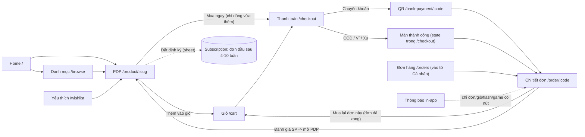

# A2 — Phễu mua hàng (Zalo Mini App là chính, web shop ở chỗ khác biệt)

**Kết luận.** Đường mua "thẳng" của mini app đã gọn và an toàn hơn mức trung bình: khách cũ có địa chỉ mặc định đi từ PDP → "Mua ngay" → "Đặt hàng" trong 2–3 chạm, có chống bấm đôi, Idempotency-Key + replay có kiểm tra ở BE, trừ kho/ví/điểm/xu/mã trong một transaction, sheet PRICE_CHANGED cho flash sale, huỷ đơn có xác nhận, mở lại được QR chuyển khoản. Nhưng **phễu gần như không có vòng mua lại** — đúng chỗ north-star cần nhất: không có "Mua lại" ở Home hay trên thẻ đơn, feed "Dành cho bạn" còn *loại* món khách đã mua, nhắc mua lại dùng một chu kỳ 51 ngày cho mọi SKU, chỉ gửi in-app, không có nút mua lại và có lỗi khiến cron ngừng gửi khi dữ liệu lớn; "Đặt định kỳ" không giao đơn đầu; chỉ 2 thông báo đi qua ZNS và app không xin quan tâm OA. Có **3 lỗi P0** ở đường tiền và catalog: QR chuyển khoản của đơn gắn gian hàng CTV trả tiền vào tài khoản cá nhân CTV, web cho chọn chuyển khoản nhưng không đưa QR/STK, sản phẩm đối tác chưa duyệt/bị từ chối vẫn hiện và mua được. PDP thiếu các khối chuẩn của mỹ phẩm/tẩy rửa (cách dùng, thông số, ETA, báo có hàng, phóng to ảnh), còn giá trên thẻ sản phẩm lệch với giá PDP do đồng bộ Pancake không cập nhật giá cấp Product. Web shop chỉ là bản rút gọn (30 SP, không tìm, không chi tiết đơn). Tổng: **57 phát hiện — 3 P0, 28 P1, 26 P2**; 8 phát hiện được đánh dấu **CHẶN MUA LẠI**.

Phạm vi đọc: nhánh `feat/complete-wip-2026-09`, commit `1e7fda7` (số dòng trong báo cáo theo commit này; các file `integrations/gomdon/**` đang được agent khác sửa không được dùng làm bằng chứng).

---

## Hiện trạng

Đường dẫn ngắn trong phần này (`pages/…`, `components/…`, `utils/…`, `services/…`) tương đối với `apps/miniapp/src/`; đường dẫn backend ghi đầy đủ.

### Bản đồ phễu (mini app)



Thanh điều hướng dưới: Trang chủ · Danh mục · Vườn Xanh · Ví & HH · Cá nhân (`apps/miniapp/src/components/bottom-nav.tsx:19-25`) — không có Giỏ/Đơn hàng; giỏ vào qua icon ở header Home/Danh mục/PDP, đơn hàng vào qua Cá nhân.

| Bước | Màn / component | API chính | Đang có | Thiếu so với chuẩn top (Shopee, Hasaki, Sephora, Amazon S&S…) |
|---|---|---|---|---|
| Home | `pages/home.tsx` | `/products` ×3, `/products/for-you`, `/brands`, `/flash-sales/active`, `/flash-sales/upcoming`, `/cart`, `/me/notifications` | ô tìm (vỏ), 4 phân khúc, dải thương hiệu, flash + đặt nhắc, "Dành cho bạn", "Tubu chọn cho bạn", "Cho mẹ và bé", "Mới về vườn", chuông có badge | Mua lại/Đã mua, Bán chạy, Đã xem gần đây, danh mục thật, khối theo chu kỳ tiêu dùng |
| Tìm / duyệt | `pages/browse.tsx` | `/products?q&brand&segment&sort&page` | tìm debounce 300ms, "Tìm gần đây" (localStorage), chip thương hiệu, 4 kiểu sắp xếp, "Xem thêm" | gợi ý khi gõ, tìm không dấu, lọc giá/đánh giá/loại da/còn hàng, "Bán chạy", số kết quả, giữ trạng thái khi quay lại |
| PDP | `pages/product-detail.tsx` + `reviews-section`, `subscribe-sheet`, `wishlist-heart` | `/products/:slug`, `/related`, `/bought-together`, `/reviews`, `/reviews/can-review`, `/me/coupons`, `/config/public`, `/affiliate/me`, `/flash-sales/active`, `/cart`, `/me/wishlist/ids` | gallery vuốt, giá + gạch, flash có đếm ngược, "Còn N", badge freeship, chứng nhận, chip mã (chạm để chép), Đặt định kỳ, phân loại, số lượng, Mua chung, thành phần, cam kết, mô tả thu gọn, đánh giá có ảnh/video + lọc, "Thường mua kèm", "Cùng nhà …", **CTA dính đáy đôi** | phóng to ảnh, sheet chọn phân loại khi bấm CTA, cách dùng/thông số/đơn giá, ETA, báo khi có hàng, bundle 1 chạm, UGC gần giá, ước tính "sắp hết" |
| Giỏ | `pages/cart.tsx` + `voucher-sheet` | `/cart`, `PATCH/DELETE /cart/items/:id`, `/cart/coupon`, `/me/coupons` | chọn từng món, hoàn tác xoá 3,5s, debounce số lượng, thanh freeship, sheet mã | gợi ý mua thêm để freeship, tự chọn mã tốt nhất, lưu mua sau, phí ship, xử lý dòng hết hàng |
| Thanh toán | `pages/checkout.tsx` + `address-section`, `geo-picker`, `voucher-sheet` | `/cart`, `/me/addresses`, `/me/wallet`, `/me/loyalty`, `/config/public`, `POST /checkout/quote`, `POST /checkout/place-order` | 1 trang; COD/Chuyển khoản/Ví/Xu; Điểm Xanh; ghi chú; thu gom tái chế; VAT; tóm tắt; Idempotency-Key; chặn bấm đôi | ETA, ZaloPay/thẻ, điền sẵn địa chỉ, giải thích điểm/xu, upsell định kỳ |
| Chuyển khoản | `pages/bank-payment.tsx` | `GET /payments/bank-qr/:code` (poll 4s) | VietQR, chép STK/số tiền/nội dung, tự dò PAID, mở lại từ chi tiết đơn | hạn thanh toán, lưu ảnh QR/mở app ngân hàng, tự huỷ |
| Thành công | `components/checkout/order-success.tsx` | — | mã đơn, tổng tiền, nhắc tiền mặt COD, điểm sẽ nhận | bước tiếp theo/ETA, mời quan tâm OA, định kỳ, chia sẻ |
| Đơn hàng | `pages/orders.tsx` | `/orders?status&page` | 6 tab, phân trang | ảnh SP, nút Mua lại/Đánh giá trên thẻ |
| Chi tiết đơn | `pages/order-detail.tsx` | `/orders/:code`, `/orders/me/returns`, `cancel`, `repurchase`, `return-request` | timeline 5 bước, vận chuyển + tra cứu, VAT, thu gom, huỷ có xác nhận, "Thanh toán ngay", đổi/trả có ảnh, "Mua lại đơn này", chat OA | mã đơn, mốc giờ, ảnh, đánh giá trong đơn, upsell định kỳ |
| Yêu thích | `pages/wishlist.tsx` | `/me/wishlist`, `/me/wishlist/ids` | lưới thẻ + tim | thêm giỏ nhanh, nhãn giảm giá/có hàng lại |
| Hậu mua (BE) | `lifecycle`, `remarketing`, `notifications`, `vouchers` | cron 04:00 / mỗi giờ / 05:00 | nhắc mua lại (~51 ngày), giỏ bỏ quên (6–72h), voucher sắp hết, báo giảm giá SP yêu thích, voucher chào mừng | ZNS cho các nhắc này, nút hành động, chu kỳ theo SKU |

### Request mạng ở lần render đầu (đã đăng nhập, cache rỗng)

Số `useQuery` trong file lấy bằng lệnh ở Phụ lục (A); số request mạng là liệt kê thủ công từ code (sau khi React Query gộp các query cùng key), **chưa đo bằng DevTools trên máy thật**. Mọi request đều chờ khôi phục phiên trước (`apps/miniapp/src/services/api.ts:54-67`); `OnboardingGate` gọi thêm `/me` một lần khi mở app (`apps/miniapp/src/components/onboarding.tsx:67`).

| Trang | `useQuery` trong file | Request mạng | Bậc phụ thuộc | Ghi chú |
|---|---|---|---|---|
| Home | 7 (+2 FlashSale, +1/ProductCard, +1/WishlistHeart — gộp key) | **10**: `/cart`, `/me/notifications`, `/products` ×3, `/brands`, `/products/for-you`, `/flash-sales/active`, `/flash-sales/upcoming` → khi lưới hiện: `/me/wishlist/ids` | phiên → 9 song song → 1 | flash refetch 60s (`components/flash-sale.tsx:23-28`) |
| Danh mục | 2 + 1 infinite | **5**: `/cart`, `/brands`, `/products?page=1&limit=30` → `/flash-sales/active`, `/me/wishlist/ids` | phiên → 3 → 2 | mỗi lần ngừng gõ 300ms là 1 request `/products` |
| PDP | 8 (+1 `usePublicConfig`, +2 ReviewsSection, +WishlistHeart) | **11**: `/products/:slug`, `/reviews`, `/me/coupons`, `/config/public`, `/affiliate/me`, `/cart`, `/flash-sales/active` → sau khi có SP: `/related`, `/bought-together`, `/reviews/can-review`, `/me/wishlist/ids` | phiên → tải chunk JS lazy (`components/app.tsx:36`) → 7 → 4 | `/products/:slug` nhúng sẵn 20 review không dùng (`apps/api/src/modules/catalog/catalog.service.ts:94-99`); poll flash 60s (`product-detail.tsx:118`) |
| Giỏ | 1 | **1**: `/cart` | phiên → 1 | `/me/coupons` chỉ khi mở sheet |
| Thanh toán | 5 (+1 `usePublicConfig`) | **6**: `/cart`, `/me/addresses`, `/me/wallet`, `/me/loyalty`, `/config/public` → `POST /checkout/quote` | phiên → 5 → 1 | bật/tắt Điểm Xanh = 1 quote mới; áp mã = 2 quote + 1 `/cart` (`voucher-sheet.tsx:39-44`, `checkout.tsx:742-745`) |
| QR chuyển khoản | 1 | **1** + poll mỗi 4s không giới hạn | — | 15 request/phút khi mở màn (`bank-payment.tsx:25`) |
| Đơn hàng | 1 infinite | **1**: `/orders?page=1&limit=20` | — | |
| Chi tiết đơn | 2 | **1–2**: `/orders/:code` → `/orders/me/returns` (chỉ khi DELIVERED) | 1 → 1 | |
| Yêu thích | 1 | **3**: `/me/wishlist` → `/flash-sales/active`, `/me/wishlist/ids` | 1 → 2 | |

### Xử lý ảnh

| Nơi | Kích thước hiển thị | Lazy | Nguồn | Ghi chú |
|---|---|---|---|---|
| ProductCard (lưới) | ~½ bề ngang, vuông | `loading="lazy"` (`components/product-card.tsx:66`) | `thumbnail` = ảnh đầu tiên gốc từ Pancake (`apps/api/src/modules/integrations/pancake/pancake-sync.service.ts:140`, `apps/api/src/modules/catalog/catalog.service.ts:289`) | có `aspect-ratio` nên không nhảy layout; không srcset/resize |
| Dải flash | 132px | lazy (`components/flash-sale.tsx:93`) | ảnh gốc | |
| Gallery PDP | 375px vuông | ảnh 1 eager, còn lại lazy (`product-detail.tsx:802`) | `images[]` gốc | không phóng to, không `fetchpriority` |
| Dòng giỏ | 64px | lazy (`cart.tsx:348`) | ảnh gốc | |
| Dòng checkout | 48px | **không** lazy (`checkout.tsx:295-299`) | ảnh gốc; `src` rỗng khi null | |
| Ảnh đánh giá | 64px | lazy (`reviews-section.tsx:194`) | upload Cloudinary gốc (`components/image-upload.tsx:6-7`) | không mở lớn được |
| Web (thẻ / PDP) | — | lazy + `decoding=async` / eager + `fetchPriority=high` | ảnh gốc, chưa dùng `next/image` (ghi chú `apps/web/src/app/san-pham/[slug]/page.tsx:42-45`) | PDP web chỉ 1 ảnh |

Dung lượng ảnh thật trên production: UNKNOWN (seed không có ảnh — `apps/api/prisma/seed.ts:764`; ảnh thật đến từ Pancake).

### Web shop khác mini app ở đâu

| Bước | Web (`apps/web/src/app`) | Khác biệt đáng kể |
|---|---|---|
| Trang chủ | SSR 30 SP + lọc thương hiệu | không tìm kiếm, không phân trang, không flash/for-you |
| PDP | 1 ảnh, giá cấp Product, chọn phân loại + "Thêm vào giỏ" | không "Mua ngay", đánh giá, thành phần, định kỳ |
| Giỏ | thanh toán toàn giỏ, nhập/chọn mã, dòng freeship | không chọn từng món, không hoàn tác |
| Thanh toán | COD + Chuyển khoản, Điểm Xanh, thu gom | không Ví/Xu; **không có QR sau khi đặt chuyển khoản (P0)**; không có dòng combo |
| Tài khoản | 20 đơn gần nhất | không chi tiết/huỷ/mua lại/theo dõi |
| Đăng nhập | Zalo OAuth | luôn quay về "/" |
| Gian hàng `/s/[slug]` | thẻ QR "Thanh toán trực tiếp cho Đối tác" | tiền đi ngoài hệ thống (P1) |

### Điểm mạnh nên giữ khi redesign

- CTA dính đáy đôi "Thêm vào giỏ" + "Mua ngay · tổng tiền" (`apps/miniapp/src/pages/product-detail.tsx:685-750`); "Mua ngay" chỉ thanh toán đúng dòng vừa thêm và nhớ lựa chọn qua sessionStorage (`product-detail.tsx:156-180`, `utils/checkout-selection.ts:15-66`).
- Giỏ chọn từng món, hoàn tác xoá, debounce số lượng, thanh freeship theo tổng đang chọn (`pages/cart.tsx:65-74,90-115,301-314,536-583`).
- Checkout một trang, khoá bấm đôi (`checkout.tsx:57,689-711`), BE replay idempotency có kiểm tra chủ đơn/địa chỉ/phương thức (`apps/api/src/modules/checkout/checkout.service.ts:86-90,362-386`), mọi trừ kho/điểm/ví/xu/mã trong một transaction (`checkout.service.ts:147-269`), sheet PRICE_CHANGED (`checkout.tsx:714-735`).
- QR chuyển khoản mở lại được từ chi tiết đơn (`order-detail.tsx:126,528-540`); huỷ đơn có màn xác nhận với "Giữ đơn" là nút chính (`order-detail.tsx:565-590`).
- Ô soạn đánh giá chỉ mở khi đủ điều kiện, có ảnh/video + thưởng điểm (`components/reviews-section.tsx:35-40,63-81`).

---

## Phát hiện

Quy ước đường dẫn trong cột Bằng chứng: `mini/` = `apps/miniapp/src/`, `api/` = `apps/api/src/modules/`, `web/` = `apps/web/src/`, `prisma/` = `apps/api/prisma/`, `zmpui/` = `apps/miniapp/node_modules/zmp-ui/esm/components/`. Nhãn **CHẶN MUA LẠI** = khoảng trống trực tiếp nhất cản đơn thứ 2 trong 30 ngày.

| ID | Mức | Bề mặt/Trang | Phát hiện | Bằng chứng | Đề xuất | Công | Tác động north-star |
|---|---|---|---|---|---|---|---|
| A2-01 | **P0** | Thanh toán chuyển khoản (mini app) | Đơn BANK_TRANSFER có `storefrontSlug` nhận QR/STK của **chủ gian hàng** thay vì tài khoản Tubu. CTV tự nhập "Tài khoản nhận tiền (VietQR 0đ phí)" trong trình dựng gian hàng; `storefrontSlug` được gắn cả khi khách chỉ từng mở link CTV trong 3 ngày rồi mua ở app chính. Đối soát tự động dựa trên Pancake liên kết TK Tubu → tiền vào TK CTV không bao giờ lật PAID: khách đã trả nhưng đơn kẹt "Chờ thanh toán", màn QR vẫn báo "chưa thấy tiền về". | `api/integrations/payment/bank-transfer.service.ts:7-9,38-51`; `api/checkout/checkout.service.ts:102-109,190`; `api/storefront/storefront.service.ts:103-141`; `mini/pages/storefront-builder.tsx:896-915` | Đơn bán lẻ luôn dùng `payment.bank_*` của Tubu; nếu có mô hình đối tác tự thu thì chỉ cho `type='MERCHANT'` đã ký và có đối soát riêng; ẩn ô tài khoản nhận tiền với CTV; rà các đơn đang mở dùng TK CTV. | S | Chặn đơn đầu (khách trả tiền mà không nhận hàng) → mất khách; rủi ro thất thu. |
| A2-02 | **P0** | Web `/thanh-toan` | Web cho chọn "Chuyển khoản ngân hàng" nhưng sau khi đặt chỉ hiện "Đặt hàng thành công!" + mã + tổng: không QR, không STK, không nội dung chuyển khoản; `/tai-khoan` chỉ là danh sách, không có chi tiết hay nút thanh toán; apps/web không gọi `/payments/bank-qr` ở luồng mua. Khách web không có cách trả tiền, đơn giữ kho vô thời hạn (A2-24). | `web/app/thanh-toan/page.tsx:127-153,185-193`; `web/app/tai-khoan/page.tsx:72-89`; Phụ lục (G) | Ẩn BANK_TRANSFER trên web ngay; sau đó thêm trang QR dùng `GET /payments/bank-qr/:code` + chi tiết đơn. | S (ẩn) / M (trang QR) | Chặn đơn đầu trên web. |
| A2-03 | **P0** | Catalog → PDP → giỏ (mini app + web) | Sản phẩm đối tác được tạo với `approvalStatus: 'PENDING_REVIEW'` nhưng `isActive: true`; `list()`/`getBySlug()`/`brands()` chỉ lọc `isActive` → SP chưa duyệt hiện ở Home, Danh mục, tìm kiếm, dải thương hiệu và mua được (`addItem` chỉ kiểm variation). "Từ chối" chỉ đổi `approvalStatus`, không tắt `isActive` → SP "không đạt tiêu chuẩn xanh" vẫn bán. API công khai còn trả cả `approvalStatus`/`rejectReason`. | `api/merchant/merchant.service.ts:239-240`; `api/catalog/catalog.service.ts:56,88-103,224-228`; `api/admin/admin.service.ts:713-727`; `api/cart/cart.service.ts:113-114` | Thêm `approvalStatus: 'APPROVED'` vào mọi truy vấn catalog công khai (list, getBySlug, related, boughtTogether, getForYou, brands, suggest, flash `listActive`) và chặn ở `addItem`/checkout; `select` tường minh cho Product public. | S | Giữ lời hứa "chuẩn xanh" — nền tảng của mua lại; tránh đơn phải huỷ/đổi trả. |
| A2-04 | P1 | Home / Cá nhân | Không có khối "Mua lại"/"Đã mua" ở Home hay Cá nhân; "Dành cho bạn" còn chủ động **loại** mọi SP khách đã mua (`id notIn purchasedProductIds`). Với nước giặt, sữa tắm, cà phê… món khách cần mua lại nhất bị giấu khỏi đúng nơi cá nhân hoá. | `api/catalog/catalog.service.ts:160-196`; `mini/pages/home.tsx:407-423`; `mini/pages/profile.tsx:56-63`; Phụ lục (E) | Khối "Mua lại" ở đầu Home (SP đã giao, sắp theo ngày dự kiến hết, nút + thêm 1 chạm, "Mua lại tất cả"); giữ "Dành cho bạn" cho khám phá nhưng tách khỏi món đã mua. | M | **CHẶN MUA LẠI** — lối vào đơn 2 ngay khi mở app. |
| A2-05 | P1 | Đơn hàng (danh sách + chi tiết) | Thẻ đơn không có ảnh SP (OrderItem không lưu ảnh) và không có nút "Mua lại". "Mua lại đơn này" chỉ ở chi tiết đơn đã xong, đổ vào giỏ chung rồi mở `/cart` với **mọi** món (cả món cũ đang nằm trong giỏ) được chọn sẵn; món hết hàng bị bỏ qua không báo; nếu giỏ đã có món đó gần hết kho thì `addItem` ném lỗi giữa vòng lặp → trả 400 sau khi đã thêm một phần. | `mini/pages/orders.tsx:105-163`; `mini/pages/order-detail.tsx:71-79,541-549`; `api/orders/orders.service.ts:139-151`; `api/cart/cart.service.ts:119-122`; `prisma/schema.prisma:864-873` | Nút "Mua lại" trên thẻ đơn đã giao; repurchase trả `{addedItemIds, skipped[]}` → mở giỏ/checkout chỉ chọn các dòng vừa thêm (`rememberCheckoutSelection`), báo món thiếu + gợi ý thay thế; kẹp số lượng theo tồn còn lại; snapshot thumbnail vào OrderItem. | M | **CHẶN MUA LẠI** — mua lại cả đơn phải là 1–2 chạm. |
| A2-06 | P1 | Nhắc mua lại (cron + màn thông báo) | Nhắc dùng một chu kỳ chung `reorder.default_cycle_days` 60 × `remind_ratio` 0,85 ≈ **51 ngày** cho mọi SP — muộn hơn mốc 30 ngày của north-star; kênh INAPP; payload chỉ có tên SP nên màn chi tiết thông báo không khớp nhánh CTA nào (không có nút mua lại), tiêu đề rơi về "Thông báo" chung. CTA được đoán bằng regex trên nội dung → SP có chữ "cây" trong tên sẽ hiện nút "Đến Vườn Xanh". | `api/lifecycle/lifecycle.service.ts:44-46,103`; `prisma/seed.ts:639`; `mini/pages/notifications.tsx:20-39,235-244` | Trường `consumptionDays` theo variation (mặc định theo nhóm/dung tích, admin sửa); nhắc ở ~80% chu kỳ; payload có `variationId`/`slug`; CTA "Mua lại ngay" (thêm giỏ + checkout 1 dòng); định tuyến CTA theo `templateCode`. | L | **CHẶN MUA LẠI** — đòn bẩy lớn nhất cho đơn 2 đúng lúc sắp hết hàng. |
| A2-07 | P1 | Cron nhắc mua lại | SQL `LIMIT 500` không `ORDER BY` và không loại cặp đã nhắc; vòng lặp `continue` qua cặp đã nhắc. Tập (khách × variation) quá hạn chỉ tăng dần → khi vượt 500, lô 500 có thể toàn cặp đã nhắc → không ai mới được nhắc nữa, không lỗi, không log. | `api/lifecycle/lifecycle.service.ts:49-59,68` | Đưa điều kiện "chưa nhắc cho đơn cuối" vào SQL (LEFT JOIN `reorder_reminders`), `ORDER BY lastOrderAt`, lặp theo trang tới hết. | S | **CHẶN MUA LẠI** — kênh nhắc tự tắt khi lượng khách tăng. |
| A2-08 | P1 | Kênh OA/ZNS | Theo seed chỉ ORDER_CONFIRMED và ORDER_SHIPPING là ZNS; giỏ bỏ quên, nhắc mua lại, winback, giảm giá SP yêu thích, flash bắt đầu, đơn định kỳ… đều INAPP — khách không mở app thì không thấy. `zaloTemplateId` không được seed và không có UI cấu hình; ZNS cần SĐT (chỉ xin lúc đặt đơn). Mini app không gọi `followOA` / `requestSendNotification` / `favoriteApp` dù zmp-sdk 2.51.4 có sẵn. | `prisma/seed.ts:627-672`; `api/notifications/notifications.service.ts:57-59`; Phụ lục (B) | Ở màn đặt thành công: mời quan tâm OA + xin quyền thông báo; đăng ký ZNS cho REORDER_REMINDER, CART_ABANDONED, ORDER_DELIVERED (+ mời đánh giá), đơn chờ thanh toán; màn admin map `zaloTemplateId`. | M | **CHẶN MUA LẠI** — không có kênh ngoài app thì mọi vòng nhắc chỉ chạm người đã tự quay lại. |
| A2-09 | P1 | ZNS client | `sendTemplate` trả `true` với mọi HTTP 2xx, không đọc trường `error` trong body — trong khi cùng dự án `zalo.service.ts` phải kiểm `data.error !== 0` với API Zalo → ZNS bị Zalo từ chối vẫn ghi SENT, không retry, không cảnh báo. `notify()` còn gọi ZNS đồng bộ (timeout 10s) ngay trong request đặt hàng. | `api/integrations/zns/zns.client.ts:35-40`; `api/auth/zalo.service.ts:76,113`; `api/notifications/notifications.service.ts:58-80`; `api/checkout/checkout.service.ts:323-328` | Kiểm `res.data.error === 0`, lưu mã lỗi, retry theo mã; đưa gửi ZNS vào queue. | S | **CHẶN MUA LẠI** (âm thầm mất thông báo) + giảm độ trễ đặt hàng. |
| A2-10 | P1 | Đặt định kỳ (sheet PDP + BE) | "Bắt đầu đặt định kỳ" **không tạo đơn nào** — lần giao đầu là sau 4–10 tuần (`nextRunAt = now + interval`); sheet không nói ngày giao đầu, giá mỗi kỳ, cách trả tiền (cron tạo đơn COD), không đổi được địa chỉ, không gợi ý chu kỳ theo SP; không nhắc trước khi tạo đơn kỳ tới; upsell định kỳ chỉ có ở PDP (không ở giỏ, checkout, màn thành công, chi tiết đơn đã giao). | `api/subscriptions/subscriptions.service.ts:57-65,250`; `mini/components/subscribe-sheet.tsx:10,46-103`; `mini/pages/product-detail.tsx:625`; Phụ lục (E) | Mẫu Subscribe & Save: đơn đầu giao ngay (hoặc chọn ngày), hiện giá/kỳ + ngày giao kế, nhắc trước 3 ngày có "Bỏ qua kỳ này"; chu kỳ gợi ý theo `consumptionDays`; upsell ở checkout ("giao định kỳ món này -12%") và sau khi giao. | L | **CHẶN MUA LẠI** — biến đơn 2, 3 thành mặc định. |
| A2-11 | P1 | Đánh giá sau mua | Không có lời mời đánh giá chủ động (ORDER_DELIVERED chỉ báo "đã cộng điểm"); từ chi tiết đơn, "Đánh giá sản phẩm này" chỉ mở PDP — khách phải cuộn tới cuối rồi bấm "Viết đánh giá" (≥4 thao tác); link vẫn hiện dù đã đánh giá. | `prisma/seed.ts:629`; `mini/pages/order-detail.tsx:186-199`; `mini/components/reviews-section.tsx:63-76`; `mini/pages/product-detail.tsx:622` | Sheet đánh giá theo đơn (mọi món một lần) mở thẳng từ đơn và từ thông báo; nhắc D+3 sau giao kèm số Điểm Xanh sẽ nhận. | M | Gián tiếp: tăng UGC (chuyển đổi đơn đầu); điểm thưởng là lý do quay lại. |
| A2-12 | P1 | Giá trên thẻ SP (mọi danh sách + web) | Đồng bộ Pancake ghi `salePrice` cho variation nhưng **không bao giờ** cập nhật `Product.salePrice`; `Product.basePrice` = giá niêm yết của variation đầu. Thẻ SP (Home, Danh mục, tìm, Yêu thích, gian hàng, web) dùng giá cấp Product → hiện giá chưa giảm, không nhãn -%; vào PDP mới thấy giá thấp hơn; sắp xếp theo giá cũng dùng `basePrice`. | `api/integrations/pancake/pancake-sync.service.ts:137-142,178-185`; `api/catalog/catalog.service.ts:255-258,290-291`; `mini/components/product-card.tsx:37-42`; `web/components/product-card.tsx:5-9`; `web/app/san-pham/[slug]/page.tsx:32` | Khi sync, đặt giá cấp Product = min giá hiệu lực của variation (kèm `salePrice`); thẻ hiện "Từ X" khi nhiều giá; sort theo giá hiệu lực. | S | Tăng CTR và chuyển đổi đơn đầu; khuyến mãi được nhìn thấy. |
| A2-13 | P1 | Tìm kiếm | Ô tìm ở Danh mục không có gợi ý khi gõ (API `/search/suggest` có nhưng chỉ dùng ở gắn SP cộng đồng và CTV lên đơn); tìm `contains` theo tên + tag khớp nguyên → gõ không dấu "sua tam" không ra "Sữa tắm", không tìm theo thương hiệu/thành phần; "Tìm gần đây" lưu cả mẩu đang gõ dở (mỗi lần ngừng 300ms, ≥2 ký tự). | `mini/pages/browse.tsx:79-84,157-162`; `mini/services/shop-api.ts:195-196`; `mini/components/community/product-picker.tsx:27`; `mini/components/affiliate/ctv-order-sheet.tsx:327`; `api/catalog/catalog.service.ts:67-72,243-251` | Cột `searchText` bỏ dấu (hoặc `unaccent` + trigram), tìm cả brand/tags/thành phần; gợi ý SP + từ khoá khi gõ; lưu "gần đây" khi submit hoặc chạm kết quả. | M | Tìm lại món đã dùng nhanh → mua lại; giảm "không tìm thấy". |
| A2-14 | P1 | Danh mục | Tab "Danh mục" chỉ có 4 phân khúc gõ cứng; mọi SP đồng bộ đều được gán "Sống xanh" (catch-all = cả catalog); regex "mẹ & bé" khớp chuỗi con "tre" nên tên chứa "Tubu Tree"/"tre" bị xếp vào mẹ & bé (đã chạy thử, Phụ lục C); nhãn "Nhà bếp xanh" nhưng gom cả nước giặt/lau sàn/rửa tay. Cây `Category` (có `parentId`) và filter `category` của API không được app mua sắm dùng (chỉ trình dựng gian hàng gọi `/categories`). | `mini/pages/browse.tsx:19-24,193-226`; `mini/pages/home.tsx:22-27`; `api/integrations/pancake/pancake-sync.service.ts:234-239`; `api/catalog/catalog.controller.ts:50-54`; `api/catalog/catalog.service.ts:65`; `mini/services/storefront-api.ts:37` | Duyệt theo cây Category thật 2 cấp (có ảnh), phân khúc chỉ là lối tắt; sửa regex (bỏ nhánh `tre` trần); gán phân khúc thủ công cho SP nhập. | M | Khám phá theo nhu cầu → đơn đầu và mua chéo nhóm. |
| A2-15 | P1 | Sắp xếp / "Bán chạy" | Không có "Bán chạy" ở bất kỳ màn mua nào; DTO nhận `sort=best_seller` nhưng `orderBy()` không có case → rơi về `isFeatured`; mặc định chỉ `isFeatured desc` không khoá phụ → phân trang OFFSET có thể lặp/sót SP khi sync Pancake cập nhật dòng giữa hai lần "Xem thêm". | `api/catalog/dto/product-query.dto.ts:11-12`; `api/catalog/catalog.service.ts:75-83,253-266`; `mini/pages/browse.tsx:109-114` | Case `best_seller` (soldApp + soldExternal), khoá phụ `id`; chip "Bán chạy" + khối Home "Bán chạy tuần này". | S | Social proof cho đơn đầu; hàng "ai cũng mua lại" dễ thấy. |
| A2-16 | P1 | Danh mục ↔ PDP | Từ PDP quay lại, Danh mục mất từ khoá, sắp xếp và vị trí cuộn: `q`/`sort` là state cục bộ trong khi `AnimationRoutes` của zmp-ui unmount trang cũ; không trang nào bật `restoreScrollOnBack` (zmp-ui `Page` có hỗ trợ). | `mini/pages/browse.tsx:64,77`; `zmpui/router/AnimationRoutes.js:156`; `zmpui/page/index.js:38`; Phụ lục (D) | Đưa `q`/`sort` vào URL; bật `restoreScrollOnBack` cho Home, Danh mục, Đơn hàng, Yêu thích. | S | Giảm ma sát so sánh/chọn → đơn đầu. |
| A2-17 | P1 | PDP — chọn phân loại | Khối "Phân loại" nằm sau gallery + khối thông tin (ước tính ~790px từ đỉnh ở 375px, tính từ style — chưa đo trên máy), trong khi CTA dính đáy thêm ngay phân loại mặc định (đầu tiên còn hàng) → dễ mua nhầm dung tích; ảnh không đổi theo phân loại; chip phân loại hiện giá chưa tính flash. | `mini/pages/product-detail.tsx:124-130,212-230,248,463-482,886` | SP có >1 phân loại: bấm "Thêm vào giỏ"/"Mua ngay" mở sheet chọn phân loại + số lượng (mẫu Shopee/TikTok Shop); hiện phân loại đang chọn ngay dưới giá. | M | Giảm mua nhầm/đổi trả → giữ niềm tin cho lần sau. |
| A2-18 | P1 | PDP — nội dung mỹ phẩm/tẩy rửa | Mô hình Product không có cách dùng, dung tích/khối lượng hiển thị, xuất xứ, HSD, loại da/đối tượng, cảnh báo; PDP chỉ có thành phần + chứng nhận + mô tả thô (text thuần, cắt 4 dòng); không tính được đơn giá /100ml. | `prisma/schema.prisma:340-368`; `mini/services/shop-api.ts:35-50`; `mini/pages/product-detail.tsx:567-603,893-932` | Thêm `specs` (dung tích, xuất xứ, HSD, cách dùng, lưu ý, loại da) + khối "Cách dùng", "Thông số"; hiện đơn giá khi có dung tích. | L | Tin tưởng + dùng đúng → dùng hết → mua lại đúng nhịp. |
| A2-19 | P1 | Giao hàng (PDP / giỏ / checkout) | Không có ngày giao dự kiến ở bất kỳ bước nào; PDP chỉ có badge ngưỡng freeship chung; phí ship thật (19.000đ dưới ngưỡng, không phụ thuộc địa chỉ) chỉ lộ ở checkout, giỏ không hiện. | `mini/pages/product-detail.tsx:353-360`; `mini/pages/cart.tsx:595-605`; `api/pricing/pricing.service.ts:21-42`; Phụ lục (F) | "Giao dự kiến …" theo tỉnh của địa chỉ mặc định (bảng SLA tĩnh); hiện phí ship ở PDP và giỏ. | M | Giảm bỏ giỏ đơn đầu. |
| A2-20 | P1 | PDP — hết hàng | Hết hàng chỉ có CTA xám "Tạm hết — sẽ về sớm"; không có "Báo khi có hàng" (không có bảng/luồng nào), không gợi ý SP thay thế tại CTA. | `mini/i18n/vi.ts:63`; `mini/pages/product-detail.tsx:741-748`; Phụ lục (F) | "Báo tôi khi có hàng" (StockAlert, gửi khi sync tăng tồn, qua ZNS/OA) + gợi ý thay thế cùng nhóm. | M | **CHẶN MUA LẠI** khi món quen hết hàng — khách sang shop khác. |
| A2-21 | P1 | Giỏ → Checkout (tồn kho) | Dòng hết hàng/vượt tồn vẫn được chọn mặc định (chỉ có dòng cảnh báo), nút "Thanh toán" vẫn bật; báo giá không kiểm tồn → khách đi hết checkout, bấm "Đặt hàng" mới nhận snackbar "không đủ tồn kho". | `mini/pages/cart.tsx:156-171,300,394-408`; `api/checkout/checkout.service.ts:151-155,393-493` | Tự bỏ chọn + làm mờ dòng hết hàng, nút "cập nhật về N" 1 chạm; quote trả `stockIssues`. | S | Giảm thất bại ở bước cuối (cả đơn mua lại). |
| A2-22 | P1 | Checkout lần đầu (địa chỉ/SĐT) | Form địa chỉ ở checkout không điền sẵn tên/SĐT (trang Sổ địa chỉ thì có); khi chưa có địa chỉ form không tự mở; chọn Phường/Xã bằng Select không có ô tìm; quyền SĐT Zalo bị hỏi ở cú chạm "Đặt hàng" cuối cùng thay vì dùng để điền sẵn form. | `mini/components/checkout/address-section.tsx:18,51,60-64,184`; `mini/pages/addresses.tsx:245`; `mini/components/geo-picker.tsx:44-99`; `mini/pages/checkout.tsx:693-699` | Chưa có địa chỉ → mở form ngay, xin SĐT Zalo để điền sẵn tên + SĐT; ô tìm phường/xã; tự đặt làm mặc định. | M | Tăng chuyển đổi đơn đầu (điều kiện cần của đơn 2). |
| A2-23 | P1 | Checkout — idempotency & độ trễ | FE sinh Idempotency-Key **mới sau mọi lỗi**, kể cả timeout 15s/mất mạng khi server có thể vẫn đang xử lý: bấm lại lúc request 1 chưa dọn giỏ → có thể tạo đơn thứ 2 và trừ Ví/xu 2 lần; nếu request 1 đã xong thì lần bấm lại báo "Chưa chọn sản phẩm để thanh toán." dù đơn đã tạo. Request đặt hàng còn chờ gửi ZNS đồng bộ sau khi commit, làm tăng khả năng chạm timeout. | `mini/pages/checkout.tsx:70,186-197`; `mini/services/api.ts:6`; `api/checkout/checkout.service.ts:86-90,119,284-289,323-328` | Giữ key khi lỗi không có response/timeout/5xx, chỉ đổi khi 4xx nghiệp vụ; sau timeout gửi lại cùng key (BE replay) hoặc tra đơn mới nhất; đưa notify ra queue. | S | Tránh đơn trùng/trừ tiền 2 lần → giữ niềm tin. |
| A2-24 | P1 | Chuyển khoản (màn QR + vòng đời đơn) | Đơn chuyển khoản chưa trả **không bao giờ hết hạn** (không cron nào xử lý PENDING_PAYMENT) → giữ tồn kho vô thời hạn; màn QR không có hạn chót, không "Lưu ảnh QR" (zmp-sdk có `saveImageToGallery`) hay mở app ngân hàng, trong khi hướng dẫn "quét mã VietQR bên dưới" không làm được trên chính điện thoại đang hiện QR; poll 4s không dừng. | `mini/pages/bank-payment.tsx:20-26,161-199`; `api/checkout/dto/checkout.dto.ts:26-27`; Phụ lục (G) | Hạn thanh toán (vd 24h) + nhắc trước hạn + tự huỷ nhả kho; nút "Lưu ảnh QR"/"Mở app ngân hàng"; dừng poll sau ~10 phút. | M | Hoàn tất đơn đầu; không khoá hàng của khách khác. |
| A2-25 | P1 | Phương thức thanh toán | Mini app chỉ có COD, chuyển khoản thủ công, Ví, Xu; ZaloPay có BE (tạo giao dịch + webhook) nhưng bị ẩn ở checkout và không FE nào gọi; không có thẻ/ví qua Checkout SDK của Zalo. | `mini/pages/checkout.tsx:248-263`; `api/integrations/payment/payment.controller.ts:25-42`; Phụ lục (G) | Nối ZaloPay/Checkout SDK (`Payment.createOrder` có trong zmp-sdk); nhớ phương thức lần trước. | L | Thanh toán 1 chạm cho đơn lặp lại → rút ngắn đơn 2. |
| A2-26 | P1 | Combo (gian hàng CTV) | API gian hàng trả `kind`/`comboDiscountPct`/`layout` nhưng màn gian hàng vẽ mọi bộ sưu tập như lưới thường: không nhãn combo, không % giảm, không nút "thêm cả combo"; combo chỉ áp khi đủ mọi SP và còn ngữ cảnh gian hàng → khách chỉ biết có combo nếu tình cờ thấy dòng "Ưu đãi combo" ở checkout. | `mini/pages/storefront-view.tsx:67-110`; `api/storefront/storefront.service.ts:251`; `mini/services/storefront-api.ts:14-15`; `api/storefront/combo.service.ts:23-49` | Thẻ combo: danh sách SP, giá gộp, số tiền tiết kiệm, "Thêm combo vào giỏ"; tiến độ combo ở giỏ. | M | Tăng AOV; combo tiêu hao (giặt + xả) tạo nhịp mua lại theo bộ. |
| A2-27 | P1 | Giỏ — gợi ý & mã | Giỏ chỉ có thanh freeship, không gợi ý SP để đủ ngưỡng; không tự chọn mã có lợi nhất, không báo có bao nhiêu mã khả dụng; "Thường mua kèm" ở PDP chỉ là băng thẻ, không có "thêm cả bộ". | `mini/pages/cart.tsx:431-520,557-583`; `mini/components/checkout/voucher-sheet.tsx:178-281`; `mini/pages/product-detail.tsx:642-661` | Hàng "Mua thêm để freeship" (ưu tiên món đã mua/giá thấp); tự áp mã tốt nhất + "Bạn tiết kiệm X"; bundle "Mua kèm" 1 chạm. | M | AOV + cảm giác được lợi → lý do quay lại. |
| A2-28 | P1 | Đo lường phễu | Không có sự kiện phễu nào (xem SP, thêm giỏ, bắt đầu checkout, đặt hàng, mở nhắc mua lại, bấm mua lại) ở mini app và web → không đo được chuyển đổi từng bước hay hiệu quả của nhắc. | Phụ lục (H) | Chuẩn event cho dự án con (2): `product_view`, `add_to_cart`, `checkout_start`, `order_placed`, `reorder_click`, `notification_open` (kèm nguồn: khối Home/thông báo/gian hàng). | M | Tiền đề để đo và tối ưu north-star. |
| A2-29 | P1 | Web — danh sách/tìm | Web chỉ tải 30 SP, không phân trang, không ô tìm; "N sản phẩm đang bán" là số đã tải (≤30); thẻ không báo hết hàng. | `web/lib/api.ts:48-58`; `web/app/page.tsx:105,156-160`; `web/components/site-header.tsx:47-93`; `web/components/product-card.tsx:4-85` | "Xem thêm"/phân trang, ô tìm, dùng `meta.total`, nhãn hết hàng. | M | Kênh web (SEO) cho khách mới; không trực tiếp mua lại. |
| A2-30 | P1 | Web — sau mua / đăng nhập | `/tai-khoan` chỉ liệt kê 20 đơn mới nhất: không chi tiết, không huỷ, không mua lại, không theo dõi vận chuyển, không đánh giá; đăng nhập xong luôn về "/" (mất SP đang xem khi bấm "Thêm vào giỏ"). | `web/app/tai-khoan/page.tsx:61-95`; `web/lib/shop-client.ts:139-140`; `web/app/dang-nhap/page.tsx:15`; `web/app/dang-nhap/callback/page.tsx:29`; `web/components/add-to-cart.tsx:43` | Trang chi tiết đơn web (tái dùng API), `returnTo` khi đăng nhập — hoặc chuyển khách web sang mini app. | M | Mua lại trên web. |
| A2-31 | P1 | Web — gian hàng `/s/[slug]` | Web hiện thẻ "Thanh toán trực tiếp cho Đối tác" với QR tài khoản chủ gian hàng, không số tiền, nội dung `DONHANG_<slug>` — khách có thể chuyển tiền mà hệ thống không có đơn nào. | `web/app/s/[slug]/page.tsx:191-229` | Bỏ thẻ (hoặc chỉ cho MERCHANT có quy trình riêng) — gộp quyết định với A2-01. | S | Tiền và khách ngoài hệ thống → không tích điểm, không nhắc mua lại được. |
| A2-32 | P2 | Home — thứ tự khối | Lưới SP đầu tiên là khối thứ 11 (sau thanh trên, ô tìm, 2 nút AI/Mua chung, hero, phân khúc, thương hiệu, "Hành trình nguyên liệu", "Cộng đồng", 2 dải flash) — đếm thủ công từ JSX; ước tính bắt đầu ~650px khi không có flash, ~1.200px khi có cả 2 dải. Với khách mới, "Dành cho bạn" rơi về SP `isFeatured` → trùng "Tubu chọn cho bạn" (cũng sắp `isFeatured`). | `mini/pages/home.tsx:76-423`; `api/catalog/catalog.service.ts:206-212,263-264` | Thứ tự: tìm → Mua lại/Dành cho bạn → Flash → danh mục → nội dung thương hiệu; bỏ khối trùng. | S | Rút ngắn đường tới SP. |
| A2-33 | P2 | Home — copy/CTA | CTA hero "Khám phá vườn" mở ô tìm kiếm (dễ nhầm game Vườn Xanh); tiêu đề "Cho mẹ và bé" vs pill "Cho mẹ & bé"; "Tubu chọn cho bạn" vs "Dành cho bạn"; kéo để làm mới không làm mới for-you/flash/giỏ. | `mini/pages/home.tsx:23,74,224-246,420`; `mini/i18n/vi.ts:40-41` | Nhãn rõ ("Tìm sản phẩm"), thống nhất tên khối, làm mới đủ query. | S | Nhỏ. |
| A2-34 | P2 | Danh mục — chip & emoji | "Xu hướng" thực ra là 6 thương hiệu đầu danh sách (kèm emoji lửa), không phải xu hướng tìm kiếm; nhãn phân khúc dùng emoji trong khi Home dùng icon Lucide cho cùng phân khúc; emoji đồng hồ trước từ khoá gần đây. | `mini/pages/browse.tsx:19-24,255,260-276`; `mini/pages/home.tsx:22-27` | Xu hướng = top từ khoá thật (cần log tìm kiếm) hoặc đổi nhãn "Thương hiệu"; icon Lucide. | S | Nhất quán, đáng tin. |
| A2-35 | P2 | PDP — gallery & ảnh đánh giá | Gallery vuốt ngang không phóng to/xem toàn màn, không số đếm; zmp-ui có sẵn `ImageViewer` nhưng không dùng; ảnh đánh giá 64px không mở lớn; không có dải "Ảnh từ khách" gần giá. | `mini/pages/product-detail.tsx:756-844`; `mini/components/reviews-section.tsx:187-199`; `zmpui/image-viewer/index.js`; Phụ lục (D) | `ImageViewer` cho gallery + ảnh review; dải UGC dưới giá. | S | Chuyển đổi đơn đầu. |
| A2-36 | P2 | PDP — đánh giá | `/reviews` lấy tối đa 100 review và tính `count`/`average`/`distribution` trên 100 bản đó → SP >100 review hiện "100 đánh giá" và điểm lệch với thẻ SP (`ratingAvg`/`reviewCount`); không có lọc 1★/2★; hiện đầy đủ họ tên người đánh giá; tóm tắt sao ở đầu PDP không bấm để cuộn tới; gửi xong không làm mới `can-review`. | `api/reviews/reviews.service.ts:123-153`; `mini/components/reviews-section.tsx:128-135,257-262`; `mini/pages/product-detail.tsx:284-291` | Phân trang, tổng lấy từ Product; đủ 5 mức lọc; che tên; invalidate `can-review`. | S | Tin tưởng. |
| A2-37 | P2 | PDP — thứ bậc CTA & Mua chung | Một màn có ~6 lời mời cạnh tranh (chip mã, "Đặt định kỳ" xanh lá, "Mở nhóm mua chung", "Nội dung bán hàng" cho CTV, 2 CTA dính đáy màu cam); "Mở nhóm mua chung" tạo nhóm ngay khi chạm, không hiện giá nhóm/số người/hạn (BE: -15%, 3 người, 48h). | `mini/pages/product-detail.tsx:383-564,685-750`; `api/groupbuy/groupbuy.service.ts:46-53` | Gom thành bộ chọn "Cách mua" (Một lần / Định kỳ / Mua nhóm) có giá từng lựa chọn. | M | Rõ ràng → chuyển đổi; định kỳ thành lựa chọn ngang hàng. |
| A2-38 | P2 | PDP — cam kết & payload | "Đổi trả trong 7 ngày nếu lỗi" gõ cứng (BE đọc `returns.window_days`; chi tiết đơn cũng gõ cứng "7 ngày"); `/products/:slug` không `select` ở cấp Product → trả cả `pancakeId`, `approvalStatus`, `rejectReason`, `soldExternal`/`soldApp`… và nhúng 20 review mà FE không dùng. | `mini/pages/product-detail.tsx:609`; `mini/pages/order-detail.tsx:596-597`; `api/orders/orders.service.ts:181`; `api/catalog/catalog.service.ts:87-103` | Lấy số ngày từ `/config/public`; `select` tường minh, bỏ reviews khỏi payload PDP. | S | Nhỏ; giảm payload PDP. |
| A2-39 | P2 | Flash — giới hạn mua/khách | `/flash-sales/active` không trả `perUserLimit`; PDP/giỏ không nói giới hạn; khách chỉ biết khi bấm "Đặt hàng" với lỗi chung "Vượt giới hạn mua ưu đãi." (không nêu số). | `api/flash-sale/flash-sale.service.ts:9,60-85`; `mini/services/shop-api.ts:199-210`; `api/checkout/checkout.service.ts:156-163` | Trả + hiện "Tối đa N/khách", kẹp số lượng ở PDP/giỏ. | S | Giảm lỗi ở bước cuối. |
| A2-40 | P2 | Freeship theo hạng | Thanh freeship ở giỏ và badge PDP chỉ dùng ngưỡng chung 200k; hạng Lộc Biếc (99k) và Đại Thụ/Cổ Thụ (luôn freeship) vẫn thấy "Mua thêm X để được miễn phí ship". | `api/cart/cart.service.ts:97-98`; `api/pricing/pricing.service.ts:27-39`; `prisma/seed.ts:156`; `mini/pages/product-detail.tsx:353-360` | Trả ngưỡng theo hạng ở `/cart` (và PDP khi đã đăng nhập) + ghi "Quyền lợi hạng X". | S | Nhắc quyền lợi hạng → lý do quay lại. |
| A2-41 | P2 | Giỏ/Thanh toán/Đơn/Yêu thích — tiêu đề & chi tiết giỏ | Các trang Giỏ, Thanh toán, Đơn hàng, Yêu thích không có tiêu đề (chuỗi `vi.cart.title`, `vi.checkout.title`, `vi.orders.title` có định nghĩa nhưng không dùng, action bar Zalo đã ẩn); giỏ không hiện phí ship dù phí cố định; không "Lưu để mua sau"; dòng hết hàng ghi "Chỉ còn 0 sản phẩm"; nút mã "Chọn mã" (giỏ) vs "Xem mã" (checkout). | `mini/i18n/vi.ts:87,102,106,150`; `apps/miniapp/app-config.json:9`; `mini/pages/cart.tsx:394-401,503,595-605`; `mini/pages/checkout.tsx:383`; Phụ lục (D) | Header chuẩn DS v2 cho trang con; hiện ship; "Chuyển vào Yêu thích"; "Hết hàng" thay "Chỉ còn 0". | S | Nhỏ. |
| A2-42 | P2 | Checkout — minh bạch điểm/xu/mã | Không giải thích 1 điểm = 1.000đ và trần 20% đơn; chọn TubuXu thì dòng "+X điểm" biến mất không lý do (đơn xu không tích điểm); Ví/Xu chỉ trả toàn phần; đang chọn Ví/Xu mà thiếu số dư bị chuyển về COD không báo; mã của giỏ không đạt điều kiện với tập con vẫn hiện chip mã mà không giảm, không nêu lý do. | `mini/pages/checkout.tsx:124-130,352-372,417-453,649-659`; `api/pricing/pricing.service.ts:51-73`; `api/checkout/checkout.service.ts:133-142,428-449` | Dòng giải thích dưới toggle; snackbar khi đổi phương thức; lý do mã không áp. | S | Hiểu quyền lợi → quay lại tiêu điểm/xu. |
| A2-43 | P2 | Checkout — bố cục & request thừa | Khối "Tóm tắt" và sheet "Chi tiết" hiện cùng một bộ số; khối VAT luôn hiện với khách lẻ; mọi địa chỉ liệt kê thành thẻ (không sửa tại chỗ); ảnh SP 48px không lazy, vỡ khi `thumbnail` null; áp mã ở checkout bắn 2 quote + 1 `/cart` thừa; hạn mức COD 5 triệu chỉ báo khi bấm đặt. | `mini/pages/checkout.tsx:295-299,536-588,590-675,737-746,748-829`; `mini/components/checkout/voucher-sheet.tsx:39-44`; `mini/components/checkout/address-section.tsx:66-68`; `api/checkout/checkout.service.ts:127-130` | Gộp tóm tắt; VAT vào "Tuỳ chọn khác"; địa chỉ mặc định + "Thay đổi"; khoá COD sớm; bỏ refetch trùng. | M | Màn checkout ngắn hơn. |
| A2-44 | P2 | Checkout — copy thu gom | "bọc nilong" (sai chính tả), "vỏ sữa làm sạch" (tối nghĩa), mũi tên "->" trong câu, "~1.5 kg" dùng dấu chấm thập phân; "(Bảo vệ môi trường)" viết hoa giữa câu. | `mini/pages/checkout.tsx:496,499,517`; `mini/utils/format.ts:80-84` | "túi ni-lông", "vỏ hộp sữa đã rửa sạch", "~1,5 kg" (định dạng vi-VN). | S | Nhỏ. |
| A2-45 | P2 | Màn đặt hàng thành công | Chỉ có mã đơn, tổng tiền, điểm sẽ nhận: không nói bước tiếp theo/khi nào giao, không mời quan tâm OA, không gợi ý định kỳ/chia sẻ; thông báo "Đơn … đã được xác nhận" gửi cả cho đơn chuyển khoản còn "Chờ thanh toán". | `mini/components/checkout/order-success.tsx:83-127`; `api/checkout/checkout.service.ts:325`; `prisma/seed.ts:627` | Khối "Tiếp theo" + mời quan tâm OA + "Giao định kỳ món này"; template riêng cho đơn chờ thanh toán kèm hạn. | S | Mở kênh cho đơn 2 đúng lúc khách hài lòng nhất. |
| A2-46 | P2 | Chi tiết đơn | Không hiện mã đơn ở đâu trên màn; timeline 5 bước không có mốc giờ (`OrderStatusHistory` có nhưng API không trả) và đánh dấu "Chờ thanh toán" đã qua cho cả đơn COD; dòng SP không ảnh, không bấm mở SP (trừ link đánh giá); trạng thái đổi/trả dùng emoji; hứa "phản hồi trong 24h". | `mini/pages/order-detail.tsx:133-150,153-202,447-483,596-597`; `mini/utils/order-status.ts:14-20`; `api/orders/orders.service.ts:48-55` | Mã đơn + nút chép; timeline có giờ, bỏ bước thanh toán với COD; ảnh + link SP. | S | Tin tưởng sau mua. |
| A2-47 | P2 | Danh sách đơn — tab | Thiếu tab "Đang đóng gói" và "Đã hoàn" (đơn PACKED/RETURNED chỉ thấy ở "Tất cả"); không có nhóm "Chờ đánh giá"; "N sản phẩm" đếm số dòng, không phải số món. | `mini/pages/orders.tsx:16-25,156` | Tab theo hành động (Chờ thanh toán / Đang xử lý / Đang giao / Đã giao — đánh giá & mua lại). | S | Thêm lối vào mua lại. |
| A2-48 | P2 | Yêu thích & báo giảm giá | Trang Yêu thích chỉ là lưới thẻ (không thêm giỏ nhanh, không nhãn đang giảm/hết hàng/có lại); PRICE_DROP_ALERT không mang slug nên màn thông báo không có nút tới SP. | `mini/pages/wishlist.tsx:16-41`; `api/lifecycle/lifecycle.service.ts:133-147`; `prisma/seed.ts:640`; `mini/pages/notifications.tsx:235-244` | Nút thêm giỏ, nhãn giá/kho, payload slug + CTA. | S | Kéo quay lại từ danh sách yêu thích. |
| A2-49 | P2 | Ảnh & tải trang | Mọi ảnh SP là URL gốc (thumbnail = ảnh đầu từ Pancake, không có bản thu nhỏ), không srcset/resize ở đâu → thẻ, dòng giỏ 64px, ảnh review 64px (Cloudinary gốc) đều tải ảnh gốc; ảnh đầu PDP eager nhưng không `fetchpriority`; PDP/giỏ/checkout là chunk lazy, không prefetch khi chạm thẻ. | `api/integrations/pancake/pancake-sync.service.ts:130-140`; `api/catalog/catalog.service.ts:289`; `mini/components/product-card.tsx:62-68`; `mini/pages/product-detail.tsx:797-812`; `mini/pages/cart.tsx:344-350`; `mini/components/reviews-section.tsx:190-196`; `mini/components/app.tsx:35-41`; Phụ lục (D) | CDN resize (w=320/640/1080, webp) + srcset/sizes; `fetchpriority=high` ảnh đầu; prefetch query + chunk PDP khi nhấn thẻ. | M | Tốc độ → chuyển đổi. |
| A2-50 | P2 | Số request lần render đầu | Home 10 request (9 song song + 1 phụ thuộc), PDP 11 (7 + 4 sau khi có SP, gồm `/affiliate/me` cho mọi khách), Checkout 6 (5 + quote sau khi có địa chỉ), Danh mục 5; PDP poll flash 60s; màn QR poll 4s không giới hạn (bảng Hiện trạng). | `mini/pages/home.tsx:34-65`; `mini/pages/product-detail.tsx:58-119`; `mini/pages/checkout.tsx:73-120`; `mini/pages/bank-payment.tsx:25`; Phụ lục (A) | BFF gộp `/home` và `/pdp/:slug`; chỉ gọi `/affiliate/me` khi user là CTV (cờ trong `/me`); giới hạn poll. | M | Tốc độ mở trang. |
| A2-51 | P2 | Thuật ngữ & chính tả | "Điểm Xanh"/"điểm Xanh" lẫn nhau ngay trong checkout; "Hủy/Huỷ", "Xóa/Xoá", "Hóa/Hoá đơn" lẫn giữa các màn; "Mã giảm giá"/"mã ưu đãi"/"voucher" trong cùng một sheet; "ví" dùng cho cả kho mã lẫn Ví Tubu; "Miễn phí vận chuyển"/"miễn phí ship"; "Giao thành công" (app) vs "Đã giao" (web); đầu `vi.ts` tuyên bố không hard-code chuỗi trong JSX nhưng các trang phễu gõ cứng nhiều chuỗi. | `mini/i18n/vi.ts:5,38,100-101,125,134,156-161,178`; `mini/pages/checkout.tsx:552,778,786,815`; `mini/components/checkout/voucher-sheet.tsx:90,93,127,162,286`; `mini/pages/product-detail.tsx:357,397,607-609,646`; `mini/pages/notifications.tsx:25`; `mini/pages/browse.tsx:250`; `mini/pages/addresses.tsx:73`; `web/app/tai-khoan/page.tsx:14` | Bảng thuật ngữ (Điểm Xanh, Mã giảm giá, Miễn phí vận chuyển; một chuẩn dấu cho hủy/xóa/hóa) + gom chuỗi về i18n. | M | Nhất quán thương hiệu. |
| A2-52 | P2 | Copy hứa hẹn sai | Màn đơn trống ghi "Mua đơn đầu — nhận 30k voucher" nhưng voucher chào mừng được cron cấp mỗi giờ cho tài khoản mới **chưa có đơn**, cần đơn từ 199k; "Tạm hết — sẽ về sớm" không dựa trên dữ liệu nhập hàng. | `mini/i18n/vi.ts:63,152`; `api/vouchers/vouchers.service.ts:85-116` | "Tài khoản mới: voucher 30k cho đơn từ 199k"; "Tạm hết hàng" + "Báo khi có hàng" (A2-20). | S | Tránh hụt kỳ vọng ở đơn đầu. |
| A2-53 | P2 | Emoji trong UI chức năng | Emoji ở huy hiệu/tiêu đề flash (tia sét, lá, đồng hồ cát, chuông, dấu tích), snackbar màn QR, trạng thái đổi/trả, nút ở màn thông báo, ký hiệu mũi tên ở "Về Tubu Tree" — trái quy ước "icon Lucide cho chức năng, emoji chỉ cho game/hạng". | `mini/i18n/vi.ts:48-58,238`; `mini/pages/bank-payment.tsx:54,60,66,72,79`; `mini/pages/order-detail.tsx:453-456`; `mini/pages/notifications.tsx:303,316,329,342,355` | Thay bằng Lucide (Zap, Clock, Bell, CheckCircle2, AlertTriangle…). | S | Cảm giác cao cấp, nhất quán. |
| A2-54 | P2 | Web — PDP/checkout | PDP web chỉ 1 ảnh, không đánh giá/thành phần/flash/"Mua ngay"; lỗi thêm giỏ hiện chữ xanh lá như thành công; checkout web không có dòng "Ưu đãi combo" → các dòng không cộng ra tổng khi có combo; `crypto.randomUUID()` gọi thẳng khi `crypto` tồn tại → trình duyệt cũ thiếu hàm này lỗi trang. | `web/app/san-pham/[slug]/page.tsx:39-85`; `web/components/add-to-cart.tsx:117-125`; `web/app/thanh-toan/page.tsx:38,219-238` | Tái dùng khối PDP; màu lỗi; dòng combo; fallback `getRandomValues`. | M | Kênh web. |
| A2-55 | P2 | Web — tuyên bố & CTA hero | Trang chủ web khẳng định "100% NGUYÊN BẢN VIỆT NAM" và "100% Thuần Chay & Lành Tính — Đạt chuẩn kiểm định" cho cả danh mục (gồm cà phê, thực phẩm, nhãn đối tác); CTA "Mở gian hàng Đối tác" đứng cạnh "Mua sắm ngay". | `web/app/page.tsx:30,54-60,72-73` | Chủ shop xác nhận căn cứ; chuyển CTA đối tác xuống footer. | S | Tin tưởng (rủi ro khiếu nại quảng cáo). |
| A2-56 | P2 | Gian hàng CTV (mini app, khách xem) | Nút dính đáy là "Chia sẻ gian hàng" — hành động của CTV, không phải người mua; không có icon giỏ; `layout` CTV chọn (GRID/CAROUSEL/STACK) không được áp. | `mini/pages/storefront-view.tsx:67-121`; `mini/services/storefront-api.ts:14` | CTA chính cho khách (xem giỏ, thêm combo); chia sẻ chỉ khi là chủ gian hàng. | S | Chuyển đổi từ link CTV. |
| A2-57 | P2 | Đã xem gần đây | Không lưu/hiện SP đã xem ở đâu trong app. | Phụ lục (F) | Lưu ~20 SP đã xem (local + server), khối trên Home/Tìm. | S | Quay lại hoàn tất món đang cân nhắc. |

**Các phát hiện chặn mua lại trực tiếp nhất:** A2-04 (không có "Mua lại", feed loại món đã mua), A2-05 (mua lại cả đơn nhiều bước, trộn giỏ), A2-06 (nhắc 51 ngày, in-app, không nút), A2-07 (cron nhắc tự ngừng), A2-08 (không kênh ngoài app, không xin quan tâm OA), A2-09 (ZNS lỗi vẫn ghi đã gửi), A2-10 (định kỳ không giao đơn đầu, không upsell sau mua), A2-20 (hết hàng không có "báo khi có hàng"). Hỗ trợ mua lại gián tiếp: A2-11, A2-25, A2-27, A2-40, A2-45, A2-48.

---

## Đề xuất hàng đầu cho redesign

Trước mọi redesign: sửa 3 P0 (A2-01, A2-02, A2-03) — mỗi lỗi đều S/M và không cần thiết kế mới.

1. **"Mua lại 1 chạm" ở mọi điểm chạm** (A2-04, A2-05, A2-47, A2-48). Khối "Mua lại" đầu Home (món đã giao, sắp theo ngày dự kiến hết), nút "Mua lại" trên thẻ đơn, repurchase chỉ chọn đúng dòng vừa thêm và báo món thiếu. Tác động: trực tiếp tăng % khách có đơn 2 trong 30 ngày — biến hành vi "tìm lại món cũ" từ 4–6 thao tác thành 1–2.
2. **Động cơ chu kỳ tiêu dùng + nhắc đúng lúc qua kênh ngoài app** (A2-06, A2-07, A2-08, A2-09, A2-20). `consumptionDays` theo SKU, nhắc ở ~80% chu kỳ qua ZNS/OA với deep link "Mua lại ngay", xin quan tâm OA ở màn thành công, "báo khi có hàng". Tác động: kéo đơn 2 vào trước ngày khách hết hàng (với SKU 2–4 tuần là vào đúng cửa sổ 30 ngày); tăng đơn/khách/tháng.
3. **Subscribe & Save thật** (A2-10, A2-37, A2-45). Giao đơn đầu ngay, chọn định kỳ ngay trong bộ chọn "Cách mua" ở PDP và ở checkout/màn thành công/sau khi giao, nhắc trước mỗi kỳ có "Bỏ qua". Tác động: biến đơn 2, 3 thành mặc định; tăng đơn/khách/tháng ổn định.
4. **Đường tiền an toàn và nhanh** (A2-01, A2-02, A2-21, A2-23, A2-24, A2-25). Tiền luôn về Tubu, giữ Idempotency-Key khi timeout, hạn thanh toán + tự huỷ, "Lưu ảnh QR", ZaloPay/Checkout SDK, xử lý hết hàng ngay ở giỏ. Tác động: không mất đơn đầu vì lỗi thanh toán; đơn lặp lại trả 1 chạm.
5. **PDP cho hàng tiêu hao** (A2-12, A2-17, A2-18, A2-19, A2-35, A2-36). Giá thẻ = giá thật, sheet chọn phân loại, khối "Cách dùng/Thông số/đơn giá", ETA + phí ship, gallery phóng to + ảnh khách. Tác động: tăng chuyển đổi đơn đầu và giảm mua nhầm/đổi trả — hai điều kiện để có đơn 2.
6. **Tìm và duyệt như sàn lớn** (A2-13, A2-14, A2-15, A2-16, A2-57). Tìm không dấu có gợi ý, danh mục thật 2 cấp, "Bán chạy", giữ trạng thái khi quay lại, "Đã xem". Tác động: khách tìm lại món đã dùng nhanh hơn (mua lại) và khám phá thêm nhóm hàng (tăng đơn/khách).
7. **Hậu mua có chủ đích + đo lường** (A2-11, A2-28, A2-45, A2-46). Màn thành công có "Tiếp theo" + OA + định kỳ, đánh giá theo đơn mở thẳng từ thông báo D+3, event phễu chuẩn cho dự án con (2). Tác động: mở kênh cho đơn 2 và cho phép đo north-star theo từng bước.

---

## Câu hỏi cho chủ shop

1. **Ai thu tiền chuyển khoản của đơn đến từ gian hàng CTV?** Hiện QR trả vào tài khoản CTV tự khai (A2-01) và web còn có thẻ "trả trực tiếp cho Đối tác" (A2-31). Nếu Tubu thu: bỏ luồng này. Nếu đối tác/CTV được tự thu: ai đối soát, khi nào đơn được coi là đã trả?
2. **Sản phẩm của đối tác (merchant) có được bán trong catalog chung của Tubu không**, hay chỉ trong gian hàng đối tác? SP chờ duyệt/bị từ chối chắc chắn phải ẩn (A2-03) — xác nhận.
3. **Chu kỳ tiêu dùng từng SKU**: ai cung cấp số ngày dùng hết (theo dung tích, theo nhóm)? Đây là dữ liệu đầu vào cho nhắc mua lại, "sắp hết", gợi ý chu kỳ định kỳ (A2-06, A2-10).
4. **Đặt định kỳ**: có giao đơn đầu ngay không? Các kỳ sau trả bằng gì (chỉ COD như hiện nay, hay Ví/ZaloPay)? Nhắc trước mấy ngày? Giữ mức -12% và thang bậc hiện tại? (A2-10)
5. **Ngân sách ZNS**: những thông báo nào đáng trả phí — nhắc mua lại, giỏ bỏ quên, nhắc đánh giá, hạn thanh toán chuyển khoản, có hàng lại? (A2-08)
6. **Hạn thanh toán đơn chuyển khoản**: bao lâu thì tự huỷ và nhả hàng (vd 24h)? (A2-24)
7. **ZaloPay / Checkout SDK của Zalo**: có kích hoạt không, khi nào có key? (A2-25)
8. **Chính sách đổi trả**: giữ "chỉ lỗi nhà sản xuất, 7 ngày" hay nới cho "đổi ý" với hàng chưa mở? Quyết định này đổi thông điệp PDP và ảnh hưởng chuyển đổi (A2-38).
9. **Cây danh mục mong muốn** cho khách duyệt (vd Da mặt / Tóc / Cơ thể; Giặt / Rửa chén / Lau nhà; Mẹ & bé; Cà phê; Thực phẩm) (A2-14).
10. **Vai trò web shop**: đầu tư ngang mini app, hay chỉ SEO + chuyển khách sang Zalo để mua? Quyết định này quyết định có sửa A2-02, A2-29, A2-30, A2-54 hay rút gọn web (A2-02 ít nhất phải ẩn chuyển khoản ngay).
11. **Tuyên bố trên web** "100% thuần chay", "100% nguyên bản Việt Nam", "đạt chuẩn kiểm định" có căn cứ cho toàn bộ danh mục không? (A2-55)
12. **Thanh điều hướng dưới**: giữ "Ví & HH" là tab chính, hay đổi thành "Đơn hàng/Mua lại" cho người mua (`apps/miniapp/src/components/bottom-nav.tsx:19-25`)?
13. **Domain web chính thức** là `shop.` hay `app.`? Link chia sẻ mặc định trỏ `https://shop.tubutree.com` (`apps/miniapp/src/components/share-sheet.tsx:31`) nhưng middleware web coi subdomain `shop` là một gian hàng (chỉ bỏ qua www/admin/api/app/mail — `apps/web/src/middleware.ts:19-31`).

**Ứng viên gộp/bỏ (chủ shop quyết):**
- Gộp "Yêu thích", "Mua lại" (mới) và "Đã xem" thành một hub "Của tôi" từ Home/Cá nhân — một lối vào duy nhất cho mua lại.
- Gộp "Mua một lần / Đặt định kỳ / Mua chung" trên PDP thành một bộ chọn "Cách mua" (bỏ 2 khối rời) — giảm CTA cạnh tranh (A2-37).
- Bỏ sheet "Chi tiết tính tiền" ở checkout (trùng khối Tóm tắt) (A2-43).
- Bỏ thẻ "Thanh toán trực tiếp cho Đối tác" trên web `/s/[slug]` (A2-31).
- Đưa 2 nút "Trợ lý AI 24/7" / "Mua chung giá tốt" và 2 thẻ nội dung ("Hành trình nguyên liệu", "Cộng đồng") xuống dưới lưới sản phẩm ở Home (A2-32).
- Nếu không đầu tư web: bỏ `/thanh-toan` + `/tai-khoan` của web, chuyển khách sang mini app.

---

## Phụ lục: lệnh đã chạy và giới hạn

Các lệnh chỉ đọc, chạy tại `D:\tubutree-mini-app` (Git Bash), commit `1e7fda7`:

```bash
# (A) Đếm useQuery / useInfiniteQuery trong từng file của phễu
cd apps/miniapp/src && for f in pages/home.tsx pages/browse.tsx pages/product-detail.tsx pages/cart.tsx \
  pages/checkout.tsx pages/bank-payment.tsx pages/orders.tsx pages/order-detail.tsx pages/wishlist.tsx \
  components/product-card.tsx components/flash-sale.tsx components/reviews-section.tsx components/wishlist-heart.tsx \
  components/subscribe-sheet.tsx components/content-kit-sheet.tsx components/checkout/voucher-sheet.tsx \
  components/geo-picker.tsx components/onboarding.tsx hooks/use-public-config.ts; do
  printf "%-45s useQuery=%s useInfiniteQuery=%s\n" "$f" "$(grep -c 'useQuery(' $f)" "$(grep -c 'useInfiniteQuery(' $f)"; done
# kết quả: home 7/0, browse 2/1, product-detail 8/0, cart 1/0, checkout 5/0, bank-payment 1/0, orders 0/1,
# order-detail 2/0, wishlist 1/0, product-card 1, flash-sale 2, reviews-section 2, wishlist-heart 1,
# subscribe-sheet 1, content-kit-sheet 1, voucher-sheet 1, geo-picker 2, onboarding 1, use-public-config 1

# (B) API Zalo có trong SDK nhưng app không dùng
grep -rn "followOA\|requestSendNotification\|interactOA\|favoriteApp\|addToFavorites\|createShortcut\|showOAWidget" apps/miniapp/src   # 0 kết quả
grep -rn "saveImageToGallery\|createOrder\|Payment\.\|purchase(" apps/miniapp/src                                                # 0 kết quả
grep -o "followOA\|requestSendNotification\|favoriteApp\|createShortcut\|saveImageToGallery\|Payment\b\|createOrder\|showOAWidget\|interactOA" \
  -r apps/miniapp/node_modules/zmp-sdk/apis/index.d.ts | sort | uniq -c    # tất cả đều có; zmp-sdk "version": "2.51.4"

# (C) Thử regex gán phân khúc mẹ & bé (pancake-sync.service.ts:235) với tên SP mẫu do người audit đặt
node -e "const re=/\b(be|em be|tre em|baby|ta |bim|tre nho)\b|cho be|tre/; const n=s=>s.toLowerCase().normalize('NFD').replace(/[\u0300-\u036f]/g,'').replace(/đ/g,'d');
for (const x of ['Nước rửa chén Tubu Tree 500ml','Dầu gội thảo dược','Kem dưỡng da trẻ em','Bàn chải tre']) console.log(x,'->',re.test(n(x)))"
# kết quả: Tubu Tree -> true (sai), Dầu gội -> false, trẻ em -> true, Bàn chải tre -> true (sai)

# (D) Các tính năng UI không được dùng
grep -rn "restoreScroll" apps/miniapp/src                                              # 0 kết quả
grep -rln "vi.cart.title\|vi.checkout.title\|vi.orders.title" apps/miniapp/src          # 0 kết quả
grep -rn "ImageViewer" apps/miniapp/src                                                 # 0 kết quả
grep -rn "srcSet\|srcset\|sizes=\|?w=\|resize\|width=" apps/miniapp/src --include=*.tsx # không có dòng nào cho ảnh sản phẩm

# (E) "Mua lại", "Bán chạy", nơi dùng SubscribeSheet
grep -rn "Mua lại\|mua lại\|Bán chạy\|bán chạy\|best_seller\|Buy again" apps/miniapp/src apps/web/src   # chỉ vi.ts:165 và 1 comment ở storefront-builder
grep -rn "SubscribeSheet\|/subscriptions'" --include=*.tsx apps/miniapp/src           # chỉ product-detail.tsx + route/profile

# (F) ETA, báo có hàng, đã xem gần đây
grep -rni "dự kiến giao\|giao dự kiến\|nhận hàng dự kiến\|estimatedDelivery\|expectedDelivery" apps/miniapp/src apps/web/src apps/api/src   # 0
grep -rni "restock\|back.in.stock\|có hàng lại\|báo khi có hàng\|khi có hàng\|notify-me\|stockAlert" apps/miniapp/src apps/web/src apps/api/src apps/api/prisma/schema.prisma  # chỉ restock kho khi hoàn đơn
grep -rni "recently\|vừa xem\|đã xem\|recent_viewed\|viewed" apps/miniapp/src          # không có tính năng đã xem

# (G) Thanh toán
grep -rn "payments/zalopay" apps/miniapp/src apps/web/src                              # 0 kết quả
grep -rn "bank-qr\|bankQr\|BANK_TRANSFER\|VietQR\|qrImageUrl" apps/web/src/app apps/web/src/components apps/web/src/lib   # chỉ thanh-toan (lựa chọn), s/[slug] (QR tĩnh), recycling/export
grep -rn "PENDING_PAYMENT" apps/api/src --include=*.ts                                  # không có cron hết hạn đơn chờ thanh toán

# (H) Theo dõi sự kiện phễu
grep -rn "analytics\|trackEvent\|logEvent\|gtag\|fbq\|posthog\|mixpanel\|amplitude\|events\.track" apps/miniapp/src apps/web/src   # chỉ tên query/comment về "analytics CTV", không có lệnh gửi sự kiện

# Kênh của template thông báo trong seed
grep -n "channel" apps/api/prisma/seed.ts     # chỉ nt-confirmed (627) và nt-shipping (628) là 'ZNS'
```

**Không xác minh được (UNKNOWN):**
- Vị trí pixel thật trên máy (các con số ~650px, ~790px, ~1.200px là ước tính từ style, chưa render trên thiết bị 375px).
- Dung lượng/độ phân giải ảnh sản phẩm thật (ảnh đến từ Pancake; không truy cập production).
- Trạng thái DB production: template nào đã đổi sang ZNS và đã có `zaloTemplateId` chưa; có SP đối tác đang `PENDING_REVIEW`/`REJECTED` không; có gian hàng CTV nào đã khai tài khoản ngân hàng không; `reorder.default_cycle_days`/`reorder.remind_ratio` có bị admin đổi khỏi mặc định 60/0,85 không.
- Biến môi trường lúc build production của mini app (`VITE_ZALO_OA_ID`, `VITE_WEB_BASE_URL` không có trong `apps/miniapp/.env`); nếu thiếu `VITE_ZALO_OA_ID` thì nút "Yêu cầu hỗ trợ qua Zalo OA" ở chi tiết đơn bị ẩn (`apps/miniapp/src/pages/order-detail.tsx:486-499`).
- Mô tả sản phẩm từ Pancake có chứa HTML hay không (PDP hiện dạng text thuần, `product-detail.tsx:901-917`).
- Hành vi thật của API ZNS khi từ chối (A2-09 suy từ việc chính dự án đã phải kiểm `error` với API Zalo khác ở `zalo.service.ts:76,113`; chưa gọi thử ZNS).
- Số request mạng trong bảng Hiện trạng là liệt kê từ code, chưa đo bằng DevTools trong webview Zalo.
