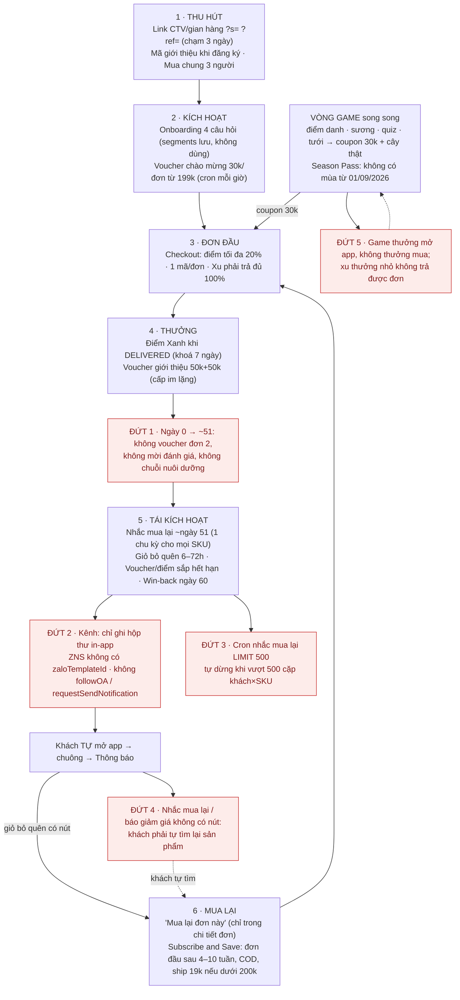
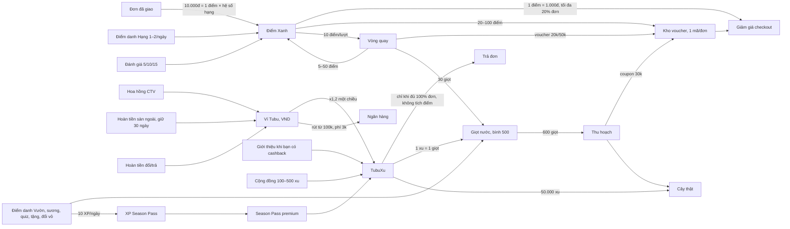

# A3 — Vòng lặp giữ chân & mua lặp lại (retention / repeat-purchase)

**Kết luận.** Tubu có một "bảo tàng" cơ chế giữ chân: 38 cơ chế trải khắp BE và miniapp (Điểm Xanh, 4 hạng, 2 kiểu điểm danh, TubuXu, Ví, giọt nước, vườn cây, vòng quay, Season Pass, 4 voucher tự động, nhắc mua lại, nhắc giỏ, đặt định kỳ, giới thiệu, hoàn tiền sàn ngoài, cộng đồng…). Phần lớn được viết cẩn thận về race/idempotency. Nhưng về mặt sản phẩm, chúng **không khép thành một vòng mua lại**. Chuỗi đứt ở bốn chỗ quyết định. (1) Không có kênh nào chạm được khách ngoài app: cả 39 mẫu thông báo chỉ ghi vào hộp thư trong app; ZNS không có template id; miniapp không gọi `followOA`/`requestSendNotification`. (2) Nhắc mua lại dùng một chu kỳ 60 ngày × 0,85 cho mọi sản phẩm, không có nút mua, và cron sẽ tự dừng khi vượt 500 cặp khách×SKU. (3) Từ đơn đầu tới ngày ~51 không có động lực nào cho **đơn thứ 2**, tức đúng chỉ số north-star. (4) Game, streak và xu thưởng việc *mở app* chứ không thưởng việc *mua*; xu thưởng lại không tiêu được cho đơn hàng vì Xu phải trả đủ 100% đơn. Thêm vào đó: khách phải hiểu ≥12 loại số dư, điểm và thước đo; có vài lỗ rò tiền (sửa ngày sinh để lấy voucher 50k mỗi tháng, Season Pass premium, vòng quay có kỳ vọng dương); quyền lợi hạng cao nhất được hứa nhưng không thực thi. Thứ tự redesign đề xuất: mở kênh ngoài app kèm deep link → engine "sắp hết → mua lại 1 chạm" theo SKU → chương trình đơn thứ 2 → Subscribe & Save 2.0 → rồi mới đơn giản hoá tiền tệ và gắn game với mua hàng.

> Phạm vi: đọc code `apps/api` (loyalty, wallet, game, lifecycle, subscriptions, refill, flash-sale, feed, notifications, vouchers, coupons, cashback, affiliate, reviews, groupbuy, ai-advisor, wishlist, orders, checkout, catalog, pricing, system-config), `apps/miniapp/src` (pages + components), `apps/web` (/tai-khoan), `prisma/schema.prisma`, `seed.ts`, migrations. Không chạy app, không đọc DB prod. Giờ VN = UTC+7. Container API chạy **UTC**: `apps/api/Dockerfile:24-35` không đặt `TZ`, `grep '^TZ' .env*` rỗng, và comment trong `vouchers.service.ts:205` ghi "container chạy UTC". Mọi giờ gửi dưới đây đã quy đổi về giờ VN.

---

## Hiện trạng

### H1. Kiểm kê 38 cơ chế

Trạng thái: **LIVE** = chạy đủ vòng · **LIVE-inapp** = chạy nhưng tin chỉ nằm trong app · **NỬA VỜI** = chạy nhưng thiếu mắt xích · **CHẾT** = hiển thị/có code nhưng không tạo giá trị · **TẮT** = cờ tắt.

Quy ước bằng chứng: bảng Phát hiện ghi đường dẫn đầy đủ. Các bảng tóm tắt ở phần Hiện trạng dùng tên file ngắn; mỗi tên đó là duy nhất trong `apps/` (đã kiểm bằng `find apps -name <file> -not -path "*/node_modules/*"`). Riêng `seed.ts` là `apps/api/prisma/seed.ts`.

#### H1.a Điểm Xanh, hạng, voucher tự động

| # | Cơ chế | Làm gì · trigger/nhịp (giờ VN) | Thưởng · đơn vị | Chi phí ước tính (config = mặc định) | Bề mặt UI | Nối với mua | Trạng thái | Bằng chứng |
|---|---|---|---|---|---|---|---|---|
| 1 | Điểm Xanh từ đơn | Cộng khi đơn DELIVERED; khoá, chưa tiêu được trong 7 ngày đổi/trả | `floor(giá trị hàng sau giảm / 10.000 × hệ số hạng)` điểm | ≈10% (×1) → 20% (×2) giá trị hàng vì 1 điểm = 1.000đ; `loyalty.vnd_per_point`=10000, `loyalty.vnd_per_point_redeem`=1000 | Checkout "+X điểm", màn thành công, Hạng, Ví, hero Home | Trực tiếp | LIVE | `apps/api/src/modules/pricing/pricing.service.ts:45-49`, `apps/api/src/modules/loyalty/loyalty.service.ts:48-114,350-391`, `apps/api/prisma/seed.ts:16-17` |
| 2 | Tiêu điểm ở checkout | Bật công tắc; trừ tối đa 20% phần hàng; chỉ điểm "dùng được" | 1 điểm = 1.000đ | `loyalty.max_redeem_pct`=0.2 | Checkout | Trực tiếp | LIVE | `pricing.service.ts:57-73`, `apps/api/src/modules/checkout/checkout.service.ts:452-464`, `apps/miniapp/src/pages/checkout.tsx:417-452` |
| 3 | Đổi điểm lấy voucher | 4 quà cố định trong code, HSD 30 ngày | Freeship cho đơn ≥99k (20 điểm), 50k/đơn ≥300k (50 điểm), 15% tối đa 80k/đơn ≥250k (75 điểm), 100k/đơn ≥600k (100 điểm) | ≈1.000đ/điểm | Hạng → "Đổi Điểm Nhận Voucher" | Trực tiếp | LIVE (admin không sửa được) | `loyalty.service.ts:559-632,1237-1282`, `apps/miniapp/src/pages/loyalty.tsx:461-563` |
| 4 | Hạng thành viên + ân hạn | Tính lại khi đơn giao + cron 10:15 VN; rớt hạng có ân hạn 30 ngày | ×1 / ×1,2 / ×1,5 / ×2 điểm; freeship ≥99k (Lộc Biếc), freeship mọi đơn (Đại Thụ, Cổ Thụ); "giảm 5%" Cổ Thụ **không chạy** | 19k ship/đơn dưới 200k cho hạng cao; `shipping.tier_freeship_overrides` | Hạng (medallion), hero | Gián tiếp | NỬA VỜI | `loyalty.service.ts:205-262`, `apps/api/src/modules/loyalty/loyalty.cron.ts:14`, `pricing.service.ts:27-39`, `seed.ts:21,227-268` |
| 5 | Điểm hết hạn + nhắc | 08:00 trừ điểm hết hạn (FIFO); 15:00 nhắc trước 7 ngày | — | Giảm chi phí nhờ breakage; `loyalty.point_expire_months`=12, `loyalty.point_expiry_reminder_days`=7 | Chỉ tin in-app; trang Hạng không hiện điểm sắp hết | Gián tiếp | LIVE-inapp | `apps/api/src/modules/loyalty/loyalty-expiry.service.ts:128-165,207-271`, `seed.ts:19-20` |
| 6 | Điểm danh 7 ngày (Điểm Xanh) | Bấm mỗi ngày; lỡ 1 ngày thì vòng về ngày 1 | 1,1,1,1,1,1,2 điểm | ≈8.000đ/tuần/khách chăm chỉ; `loyalty.checkin_points` | Hạng (widget) | Không (chỉ mở app) | LIVE | `loyalty.service.ts:742-802,1118`, `seed.ts:25`, `loyalty.tsx:252-331` |
| 7 | Thẻ thành viên QR + tích điểm POS | Nhân viên quét thẻ/nhập hoá đơn tại quầy | Điểm như online | Trần 5tr/hoá đơn, 3.000 điểm/NV/ngày, 1.000/khách/ngày | Modal thẻ ở Hạng; web `/admin/pos` | Có (mua tại quầy) | TẮT (`loyalty.pos_credit_enabled`=false) | `loyalty.service.ts:815-832,910-1049`, `seed.ts:26-29` |
| 8 | Voucher chào mừng | Cron mỗi giờ: CUSTOMER mới trong 24h, chưa có đơn | 30.000đ, đơn ≥199k, HSD 30 ngày | `voucher.welcome_amount`=30000, `voucher.welcome_min_order`=199000 (không seed; khoá seed `loyalty.welcome_voucher_*` không ai đọc) | Tin in-app + Kho voucher | Trực tiếp (đơn 1) | LIVE-inapp | `apps/api/src/modules/vouchers/vouchers.service.ts:85-124`, `seed.ts:22-23` |
| 9 | Voucher sinh nhật | 08:00, `dob` trùng ngày hôm nay | 50.000đ, **không minOrder**, HSD 30 ngày, như nhau mọi hạng | `voucher.birthday_amount`=50000 | Tin in-app | Trực tiếp | LIVE (khai thác được, A3-04) | `vouchers.service.ts:132-155` |
| 10 | Voucher win-back | 09:00, đơn gần nhất >60 ngày | 50.000đ, không minOrder, HSD 21 ngày, cấp lại mỗi tháng | `voucher.winback_days`=60, `voucher.winback_amount`=50000 | Tin in-app | Trực tiếp | LIVE, có lỗi (A3-27) | `vouchers.service.ts:163-184` |
| 11 | Voucher mốc chi tiêu tháng | 12:00, tổng đơn DELIVERED tạo trong tháng | 30k / 100k / 200k tại 1tr / 3tr / 5tr | ≈3–4% chi tiêu (6,6% nếu chạm cả 3 mốc trong tháng) | Tin in-app | Trực tiếp (tần suất) | LIVE | `vouchers.service.ts:193-238` |

#### H1.b Nhắc & lifecycle

| # | Cơ chế | Làm gì · trigger/nhịp | Thưởng | Chi phí | Bề mặt UI | Nối với mua | Trạng thái | Bằng chứng |
|---|---|---|---|---|---|---|---|---|
| 12 | Nhắc mua lại | 11:00; cặp (user×variation) có đơn DELIVERED cuối ≥ 60×0,85 ≈ 51 ngày; 1 lần/chu kỳ | — | 0 | Tin in-app **không có nút** | Trực tiếp (trên lý thuyết) | NỬA VỜI | `apps/api/src/modules/lifecycle/lifecycle.service.ts:41-126`, `apps/miniapp/src/pages/notifications.tsx:231-357` |
| 13 | Báo giảm giá SP yêu thích | Mỗi lượt sync Pancake (15 phút) thấy giá hiệu lực giảm | — | 0 | Tin in-app không nút | Trực tiếp | NỬA VỜI | `apps/api/src/modules/integrations/pancake/pancake-sync.service.ts:166-176,211-212`, `lifecycle.service.ts:133-152` |
| 14 | Nhắc giỏ bỏ quên | Mỗi giờ, 24/7; giỏ không đổi 6–72h; 1 lần mỗi lần bỏ quên | — | `remarketing.cart_abandon_min_hours`=6, `…max_hours`=72 | Tin in-app → "Xem giỏ hàng" | Trực tiếp | LIVE-inapp | `apps/api/src/modules/lifecycle/remarketing.service.ts:34-101` |
| 15 | Nhắc voucher sắp hết hạn | 12:00; voucher cá nhân còn ≤3 ngày, chưa dùng | — | `remarketing.voucher_expiry_days`=3 | Tin in-app → /loyalty | Trực tiếp | LIVE-inapp | `remarketing.service.ts:110-160` |

#### H1.c Mua lại, định kỳ, khám phá

| # | Cơ chế | Làm gì · trigger/nhịp | Thưởng | Chi phí | Bề mặt UI | Nối với mua | Trạng thái | Bằng chứng |
|---|---|---|---|---|---|---|---|---|
| 16 | Subscribe & Save | Tạo lịch 4/6/8/10 tuần; 10:00 cron tạo đơn **COD** khi tới hạn | Giảm 12% / 14% / 15% theo số lịch ACTIVE (1 / 3 / 5) | 12–15% hàng + điểm cộng thêm; ship 19k do khách trả nếu dưới 200k | PDP "Đặt định kỳ", Cá nhân → Đặt định kỳ | Trực tiếp | NỬA VỜI | `apps/api/src/modules/subscriptions/subscriptions.service.ts:47-292`, `seed.ts:70-80` |
| 17 | "Mua lại đơn này" | Thêm lại mọi món vào giỏ rồi mở giỏ | — | 0 | Chỉ trong chi tiết đơn đã giao/huỷ/trả | Trực tiếp | LIVE (chỉ trong chi tiết đơn) | `apps/api/src/modules/orders/orders.service.ts:139-151`, `apps/miniapp/src/pages/order-detail.tsx:127,541-548` |
| 18 | "Dành cho bạn" | Rule-based: danh mục đã mua + nhãn theo dõi, **loại mọi SP đã mua** | — | 0 | Home (khối thứ 9, sau flash sale) | Gián tiếp | LIVE | `apps/api/src/modules/catalog/catalog.service.ts:150-213`, `apps/miniapp/src/pages/home.tsx:401-423` |
| 19 | Flash sale + "Nhắc tôi" | Cron mỗi giờ báo sale đã bắt đầu | Giá flash, giới hạn/khách | `flashsale.default_per_user_limit`=5 | Home, PDP; tin → Home (thiếu slug) | Trực tiếp | LIVE-inapp (trễ tới 59 phút) | `apps/api/src/modules/flash-sale/flash-sale.service.ts:283-348` |
| 20 | Mua chung | Đủ 3 người trong 48h → mỗi người 1 coupon | 15% giá SP (coupon, minOrder = giá nhóm) | `groupbuy.discount_pct`=15, `target_size`=3 | Home, PDP, /group-buy | Trực tiếp (thu hút) | LIVE; tin thành công không có nút | `apps/api/src/modules/groupbuy/groupbuy.service.ts:33-162` |
| 21 | Đánh giá có thưởng | Sau đơn DELIVERED; 1 lần/SP/khách | 5 / 10 / 15 điểm (chữ/ảnh/video), không hết hạn | 5–15k/đánh giá (hard-code) | PDP; dòng chữ nhỏ trong chi tiết đơn | Gián tiếp | LIVE, không có lời mời | `apps/api/src/modules/reviews/reviews.service.ts:42-105`, `order-detail.tsx:186-199` |

#### H1.d Vườn Xanh (game)

| # | Cơ chế | Làm gì · trigger/nhịp | Thưởng | Chi phí | Bề mặt UI | Nối với mua | Trạng thái | Bằng chứng |
|---|---|---|---|---|---|---|---|---|
| 22 | Điểm danh Vườn + chuỗi + vé giữ lửa + hồi sinh | Mỗi ngày; vé 80 giọt; hồi sinh 150 giọt trong 48h, tối đa 1 lần/30 ngày | 10 giọt (+5 khi ngày chuỗi chia hết cho 3, +10 ngày thứ 7), +10 XP mùa, **0 Điểm Xanh** | Nội bộ | Vườn Xanh (tab giữa) | Không | LIVE | `apps/api/src/modules/game/game-economy.service.ts:37-203` |
| 23 | Giọt sương + Quiz | Mỗi ngày | 15 giọt; 5 câu × 8–12 giọt | Nội bộ | Vườn Xanh | Không | LIVE (quiz lặp, A3-35) | `game-economy.service.ts:132-160`, `apps/api/src/modules/game/game-quiz.service.ts:35-123` |
| 24 | Tưới → thu hoạch (+ lô đất) | 600 giọt/cây; bình tối đa 500 | Coupon 30.000đ (minOrder 30k, ≤3/ngày) + 1 cây thật cam kết + 1 loài | Coupon 30k + cây 50k (`eco.real_tree_cost_each`, không ai đọc) | Vườn Xanh, modal thu hoạch | Có (coupon → đơn) | LIVE | `apps/api/src/modules/game/game.service.ts:163-319`, `apps/api/src/modules/game/game-garden.service.ts:102-139` |
| 25 | Vòng quay | 10 Điểm Xanh/lượt, không trần | 5–50 điểm, voucher 20k/50k, 30 giọt | Kỳ vọng trả cho khách lớn hơn chi phí (A3-13) | Vườn Xanh | Có (voucher) | LIVE, kinh tế sai | `game.service.ts:103-160`, `seed.ts:96-97,138-151` |
| 26 | Nhiệm vụ | Tính tiến độ khi mở trang | Hiển thị "+15đ…+50đ" | 0 (không bao giờ trao) | Vườn Xanh | — | CHẾT | `game.service.ts:386-435`, `apps/miniapp/src/pages/game.tsx:943-991` |
| 27 | Season Pass | XP chỉ từ điểm danh Vườn | Free 230 giọt/mùa; premium 75.000 xu/mùa (cần 1 lịch định kỳ ACTIVE) | 75k xu/người/mùa | Vườn Xanh (ẩn khi không có mùa) | Gián tiếp (premium ↔ định kỳ) | CHẾT từ 01/09/2026 | `apps/api/src/modules/game/season-pass.service.ts:33-166`, `seed.ts:113-125,845-857` |
| 28 | Xã hội: tặng nước, mục tiêu cộng đồng, BXH, sổ tay loài | Tặng 10 giọt/bạn/ngày (người mời hoặc được mời) | Nội bộ | 0 | Vườn Xanh | Không | LIVE | `apps/api/src/modules/game/game-gift.service.ts:80-128`, `apps/api/src/modules/game/game-community.service.ts:15-85`, `apps/api/src/modules/game/game-season.service.ts:48-65` |
| 29 | Nhắc Vườn | 18:00: nhắc giữ chuỗi; nhắc cây khát (nghỉ 3 ngày giữa 2 lần) | — | 0 | Tin in-app → /game | Không | LIVE-inapp | `apps/api/src/modules/game/game-reminder.service.ts:47-137` |
| 30 | Đổi vỏ chai (Refill) | Khách tự khai, admin duyệt tay | 50 giọt/vỏ, ≤20 vỏ/tháng | `refill.seeds_per_bottle`=50, `refill.monthly_cap_bottles`=20 | /refill, Hạng, Cá nhân | Không (không gắn đơn refill) | LIVE (thủ công) | `apps/api/src/modules/refill/refill.service.ts:19-141` |

#### H1.e Xu, Ví, giới thiệu, cộng đồng, khác

| # | Cơ chế | Làm gì · trigger/nhịp | Thưởng | Chi phí | Bề mặt UI | Nối với mua | Trạng thái | Bằng chứng |
|---|---|---|---|---|---|---|---|---|
| 31 | TubuXu | Đổi Ví → Xu ×1,2 (một chiều). Tiêu: trả **100%** đơn, mua giọt 1 xu/giọt, cây 50.000 xu, mở lô | 1 xu = 1đ | +20% giá trị đổi; `wallet.xu_convert_multiplier`=1.2 | Ví & HH | Có, nhưng phải đủ 100% đơn | LIVE | `apps/api/src/modules/wallet/wallet.service.ts:58-117`, `checkout.service.ts:121-126`, `game.service.ts:323-362` |
| 32 | Giới thiệu → xu | Khi người được mời có giao dịch **hoàn tiền sàn ngoài** CONFIRMED đầu tiên | 5.000 + 5.000 xu; mốc 3/5/10 bạn: 20k/40k/100k xu | `coins.referrer_reward`, `coins.referee_reward`, `coins.referral_milestones` | Ví → "Mời bạn" | **Không** gắn đơn Tubu | NỬA VỜI (phụ thuộc AccessTrade) | `apps/api/src/modules/wallet/coins.service.ts:123-154`, `apps/api/src/modules/cashback/cashback.service.ts:131-137` |
| 33 | Giới thiệu → voucher | Đơn DELIVERED có `referrerUserId` (link CTV) và tổng ≥200k | 50k cho người giới thiệu (mỗi người được mời) + 50k cho người được mời (1 lần), minOrder 200k | `referral.*` (không seed) | **Không có** (không tin, không UI) | Trực tiếp (đơn 1) | LIVE nhưng im lặng | `apps/api/src/modules/affiliate/affiliate.service.ts:450-500` |
| 34 | Hoàn tiền sàn ngoài | Click deeplink Shopee/Lazada/TikTok → postback → giữ 30 ngày → Ví | 70% hoa hồng sàn | `cashback.merchant_user_share`=0.7 | Cá nhân, /cashback, Ví | **Ngược chiều** (mua ở sàn khác) | Phụ thuộc AccessTrade (`ACCESSTRADE_TOKEN` trống trong `.env.vietnix.deploy` nên reconcile tắt) | `cashback.service.ts:37-137,331-373`, `seed.ts:42,692-694` |
| 35 | Cộng đồng hỏi đáp | Đăng bài / trả lời / câu hay nhất / thắng sự kiện | 200 / 100 / 500 xu, trần 3 / 10 / 5 lượt mỗi ngày | ≤4.100 xu/người/ngày; `community.*` (không seed) | /feed, Home, Vườn | Gián tiếp (thẻ SP trong bài) | LIVE | `apps/api/src/modules/feed/community-reward.service.ts:49-93` |
| 36 | Trợ lý AI | Gợi ý SP theo từ khoá + FAQ | — | Chi phí LLM (UNKNOWN) | Home (nút nhanh) | Gián tiếp | LIVE (không dùng lịch sử mua) | `apps/api/src/modules/ai-advisor/ai-advisor.service.ts:44-91` |
| 37 | Theo dõi nhãn | Chỉ ảnh hưởng "Dành cho bạn" | — | 0 | Trang nhãn | Gián tiếp | LIVE (không phát tin) | `catalog.service.ts:184-194` |
| 38 | Ví Tubu / rút tiền | Nhận hoa hồng, cashback, hoàn tiền trả hàng; rút hoặc đổi xu | VND thật | Rút từ 100k, phí 3k do khách chịu | Tab "Ví & HH" | Có (trả 100% đơn WALLET) | LIVE | `wallet.service.ts:18-43,123-204` |

**Ghi chú về ước tính chi phí game** (theo config mặc định). Một người chơi đều tay nhận miễn phí ≈475 giọt/tuần: điểm danh 70, thưởng chuỗi 20, sương 105, quiz 5×8×7 = 280, lấy mức thấp nhất 8 giọt/câu (`game-economy.service.ts:84-95`, `seed.ts:98,100,104`, `apps/api/prisma/seed-game-quiz.ts:17,24,76`, mặc định `waterReward` 8 ở `apps/api/prisma/schema.prisma:1919`). Như vậy ≈1 lần thu hoạch mỗi 9 ngày, tức ≈3 lần mỗi tháng: ≈90.000đ voucher cộng ≈150.000đ cam kết cây thật (`eco.real_tree_cost_each`=50000). Đây chưa tính giọt mua bằng xu và giọt từ vòng quay. Số liệu là ước tính từ code, không phải số đo thật.

---

### H2. Bản đồ vòng lặp hiện tại và chỗ đứt



| Chỗ đứt | Mô tả ngắn | Bằng chứng | Finding |
|---|---|---|---|
| ĐỨT 1 | Sau đơn đầu không có ưu đãi/nhịp nào cho đơn 2 trước ngày ~51 | `vouchers.service.ts:106,166`; `lifecycle.service.ts:44-46`; `order-success.tsx:120-127` | A3-06, A3-23 |
| ĐỨT 2 | Mọi tin chỉ in-app; không ZNS/OA/quyền thông báo | `notifications.service.ts:52-59`; `seed.ts:627-628`; `zmp-bridge.ts:1-10` | A3-01 |
| ĐỨT 3 | Cron nhắc mua lại sẽ tự dừng | `lifecycle.service.ts:49-59,68` | A3-03 |
| ĐỨT 4 | Tin nhắc mua lại không có đường đi | `lifecycle.service.ts:103`; `notifications.tsx:231-357` | A3-02, A3-31 |
| ĐỨT 5 | Game tách rời mua hàng; xu không tiêu được cho đơn nhỏ | `game-economy.service.ts:129`; `checkout.tsx:258-262` | A3-14, A3-18 |
| Phụ | "Dành cho bạn" loại SP đã mua; không có kệ Mua lại | `catalog.service.ts:196`; `home.tsx:401-423` | A3-08 |
| Phụ | S&S không giao ngay, không nhắc trước khi tạo đơn | `subscriptions.service.ts:56-65,146-175` | A3-09, A3-10 |
| Phụ | Giới thiệu thưởng theo cashback sàn ngoài | `coins.service.ts:123-136` | A3-17 |

---

### H3. Tiền tệ & phần thưởng

#### H3.1 Các số dư, điểm và thước đo khách nhìn thấy (12 loại)

| Loại | Nhãn trong UI | Kiếm từ | Tiêu vào / quy đổi | Hết hạn | Giải thích ở đâu | Chồng chéo / rủi ro nhầm | Bằng chứng |
|---|---|---|---|---|---|---|---|
| Điểm Xanh (`pointsBalance`) | "Điểm Xanh (đổi giảm giá)", "X Xanh" | Đơn giao (10.000đ = 1 điểm × hạng), điểm danh Hạng, đánh giá, vòng quay, hoàn điểm khi huỷ, POS (tắt) | Checkout 1 điểm = 1.000đ (≤20%); đổi 4 voucher; 10 điểm/lượt quay | 12 tháng FIFO cho điểm đơn/điểm danh/POS; **điểm đánh giá & vòng quay không hết hạn**; khoá 7 ngày sau giao | Chỉ FAQ "Về Tubu" (chép cứng); trang Hạng không nêu tỷ giá, không nêu ngày hết hạn | Trùng vai trò với TubuXu (cả hai đều "giảm tiền đơn") | `pricing.service.ts:45-73`; `reviews.service.ts:87-89`; `game.service.ts:452-466`; `loyalty-expiry.service.ts:42-87`; `apps/miniapp/src/pages/about.tsx:19`; `wallet.tsx:235` |
| Điểm xét hạng | "Còn X điểm tích từ mua hàng để lên hạng" | Chỉ điểm đơn đã giao trong 12 tháng, trừ đơn trả | Không tiêu | Cửa sổ trượt 12 tháng | Chỉ 1 dòng dưới thanh tiến độ | Khách thấy 2 con số "điểm" khác nhau; số điểm xét hạng không hiển thị trực tiếp | `loyalty.service.ts:315-335,433-466`; `loyalty.tsx:213-215,452-454` |
| Hạng | Mầm Xanh / Lộc Biếc / Đại Thụ / Cổ Thụ | Điểm xét hạng HOẶC chi tiêu 12 tháng | Hệ số điểm, freeship, perks | Ân hạn 30 ngày khi rớt (không hiển thị) | Trang Hạng (chỉ quyền lợi hạng hiện tại) | Quyền lợi hứa ≠ quyền lợi chạy (A3-05) | `loyalty.service.ts:205-262`; `seed.ts:227-268`; `loyalty.tsx:414-459` |
| TubuXu (`coinsBalance`) | "TubuXu (tiêu trong app)" | Đổi Ví ×1,2; giới thiệu (cashback); mốc giới thiệu; cộng đồng; Season Pass premium; mốc CTV | Trả **đủ 100%** đơn (không tích điểm, không tính hạng); giọt nước; cây thật; lô đất | Không | Thẻ Ví: "Dùng để mua hàng…Không rút được" (dễ hiểu nhầm là trừ một phần được) | Trùng Điểm Xanh; không dùng được cho đơn nếu số dư nhỏ | `wallet.service.ts:58-117`; `checkout.service.ts:124-142`; `wallet.tsx:197`; `checkout.tsx:258-262` |
| Ví Tubu (`walletBalance`) | "Ví Tubu (số dư khả dụng)" | Hoa hồng CTV, cashback đã về, hoàn tiền trả hàng | Trả 100% đơn WALLET; đổi xu ×1,2; rút từ 100k, phí 3k | Không | Thẻ Ví | Với khách mua thường gần như luôn 0đ | `wallet.service.ts:18-43,123-204`; `wallet.tsx:166` |
| Hoàn tiền chờ (`cashbackPending`) | "Hoàn tiền đã duyệt, chờ về Ví" | Cashback sàn ngoài CONFIRMED | Tự về Ví sau 30 ngày | — | Thẻ Ví | Thêm 1 số dư "chờ" | `cashback.service.ts:331-373` |
| Hoa hồng (chờ / có thể rút) | "Hoa hồng chờ duyệt", "Hoa hồng có thể rút" | CTV | Bấm "Nhận về ví" | — | Ví, trang CTV | Hiện cả với khách không phải CTV | `wallet.service.ts:20-42` |
| Giọt nước (`totalSeeds`) | Biểu tượng giọt nước trong Vườn | Điểm danh Vườn, sương, quiz, tặng, vòng quay, Season Pass, đổi vỏ, mua bằng xu | Tưới 600/cây, vé giữ lửa 80, hồi sinh 150, tặng 10, mở lô 100×slot | Không, nhưng cây chết sau 7 ngày không tưới (mất tiến trình); vượt bình 500 bị cắt | Rải rác trong Vườn | Thêm một "tiền" nữa; không kiếm được từ mua hàng | `game.service.ts:163-319`; `game-economy.service.ts:37-203` |
| XP Season Pass | "XP" | Chỉ điểm danh Vườn (10/ngày) | Mở bậc thưởng | Theo mùa | Card Season Pass (đang ẩn) | — | `season-pass.service.ts:46-59` |
| 2 chuỗi + vé giữ lửa | "Chuỗi X ngày" ở Hạng và ở Vườn | 2 nút điểm danh riêng | — | Đứt khi lỡ ngày | loyalty.tsx ghi "hạt giống Vườn Xanh điểm danh riêng" | Hai chuỗi, hai phần thưởng, hai nút | `loyalty.tsx:328-330`; `game.tsx:423-498` |
| Kho voucher | "Kho voucher" | ≥9 nguồn: chào mừng, sinh nhật, win-back, mốc, đổi điểm, thu hoạch, vòng quay, mua chung, giới thiệu (+ mã PUBLIC) | 1 mã/đơn | 21–30 ngày | Danh sách, không có "Dùng ngay" | Nhiều mã nhỏ, mỗi đơn chỉ dùng 1 | `loyalty.tsx:565-609`; `apps/api/prisma/schema.prisma:737` |
| Uy tín cộng đồng; cây thật & loài | Level/huy hiệu; "Cây thật đã trồng", sổ tay loài | Hoạt động cộng đồng; thu hoạch | Không tiêu | — | Cộng đồng, Vườn | "Cây thật đã trồng" đếm cả cây mới cam kết | `game.tsx:847`; `schema.prisma:1716-1728` |

#### H3.2 Sơ đồ quy đổi hiện tại



#### H3.3 Rủi ro nhầm lẫn và chồng chéo

- **Hai tiền tệ "giảm tiền" cạnh tranh nhau.** Điểm Xanh trừ được một phần đơn (≤20%). TubuXu phải trả đủ đơn. Khách có 30 điểm và 8.000 xu không biết dùng cái nào, và thực tế chỉ dùng được điểm (`checkout.tsx:258-262`).
- **Hai điểm danh, hai chuỗi.** Hạng cho 1–2 Điểm Xanh mỗi ngày, Vườn cho 10 giọt. Mỗi nút có vòng 7 ngày riêng (`loyalty.service.ts:742-802`, `game-economy.service.ts:37-130`).
- **Ba kiểu "điểm".** Có số dư Điểm Xanh, "điểm xét hạng" và "từ X điểm tích luỹ" (`loyalty.tsx:213-215,452-454`). Số dư có thể lớn hơn điểm xét hạng mà khách không hiểu vì sao chưa lên hạng.
- **Đường vòng giá trị khó hiểu.** Ví → xu (+20%) → giọt (1:1) → 600 giọt → voucher 30k + cây thật. Hay điểm → vòng quay → voucher. Giá trị một điểm phụ thuộc vào đường đi, và quay lợi hơn dùng ở checkout (A3-13).
- **Tỷ giá không hiển thị.** Chỉ FAQ chép cứng (`about.tsx:19`). Public config không trả tỷ giá điểm (`apps/api/src/modules/system-config/system-config.controller.ts:22-47`). Nếu admin đổi config thì FAQ nói sai.
- **Tab Ví hiển thị 7 khối cho mọi khách.** Ví, Xu, Điểm, Mời bạn, hoa hồng chờ, hoa hồng rút được, hoàn tiền chờ. Với khách B2C phần lớn là 0đ (`wallet.tsx:120-310`).

#### H3.4 Mô hình đề xuất: 1 tiền tệ tiêu + 1 thước đo hạng (không triển khai ở đây)

| Thành phần | Đề xuất | Lý do |
|---|---|---|
| **1 tiền tệ tiêu: "Xu Xanh"** (1 xu = 1đ) | Gộp Điểm Xanh + TubuXu. Trừ **một phần** đơn (vd tối đa 30–50%, kiểu Shopee Xu), hạn 12 tháng theo lô. Nguồn: đơn đã giao (tỷ lệ theo hạng), đánh giá, đổi vỏ/thu gom, giới thiệu (khi bạn có đơn 2), game (có trần/tuần). Hiển thị luôn "≈ X đồng · N xu hết hạn ngày …" | Một con số khách hiểu ngay bằng tiền; mọi thưởng nhỏ đều thành lý do đặt đơn |
| **1 thước đo trạng thái: "Hạng"** | Theo chi tiêu 12 tháng (đơn đã giao, trừ trả hàng) kèm số đơn (tần suất). Bỏ "điểm xét hạng" khỏi UI. Hiển thị "chi tiêu thêm X đ hoặc thêm N đơn để lên/giữ hạng" | Tách hẳn "tiền tiêu" với "danh phận"; giữ hạng thúc tần suất |
| Ví Tubu | Giữ riêng (tiền thật, rút được), **ẩn** với khách không phải CTV và số dư = 0 | Pháp lý khác điểm thưởng; bớt nhiễu cho B2C |
| Giọt nước | Chuyển thành *tiến độ cây* nội bộ của game, không còn là số dư trên tab Ví. Nguồn chính = mua hàng và hành động xanh | Game gắn với mua; bớt một "tiền" |
| Điểm danh | Chỉ còn 1 điểm danh (trong Vườn) + "chuỗi mua xanh" theo tháng (tháng nào có đơn thì chuỗi tiếp tục) | Streak gắn với mua, không chỉ mở app |
| Tỷ lệ tích | Tái định giá (vd 2–5% theo hạng) và dồn phần ngân sách tiết kiệm được sang voucher đơn 2 và freeship định kỳ | Hiện 10–20% "đều cho mọi đơn" (A3-20) |

**Ghi chú migration.**
1. `pointsBalance` × 1.000 → Xu Xanh, giữ `expiresAt` theo lô bằng thuật toán FIFO sẵn có (`loyalty-expiry.service.ts:42-87`). Lô không có hạn (đánh giá, vòng quay) gán hạn 12 tháng kể từ ngày chuyển.
2. `coinsBalance` quy 1:1. Xu cũ có gốc là tiền Ví đã đổi ×1,2 nên cần luật sư xác nhận trước khi gắn hạn. Phương án an toàn: lô "legacy" không hạn.
3. Hợp nhất `PointsTransaction` + `CoinTransaction` thành một sổ cái có `source/refType/refId/expiresAt`. Giữ các unique index idempotency hiện có (ORDER_DELIVERED, CHECKIN, POS, REFERRAL, COMMUNITY, CONVERT).
4. Checkout: bỏ phương thức "XU trả 100%", thay bằng trừ một phần. Giữ luật khoá 7 ngày (`lockedOrderPoints`) cho xu đến từ đơn còn trong hạn đổi/trả.
5. Hạng: giữ nguyên hạng hiện tại 1 chu kỳ (grandfather) để không ai bị rớt khi chuyển.
6. Truyền thông: báo trước 30 ngày (banner + tin), một trang "Xu Xanh là gì", cập nhật FAQ. Ghi log quy đổi để đối soát.

---

### H4. Chiến lược thông báo

#### H4.1 Toàn bộ mẫu thông báo

Có 39 mẫu, đều nằm trong `seed.ts`. Chỉ 8 mẫu có thêm trong migration: GROUP_BUY_SUCCESS, DEALER_BONUS_PAID, OPS_GOMDON_ALERT, 4 × DEALER_REWARD_CLAIM_*, DEALER_BONUS_ADJUSTED. Ngoài ra có 2 mã ghi log trực tiếp không qua template. **Kênh thực tế của mọi mẫu là INAPP**: ZNS chỉ gửi khi `channel='ZNS'` và có `zaloTemplateId` (`notifications.service.ts:58`). 2 mẫu ZNS trong seed không có `zaloTemplateId` (`seed.ts:627-628`), và không có API hay màn admin để đặt giá trị này.

| Mã | Kênh seed | Trigger | Giờ gửi (VN) | Cá nhân hoá | Nút ở trang Thông báo | Vai trò với mua lặp |
|---|---|---|---|---|---|---|
| ORDER_CONFIRMED | ZNS (thực tế INAPP) | `checkout.service.ts:325`; `integrations/pancake/pancake.processor.ts:209`; `integrations/payment/zalopay.service.ts:170`; `dealer/dealer.service.ts:961` | Ngay | order_code | Xem chi tiết đơn | Giao dịch |
| ORDER_PACKED, ORDER_SHIPPING (ZNS), ORDER_DELIVERED, ORDER_RETURNED, ORDER_CANCELLED | INAPP (SHIPPING: ZNS→INAPP) | `orders/order-status.service.ts:128-130`; `orders/orders.service.ts:119` | Ngay | order_code | Xem chi tiết đơn | Giao dịch. DELIVERED là điểm chạm vàng để mời đánh giá/đặt định kỳ nhưng chỉ nói "Điểm Xanh đã được cộng" |
| INVOICE_ISSUED | INAPP | `pancake.processor.ts:321` | Ngay | order_code | Chi tiết đơn | Giao dịch |
| RETURN_REQUESTED / RETURN_APPROVED | INAPP | `orders.service.ts:208`; `admin/admin.service.ts:156` | Ngay | order_code | Chi tiết đơn | Giao dịch |
| SUBSCRIPTION_ORDER | INAPP | `subscriptions.service.ts:291` | 10:00 | order_code | Chi tiết đơn | **Mua lặp** |
| SUBSCRIPTION_PAUSED | INAPP | `subscriptions.service.ts:191,197` | 10:00 | — | **Không** | Mua lặp (nguy cơ mất lịch) |
| SUBSCRIPTION_ORDER_FAILED | INAPP | `subscriptions.service.ts:275` | 10:00 | reason | **Không** | Mua lặp |
| REORDER_REMINDER | INAPP | `lifecycle.service.ts:103` | 11:00 | product (không slug) | **Không** | **Mua lặp trực tiếp** |
| PRICE_DROP_ALERT | INAPP | `lifecycle.service.ts:145` | Bất kỳ (sync 15 phút, cả đêm) | product | **Không** | Chuyển đổi/mua lặp |
| CART_ABANDONED | INAPP | `remarketing.service.ts:74` | Mỗi giờ, 24/7 | item_count, product | Xem giỏ hàng | Chuyển đổi |
| VOUCHER_EXPIRING | INAPP | `remarketing.service.ts:140` | 12:00 | code, expires | → /loyalty | Mua lặp |
| POINTS_EXPIRING | INAPP | `loyalty-expiry.service.ts:265` | 15:00 | points, date | → /loyalty | Mua lặp |
| FLASH_STARTING | INAPP | `flash-sale.service.ts:322` | Mỗi giờ (trễ tới 59 phút) | product (không slug) | → Home | Chuyển đổi |
| WELCOME_VOUCHER | INAPP | `vouchers.service.ts:116` | Mỗi giờ | code, value, expires | → /loyalty | Kích hoạt đơn 1 |
| BIRTHDAY_VOUCHER | INAPP | `vouchers.service.ts:149` | 08:00 | như trên | → /loyalty | Mua lặp |
| WINBACK_VOUCHER | INAPP | `vouchers.service.ts:178` | 09:00 | như trên | → /loyalty | Win-back |
| MILESTONE_VOUCHER | INAPP | `vouchers.service.ts:229` | 12:00 | như trên | → /loyalty | Tần suất |
| CASHBACK_PAID | INAPP | `cashback.service.ts:363` | Mỗi giờ (phút 30) | amount | **Không** | Ví |
| GAME_CHECKIN_REMINDER | INAPP | `game-reminder.service.ts:73` | 18:00 | streak | → /game | Mở app |
| GAME_TREE_THIRSTY | INAPP | `game-reminder.service.ts:134` | 18:00 | — | → /game | Mở app |
| GAME_WATER_GIFT | INAPP | `game-gift.service.ts:125` | Ngay | amount | → /game | Mở app |
| GROUP_BUY_SUCCESS | INAPP | `groupbuy.service.ts:162` | Ngay | discount | **Không** (dù nội dung "Đặt hàng ngay") | Chuyển đổi |
| COMMUNITY_NEW_ANSWER / COMMUNITY_EXPERT_REPLIED | INAPP | `feed/community-feed.service.ts:644` | Ngay | author, title | **Không** | Engagement |
| COMMUNITY_BEST_ANSWER | INAPP | `community-feed.service.ts:752` | Ngay | — | **Không** | Engagement |
| COMMUNITY_POST_APPROVED | INAPP | `community-feed.service.ts:556` | Ngay | — | **Không** | Engagement |
| STOREFRONT_TRENDING_PRODUCTS | INAPP | `storefront/storefront-reminder.service.ts:77` | Thứ Hai 16:00 | count, sample | → /storefront | CTV |
| DEALER_BONUS_PAID, DEALER_BONUS_ADJUSTED, DEALER_REWARD_CLAIM_NEW/APPROVED/REJECTED/PAID | INAPP | `dealer.service.ts:780,992,1066,1238` | Ngay / cron quý | quarter, amount, reward… | Không | Đại lý |
| OPS_GOMDON_ALERT | INAPP | `integrations/gomdon/gomdon-alert.service.ts:36` | Ngay | order_code, message | Không (chủ ý) | Vận hành (admin) |
| REFILL_APPROVED / REFILL_REJECTED (log trực tiếp, không template) | INAPP | `refill.service.ts:126-137,156-167` | Khi admin duyệt | quantity, seeds | APPROVED → /game (khớp regex "tưới cây") | Mở app |

Ghi chú rủi ro triển khai: 31/39 mẫu chỉ có trong `seed.ts`. Nếu một lần deploy không chạy seed, `notify()` gửi câu chung chung "Tubu Tree có cập nhật mới…" (`notifications.service.ts:9,49-52`). Prod đã chạy seed hay chưa: UNKNOWN.

#### H4.2 Quiet hours, trần tần suất, cá nhân hoá, opt-out

- **Quiet hours: không có.** `notify()` không kiểm giờ (`notifications.service.ts:37-82`). Nhắc giỏ, welcome và flash chạy mỗi giờ 24/7 (`remarketing.service.ts:34`, `vouchers.service.ts:85`, `flash-sale.service.ts:283`). Báo giảm giá chạy theo nhịp sync 15 phút. Hiện chưa gây hại vì chỉ là in-app, nhưng sẽ vi phạm khung 06:00–19:59 của OA broadcast (nghiên cứu nội bộ `docs/2026-07-05-retention-ctv-conversion-research.md:15-19`) ngay khi bật kênh ngoài app.
- **Trần tần suất: không có trần chung.** Chỉ có chống trùng riêng lẻ: POINTS_EXPIRING 1 lần/7 ngày (`loyalty-expiry.service.ts:256-262`), cây khát 1 lần/3 ngày (`game-reminder.service.ts:113-121`), giỏ 1 lần mỗi lần bỏ quên, nhắc mua lại 1 lần/chu kỳ.
- **Cá nhân hoá**: chỉ tên SP/mã đơn/mã voucher. Không có giá, ảnh, deep link hay biến tên khách.
- **Opt-out**: 3 công tắc trong Cài đặt chỉ lưu trên máy, BE không biết (`apps/miniapp/src/pages/settings.tsx:43-57`).
- **Đo lường**: `NotificationLog.status` chỉ có SENT/READ (`notifications.service.ts:53-55,105-113`). Không đo click, không gắn đơn với tin.
- **Danh sách**: tối đa 50 tin, không có "đánh dấu tất cả đã đọc" (`notifications.service.ts:97-103`).

#### H4.3 Tin nào thúc mua lặp, tin nào thiếu

**Đang có và (về lý thuyết) thúc mua lặp**: REORDER_REMINDER, SUBSCRIPTION_ORDER, VOUCHER_EXPIRING, POINTS_EXPIRING, WINBACK_VOUCHER, MILESTONE_VOUCHER, BIRTHDAY_VOUCHER, PRICE_DROP_ALERT, FLASH_STARTING, CART_ABANDONED. Trong 10 tin này chỉ CART_ABANDONED dẫn thẳng tới nơi mua. REORDER và PRICE_DROP không có nút. Các tin voucher dẫn về danh sách voucher, không dẫn về giỏ.

**Thiếu (xếp theo tác động):**

| # | Tin còn thiếu | Vì sao quan trọng |
|---|---|---|
| 1 | "Sắp hết [SP]" theo chu kỳ từng SKU (days-per-unit × SL), 2 chạm: D-3 và D+3 | Đòn bẩy mua lại số 1 cho hàng tiêu dùng; hiện chỉ có 1 chu kỳ chung 51 ngày |
| 2 | Chuỗi sau giao hàng: D+1 hướng dẫn dùng + mời đánh giá → D+10 gợi ý bổ trợ → D+20 voucher đơn 2 → D+27 hạn chót | Trúng thẳng "đơn 2 trong 30 ngày" |
| 3 | Nhắc trước giao định kỳ D-3 (bỏ qua / đổi ngày / đổi SL 1 chạm; báo đổi giá) | Giảm huỷ và bom COD của đơn định kỳ |
| 4 | "Có hàng lại" cho SP yêu thích / trong giỏ / đang định kỳ | Hết hàng là lúc mất khách sang sàn khác |
| 5 | Lên hạng / sắp hết ân hạn ("thêm X đ để giữ hạng") | Loss aversion kéo tần suất |
| 6 | Voucher mới vào kho (giới thiệu hiện cấp im lặng) | Voucher không biết thì không dùng |
| 7 | Win-back theo nhịp cá nhân (1,5× khoảng cách mua thường lệ) thay cho 60 ngày cố định | Đúng lúc hơn cho chu kỳ 30 ngày |
| 8 | Nhãn đang theo dõi có SP mới / khuyến mãi | Lý do quay lại có chủ đích |
| 9 | Xem SP nhiều lần mà chưa mua (browse abandonment) | Cần event tracking (H6) |
| 10 | Mời bật thông báo / quan tâm OA ngay sau đơn đầu | Mở kênh cho mọi tin trên |

---

### H5. Đòn bẩy mua lặp cho hàng tiêu dùng — đối chiếu best-in-class

| Đòn bẩy | Mẫu best-in-class (mô tả bằng lời của mình) | Tubu có? | Chất lượng | Bằng chứng |
|---|---|---|---|---|
| Dự đoán chu kỳ theo SP (days-per-unit) | Amazon cho chọn tần suất giao riêng cho từng SP khi đăng ký định kỳ, và gom SP từng mua vào mục "Buy it again" | Một chu kỳ 60×0,85 cho mọi SKU; không tính SL | **Yếu** | `lifecycle.service.ts:44-59` |
| Giảm giá định kỳ + bỏ qua/tạm dừng dễ | Amazon S&S: ~5% cho 1–4 món, tới 15% khi ≥5 món trong cùng một lần giao; email nhắc trước mỗi lần giao (món, giá, giảm); bỏ qua/huỷ bất kỳ lúc nào | Giảm 12/14/15% theo số lịch; có pause/skip/cancel; **không** nhắc trước, không gộp giao, không sửa lịch, chỉ COD, đơn đầu trễ, ship 19k dưới 200k | **Trung bình-yếu** | `subscriptions.service.ts:47-292`; `subscriptions.controller.ts:16-39` |
| Mua lại 1 chạm | Amazon "Buy it again"; Shopee có nút mua lại trên đơn đã giao ngay trong danh sách | Nút trong chi tiết đơn → giỏ → checkout (≥4 bước); danh sách đơn không có nút | **Trung bình** | `order-detail.tsx:541-548`; `orders.tsx:104-160` |
| Kệ "Mua lại" trên Home | Amazon đưa kệ "Buy it again" lên trang chủ của khách đã mua; Shopee có mục "Mua lại" ngay trong trang cá nhân | Không có; "Dành cho bạn" còn loại SP đã mua | **Không có** | `catalog.service.ts:196`; `home.tsx:401-423` |
| Home cá nhân hoá | Shopee/TikTok Shop: feed cá nhân hoá theo hành vi | 1 kệ rule-based đặt sau flash sale; segments onboarding không dùng | **Yếu** | `catalog.service.ts:156-213`; `users.service.ts:98-107` |
| Quyền lợi hạng thưởng tần suất | Sephora: hạng theo chi tiêu năm, quà sinh nhật cho mọi hạng, hạng cao được ưu đãi sâu hơn trong đợt sale lớn; Shopee Mall: thành viên theo từng shop, voucher thành viên | Hạng theo 12 tháng + freeship + hệ số điểm; 5% Cổ Thụ và sinh nhật theo hạng không chạy; không có ưu đãi theo số đơn; không có "giữ hạng" | **Yếu** | `seed.ts:227-268`; `loyalty.service.ts:205-262` |
| Streak gắn với mua | Hiếm ai làm tốt; mẫu nên theo: "tháng nào cũng có đơn" hoặc "đơn thứ N trong quý" | 2 chuỗi điểm danh mở app, 0 chuỗi mua | **Không có** | `game-economy.service.ts:37-130`; `loyalty.service.ts:742-802` |
| Giới thiệu thưởng đơn thứ 2 | Mẫu tốt: tách thưởng thành 2 lần (bạn mới có đơn 1, rồi đơn 2) để kéo cả người mới quay lại | Thưởng khi bạn có cashback sàn ngoài, hoặc khi đơn đầu ≥200k qua CTV; không có đơn 2 | **Không có** | `coins.service.ts:123-154`; `affiliate.service.ts:450-500` |
| Voucher "khách mua lại" | Shopee (người bán tạo voucher cho khách từng mua) và TikTok Shop VN (điều kiện "Khách hàng quay lại") | Chỉ có win-back ngày 60 | **Không có** | `vouchers.service.ts:163-184` |
| Đổi vỏ lấy điểm | Innisfree VN: điểm thành viên cho mỗi vỏ rỗng, trần theo tháng | Đổi vỏ lấy giọt nước (game), không gắn mua refill | **Trung bình** | `refill.service.ts:19-64` |
| Tiền thưởng trừ một phần đơn | Shopee Xu: dùng trừ một phần đơn (tối đa ~50%) | Điểm ≤20%; Xu phải trả 100% | **Kém** | `pricing.service.ts:57-73`; `checkout.tsx:258-262` |
| Tỷ lệ tích điểm | Hasaki: 1.000đ = 1 điểm, đổi quà từ 1.000 điểm, reset hằng năm; Sephora: hạng cao nhất quy đổi tốt nhất ≈4% | ≈10–20% giá trị hàng | **Quá hào phóng / cần quyết** | `seed.ts:16-18`; `pricing.service.ts:45-49` |

Nguồn benchmark (chỉ dùng để mô tả mẫu): [Amazon Subscribe & Save](https://www.amazon.com/gp/help/customer/display.html?nodeId=GJ2LTMLFGGMH67M7), [Amazon — Subscribe & Save guide](https://www.aboutamazon.com/news/retail/how-you-can-save-time-and-money-with-amazon-subscribe-save), [Sephora Beauty Insider](https://www.sephora.com/beauty/loyalty-program), [Innisfree x AEON Mall — Empty Bottle Campaign](https://aeonmall-binhduongcanary-en.com/khuyen-mai/innisfree-chien-dich-song-xanh), [Hasaki — tích điểm khách hàng thân thiết](https://hotro.hasaki.vn/tri-an-khach-hang.html), [Shopee — Voucher khách hàng mua lại](https://banhang.shopee.vn/edu/article/18079/cau-hoi-thuong-gap-voucher-khach-hang-mua-lai-shopee), [Shopee Xu FAQ](https://help.shopee.vn/4/article/79144-%5BShopee-Xu%5D-C%C3%A1c-c%C3%A2u-h%E1%BB%8Fi-th%C6%B0%E1%BB%9Dng-g%E1%BA%B7p), [TikTok Shop — mã ưu đãi cho nhà bán (Brands Vietnam)](https://www.brandsvietnam.com/congdong/topic/341566-tong-hop-ma-uu-dai-voucher-tiktok-shop-nha-ban-hang-can-biet).

---

### H6. Sự kiện analytics cần đo (cho sub-project 2 — chỉ tên sự kiện)

| Đòn bẩy | Sự kiện | Chỉ số chứng minh |
|---|---|---|
| Nền (mọi đòn bẩy) | `app_opened` (source, notification_id), `screen_viewed`, `product_viewed`, `add_to_cart`, `checkout_started`, `order_placed` (order_index, is_first_order, days_since_prev_order, payment_method, coupon_code, points_used), `order_delivered`, `order_cancelled`, `order_returned` | % khách có đơn 2 trong 30 ngày (cohort theo tuần của đơn 1); đơn/khách/tháng; trung vị số ngày tới đơn 2 |
| Kênh ngoài app | `notification_created` (template, channel), `zns_sent`, `zns_failed`, `oa_message_sent`, `notification_opened`, `notification_cta_clicked`, `notification_optin_prompted`, `notification_optin_granted`, `oa_follow_prompted`, `oa_followed`, `notification_pref_changed`, `app_favorited`, `shortcut_created` | Tỷ lệ phủ ngoài app; tỷ lệ tin → đơn trong 7 ngày theo template/kênh; chi phí/đơn tăng thêm |
| Sắp hết → mua lại | `replenish_due_computed`, `reorder_reminder_sent`, `buy_again_shelf_viewed`, `buy_again_item_clicked`, `repurchase_clicked` (source), `repurchase_cart_created` | Tỷ lệ mua lại trong 14 ngày quanh ngày dự kiến hết; lift so với nhóm đối chứng |
| Đơn thứ 2 | `second_order_voucher_granted`, `second_order_voucher_viewed`, `second_order_voucher_redeemed`, `post_delivery_step_sent` (step) | % đơn 2 trong 30 ngày (nhóm có/không voucher) |
| Đặt định kỳ | `subscription_sheet_opened`, `subscription_created` (interval, first_delivery_now), `subscription_preship_reminder_sent`, `subscription_skipped`, `subscription_rescheduled`, `subscription_paused`, `subscription_resumed`, `subscription_cancelled` (reason), `subscription_order_created`, `subscription_order_failed`, `subscription_order_delivered` | Giữ lịch tới kỳ 3; tỷ lệ bom COD đơn định kỳ |
| Tiền tệ | `points_earned`, `points_redeemed`, `points_expired`, `points_expiring_notice_sent`, `xu_earned`, `xu_spent`, `reward_redeemed`, `voucher_granted` (source), `voucher_applied`, `voucher_redeemed`, `voucher_expired` | Tỷ lệ tiêu thưởng; chi phí thưởng/đơn |
| Hạng | `tier_upgraded`, `tier_grace_started`, `tier_downgraded`, `tier_keep_nudge_sent` | Tỷ lệ giữ hạng sau cảnh báo |
| Game | `game_checkin`, `game_harvest`, `game_coupon_granted`, `game_coupon_redeemed`, `spin_played`, `season_pass_claimed`, `mission_completed`, `mission_claimed` | Người chơi có tần suất đơn cao hơn không (so cohort) |
| Đánh giá | `review_prompt_sent`, `review_form_opened`, `review_submitted` | Tỷ lệ đánh giá; đơn 2 sau khi đánh giá |
| Tồn kho & wishlist | `wishlist_added`, `price_drop_alert_sent`, `back_in_stock_subscribed`, `back_in_stock_alert_sent` | Tin → đơn |
| Giới thiệu | `referral_shared`, `referral_signup`, `referral_first_order`, `referral_second_order`, `referral_reward_granted` | % bạn được mời có đơn 2 |
| Giỏ & win-back | `cart_abandon_reminder_sent`, `cart_recovered`, `winback_voucher_granted`, `winback_order` | Tỷ lệ phục hồi |

---

### H7. Xếp hạng khoảng trống theo tác động tới tần suất mua lặp

1. **Không có kênh ngoài app + không điều phối/opt-out thật** (A3-01, A3-21, A3-22). Mọi tin khác phụ thuộc vào đây.
2. **Engine "sắp hết" chưa có**: 1 chu kỳ chung, không link, tự tắt; không kệ Mua lại (A3-02, A3-03, A3-07, A3-08, A3-41).
3. **Không có đòn bẩy đơn thứ 2** (A3-06, A3-23, A3-26).
4. **Subscribe & Save thiếu đơn ngay, nhắc trước, gộp/freeship, trả trước** (A3-09, A3-10).
5. **Tiền tệ rối, xu không trừ một phần, tỷ lệ tích điểm dàn trải** (A3-18, A3-19, A3-20).
6. **Hạng không thưởng tần suất, không "giữ hạng", hứa sai** (A3-05, A3-25, A3-33).
7. **Game/streak tách khỏi mua; các lỗ rò** (A3-14, A3-11, A3-13, A3-15, A3-04, A3-16).
8. **Giới thiệu không thưởng đơn thứ 2** (A3-17).
9. **Không có báo có hàng lại; báo giảm giá kém** (A3-24, A3-32).
10. **CTV không có động lực nhắc mua lại** (A3-30).
11. **Không đo được** (A3-29). Không tự tăng tần suất nhưng là điều kiện để tối ưu mọi mục trên.
12. **IA: bottom nav ưu tiên game/ví** (A3-28).

---

## Phát hiện

| ID | Mức | Bề mặt/Trang | Phát hiện | Bằng chứng | Đề xuất | Công | Tác động north-star |
|---|---|---|---|---|---|---|---|
| A3-01 | P0 | BE notifications · toàn app | **Không có kênh nào chạm khách ngoài app.** `notify()` luôn chỉ ghi `NotificationLog` INAPP. ZNS chỉ gửi khi template `channel='ZNS'` **và** có `zaloTemplateId`: seed chỉ có 2 mẫu ZNS (ORDER_CONFIRMED/SHIPPING), không mẫu nào có `zaloTemplateId`, và không có API/màn admin để đặt. Miniapp không gọi `followOA`, `requestSendNotification`, `favoriteApp`, `createShortcut` dù zmp-sdk 2.51.4 có sẵn. Người quan tâm OA (`OaInboundMessage.zaloUserId`) cố ý không map sang User, và `ZaloOaMessageClient` chỉ dùng để trả lời CSKH; không có luồng nào gửi tin OA chủ động cho khách của app. Hệ quả: nhắc mua lại, giỏ bỏ quên, win-back, điểm sắp hết hạn… chỉ thấy được khi khách **tự** mở app và bấm chuông. | `apps/api/src/modules/notifications/notifications.service.ts:52-59`; `apps/api/prisma/seed.ts:627-628`; `apps/api/src/modules/integrations/zns/zns.client.ts:30-33`; `apps/miniapp/src/services/zmp-bridge.ts:1-10`; `apps/miniapp/node_modules/zmp-sdk/apis/index.d.ts:3034,3414,4835,4850`; `apps/api/prisma/schema.prisma:2211`; `apps/api/src/modules/integrations/zalo-oa/zalo-oa-message.client.ts:5-8` (chỉ được gọi từ `apps/api/src/modules/integrations/zalo-oa/zalo-oa-events.processor.ts:25`) | Đăng ký 5–7 mẫu ZNS: sắp hết, nhắc giao định kỳ D-3, voucher đơn 2, điểm sắp hết hạn, có hàng lại. Thêm `zaloTemplateId` + màn admin. Gọi `requestSendNotification`/`followOA` ở thời điểm vàng (màn đặt hàng thành công, lúc tạo lịch định kỳ, lúc bật "nhắc khi sắp hết"). Map `user_id_by_app` → User để dùng tin OA tư vấn trong cửa sổ tương tác. Mọi tin bắt buộc có deep link. | L | Điều kiện tiên quyết: thiếu kênh này, độ phủ của mọi nhắc mua lại ≈ số khách tự quay lại, nên không kéo được % đơn 2/30 ngày. |
| A3-02 | P0 | Thông báo → nhắc mua lại | Tin REORDER_REMINDER ("…dự kiến sắp hết. Đặt lại ngay…") là **ngõ cụt**. Payload chỉ có `{product}` (không slug/variationId). Trang Thông báo không có nút cho mã này vì nó không khớp nhóm ORDER/GAME/CART/VOUCHER/POINTS/FLASH/STOREFRONT, và tiêu đề rơi về "Thông báo" chung. PRICE_DROP_ALERT bị cùng lỗi. | `apps/api/src/modules/lifecycle/lifecycle.service.ts:103,145`; `apps/api/prisma/seed.ts:639-640`; `apps/miniapp/src/pages/notifications.tsx:20-40,231-357` | Thêm `product_slug`, `variation_id`, `qty` vào payload. CTA chính "Mua lại ngay" → giỏ dựng sẵn/checkout nhanh. CTA phụ "Đặt định kỳ". | S | Trực tiếp: tin nhắc thành 1 chạm tới checkout. Hiện tỷ lệ chuyển đổi của tin ≈ 0 vì không có đường đi. |
| A3-03 | P0 | Cron nhắc mua lại | Truy vấn lấy `LIMIT 500` cặp (user×variation) có đơn giao cuối ≤ ngưỡng, **không** `ORDER BY`, **không** loại cặp đã nhắc (chỉ lọc sau, trong vòng lặp). Cặp cũ khớp điều kiện mãi mãi, nên khi số cặp quá hạn vượt 500 thì 500 dòng lấy ra toàn là cặp đã nhắc → `continue` → khách mới không bao giờ được nhắc, và không có log lỗi. Đây là cùng lớp lỗi đã sửa ở `welcomeVouchers`. | `apps/api/src/modules/lifecycle/lifecycle.service.ts:49-59,68` | `NOT EXISTS` với `reorder_reminders` (remindedAt ≥ lastOrderAt); giới hạn cửa sổ `lastOrderAt`; `ORDER BY lastOrderAt`; phân trang cursor; cảnh báo khi một lượt gửi 0 tin. | S | Nếu không sửa, engine mua lại dừng im lặng đúng lúc tệp khách lớn lên. Số cặp hiện có ở prod: UNKNOWN. |
| A3-04 | P0 | Voucher sinh nhật · Sửa hồ sơ | Ngày sinh sửa tự do, không giới hạn. Cron cấp voucher theo khoá `BIRTHDAY-<năm>-<tháng>` + userId, nên đổi ngày sinh sang ngày mai mỗi tháng = 1 voucher 50.000đ/tháng, **không minOrder** (tối đa 600k/năm/tài khoản). | `apps/api/src/modules/users/users.service.ts:18-35`; `apps/miniapp/src/pages/edit-profile.tsx:217-234`; `apps/api/src/modules/vouchers/vouchers.service.ts:139-149,47-59` | Khoá `dob` sau lần đặt đầu (sửa qua CSKH), hoặc chỉ cho sửa 1 lần/năm và ngày mới có hiệu lực sau 30 ngày. Khoá idempotency theo **năm**. Thêm minOrder. | S | Không tạo mua thật; rò ngân sách lẽ ra dành cho ưu đãi đơn 2. |
| A3-05 | P0 | Hạng — quyền lợi | Quyền lợi hiển thị cho khách nhưng **không được thực thi**. Cổ Thụ "Freeship + giảm 5% mọi đơn" (`discountPct`=0.05): trường `discountPct` không được đọc ở pricing/checkout, chỉ phần freeship chạy. "Voucher sinh nhật 150k/300k + hộp quà" nhưng cron cấp 50k như nhau cho mọi người, kể cả khách chưa có hạng. "Ưu tiên hotline", "Beta tester" không gắn với hạng ở đâu trong code. | `apps/api/prisma/seed.ts:245,255,264-265`; `apps/api/src/modules/pricing/pricing.service.ts:21-73`; `apps/api/src/modules/checkout/checkout.service.ts:393-494`; `apps/api/src/modules/vouchers/vouchers.service.ts:145`; `apps/miniapp/src/pages/loyalty.tsx:414-425,958-966` | Làm thật: áp `tier.discountPct` trong `compute()` sau coupon và trước điểm; voucher sinh nhật theo `tierId`. Hoặc gỡ ngay khỏi `perks`. | M | Hạng cao là nhóm mua nhiều nhất; hứa sai làm mất lòng tin và giảm tần suất ở đúng tệp giá trị nhất. |
| A3-06 | P1 | Hành trình sau đơn đầu | **Không có ưu đãi hay nhịp nuôi "đơn thứ 2 trong 30 ngày".** Voucher chào mừng chỉ cho user **chưa** có đơn. Sau đơn đầu, cơ chế kế tiếp là nhắc mua lại ngày ~51 và win-back ngày 60. Màn thành công chỉ có "Theo dõi đơn" / "Tiếp tục mua sắm". Không có mã nào về second-order/bounce-back (grep). | `apps/api/src/modules/vouchers/vouchers.service.ts:106,166`; `apps/api/src/modules/lifecycle/lifecycle.service.ts:44-46`; `apps/miniapp/src/components/checkout/order-success.tsx:120-127` | Voucher đơn 2 cấp khi đơn đầu DELIVERED (vd 30k/đơn ≥199k, HSD 30 ngày). Chuỗi D+1 (hướng dẫn dùng + mời đánh giá) → D+10 (bổ trợ) → D+20 (nhắc voucher) → D+27 (hạn chót). Hiện voucher ở màn thành công và Home. | M | Tác động trực tiếp và lớn nhất lên % khách có đơn 2 trong 30 ngày. |
| A3-07 | P1 | Engine nhắc mua lại | Một chu kỳ `reorder.default_cycle_days`=60 × `reorder.remind_ratio`=0,85 (≈51 ngày) cho **mọi** SKU: mặt nạ 1 miếng, cà phê 250g và can nước rửa chén 5L bị nhắc cùng ngày. Bỏ qua số lượng đã mua. Tính từ `createdAt` của đơn thay vì ngày giao. Không loại SP đang đặt định kỳ, đã ngừng bán hay hết hàng. Chỉ nhắc 1 lần/chu kỳ. Hai khoá config không được seed nên admin không thấy. | `apps/api/src/modules/lifecycle/lifecycle.service.ts:44-59,68`; `apps/api/prisma/seed.ts:351,412,474` | Thêm `Variation.daysPerUnit` (admin nhập theo dung tích/liều dùng, fallback theo danh mục) + học khoảng cách mua thực của từng khách. Ngày đến hạn = deliveredAt + qty × daysPerUnit × 0,8. Nhắc 2 chạm (D-3, D+3). Loại SP định kỳ/hết hàng. | M | Nhắc đúng lúc sắp hết là đòn bẩy mua lại số 1 của hàng tiêu dùng. |
| A3-08 | P1 | Home · "Dành cho bạn" | Home không có kệ "Mua lại", "Sắp hết" hay "Lịch định kỳ sắp giao". Khối cá nhân hoá duy nhất cố ý **loại mọi SP đã mua**, ngược với hành vi mua hàng tiêu dùng, và nằm sau Flash sale, Sắp diễn ra, Hành trình nguyên liệu, Cộng đồng. | `apps/api/src/modules/catalog/catalog.service.ts:150-153,196`; `apps/miniapp/src/pages/home.tsx:401-423` | Kệ "Mua lại" ngay dưới ô tìm kiếm: SP đã mua, sắp theo độ gần ngày hết, nút +1 vào giỏ. Tách "Gợi ý mới" (loại đã mua) khỏi "Mua lại". | M | Rút đường đặt lại từ ~5 chạm xuống 1–2 chạm, nên tăng tần suất. |
| A3-09 | P1 | PDP → Đặt định kỳ | Tạo lịch **không** tạo đơn ngay: `nextRunAt = now + intervalWeeks`, nên đơn đầu tới sau 4–10 tuần. Sheet không nói ngày giao đầu, giá mỗi kỳ, phí ship hay phương thức (COD). Snackbar "Đã tạo lịch…" dễ bị hiểu là đã đặt hàng. | `apps/api/src/modules/subscriptions/subscriptions.service.ts:56-65`; `apps/miniapp/src/components/subscribe-sheet.tsx:31-41,46-51,94-102`; `apps/miniapp/src/pages/product-detail.tsx:429-458` | Mặc định "Giao lần đầu ngay (đã áp giảm định kỳ)" + chọn ngày giao đầu. Tóm tắt giá/ship/thanh toán trước khi xác nhận. Mời đặt định kỳ ở màn thành công cho SP vừa mua. | M | Biến ý định mua lặp thành đơn ngay + lịch; tránh khách đăng ký rồi một tháng không nhận gì. |
| A3-10 | P1 | Subscribe & Save — vận hành | Mỗi lịch sinh 1 đơn riêng. SP dưới 200k chịu ship 19k: chai rửa chén 120k giảm 14.400đ nhưng ship 19.000đ, thành 124.600đ, đắt hơn mua gộp giỏ ≥200k được freeship. Chỉ COD. Không có tin nhắc trước khi tạo đơn, nên khách không kịp bỏ qua (rủi ro bom COD). Không sửa được SL/chu kỳ/địa chỉ (controller chỉ có list/create/status/skip). Chu kỳ cố định 4/6/8/10 tuần (không có 2 tuần cho cà phê). Cron lấy 200 lịch/ngày, không ORDER BY. | `subscriptions.service.ts:48-50,146-175,213-221,244-252`; `apps/api/src/modules/subscriptions/subscriptions.controller.ts:16-39`; `apps/api/src/modules/pricing/pricing.service.ts:41`; `apps/api/prisma/seed.ts:154-155,411` | Gộp các lịch cùng tuần thành 1 đơn; freeship cho đơn định kỳ; nhắc D-3 (bỏ qua / đổi ngày / đổi SL 1 chạm, báo đổi giá); cho trả trước ZaloPay/Ví; thêm endpoint sửa lịch; chu kỳ 2–12 tuần theo SKU. | L | Định kỳ là tần suất được bảo đảm; hiện kinh tế và vận hành đang đẩy khách huỷ. |
| A3-11 | P1 | Season Pass premium | Premium (5k→30k xu/bậc, tổng 75.000 xu/mùa) chỉ kiểm "có ≥1 lịch định kỳ ACTIVE" tại lúc nhận. Tạo lịch không cần trả tiền và đơn đầu tới sau ≥4 tuần, nên khách có thể tạo lịch → nhận hết premium → huỷ lịch. Hiện chưa bị khai thác vì không có mùa (A3-12); sẽ thành rò tiền ngay khi mở mùa mới. | `apps/api/src/modules/game/season-pass.service.ts:114-117`; `apps/api/src/modules/subscriptions/subscriptions.service.ts:56-65,116-125`; `apps/api/prisma/seed.ts:115-124` | Điều kiện premium = có ≥1 đơn định kỳ **DELIVERED** trong mùa; hoặc thưởng premium bằng voucher chỉ dùng cho đơn định kỳ kế tiếp. | S | Giữ đúng ý đồ "premium gắn định kỳ" (tốt cho tần suất) nhưng gắn với đơn thật. |
| A3-12 | P1 | Vườn Xanh — mùa | Mùa duy nhất trong seed kết thúc 31/08/2026 và không có API/màn admin tạo mùa. Từ 01/09/2026 Season Pass trả `active:false` và bị ẩn. Live-ops mùa không có công cụ. Có mùa nào được chèn tay vào DB không: UNKNOWN. | `apps/api/prisma/seed.ts:845-857`; `apps/api/src/modules/game/season-pass.service.ts:33-39,62-64`; `apps/miniapp/src/pages/game.tsx:634-635` | Thêm CRUD mùa / mục tiêu cộng đồng / loài nổi bật trong admin, lịch live-ops theo lễ VN. Hoặc bỏ Season Pass nếu không có người vận hành. | M | Gián tiếp: season pass chỉ có giá trị khi gắn với đơn định kỳ/mua hàng. |
| A3-13 | P1 | Vòng quay | Kinh tế sai. 1 lượt = 10 Điểm Xanh (10.000đ giá trị đổi) nhưng kỳ vọng trả lại ≈8,6 điểm + ≈4.000đ voucher (10% ra 20k, 4% ra 50k, minOrder = mệnh giá) + 4,5 giọt. Như vậy quay luôn lợi hơn dùng điểm ở checkout (≈2,9 lần giá trị mỗi điểm). Trần 5 lượt/ngày (`game.spin_buy_daily_limit`) có trong seed nhưng không code nào đọc. Vòng quay dùng **toàn bộ** số dư, bỏ qua luật khoá điểm 7 ngày mà đổi quà và checkout đều áp. Điểm trúng không có hạn. | `apps/api/src/modules/game/game.service.ts:103-160,452-466`; `apps/api/prisma/seed.ts:96-97,138-151`; `apps/api/src/modules/loyalty/loyalty.service.ts:565-571` | Thực thi trần/ngày; dùng `lockedOrderPoints` như `redeemReward`; cân lại bảng giải (kỳ vọng ≤70% chi phí); điểm trúng có hạn 12 tháng; cân nhắc bỏ voucher khỏi vòng quay. | S | Hiện kéo điểm ra khỏi checkout (nơi tạo đơn) sang voucher rời; sửa để điểm quay về mua hàng. |
| A3-14 | P1 | Vườn Xanh ↔ mua hàng | Game thưởng việc mở app, không thưởng việc mua. Có 8 chỗ cộng giọt nước (điểm danh, sương, quiz, tặng, quay, mua bằng xu, Season Pass, đổi vỏ) và không chỗ nào từ đơn hàng. XP mùa chỉ từ điểm danh. Điểm danh Vườn trả `pointsEarned: 0`. Có hai điểm danh song song (Điểm Xanh ở Hạng, giọt nước ở Vườn) với 2 chuỗi khác nhau. | `apps/api/src/modules/game/game-economy.service.ts:84-129`; `apps/api/src/modules/game/season-pass.service.ts:46-59`; `apps/api/src/modules/loyalty/loyalty.service.ts:742-802`; `apps/miniapp/src/pages/loyalty.tsx:252-331`; `apps/miniapp/src/pages/game.tsx:423-498` | Giọt nước/XP từ đơn đã giao (vd 1 giọt/2.000đ), đánh giá, đổi vỏ, thu gom tái chế. Chỉ giữ 1 điểm danh. Thêm "chuỗi mua xanh" theo tháng (tháng nào có đơn thì được thưởng). | M | Nối game vào vòng mua: người chơi mua để nuôi cây thay vì chỉ mở app. |
| A3-15 | P1 | Thu hoạch cây | Mỗi lần đủ 600 giọt: coupon 30.000đ (minOrder 30k, ≤3/ngày) + 1 cây thật cam kết (`eco.real_tree_cost_each`=50.000đ) **không giới hạn ngân sách**: `eco.real_tree_monthly_budget`=5tr có trong seed nhưng không code nào đọc. Người chơi đều tay nhận ≈475 giọt/tuần miễn phí, tức ≈3 coupon + 3 cây/tháng (≈90k voucher + ≈150k cam kết cây). Mua giọt bằng xu giá 1 xu/giọt, nên 600 xu đổi được coupon 30.000đ (×50). UI ghi "Cây thật đã trồng" cho cả cây mới chỉ cam kết. | `apps/api/src/modules/game/game.service.ts:163-319,323-350`; `apps/api/prisma/seed.ts:66,100-104,200-201`; `apps/miniapp/src/pages/game.tsx:847,1079` | Trần ngân sách cây thật theo tháng (đọc config). Coupon thu hoạch chỉ áp cho đơn ≥199k. Bỏ hoặc giới hạn đường mua giọt bằng xu. Tách nhãn "Đã cam kết" / "Đã trồng". | S | Giữ coupon làm lực kéo mua nhưng có trần; tránh nghĩa vụ công khai không kiểm soát. |
| A3-16 | P1 | Vườn Xanh — Nhiệm vụ | 4 nhiệm vụ (Đơn đầu +20, Chuỗi 7 ngày +30, 3 đánh giá có ảnh +15, Mời 3 bạn +50) hiện tiến độ và dấu "✓" nhưng **không có đường nhận thưởng**: không có endpoint, `MissionProgress` không bao giờ được ghi. FE còn ghi "+20đ" (đơn vị đồng). "Đơn đầu" tính cả đơn CONFIRMED chưa giao. | `apps/api/src/modules/game/game.service.ts:386-435`; `apps/api/src/modules/game/game.controller.ts:73-74`; `apps/api/prisma/seed.ts:684-689`; `apps/miniapp/src/pages/game.tsx:943-991` | Gỡ, hoặc làm thật với nhiệm vụ gắn mua hàng (đơn 2 trong 30 ngày, đặt định kỳ, đánh giá) + nút "Nhận" idempotent. | M | Nhiệm vụ gắn đơn 2 là đòn bẩy tần suất rẻ; hiện chỉ là lời hứa suông. |
| A3-17 | P1 | Giới thiệu bạn bè | Ba cơ chế rời rạc. (a) Thẻ "Mời bạn — cả hai nhận TubuXu" chỉ thưởng khi người được mời có giao dịch **hoàn tiền sàn ngoài** được xác nhận, không phải đơn Tubu; mốc 3/5/10 bạn cũng chỉ đếm loại này. (b) Voucher 50k+50k khi đơn đầu ≥200k có `referrerUserId` được cấp im lặng: không thông báo, không UI. (c) Nhiệm vụ "Mời 3 bạn" không trao. Không cơ chế nào thưởng đơn 2 của người được mời. | `apps/api/src/modules/wallet/coins.service.ts:123-154`; `apps/api/src/modules/cashback/cashback.service.ts:131-137`; `apps/miniapp/src/pages/wallet.tsx:248`; `apps/api/src/modules/affiliate/affiliate.service.ts:450-500` | Gộp thành một chương trình giới thiệu cho khách: thưởng người được mời ở đơn 1; thưởng người giới thiệu khi bạn có **đơn thứ 2** trong 60 ngày; kèm thông báo + trang tiến độ. | M | Giới thiệu gắn đơn 2 vừa kéo khách mới vừa khiến họ quay lại. |
| A3-18 | P1 | Checkout — TubuXu | Xu là phương thức thanh toán "tất cả hoặc không": bị vô hiệu khi số dư nhỏ hơn tổng đơn, không trừ một phần. Vì vậy xu thưởng nhỏ (5k giới thiệu, 100–500 xu cộng đồng, 5–30k Season Pass) chỉ tiêu được vào giọt nước/cây/lô đất: thưởng chảy về game thay vì về đơn hàng. Đơn trả bằng xu còn không tích điểm và không tính hạng. | `apps/miniapp/src/pages/checkout.tsx:258-262`; `apps/api/src/modules/checkout/checkout.service.ts:124-126,140-142`; `apps/api/src/modules/loyalty/loyalty.service.ts:215-224`; `apps/miniapp/src/pages/wallet.tsx:197` | Cho trừ một phần bằng xu như điểm, hoặc gộp xu vào một tiền tệ (H3.4). | M | Mỗi số dư nhỏ thành một lý do đặt đơn tiếp. |
| A3-19 | P1 | Toàn app — tiền tệ | Khách phải hiểu ≥12 loại số dư/điểm/thước đo (H3.1). Tỷ giá Điểm Xanh chỉ được giải thích 1 lần, trong FAQ "Về Tubu", và chép cứng nên sẽ lệch config. Trang Hạng không nói 1 điểm bằng bao nhiêu tiền, không nói điểm hết hạn khi nào. | `apps/miniapp/src/pages/about.tsx:19`; `apps/miniapp/src/pages/wallet.tsx:166,197,235`; `apps/miniapp/src/pages/loyalty.tsx:185-221,328-330`; `apps/api/src/modules/system-config/system-config.controller.ts:22-47` | Mô hình 1 tiền tệ tiêu + 1 hạng (H3.4). Mỗi số dư hiển thị "≈ X đồng" và "hết hạn ngày …". Public config trả tỷ giá thay cho chép cứng. | L | Giá trị nhìn thấy được mới thúc đẩy quay lại; hiện khách không biết mình đang có bao nhiêu tiền. |
| A3-20 | P1 | Kinh tế điểm | Tích 1 điểm/10.000đ, tiêu 1 điểm = 1.000đ, tức hoàn lại 10% (Mầm Xanh) → 12% → 15% → 20% (Cổ Thụ ×2) giá trị hàng, cộng dồn với S&S 12–15%, voucher và freeship hạng. Để so sánh, hạng cao nhất của Sephora quy đổi tốt nhất ≈4% (100 USD cho 2.500 điểm, 1 điểm/1 USD). Chi phí lớn bị khoá vào một đòn bẩy "đều cho mọi đơn" thay vì dồn vào đơn 2/tần suất. | `apps/api/prisma/seed.ts:16-18,233,243,253,263`; `apps/api/src/modules/pricing/pricing.service.ts:45-49,58-73` | Chủ shop quyết tỷ lệ. Đề xuất 2–5% theo hạng; dồn ngân sách tiết kiệm được sang voucher đơn 2 và freeship định kỳ. | S | Chuyển ngân sách từ "đều" sang "đúng lúc" (đơn 2, sắp hết) để tăng tần suất trên mỗi đồng chi. |
| A3-21 | P1 | Cài đặt — thông báo | 3 công tắc "Cập nhật đơn hàng / Khuyến mãi & voucher / Nhắc nhở Vườn Xanh" chỉ lưu `setStorage` trên máy, không gửi BE và không nơi nào đọc. Tắt vẫn nhận. Khi bật ZNS/OA sẽ gửi trái lựa chọn của khách và trái chính sách gửi tin marketing. | `apps/miniapp/src/pages/settings.tsx:43-57` | Lưu `notificationPrefs` trên User; `notify()` kiểm theo nhóm (giao dịch luôn gửi; marketing/game theo lựa chọn). | M | Điều kiện để dùng kênh ngoài app lâu dài mà không bị chặn hay báo spam. |
| A3-22 | P1 | Điều phối thông báo | `notify()` không có quiet hours, trần tần suất, thứ tự ưu tiên hay gộp tin. Nhiều cron chạy mỗi giờ 24/7, và lịch tính theo UTC của container (không đặt TZ). Cùng một ngày một khách có thể nhận: giỏ bỏ quên + voucher sắp hết + điểm sắp hết + nhắc Vườn + nhắc mua lại + win-back. | `apps/api/src/modules/notifications/notifications.service.ts:37-82`; `apps/api/src/modules/lifecycle/remarketing.service.ts:34`; `apps/api/src/modules/flash-sale/flash-sale.service.ts:283`; `apps/api/src/modules/vouchers/vouchers.service.ts:85,205`; `apps/api/Dockerfile:24-35` | Thêm lớp orchestrator: quiet hours 21:00–08:00 VN (OA broadcast chỉ 06:00–19:59); trần 1 tin marketing/ngày và 3/tuần; thứ tự giao dịch > định kỳ > sắp hết > voucher > game; gộp tin. Đặt `TZ=Asia/Ho_Chi_Minh` hoặc `timeZone` cho cron. | M | Khi có kênh ngoài app, điều phối quyết định tỷ lệ mở và tỷ lệ bỏ quan tâm OA. |
| A3-23 | P1 | Sau giao hàng — đánh giá | Không có tin mời đánh giá. ORDER_DELIVERED chỉ báo "Điểm Xanh đã được cộng!", dù điểm còn khoá 7 ngày và đơn trả bằng xu được 0 điểm. Lối vào đánh giá là một dòng chữ nhỏ trong chi tiết đơn dẫn sang PDP (không mở thẳng form). Thưởng đánh giá hard-code 5/10/15 điểm, không hết hạn. | `apps/api/prisma/seed.ts:629`; `apps/api/src/modules/loyalty/loyalty.service.ts:350-391`; `apps/api/src/modules/checkout/checkout.service.ts:141-142`; `apps/miniapp/src/pages/order-detail.tsx:186-199`; `apps/api/src/modules/reviews/reviews.service.ts:67-70` | Tin D+2 sau giao "Bạn thấy [SP] thế nào?" mở thẳng form đánh giá; sau khi đánh giá gợi ý "Đặt định kỳ / Mua lại"; sửa nội dung ORDER_DELIVERED. | S | D+2 là điểm chạm tốt nhất để cài lịch mua lại; đánh giá cũng tăng chuyển đổi của khách sau. |
| A3-24 | P1 | Hết hàng | Không có "Báo tôi khi có hàng" (grep 0 kết quả). Với hàng tiêu dùng, hết hàng đúng lúc khách cần là khoảnh khắc mất khách sang sàn khác. Dữ liệu `inStock` đã có ở wishlist, và sync Pancake đã cập nhật tồn kho. | `apps/api/src/modules/wishlist/wishlist.service.ts:39`; `apps/miniapp/src/pages/wishlist.tsx:24-29`; `apps/api/src/modules/integrations/pancake/pancake-sync.service.ts:204-206` | Nút "Báo khi có hàng" ở PDP/giỏ/lịch định kỳ; khi tồn chuyển từ 0 lên >0 thì gửi thông báo có link. | M | Giữ lại đơn đáng lẽ mất, nhất là khách định kỳ bị SUBSCRIPTION_ORDER_FAILED. |
| A3-25 | P1 | Hạng — lên/rớt | Lên hay rớt hạng đều không có thông báo. Chúc mừng lên hạng chỉ hiện khi khách tự mở trang Hạng (so với localStorage). Ân hạn 30 ngày (`tierGraceUntil`) không trả về FE, nên khách không biết mình sắp rớt. Danh sách hạng không hiện quyền lợi của hạng trên, chỉ ngưỡng điểm. Không có dòng "chi tiêu thêm X để lên/giữ hạng". | `apps/api/src/modules/loyalty/loyalty.service.ts:244-261,441-473`; `apps/api/src/modules/loyalty/tier-policy.ts:39-44`; `apps/miniapp/src/pages/loyalty.tsx:142-160,427-459` | Thông báo lên hạng kèm quyền lợi; cảnh báo D-14/D-3 trước khi hết ân hạn ("cần thêm X đ hoặc 1 đơn để giữ hạng"); hiện quyền lợi hạng kế tiếp. | M | "Giữ hạng" là lực kéo tần suất mạnh (loss aversion); dữ liệu đã có nhưng chưa dùng. |
| A3-26 | P1 | Onboarding / kích hoạt | Onboarding hứa "nhận quà chào mừng" và "sẽ gợi ý sản phẩm phù hợp hơn". Thực tế: segments chỉ lưu vào metadata, không nơi nào đọc ("Dành cho bạn" không dùng); voucher chào mừng do cron **mỗi giờ** cấp và chỉ xuất hiện trong Thông báo/Kho voucher, nên phiên đầu thường kết thúc mà chưa thấy quà. | `apps/miniapp/src/components/onboarding.tsx:124,224`; `apps/api/src/modules/users/users.service.ts:98-107`; `apps/api/src/modules/vouchers/vouchers.service.ts:85-124`; `apps/api/src/modules/catalog/catalog.service.ts:156-213` | Cấp voucher chào mừng ngay khi hoàn tất onboarding/đăng nhập đầu, hiện thẻ voucher trên màn cuối và Home; dùng segments cho "Dành cho bạn" khi chưa có lịch sử. | S | Tăng tỷ lệ đơn 1 (tiền đề của đơn 2); gợi ý đúng từ phiên đầu. |
| A3-27 | P1 | Win-back | Truy vấn `LIMIT 500` không ORDER BY. Khoá theo tháng nên khi có hơn 500 khách ngủ đông, 500 người đầu chiếm chỗ vĩnh viễn và nhóm còn lại không bao giờ nhận (cùng lỗi đã sửa ở welcome). Cấp lại mỗi tháng cho người không quay lại. Không minOrder (50k trên đơn bất kỳ). "Đơn gần nhất" tính cả đơn huỷ. Mốc 60 ngày cố định là muộn cho hàng chu kỳ 30 ngày. | `apps/api/src/modules/vouchers/vouchers.service.ts:163-184` | Phân trang cursor; ngưỡng theo nhịp cá nhân (vd 1,5× khoảng cách mua trung bình, tối thiểu 30 ngày); chỉ tính đơn DELIVERED; có minOrder; tối đa 2 lần/khách rồi dừng. | S | Win-back đúng người đúng lúc; hiện có thể bỏ sót toàn bộ khách mới ngủ đông. |
| A3-28 | P1 | Bottom nav / IA | 5 tab: Trang chủ · Danh mục · Vườn Xanh (nút tròn trung tâm) · Ví & HH · Cá nhân. Vị trí đắt nhất dành cho game. Tab "Ví & HH" (hoa hồng/cashback) gần như trống với khách mua thường. Không có lối 1 chạm tới Đơn hàng/Mua lại. | `apps/miniapp/src/components/bottom-nav.tsx:19-25`; `apps/miniapp/src/pages/wallet.tsx:166` | Đề xuất: Trang chủ · Danh mục · Mua lại/Đơn hàng · Ưu đãi (điểm + voucher) · Tài khoản. Vườn Xanh vào Ưu đãi hoặc Home. Ví chỉ hiện cho CTV hoặc khi có số dư. Chủ shop quyết. | S | Đưa hành vi mua lại lên tầng điều hướng chính. |
| A3-29 | P1 | Đo lường | Không có sự kiện hành vi phía khách: grep "analytics" chỉ ra số liệu gian hàng CTV. Dashboard admin chỉ có tổng đơn, doanh thu, số user. `NotificationLog` chỉ có SENT/READ, nên không biết tin nào dẫn tới đơn và không tính được % đơn 2/30 ngày. | `apps/api/src/modules/admin/admin.service.ts:320-375`; `apps/api/src/modules/notifications/notifications.service.ts:53-55,105-113` | Sub-project 2: bộ sự kiện ở H6 + cohort đơn 2/30 ngày + gắn `notificationId` vào deep link để quy đơn về tin. | L | Không đo thì không biết đòn bẩy nào chạy; là điều kiện để tối ưu north-star. |
| A3-30 | P1 | CTV ↔ mua lại (liên quan A6) | Hoa hồng chỉ gắn khi có "chạm" trong 3 ngày (`affiliate.attribution_days`=3). Đơn định kỳ không mang `referrerUserId`. Khoá `affiliate.last_click_window_days`=30 được seed nhưng không code nào đọc. Kết quả: CTV không hưởng đơn mua lại của khách mình giới thiệu và không có động lực nhắc khách mua lại. | `apps/api/src/modules/affiliate/affiliate.service.ts:85`; `apps/api/src/modules/subscriptions/subscriptions.service.ts:239-268`; `apps/api/prisma/seed.ts:36` | Chủ shop quyết: CTV hưởng hoa hồng (có thể thấp hơn) trên đơn lặp của khách "thuộc" CTV trong N ngày; cho CTV công cụ "khách sắp hết". | M | CTV là kênh nhắc mua lại có sẵn quan hệ người–người, hiệu quả hơn tin tự động. |
| A3-31 | P1 | Trang Thông báo | Nhiều tin không có nút hoặc dẫn sai chỗ. WELCOME/WINBACK/MILESTONE/BIRTHDAY → /loyalty (danh sách voucher) thay vì "Dùng ngay". GROUP_BUY_SUCCESS ("Đặt hàng ngay nhé") không có nút. SUBSCRIPTION_PAUSED/FAILED không dẫn tới /subscriptions. CASHBACK_PAID và COMMUNITY_* không có nút. FLASH_STARTING thiếu slug nên luôn về Home. Tiêu đề rơi về "Thông báo" chung cho WELCOME/WINBACK/MILESTONE/REORDER/PRICE_DROP/SUBSCRIPTION/GROUP_BUY/COMMUNITY. FE đoán CTA bằng regex trên nội dung tin, nên một tin nhắc mua lại có tên SP chứa chữ "cây" hoặc "vườn" sẽ bị gắn nút "Đến Vườn Xanh". | `apps/miniapp/src/pages/notifications.tsx:20-40,231-357,236,291-305`; `apps/api/src/modules/flash-sale/flash-sale.service.ts:322` | Mỗi template khai báo `deeplink` + `ctaLabel` ở BE (bỏ regex ở FE); tin voucher mở giỏ đã gắn mã. | S | Mỗi tin là một lần chạm; không có đường đi thì tin không tạo đơn. |
| A3-32 | P2 | Báo giảm giá | Mọi lần giá hiệu lực giảm (sync Pancake 15 phút/lần) đều gửi cho tối đa 2.000 người yêu thích: không chống trùng (giá dao động là spam), không nêu giá cũ/mới, không có link. | `apps/api/src/modules/integrations/pancake/pancake-sync.service.ts:166-176,211-212`; `apps/api/src/modules/lifecycle/lifecycle.service.ts:133-152` | Chỉ báo khi giảm ≥10% và thấp hơn giá khách thấy lần trước; tối đa 1 lần/SP/7 ngày; nội dung có giá + link. | S | Chuyển wishlist thành đơn; ít tác động tới tần suất. |
| A3-33 | P2 | Giỏ hàng | Thanh "mua thêm X để freeship" luôn dùng ngưỡng chung 200k, bỏ qua ưu đãi hạng (Lộc Biếc freeship từ 99k; Đại Thụ/Cổ Thụ freeship mọi đơn). Quyền lợi hạng vô hình đúng lúc nó có giá trị nhất. | `apps/api/src/modules/cart/cart.service.ts:97-98`; `apps/api/src/modules/pricing/pricing.service.ts:27-39` | Trả ngưỡng theo hạng của user + dòng "Freeship nhờ hạng Lộc Biếc". | S | Nhắc giá trị hạng, tạo lý do mua tiếp ở Tubu. |
| A3-34 | P2 | Đổi vỏ chai | Thưởng chỉ bằng giọt nước (50/vỏ, ≤20 vỏ/tháng), không gắn với mua refill. Duyệt cộng giọt vượt sức chứa bình 500. Khách tự khai, admin duyệt tay. (Innisfree VN trả điểm thành viên cho mỗi vỏ, có trần theo tháng.) | `apps/api/src/modules/refill/refill.service.ts:19-64,121-125` | Thưởng bằng tiền tệ tiêu được hoặc voucher refill cho lần mua kế; xác nhận tại quầy bằng thẻ thành viên. | S | Biến đổi vỏ thành một chu kỳ mua refill. |
| A3-35 | P2 | Quiz | `getTodayQuiz` lấy 5 câu không ORDER BY/ngẫu nhiên, nên thực tế lặp lại cùng bộ câu mỗi ngày. Đáp án đúng trả ngay sau khi trả lời, nên từ ngày 2 đúng 100%: "học sinh thái" thành bấm lấy nước. | `apps/api/src/modules/game/game-quiz.service.ts:43-46,122` | Xoay vòng theo ngày/user, ưu tiên câu chưa gặp; thêm câu về cách dùng SP (giáo dục mua hàng). | S | Nhỏ; có thể dùng quiz để giới thiệu SP. |
| A3-36 | P2 | Vườn — BXH | Tiêu đề "Bảng xếp hạng tuần" nhưng dữ liệu là `longestStreak` mọi thời gian. | `apps/miniapp/src/pages/game.tsx:1008`; `apps/api/src/modules/game/game.service.ts:437-449` | Đổi nhãn, hoặc tính theo tuần. | S | Không. |
| A3-37 | P2 | Trần theo ngày | Trần coupon thu hoạch/ngày và trần thưởng cộng đồng/ngày reset lúc nửa đêm UTC (= 07:00 giờ VN) vì dùng `setHours(0,0,0,0)` trên container UTC. | `apps/api/src/modules/game/game.service.ts:174-175`; `apps/api/src/modules/feed/community-reward.service.ts:31-32` | Dùng mốc ngày VN (dayKey UTC+7) như các chỗ khác. | S | Không. |
| A3-38 | P2 | Voucher mốc chi tiêu | `LIMIT 1000` không ORDER BY: vượt 1.000 khách có đơn giao trong tháng thì phần còn lại không được xét. Khoá theo mốc nên cùng tháng có thể nhận 30k + 100k + 200k. | `apps/api/src/modules/vouchers/vouchers.service.ts:209-231` | Phân trang cursor; quyết định cộng dồn các mốc hay chỉ mốc cao nhất. | S | Nhỏ ở quy mô hiện tại. |
| A3-39 | P2 | SystemConfig | Khoá được seed nhưng không code nào đọc: `loyalty.welcome_voucher_amount/min_order`, `game.daily_checkin_points`, `game.daily_checkin_seeds`, `game.quiz_correct_points`, `game.spin_buy_daily_limit`, `eco.real_tree_cost_each`, `eco.real_tree_monthly_budget`, `affiliate.last_click_window_days`. Ngược lại, các khoá đang điều khiển tiền nhưng không được seed thì không hiện ở màn cấu hình (admin chỉ liệt kê dòng có trong DB): `voucher.*`, `reorder.*`, `referral.*`, `community.*`, `game.harvest_coupon_amount`. Admin sửa khoá "chết" tưởng có tác dụng. | `apps/api/prisma/seed.ts:22-23,36,93-99,200-201`; `apps/api/src/modules/admin/admin.service.ts:541-544`; `apps/api/src/modules/vouchers/vouchers.service.ts:89-90,145,166,174`; `apps/api/src/modules/lifecycle/lifecycle.service.ts:44-45`; `apps/api/src/modules/affiliate/affiliate.service.ts:456-462`; `apps/api/src/modules/game/game.service.ts:166` | Seed đủ khoá đang dùng (createOnly); xoá hoặc đổi tên khoá chết; admin hiển thị cả giá trị mặc định trong code. | S | Gián tiếp: vận hành retention được bằng cấu hình. |
| A3-40 | P2 | Web shop /tai-khoan | Chỉ có số điểm/ví và danh sách đơn không bấm được. Không có mua lại, chi tiết đơn, kho voucher hay hạng. | `apps/web/src/app/tai-khoan/page.tsx:46-95` | Thêm "Mua lại", voucher, hạng (dùng chung API miniapp). | M | Kênh web nhỏ; cần cho nhất quán. |
| A3-41 | P2 | Đơn hàng | "Mua lại đơn này" chỉ có ở chi tiết đơn, danh sách đơn không có. BE âm thầm bỏ món ngừng bán/hết hàng và hạ SL về mức tồn mà không báo. | `apps/miniapp/src/pages/orders.tsx:104-160`; `apps/miniapp/src/pages/order-detail.tsx:127,541-548`; `apps/api/src/modules/orders/orders.service.ts:139-151` | Nút "Mua lại" trên từng thẻ đơn đã giao; BE trả danh sách món bị bỏ để FE báo và gợi ý thay thế. | S | Rút ngắn đường mua lại. |
| A3-42 | P2 | PDP | Khối giá không hiển thị "+X Điểm Xanh khi mua", và không có "Bạn đã mua lần cuối ngày … — có thể sắp hết" cho khách đã mua. | `apps/miniapp/src/pages/product-detail.tsx:201-207,429-458` | Thêm dòng điểm (dùng tỷ giá từ public config) và nhãn "đã mua". | S | Nhỏ–vừa: nhắc giá trị và nhu cầu mua lại ngay trên PDP. |
| A3-43 | P2 | Kho voucher | Kho voucher ở trang Hạng chỉ liệt kê, không có "Dùng ngay". Checkout chỉ nhận 1 mã/đơn (`Cart.couponCode`; `isStackable` không được dùng), nên khách tích nhiều voucher nhỏ (thu hoạch, vòng quay, mốc, win-back…) nhưng mỗi đơn chỉ dùng được 1. | `apps/miniapp/src/pages/loyalty.tsx:565-609`; `apps/api/prisma/schema.prisma:737,1021` | "Dùng ngay" mở giỏ đã gắn mã; tự chọn mã tốt nhất; cho cộng 1 mã freeship + 1 mã giảm giá. | S | Voucher dễ dùng thì nhiều đơn được đặt trước khi mã hết hạn. |
| A3-44 | P2 | Cộng đồng | 6 danh mục hỏi đáp là chăm cây, sâu bệnh, décor, khoe vườn, hỏi mua gì, mẹo, trong khi catalog là mỹ phẩm, tẩy rửa, mẹ & bé, cà phê, thực phẩm. Nội dung cộng đồng vì vậy hiếm khi dẫn tới SP tiêu dùng. | `apps/api/prisma/seed.ts:277-285,861-868`; `apps/miniapp/src/pages/profile.tsx:63` | Danh mục theo nhu cầu dùng SP (da nhạy cảm, cho bé, nhà bếp xanh, cà phê); bắt buộc gắn thẻ SP cho bài "Hỏi mua gì". | S | Nội dung về cách dùng SP thúc mua lại và mua kèm. |
| A3-45 | P2 | Hoàn tiền sàn ngoài | Chương trình đưa khách sang Shopee/Lazada/TikTok Shop (khách nhận 70% hoa hồng) nằm ở Cá nhân và Ví, tức là đang dạy khách mua ở sàn khác. Thưởng giới thiệu bằng xu cũng neo vào hành vi này. | `apps/miniapp/src/pages/profile.tsx:77`; `apps/api/prisma/seed.ts:42,692-694`; `apps/api/src/modules/cashback/cashback.service.ts:37-66` | Chủ shop quyết: giữ, thu nhỏ, hay thay bằng "hoàn xu khi mua ở Tubu". | S | Có thể đang làm giảm tần suất mua ở Tubu. |
| A3-46 | P2 | Theo dõi nhãn | BrandFollow chỉ ảnh hưởng "Dành cho bạn". Nhãn có SP mới hay khuyến mãi không phát thông báo cho người theo dõi. | `apps/api/src/modules/catalog/catalog.service.ts:184-194` | Tin "Nhãn bạn theo dõi có SP mới/khuyến mãi" (có trần tần suất). | S | Nhỏ. |
| A3-47 | P2 | Vườn — thao tác | Nút tưới cố định 20 giọt/lần trong khi mục tiêu là 600 giọt, nên ~30 lần bấm cho 1 cây. Bình tối đa 500 nhỏ hơn 600 nên không thể tưới một lần; giọt vượt 500 bị cắt. | `apps/miniapp/src/pages/game.tsx:159-161,544-546`; `apps/api/prisma/seed.ts:101-102` | Thêm "Tưới hết"; hiển thị số giọt bị tràn. | S | Không. |

**Tổng: P0 = 5 · P1 = 26 · P2 = 16 (47 phát hiện).**

---

## Đề xuất hàng đầu cho redesign

Xếp theo tác động lên north-star.

1. **Hạ tầng tái kích hoạt ngoài app + orchestrator** (A3-01, A3-21, A3-22, A3-31). Đăng ký ZNS cho 5–7 kịch bản mua lặp. Gọi `requestSendNotification` + `followOA` ở 3 thời điểm vàng (đặt đơn đầu thành công, tạo lịch định kỳ, bật "nhắc khi sắp hết"). Mọi template bắt buộc khai báo deep link + CTA ở BE. Quiet hours, trần tần suất, thứ tự ưu tiên, opt-out lưu server. Gắn `notificationId` vào link để đo đơn theo tin. *North-star:* mở kênh để mọi nhắc bên dưới tới được khách; đây là đòn bẩy lớn nhất vì hiện độ phủ ≈ 0 ngoài app.
2. **Engine "Sắp hết → Mua lại 1 chạm"** (A3-02, A3-03, A3-07, A3-08, A3-41). `daysPerUnit` theo SKU cộng với học nhịp của từng khách. Kệ "Mua lại" ngay đầu Home kèm nhãn "sắp hết". Tin D-3/D+3 mở giỏ dựng sẵn. Sửa lỗi LIMIT 500. Loại SP đang định kỳ/hết hàng. *North-star:* tăng trực tiếp đơn/khách/tháng cho nhóm hàng tiêu dùng.
3. **Chương trình "Đơn thứ 2 trong 30 ngày"** (A3-06, A3-23, A3-26). Voucher bounce-back cấp khi đơn đầu được giao. Chuỗi D+1 (hướng dẫn dùng + mời đánh giá) → D+10 → D+20 → D+27. Voucher chào mừng hiện ngay trong phiên đầu. *North-star:* nhắm thẳng chỉ số % khách có đơn 2 trong 30 ngày.
4. **Subscribe & Save 2.0** (A3-09, A3-10, A3-11). Giao lần đầu ngay. Gộp các lịch cùng tuần thành 1 đơn và freeship. Nhắc D-3 với bỏ qua / đổi ngày / đổi SL 1 chạm. Cho sửa lịch, chu kỳ 2–12 tuần theo SKU, trả trước. Premium Season Pass chỉ tính khi có đơn định kỳ đã giao. *North-star:* chuyển mua lặp từ "nhớ ra thì mua" sang "tự động có đơn"; giảm huỷ và bom COD.
5. **Tiền tệ 1+1 và tái định giá thưởng** (A3-18, A3-19, A3-20, A3-43). Gộp Điểm Xanh + Xu thành một tiền tệ trừ một phần đơn, có "≈ đồng" và ngày hết hạn. Hạng tính theo chi tiêu. Chuyển ngân sách từ tỷ lệ tích đại trà sang đơn 2 và freeship định kỳ. *North-star:* mọi số dư nhỏ thành lý do đặt đơn kế; giá trị dễ hiểu thì khách quay lại.
6. **Hạng thưởng tần suất và "giữ hạng"** (A3-05, A3-25, A3-33). Làm thật hoặc gỡ quyền lợi hứa sai. Thông báo lên hạng. Cảnh báo ân hạn "thêm X đ hoặc 1 đơn để giữ hạng". Hiện quyền lợi hạng kế tiếp. Ưu đãi thành viên theo tháng (member day). *North-star:* loss aversion kéo thêm đơn ở tệp giá trị cao.
7. **Gắn game và giới thiệu với mua hàng, vá lỗ rò** (A3-14, A3-15, A3-13, A3-16, A3-17, A3-04). Giọt nước/XP từ đơn đã giao, đánh giá, đổi vỏ. "Chuỗi mua xanh" theo tháng. Nhiệm vụ gắn đơn 2 và đặt định kỳ. Giới thiệu thưởng ở đơn thứ 2 của bạn. Vá khai thác sinh nhật, vòng quay, trần cây thật. *North-star:* chuyển năng lượng engagement hiện có sang tần suất mua; cắt rò ngân sách để tài trợ mục 3 và 4.

---

## Câu hỏi cho chủ shop

1. **Tỷ lệ tích điểm 10–20% giá trị** (1 điểm/10.000đ, 1 điểm = 1.000đ): đây có phải chủ đích? Biên lợi nhuận gộp theo ngành hàng là bao nhiêu, và ngân sách retention/tháng là bao nhiêu (để quyết mức voucher đơn 2 và freeship định kỳ)?
2. **Cây thật**: mỗi lần thu hoạch hiện "cam kết 1 cây thật" (config ghi 50.000đ/cây, trần 5tr/tháng nhưng không được áp). Tubu có thật sự chi tiền trồng cây cho từng cam kết không? Nếu không, cần đổi nội dung hiển thị.
3. **Hoàn tiền sàn ngoài** (Shopee/Lazada/TikTok): giữ, thu nhỏ, hay bỏ, khi nó dạy khách mua ở sàn khác và là điều kiện duy nhất của thưởng giới thiệu bằng xu?
4. **Ngân sách ZNS/OA**: đồng ý trả phí theo tin ZNS (vài trăm đồng/tin) cho những kịch bản nào (sắp hết, nhắc giao định kỳ, voucher đơn 2, điểm sắp hết hạn, có hàng lại)? OA đã có và được xác thực chưa? Ai duyệt nội dung template?
5. **Subscribe & Save**: chấp nhận freeship cho đơn định kỳ? Cho trả trước (ZaloPay/Ví) thay cho chỉ COD? Ai nhập "số ngày dùng hết" cho từng SKU?
6. **Gộp Điểm Xanh + TubuXu** thành một tiền tệ: có chấp nhận đổi tên, đổi luật và báo khách trước 30 ngày không? Xu cũ (có gốc là tiền Ví) có được gắn hạn dùng không, sau khi luật sư xác nhận?
7. **Ưu đãi đơn thứ 2**: mức nào (vd 30k/đơn từ 199k hay 10%), hạn bao lâu (30 ngày), áp cho mọi kênh (CTV, nhãn, trực tiếp) không?
8. **Quyền lợi hạng đang hiển thị** (Cổ Thụ giảm 5% mọi đơn; voucher sinh nhật 150k/300k + hộp quà; ưu tiên hotline; beta tester): làm thật hay gỡ khỏi màn hình ngay?
9. **Season Pass & mùa**: có mở mùa mới không? Ai vận hành live-ops (mùa, loài nổi bật, mục tiêu cộng đồng)? Nếu không có người, có bỏ tính năng không?
10. **Bottom nav**: có đồng ý đưa "Mua lại/Đơn hàng" và "Ưu đãi" lên tab chính, dời Vườn Xanh khỏi nút trung tâm, và chỉ hiện "Ví & HH" cho CTV?
11. **CTV và đơn mua lại** (liên quan A6): CTV có được hưởng hoa hồng (có thể thấp hơn) trên đơn lặp của khách mình giới thiệu trong N ngày để chủ động nhắc mua lại không?
12. **Đổi vỏ chai**: thưởng bằng tiền tệ tiêu được / voucher refill thay vì giọt nước? Quy trình xác nhận tại quầy do ai làm?

---

## Phụ lục — lệnh đã chạy để có các con số

```bash
# 39 mẫu thông báo trong seed (37 INAPP, 2 ZNS)
grep -o "code: '[A-Z_]*', channel: '[A-Z]*'" apps/api/prisma/seed.ts | awk -F"'" '{print $4}' | sort | uniq -c
# Mẫu được chèn qua migration (8 mã, đều trùng với seed)
grep -n -A8 "notification_templates" apps/api/prisma/migrations/*/migration.sql
# Không có API/màn admin đặt zaloTemplateId (8 kết quả: notifications.service.ts:58,59,77 + spec của nó)
grep -rn "zaloTemplateId\|notificationTemplate\.\(update\|upsert\|create\)" apps/api/src apps/web/src apps/miniapp/src
# zmp-sdk có sẵn API nhưng miniapp không import
grep -n "declare function requestSendNotification\|declare function favoriteApp\|declare function createShortcut\|declare function followOA" apps/miniapp/node_modules/zmp-sdk/apis/index.d.ts
grep -rn "zmp-sdk" apps/miniapp/src --include=*.ts --include=*.tsx
# 27 cron handler toàn API; 16 thuộc module retention
grep -rn "@Cron(" apps/api/src --include=*.ts | grep -v spec.ts | grep -v main.ts | wc -l
# Khoá config được seed nhưng không có nơi đọc (0 kết quả mỗi khoá)
for k in game.daily_checkin_points game.daily_checkin_seeds game.quiz_correct_points game.spin_buy_daily_limit loyalty.welcome_voucher_amount loyalty.welcome_voucher_min_order eco.real_tree_cost_each eco.real_tree_monthly_budget affiliate.last_click_window_days; do grep -rn "$k" apps/api/src apps/web/src apps/miniapp/src | grep -v "spec\." | wc -l; done
# Phần thưởng nhiệm vụ không bao giờ được trao (MissionProgress không được ghi)
grep -rn "rewardPoints\|rewardCoupon\|missionProgress\|MissionProgress" apps/api/src --include=*.ts | grep -v spec
# Nguồn cộng giọt nước (8 chỗ, không chỗ nào từ đơn hàng) và nguồn XP season
grep -rn "totalSeeds: { increment" apps/api/src --include=*.ts | grep -v spec.ts
grep -rn "addXp(" apps/api/src --include=*.ts | grep -v spec.ts
# Thưởng xu giới thiệu chỉ gọi từ cashback
grep -rn "grantReferralCoins" apps/api/src --include=*.ts | grep -v spec.ts
# Không có ưu đãi đơn thứ 2 / báo có hàng lại / analytics phía khách
# (lệnh 1: mọi kết quả là debounce, hiệu ứng CartBadge hoặc comment pgbouncer; lệnh 3: chỉ có analytics gian hàng CTV)
grep -rni "second.order\|bounce\|đơn thứ 2" apps/api/src apps/miniapp/src apps/web/src
grep -rni "back.in.stock\|backInStock\|có hàng lại" apps/api/src apps/miniapp/src
grep -rni "analytics\|trackEvent\|logEvent\|gtag\|posthog" apps/miniapp/src apps/web/src apps/api/src
# Tuỳ chọn thông báo chỉ nằm ở settings.tsx
grep -rn "notifyPromo\|notifyGarden\|notifyOrders" apps/miniapp/src apps/api/src
# discountPct của hạng không được đọc ở pricing/checkout
grep -rn "discountPct" apps --include=*.ts --include=*.tsx
# Segments onboarding không có nơi dùng
grep -rn "segments" apps/api/src --include=*.ts | grep -v spec
# TZ: không đặt trong Dockerfile/compose/env mẫu
grep -n -i "tz\|timezone" apps/api/Dockerfile docker-compose.prod.yml docker-compose.vietnix.yml docker-compose.dev.yml; grep -n "^TZ" .env* apps/api/.env*
# Chỉ kiểm tra có/không (không in giá trị) các biến ZNS/AccessTrade trong env deploy cục bộ
grep -cE "^ACCESSTRADE_TOKEN=.+" .env.vietnix.deploy   # 0
grep -oE "^(ZNS|ZALO)[A-Z_]*=.+" .env.vietnix.deploy | sed -E 's/=.*/=<set>/'   # ZALO_OA_ACCESS_TOKEN, ZALO_OA_ID trống
```

**Không xác minh được (UNKNOWN):** trạng thái DB prod (có ai sửa tay `zaloTemplateId` không, có OA access token trong SystemConfig không, có mùa hay mục tiêu cộng đồng nào được chèn tay không, số cặp khách×SKU hiện có tức lỗi A3-03 đã xảy ra chưa, số khách Cổ Thụ, seed đã chạy bản mới nhất chưa); file `.env` prod thật (chỉ đọc `.env.vietnix.deploy` cục bộ, chỉ kiểm có/không); TZ thực tế của container prod; biên lợi nhuận; việc chi tiền trồng cây thật; hiển thị trực quan trên Zalo thật (audit chỉ đọc code).
