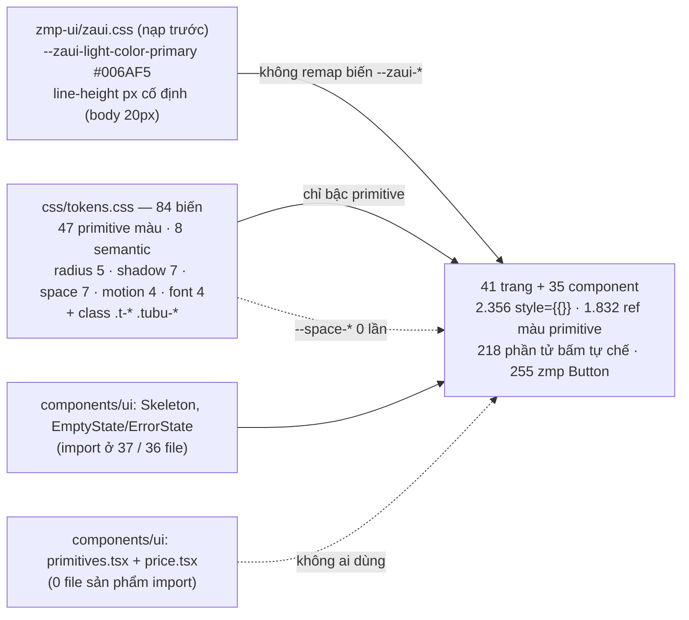

# A4 — Design System & nhất quán thị giác (Zalo Mini App; lướt nhanh web shop)

**Kết luận.** Tubu Tree hiện có một *bảng màu* chứ chưa có *design system*: `tokens.css` định nghĩa 84 biến nhưng 93,7% tham chiếu màu trong code trỏ thẳng vào bậc primitive (`--leaf-700`, `--neutral-400`…), 7 token spacing có 0 lần dùng, và bộ primitive dùng chung (`Txt/Stack/Row/Card/Btn/Badge/Chip/SectionHeader/StickyActionBar/ListRow`, `Price`) có **0** trang sử dụng. Mỗi trang tự vẽ bằng 2.356 khối `style={{}}`. Hệ quả người dùng nhìn thấy ngay: ZaUI không được theme nên **137/255 nút zmp-ui cùng mọi ô nhập và spinner hiện màu xanh Zalo #006AF5**, trong đó có nút “Thêm vào giỏ” ở PDP và nút “Thử lại” của `ErrorState` (dùng ở 36 file). CTA cam chữ trắng chỉ đạt **2,65:1**, còn chữ phụ `neutral-400/500` (263 chỗ) không qua AA. **96/110 nút có `loading` không bao giờ hiện spinner**, kể cả “Mua lại” và “Mua ngay”. 9 trang con không có tiêu đề. Gian hàng CTV tự viết lại thẻ sản phẩm nên thiếu giá giờ vàng và trạng thái hết hàng. Tôi không thấy lỗi P0 (không có sai tiền/điểm/tồn kho do tầng giao diện). Dù vậy, nền hiện tại không thể trở thành “premium natural green” nếu chỉ sơn lại. DS v2 phải làm theo thứ tự: (1) lớp token semantic cộng cầu nối ZaUI, (2) khoảng 12 component lõi có kiểm soát trạng thái, (3) lint chặn hồi quy. Sau đó mới redesign từng trang, bắt đầu từ đường mua lại: PDP → giỏ → thanh toán → đơn hàng → gian hàng CTV.

---

## Hiện trạng

### 0. Phạm vi & phương pháp

- **Miniapp:** 41 file trang (`apps/miniapp/src/pages/*.tsx`) và 35 file component (`apps/miniapp/src/components/**`, bỏ `*.spec.*`). Brief ghi 44 trang, nhưng thực tế `app.tsx` có **42 `<Route>`**: `/academy` và `/academy/:courseId` dùng chung `AcademyPage`, còn `*` là `NotFoundPage` (`apps/miniapp/src/components/app.tsx:155-198`).
- **Web shop:** 21 file (trang `/`, `/san-pham`, `/gio-hang`, `/thanh-toan`, `/tai-khoan`, `/s/[slug]`, `/brand`, `/dang-nhap` và component dùng chung). Không bao gồm admin/merchant.
- **Cách đếm:** mọi con số đến từ lệnh `grep`/`awk` hoặc script Node đọc **AST TypeScript** (không ước lượng), liệt kê ở **Phụ lục**. Tôi còn dựng lại một trang HTML dùng đúng request Google Fonts ở `tokens.css:9` và đúng quy tắc CSS của ZaUI, rồi đo trong Chromium (Browser pane) để kiểm tra dấu tiếng Việt và line-height.
- **Viết tắt đường dẫn:** `M/` = `apps/miniapp/src/`, `W/` = `apps/web/src/`, `Z/` = `node_modules/.pnpm/zmp-ui@1.11.14_react-dom@18.3.1_react@18.3.1__react@18.3.1/node_modules/zmp-ui/`, `SPEC` = `design_handoff/specs/TUBU_TREE_BUILD_SPEC_v1.1.md`.

### 1. “Nguồn sự thật” đang mâu thuẫn nhau

| Nguồn | Primary | Font | Phong cách | Ghi chú |
|---|---|---|---|---|
| `M/css/tokens.css:1-9,19-37` (đang chạy) | cam logo `#E08C1C` + lá `#509018` | Bricolage Grotesque / Plus Jakarta Sans / Inter / JetBrains Mono (+ Be Vietnam Pro dự phòng) | card + “claymorphism” (`:222-238`) | code thật |
| `SPEC:1769` (§7.1) | cam `#E08C1C` | Be Vietnam Pro (`SPEC:1778`) | cấm claymorphism (`SPEC:2091`) | mâu thuẫn ngay trong spec |
| `SPEC:1792,1839` (§7.2, code block) | **xanh `#2E7D4F`** | Be Vietnam Pro | — | lỗi thời nhưng vẫn là “copy thẳng” |
| `design_handoff/README.md:61-66,99` | **xanh `#2E7D4F`** | Be Vietnam Pro | — | lỗi thời |
| `design-system/tubu-tree/MASTER.md:11,21,36-37,161` (sinh tự động 06/09, commit `0572e74`) | **cyan `#0891B2`**, CTA `#16A34A` | Rubik / Nunito Sans | **Claymorphism**, “Category: Language Learning App” | sai hoàn toàn. Skill `ui-ux-pro-max` dặn agent đọc file này **trước** khi dựng trang |
| `apps/web/tailwind.config.ts:9-45` | cam + lá | “Be Vietnam Pro” (không được nạp) | — | thiếu semantic, thiếu thang chữ |
| Quyết định của chủ shop (brief) | **premium natural green** | — | Aesop / Innisfree / The Body Shop | hướng mới |

### 2. Kiến trúc style hiện tại



### 3. Kiểm kê token (`M/css/tokens.css`, 84 biến)

Lệnh (Phụ lục C1–C3): định nghĩa lấy bằng `grep -oE '^\s*--[a-zA-Z0-9-]+:'`, số lần dùng lấy bằng `grep -rhoE 'var\(--[a-zA-Z0-9-]+'` trên `apps/miniapp/src` (`.ts`, `.tsx`, `.css`). Bảng dưới do script S8 sinh ra.

#### Typography — 4 token, 5 lần dùng trong TS/TSX

| Token | Giá trị | tokens.css | Dùng TS/TSX |
|---|---|---:|---:|
| `--font-display` | `'Bricolage Grotesque', 'Be Vietnam Pro', system-ui, sans-s…` | :13 | 5 (+3 trong css) |
| `--font-ui` | `'Plus Jakarta Sans', 'Be Vietnam Pro', system-ui, sans-ser…` | :14 | 0 (+4 trong css) |
| `--font-body` | `'Inter', 'Be Vietnam Pro', system-ui, sans-serif` | :15 | 0 (+1 trong css) |
| `--font-mono` | `'JetBrains Mono', ui-monospace, 'Be Vietnam Pro', monospac…` | :16 | 0 (+1 trong css) |

#### Color primitive — 47 token, 1.832 lần dùng trong TS/TSX

| Token | Giá trị | tokens.css | Dùng TS/TSX |
|---|---|---:|---:|
| `--primary-50` | `#fdf3e3` | :19 | 27 |
| `--primary-100` | `#fbe4c4` | :20 | 5 |
| `--primary-200` | `#f4c98a` | :21 | 7 |
| `--primary-400` | `#eba94a` | :22 | 2 |
| `--primary-600` | `#e08c1c` | :23 | 101 |
| `--primary-700` | `#b86a10` | :24 | 100 |
| `--primary-800` | `#8a4e0a` | :25 | 2 |
| `--primary-900` | `#5c3505` | :26 | 3 |
| `--leaf-50` | `#eef7d9` | :29 | 78 (+2 trong css) |
| `--leaf-100` | `#dcefbe` | :30 | 10 (+1 trong css) |
| `--leaf-200` | `#bbd98a` | :31 | 19 (+1 trong css) |
| `--leaf-300` | `#a7ce5c` | :32 | 2 |
| `--leaf-400` | `#95d222` | :33 | 15 (+1 trong css) |
| `--leaf-600` | `#509018` | :34 | 102 (+1 trong css) |
| `--leaf-700` | `#3c6d12` | :35 | 194 (+1 trong css) |
| `--leaf-800` | `#2d520e` | :36 | 6 |
| `--leaf-900` | `#1f3a09` | :37 | 1 (+1 trong css) |
| `--clay-50` | `#fbf4ed` | :40 | 24 |
| `--clay-200` | `#edd4bd` | :41 | 5 |
| `--clay-500` | `#c97b4a` | :42 | 21 |
| `--clay-700` | `#8c4f2a` | :43 | 36 |
| `--clay-800` | `#6b3a1d` | :44 | 2 |
| `--sun-300` | `#fdd96e` | :45 | 2 |
| `--sun-500` | `#f4b408` | :46 | 5 |
| `--sun-700` | `#b8860b` | :47 | 3 |
| `--sun-bright` | `#f0e004` | :48 | 0 **KHÔNG DÙNG** |
| `--neutral-0` | `#ffffff` | :51 | 272 (+2 trong css) |
| `--neutral-50` | `#fafaf8` | :52 | 93 (+1 trong css) |
| `--neutral-100` | `#f2f2ef` | :53 | 96 (+1 trong css) |
| `--neutral-200` | `#e5e5e0` | :54 | 56 |
| `--neutral-300` | `#d5d5ce` | :55 | 11 |
| `--neutral-400` | `#a8a8a0` | :56 | 219 |
| `--neutral-500` | `#7e7e75` | :57 | 92 |
| `--neutral-600` | `#5f5f58` | :58 | 126 |
| `--neutral-700` | `#42423d` | :59 | 12 |
| `--neutral-800` | `#2a2a26` | :60 | 14 |
| `--neutral-900` | `#1a1a17` | :61 | 41 (+1 trong css) |
| `--dealer-ink` | `#1f2a44` | :78 | 23 |
| `--dealer-ink-soft` | `#2e3b5e` | :79 | 1 |
| `--dealer-bg` | `#f4f6f9` | :80 | 4 |
| `--green-50` | `var(--leaf-50)` | :86 | 0 **KHÔNG DÙNG** |
| `--green-100` | `var(--leaf-100)` | :87 | 0 **KHÔNG DÙNG** |
| `--green-200` | `var(--leaf-200)` | :88 | 0 **KHÔNG DÙNG** |
| `--green-400` | `var(--leaf-400)` | :89 | 0 **KHÔNG DÙNG** |
| `--green-600` | `var(--leaf-600)` | :90 | 0 **KHÔNG DÙNG** |
| `--green-700` | `var(--leaf-700)` | :91 | 0 **KHÔNG DÙNG** |
| `--green-900` | `var(--leaf-900)` | :92 | 0 **KHÔNG DÙNG** |

#### Color semantic — 8 token, 123 lần dùng trong TS/TSX

| Token | Giá trị | tokens.css | Dùng TS/TSX |
|---|---|---:|---:|
| `--success` | `#509018` | :64 | 0 **KHÔNG DÙNG** |
| `--warning` | `#e58b00` | :65 | 13 |
| `--danger` | `#c73e3e` | :66 | 80 |
| `--info` | `#3d7bb8` | :67 | 5 |
| `--success-bg` | `var(--leaf-50)` | :71 | 4 |
| `--warning-bg` | `#fff3e0` | :72 | 7 |
| `--danger-bg` | `#fbe9e9` | :73 | 12 |
| `--info-bg` | `#e8f1f8` | :74 | 2 |

#### Radius / Shadow / Spacing / Motion / Layout

| Token | Giá trị | tokens.css | Dùng TS/TSX |
|---|---|---:|---:|
| `--radius-sm` | `6px` | :95 | 14 |
| `--radius-md` | `10px` | :96 | 86 (+1 css) |
| `--radius-lg` | `16px` | :97 | 100 (+1 css) |
| `--radius-xl` | `24px` | :98 | 20 (+1 css) |
| `--radius-full` | `9999px` | :99 | 85 |
| `--shadow-xs` | `0 1px 2px rgba(92,52,10,.04)` | :102 | 13 |
| `--shadow-sm` | `0 2px 6px rgba(92,52,10,.06)` | :103 | 18 |
| `--shadow-md` | `0 4px 12px rgba(92,52,10,.08)` | :104 | 7 |
| `--shadow-lg` | `0 12px 32px rgba(92,52,10,.12)` | :105 | 7 |
| `--shadow-focus` | `0 0 0 3px rgba(224,140,28,.25)` | :106 | 0 **KHÔNG DÙNG** |
| `--shadow-card` | `0 2px 8px … , 0 1px 2px …` | :107 | 19 (+1 css) |
| `--shadow-clay` | `0 8px 20px …, inset …` | :108 | 0 (+1 css, chỉ `.tubu-card-clay` — cũng 0 lần) |
| `--space-xs` … `--space-3xl` (4/8/16/24/32/48/64px) | | :111-117 | **0 cả 7 token** |
| `--dur-fast` / `--dur-base` / `--dur-slow` | 150 / 200 / 320ms | :120-122 | 2 / 5 / 7 |
| `--ease-out` | `cubic-bezier(.22,.61,.36,1)` | :123 | 14 (+9 css) |
| `--safe-bottom` / `--safe-top` | `env(safe-area-inset-*)` | :126 / :128 | 42 / 2 |

**Tham chiếu đến token không được định nghĩa** (lệnh C2, kiểu `comm -13 defs used`):

| Token | Vị trí | Hậu quả khi render |
|---|---|---|
| `--leaf-500` | `M/components/avatar-crop-modal.tsx:151` | Nằm trong danh sách `box-shadow` và không có fallback, nên **cả khai báo bị vô hiệu** (invalid at computed-value time). Mặt nạ tối 75% quanh khung cắt ảnh và viền 3px đều không hiện. |
| `--leaf-500` | `M/components/avatar-crop-modal.tsx:196` | `accent-color` rơi về mặc định trình duyệt (xanh hệ thống) |
| `--primary-300` | `M/pages/affiliate.tsx:386` | Shorthand `border` bị vô hiệu, nên bậc CTV “hiện tại” mất viền |
| `--neutral-150` | `M/pages/browse.tsx:214` | Có fallback `var(--neutral-100)`, không lỗi hiển thị |

**Định nghĩa nhưng không ai dùng (17 token):** 7 alias `--green-*`, 7 `--space-*`, `--shadow-focus`, `--success`, `--sun-bright`. Class tiện ích cũng gần như bỏ trống (lệnh C4): `.t-display`/`.t-display-lg`/`.t-label`/`.t-mono`/`.tubu-card-clay` dùng 0 lần; `.t-h1` 1, `.t-h2` 6, `.t-h3` 2, `.t-body` 1; `.touch-target` 2 (`M/pages/storefront-builder.tsx:325,333`); `.tubu-card` chỉ nằm trong `Card` (vốn không ai dùng). Ngược lại, `.tubu-press` được dùng tốt: 142 lần ở 50 file.

**Phân tầng tham chiếu** (C3): trong TS/TSX có **1.832 ref màu primitive**, chỉ **123 ref semantic** (tức 93,7% là primitive); 305 radius, 64 shadow, 28 motion, 44 safe-area, 5 font, **0 spacing**. ZaUI thì có **307** biến `--zaui-*`, nhưng `M/` không ghi đè biến nào (C5).

### 4. Chỉ số nhất quán theo trang (41 trang và component)

Cách đếm (script S1, AST):
- `style={{`: thuộc tính `style` có object literal.
- hex/rgba: literal màu nằm trong chuỗi hoặc JSX (không tính fallback `var(--x,#fff)`); “named” là `color:'white'` và tương tự.
- fontSize ngoài thang: literal `fontSize` không thuộc thang SPEC §7.2 (12/13/14/16/18/20/24/28/32).
- Nút tự chế: `<button>` gốc cộng mọi phần tử có `onClick`/`role="button"` không phải component dùng chung (`Box`, `div`, `span`, `Text`…).
- Nút xanh Zalo: `<Button>` của zmp-ui không ghi đè màu (S2: primary thiếu `background`; secondary thiếu `background` hoặc `color`; tertiary thiếu `color`).
- Emoji: grapheme `\p{Extended_Pictographic}`. “Chức năng” là emoji đứng một mình như glyph, nằm trong phần tử bấm được, hoặc làm giá trị `icon/emoji`. Số trong ngoặc là số vị trí **nằm ngoài** game/hạng/BXH (các khu này được phép).
- Tổng vi phạm DS = hex + rgba + named + fontSize ngoài thang + nút tự chế + nút xanh Zalo + emoji bị gắn cờ + nút chỉ-icon thiếu `aria-label` + vùng chạm < 44 có kích thước khai báo.

| Trang | Dòng | `style={{` (/100 dòng) | hex·named / rgba | fontSize ngoài thang / tổng literal | Nút tự chế | zmp `<Button>` (rơi về xanh Zalo) | Emoji tổng/chức năng (bị gắn cờ) | Icon lucide | Skeleton / EmptyState / ErrorState | Phần tử zmp-ui / HTML thô | Component cục bộ | Tổng vi phạm DS |
|---|---:|---:|---:|---:|---:|---:|---:|---:|---:|---:|---:|---:|
| about.tsx | 284 | 30 (10.6) | 1/1 | 2/2 | 7 | 4 (3) | 1/1 (1) | 2 | 0/0/0 | 35/0 | 3 | 15 |
| academy.tsx | 234 | 27 (11.5) | 0/0 | 0/1 | 2 | 1 (0) | 0/0 (0) | 5 | 3/1/2 | 29/2 | 4 | 2 |
| addresses.tsx | 355 | 23 (6.5) | 0/0 | 0/0 | 4 | 5 (3) | 1/1 (1) | 0 | 2/1/1 | 28/0 | 2 | 8 |
| admin.tsx | 998 | 78 (7.8) | 0/0 | 1/1 | 0 | 37 (31) | 0/0 (0) | 18 | 5/4/4 | 133/5 | 7 | 40 |
| affiliate.tsx | 997 | 112 (11.2) | 1/6 | 2/6 | 7 | 8 (3) | 4/1 (1) | 7 | 2/0/5 | 147/3 | 7 | 20 |
| ai-advisor.tsx | 179 | 26 (14.5) | 0/0 | 0/0 | 2 | 1 (0) | 1/0 (0) | 4 | 0/0/0 | 29/1 | 0 | 2 |
| bank-payment.tsx | 216 | 33 (15.3) | 0/0 | 0/0 | 1 | 6 (3) | 8/0 (0) | 3 | 7/0/0 | 33/2 | 1 | 4 |
| beta.tsx | 172 | 22 (12.8) | 0/0 | 0/0 | 0 | 3 (1) | 3/0 (0) | 4 | 2/0/1 | 26/0 | 0 | 1 |
| brand-owner.tsx | 248 | 31 (12.5) | 0/0 | 0/0 | 2 | 7 (5) | 0/0 (0) | 1 | 1/1/1 | 49/2 | 1 | 7 |
| brand-story.tsx | 547 | 20 (3.7) | 102/5 | 4/4 | 2 | 1 (0) | 11/10 (10) | 0 | 0/0/0 | 25/62 | 2 | 123 |
| brand-view.tsx | 301 | 42 (14.0) | 1/0 | 1/2 | 3 | 3 (2) | 6/3 (3) | 3 | 1/0/1 | 55/2 | 0 | 10 |
| browse.tsx | 435 | 20 (4.6) | 1/0 | 1/2 | 5 | 1 (1) | 6/2 (2) | 1 | 1/2/1 | 27/1 | 1 | 11 |
| cart.tsx | 617 | 44 (7.1) | 2/0 | 2/4 | 7 | 1 (0) | 0/0 (0) | 4 | 3/2/1 | 44/6 | 5 | 13 |
| cashback.tsx | 270 | 33 (12.2) | 3/2 | 2/2 | 1 | 1 (0) | 2/1 (1) | 0 | 1/0/3 | 39/1 | 1 | 9 |
| checkout.tsx | 950 | 82 (8.6) | 1/0 | 1/2 | 8 | 3 (1) | 0/0 (0) | 9 | 10/1/1 | 90/8 | 5 | 12 |
| community-events.tsx | 319 | 28 (8.8) | 0/0 | 1/1 | 4 | 3 (1) | 3/2 (2) | 2 | 3/2/2 | 36/2 | 3 | 8 |
| community-leaderboard.tsx | 136 | 21 (15.4) | 0/0 | 1/1 | 0 | 1 (0) | 5/5 (0) | 1 | 2/1/1 | 24/1 | 1 | 1 |
| community-moderation.tsx | 482 | 40 (8.3) | 0/0 | 0/1 | 0 | 10 (10) | 1/0 (0) | 5 | 3/3/3 | 49/3 | 7 | 10 |
| dealer.tsx | 1030 | 139 (13.5) | 0/9 | 2/4 | 9 | 9 (3) | 0/0 (0) | 8 | 8/1/5 | 148/4 | 10 | 23 |
| edit-profile.tsx | 266 | 18 (6.8) | 0/2 | 0/1 | 2 | 1 (0) | 4/0 (0) | 3 | 4/0/1 | 16/3 | 0 | 4 |
| feed.tsx | 326 | 24 (7.4) | 0/0 | 1/3 | 6 | 2 (1) | 0/0 (0) | 6 | 2/2/1 | 27/0 | 1 | 10 |
| game.tsx | 1258 | 162 (12.9) | 4/2 | 8/12 | 5 | 18 (11) | 107/50 (0) | 4 | 4/0/1 | 185/2 | 3 | 30 |
| group-buy.tsx | 144 | 19 (13.2) | 0/0 | 0/0 | 1 | 1 (0) | 2/0 (0) | 2 | 2/1/1 | 21/1 | 1 | 1 |
| home.tsx | 465 | 39 (8.4) | 7/4 | 2/2 | 10 | 0 (0) | 0/0 (0) | 10 | 2/0/1 | 40/4 | 1 | 25 |
| loyalty.tsx | 1004 | 120 (12.0) | 0/4 | 5/8 | 12 | 9 (4) | 13/12 (7) | 10 | 5/0/1 | 142/2 | 1 | 33 |
| my-payroll.tsx | 240 | 35 (14.6) | 0/7 | 0/1 | 1 | 4 (4) | 0/0 (0) | 5 | 1/0/1 | 45/1 | 1 | 14 |
| not-found.tsx | 32 | 6 (18.8) | 0/0 | 1/1 | 0 | 1 (0) | 2/2 (1) | 0 | 0/0/0 | 6/0 | 0 | 2 |
| notifications.tsx | 368 | 29 (7.9) | 0/0 | 0/0 | 2 | 6 (0) | 5/5 (5) | 1 | 2/1/1 | 27/5 | 0 | 8 |
| order-detail.tsx | 714 | 85 (11.9) | 0/0 | 0/2 | 1 | 12 (4) | 4/1 (1) | 3 | 3/0/1 | 88/10 | 2 | 6 |
| orders.tsx | 185 | 13 (7.0) | 0/0 | 0/1 | 2 | 1 (1) | 0/0 (0) | 0 | 3/1/1 | 15/0 | 0 | 3 |
| post-detail.tsx | 735 | 69 (9.4) | 0/0 | 0/0 | 7 | 10 (4) | 6/6 (6) | 9 | 11/0/2 | 88/4 | 2 | 17 |
| product-detail.tsx | 958 | 85 (8.9) | 0/1 | 0/1 | 9 | 3 (1) | 1/0 (0) | 10 | 9/0/1 | 82/9 | 5 | 11 |
| profile.tsx | 395 | 34 (8.6) | 0/6 | 1/2 | 6 | 3 (1) | 1/1 (1) | 6 | 0/0/0 | 39/3 | 1 | 15 |
| refill.tsx | 215 | 34 (15.8) | 0/0 | 0/1 | 1 | 3 (2) | 5/2 (2) | 6 | 3/0/1 | 36/1 | 0 | 7 |
| settings.tsx | 177 | 13 (7.3) | 0/0 | 1/3 | 6 | 1 (1) | 0/0 (0) | 0 | 0/0/0 | 16/1 | 3 | 9 |
| staff.tsx | 767 | 58 (7.6) | 0/3 | 0/0 | 2 | 18 (16) | 0/0 (0) | 11 | 2/0/1 | 79/0 | 2 | 25 |
| storefront-builder.tsx | 955 | 121 (12.7) | 8/1 | 1/1 | 10 | 20 (11) | 1/0 (0) | 12 | 2/1/2 | 158/2 | 7 | 32 |
| storefront-view.tsx | 129 | 26 (20.2) | 0/0 | 1/1 | 1 | 1 (0) | 0/0 (0) | 6 | 1/0/1 | 29/2 | 0 | 2 |
| subscriptions.tsx | 246 | 24 (9.8) | 0/0 | 0/0 | 5 | 2 (1) | 0/0 (0) | 1 | 2/1/1 | 28/2 | 1 | 6 |
| wallet.tsx | 444 | 66 (14.9) | 0/5 | 0/5 | 3 | 5 (0) | 6/1 (1) | 7 | 3/0/1 | 77/6 | 1 | 9 |
| wishlist.tsx | 43 | 2 (4.7) | 0/0 | 0/0 | 0 | 0 (0) | 0/0 (0) | 0 | 1/1/1 | 3/0 | 0 | 0 |
| **Tổng 41 trang** | 18836 | 1933 | 131/58 | 41/78 | 156 | 226 (129) | 209/106 (45) | 189 | 116/27/53 | 2293/163 | 92 | 588 |

| Component (`M/components/`) | Dòng | `style={{` (/100 dòng) | hex·named / rgba | fontSize ngoài thang / tổng | Nút tự chế | zmp `<Button>` (xanh Zalo) | Emoji tổng/chức năng (gắn cờ) | lucide | Skel/Empty/Err | zmp-ui / HTML | Component cục bộ | Tổng vi phạm |
|---|---:|---:|---:|---:|---:|---:|---:|---:|---:|---:|---:|---:|
| onboarding.tsx | 235 | 25 (10.6) | 0/8 | 3/6 | 3 | 3 (0) | 19/18 (18) | 0 | 0/0/0 | 25/0 | 2 | 32 |
| affiliate/ctv-order-sheet.tsx | 544 | 47 (8.6) | 0/0 | 0/0 | 12 | 4 (1) | 4/4 (4) | 3 | 0/0/0 | 56/1 | 6 | 19 |
| image-upload.tsx | 440 | 29 (6.6) | 1/1 | 1/2 | 7 | 0 (0) | 1/1 (1) | 4 | 0/0/0 | 25/9 | 3 | 12 |
| community/post-card.tsx | 94 | 24 (25.5) | 0/0 | 0/1 | 3 | 0 (0) | 9/9 (9) | 1 | 0/0/0 | 24/3 | 1 | 12 |
| avatar-crop-modal.tsx | 230 | 12 (5.2) | 8/2 | 0/0 | 0 | 2 (0) | 0/0 (0) | 4 | 0/0/0 | 8/3 | 1 | 10 |
| reviews-section.tsx | 316 | 38 (12.0) | 1/0 | 2/3 | 4 | 1 (0) | 5/0 (0) | 0 | 2/0/1 | 38/6 | 3 | 7 |
| community/post-composer.tsx | 282 | 16 (5.7) | 0/1 | 0/0 | 3 | 1 (0) | 3/3 (3) | 2 | 0/0/0 | 25/0 | 1 | 7 |
| wheel.tsx | 192 | 15 (7.8) | 0/2 | 3/3 | 2 | 2 (0) | 9/9 (0) | 0 | 0/0/0 | 13/2 | 1 | 7 |
| bottom-nav.tsx | 116 | 6 (5.2) | 0/2 | 2/2 | 2 | 0 (0) | 0/0 (0) | 0 | 0/0/0 | 0/8 | 1 | 6 |
| checkout/voucher-sheet.tsx | 298 | 31 (10.4) | 0/0 | 1/3 | 1 | 4 (2) | 2/0 (0) | 3 | 0/0/0 | 33/2 | 1 | 5 |
| checkout/address-section.tsx | 278 | 15 (5.4) | 0/0 | 0/1 | 3 | 2 (1) | 1/1 (1) | 0 | 0/0/0 | 17/1 | 3 | 5 |
| ui/primitives.tsx | 371 | 14 (3.8) | 0/0 | 1/3 | 4 | 0 (0) | 0/0 (0) | 0 | 0/0/0 | 9/3 | 10 | 5 |
| error-boundary.tsx | 78 | 3 (3.8) | 3/0 | 1/2 | 1 | 0 (0) | 0/0 (0) | 0 | 0/0/0 | 0/3 | 0 | 5 |
| geo-picker.tsx | 122 | 3 (2.5) | 0/0 | 0/0 | 2 | 0 (0) | 3/3 (3) | 0 | 0/0/0 | 7/0 | 2 | 5 |
| product-card.tsx | 191 | 20 (10.5) | 0/1 | 2/2 | 1 | 0 (0) | 0/0 (0) | 0 | 0/0/0 | 18/6 | 2 | 4 |
| flash-sale.tsx | 327 | 23 (7.0) | 0/0 | 0/1 | 3 | 0 (0) | 0/0 (0) | 0 | 0/0/0 | 25/2 | 3 | 3 |
| content-kit-sheet.tsx | 188 | 21 (11.2) | 0/0 | 0/0 | 2 | 2 (1) | 0/0 (0) | 2 | 2/0/1 | 18/3 | 2 | 3 |
| ui/quantity-selector.tsx | 61 | 2 (3.3) | 0/0 | 1/2 | 2 | 0 (0) | 0/0 (0) | 2 | 0/0/0 | 4/0 | 1 | 3 |
| back-button.tsx | 69 | 1 (1.4) | 0/2 | 0/0 | 1 | 0 (0) | 0/0 (0) | 1 | 0/0/0 | 0/1 | 1 | 3 |
| community/product-picker.tsx | 143 | 13 (9.1) | 0/0 | 0/0 | 2 | 0 (0) | 0/0 (0) | 1 | 0/0/0 | 13/2 | 1 | 2 |
| subscribe-sheet.tsx | 109 | 10 (9.2) | 0/0 | 0/0 | 1 | 2 (1) | 1/0 (0) | 0 | 0/0/0 | 13/0 | 1 | 2 |
| share-sheet.tsx | 93 | 9 (9.7) | 0/0 | 0/0 | 1 | 2 (1) | 3/0 (0) | 2 | 0/0/0 | 9/2 | 1 | 2 |
| ui/empty-state.tsx | 133 | 7 (5.3) | 0/0 | 1/1 | 0 | 2 (1) | 0/0 (0) | 0 | 0/0/0 | 5/30 | 2 | 2 |
| qr-code.tsx | 13 | 2 (15.4) | 2/0 | 0/0 | 0 | 0 (0) | 0/0 (0) | 0 | 0/0/0 | 0/2 | 1 | 2 |
| wishlist-heart.tsx | 95 | 1 (1.1) | 0/1 | 0/0 | 1 | 0 (0) | 0/0 (0) | 1 | 0/0/0 | 0/1 | 1 | 2 |
| checkout/order-success.tsx | 131 | 13 (9.9) | 0/0 | 0/2 | 0 | 2 (0) | 1/1 (1) | 0 | 0/0/0 | 10/7 | 2 | 1 |
| storefront-context-bar.tsx | 43 | 4 (9.3) | 0/0 | 0/0 | 1 | 0 (0) | 0/0 (0) | 1 | 0/0/0 | 3/1 | 1 | 1 |
| ui/price.tsx | 63 | 4 (6.3) | 0/0 | 1/1 | 0 | 0 (0) | 0/0 (0) | 0 | 0/0/0 | 2/2 | 2 | 1 |
| pull-to-refresh.tsx | 115 | 3 (2.6) | 0/0 | 0/1 | 0 | 0 (0) | 1/1 (1) | 0 | 0/0/0 | 0/3 | 1 | 1 |
| ui/cart-badge.tsx | 36 | 1 (2.8) | 0/0 | 1/1 | 0 | 0 (0) | 0/0 (0) | 0 | 0/0/0 | 0/1 | 1 | 1 |
| ui/skeleton.tsx | 76 | 7 (9.2) | 0/0 | 0/0 | 0 | 0 (0) | 0/0 (0) | 0 | 0/0/0 | 0/6 | 4 | 0 |
| app.tsx | 211 | 1 (0.5) | 0/0 | 0/0 | 0 | 0 (0) | 0/0 (0) | 0 | 0/0/0 | 6/0 | 2 | 0 |
| community/rank-badge.tsx | 37 | 1 (2.7) | 0/0 | 0/0 | 0 | 0 (0) | 5/5 (0) | 0 | 0/0/0 | 1/0 | 1 | 0 |
| ui/tier-badge.tsx | 17 | 1 (5.9) | 0/0 | 0/0 | 0 | 0 (0) | 0/0 (0) | 0 | 0/0/0 | 0/1 | 1 | 0 |
| ui/time-input.tsx | 32 | 1 (3.1) | 0/0 | 0/1 | 0 | 0 (0) | 0/0 (0) | 0 | 0/0/0 | 0/1 | 1 | 0 |
| **Tổng 35 file component** | 5779 | 423 | 15/20 | 20/38 | 62 | 29 (8) | 67/55 (41) | 27 | 4/0/2 | 407/112 | 67 | 170 |

Đối chiếu tổng: `grep -rhoE 'style=\{\{' pages components | wc -l` cho **2.358** (AST đếm 2.356, vì grep còn khớp cả chuỗi trong comment). Toàn miniapp có **218** phần tử bấm tự chế (6 `<button>` và 212 `onClick`/`role="button"` trên `Box`/`div`/`span`/`Text`), trong đó 68 có `role="button"`, và **0** nơi dùng `Btn` dùng chung.

#### 10 trang tệ nhất (theo “Tổng vi phạm DS”; hoà thì xét số `style={{`)

| # | Trang | Tổng vi phạm | Cấu thành | `style={{` |
|---:|---|---:|---|---:|
| 1 | brand-story.tsx | 123 | 107 hex/rgba (102 là dữ liệu vẽ bản đồ SVG “gỗ 3D” và 8 gradient bảng Material) · 10 emoji chức năng · 4 fontSize lệch | 20 |
| 2 | admin.tsx | 40 | 31 nút xanh Zalo · 8 nút chỉ-icon thiếu aria-label | 78 |
| 3 | loyalty.tsx | 33 | 12 nút tự chế · 7 emoji chức năng · 5 fontSize lệch · 4 nút xanh · 4 rgba | 120 |
| 4 | storefront-builder.tsx | 32 | 11 nút xanh · 10 nút tự chế · 9 hex/rgba (bảng màu Tailwind) | 121 |
| 5 | game.tsx | 30 | 11 nút xanh · 8 fontSize lệch · 6 hex/rgba · 5 nút tự chế (107 emoji được phép vì là game) | 162 |
| 6 | staff.tsx | 25 | 16 nút xanh · 4 icon-only thiếu nhãn | 58 |
| 7 | home.tsx | 25 | 10 nút tự chế · 11 hex/rgba · 2 chạm < 44 | 39 |
| 8 | dealer.tsx | 23 | 9 nút tự chế · 9 rgba · 3 nút xanh | 139 |
| 9 | affiliate.tsx | 20 | 7 nút tự chế · 7 hex/rgba · 3 nút xanh | 112 |
| 10 | post-detail.tsx | 17 | 7 nút tự chế · 6 emoji chức năng · 4 nút xanh | 69 |

Nếu chỉ xét trang **khách hàng/CTV** (bỏ admin, staff): loyalty, storefront-builder, game, home, dealer, affiliate, post-detail. Cả 7 đều là trang của vòng giữ chân hoặc CTV, nên cần redesign cùng DS v2.

### 5. Kiểm kê component và nhóm trùng lặp

**5.1 Mọi file trong `M/components/**`** (lệnh C6; “import” là số file sản phẩm import, không tính spec):

| File | Dòng | Import | Export | | File | Dòng | Import | Export |
|---|---:|---:|---|---|---|---:|---:|---|
| affiliate/ctv-order-sheet | 543 | 1 | `CtvOrderSheet` | | image-upload | 439 | 11 | `ImageUpload, VideoUpload, MultiImageUpload` |
| app | 210 | 0 | `MyApp` | | onboarding | 234 | 1 | `OnboardingGate` |
| avatar-crop-modal | 229 | 1 | `AvatarCropModal` | | product-card | 190 | 4 | `ProductCard` |
| back-button | 68 | 1 | `BackButton` | | pull-to-refresh | 114 | 3 | `PullToRefresh` |
| bottom-nav | 115 | 1 | `BottomNav` | | qr-code | 12 | 2 | `QrCode` |
| checkout/address-section | 277 | 1 | `AddressSection` (+`AddressForm` nội bộ) | | reviews-section | 315 | 1 | `ReviewsSection, Stars` |
| checkout/order-success | 130 | 1 | `OrderSuccess` | | share-sheet | 92 | 2 | `ShareSheet` |
| checkout/voucher-sheet | 297 | 2 | `VoucherSheet` | | storefront-context-bar | 42 | 2 | `StorefrontContextBar` |
| community/post-card | 93 | 4 | `PostCard, KIND_LABEL` | | subscribe-sheet | 108 | 1 | `SubscribeSheet` |
| community/post-composer | 281 | 2 | `PostComposer` | | wheel | 191 | 1 | `WheelOfFortune` |
| community/product-picker | 142 | 1 | `ProductPicker` | | wishlist-heart | 94 | 2 | `WishlistHeart` |
| community/rank-badge | 36 | 3 | `RankBadge` | | **ui/empty-state** | 132 | **36** | `EmptyState, ErrorState` |
| content-kit-sheet | 187 | 2 | `ContentKitSheet` | | **ui/skeleton** | 75 | **37** | `Skeleton, ProductCardSkeleton, ProductGridSkeleton, LineItemSkeleton` |
| error-boundary | 77 | 1 | default | | ui/cart-badge | 35 | 3 | `CartBadge` |
| flash-sale | 326 | 1 | `FlashSale, UpcomingFlashSales` | | ui/quantity-selector | 60 | 3 | `QuantitySelector` |
| geo-picker | 121 | 3 | `GeoPicker` | | **ui/primitives** | 370 | **1** (chỉ `tier-badge`) | `Txt, Stack, Row, Card, Btn, Badge, Chip, SectionHeader, StickyActionBar, ListRow` |
| | | | | | **ui/price** | 62 | **0** | `Price, DiscountPct` |
| | | | | | ui/tier-badge · ui/time-input | 16 · 31 | 1 · 2 | `TierBadge` · `TimeInput` |

Ngoài ra, các trang tự định nghĩa **92 component cục bộ** và thư mục components có thêm 67 (C7). ZaUI có sẵn nhưng **0 lần dùng**: `Tabs`, `Modal`, `Switch`, `Checkbox`, `Radio`, `List`, `Swiper`, `ImageViewer`, `Progress`, `BottomNavigation`, `Header`. Chỉ có `Sheet` (48), `Input` (84), `Select` (2), `Avatar` (4), `Spinner` (3) được dùng (C8).

**5.2 Nhóm mẫu lặp và component DS v2 đề xuất** (đếm bằng S1, S6, S7, C7):

| Mẫu | Số bản cài đặt hiện có | Ví dụ (file:line) | Component DS v2 | Props đề xuất |
|---|---|---|---|---|
| Thẻ sản phẩm | `ProductCard` (4 trang dùng) + 4 bản chép (thẻ flash, thẻ “sắp diễn ra”, gian hàng CTV, trang nhãn) + ~9 dạng dòng hàng (giỏ, checkout, đơn, sheet CTV, đặt định kỳ, mua chung, AI, post-card, product-picker) | `M/components/product-card.tsx:24`, `M/components/flash-sale.tsx:70,178`, `M/pages/storefront-view.tsx:72`, `M/pages/brand-view.tsx:212`, `M/pages/cart.tsx:285` | `ProductTile` | `product; variant: 'grid'\|'rail'\|'list'\|'line'\|'compact'; mode: 'b2c'\|'ctv'\|'dealer'; price?: PriceInfo; showWishlist?; action?: 'add'\|'rebuy'\|'subscribe'\|'none'; badge?; onPress` |
| Hiển thị giá/tiền/điểm | **60 kiểu trình bày** cho 134 lần render tiền/điểm ở 26 file; `Price` 0 lần; formatter lặp: `fmtVnd`, `formatXu` ×2, 3 chỗ nối “xu” tay, 3 chỗ `toLocaleString()+'đ'` | `M/pages/bank-payment.tsx:10`, `M/pages/wallet.tsx:17`, `M/components/affiliate/milestone-copy.ts:12`, `M/pages/checkout.tsx:260`, `M/pages/ai-advisor.tsx:141` | `PriceTag`, `Money`, `Points`, `Xu` | `PriceTag{ value; compareAt?; flash?: {price,endsAt}; subscribePrice?; size:'sm'\|'md'\|'lg'\|'xl'; tone:'default'\|'inverse' }` · `Money{ amount; short? }` |
| Tiêu đề khu (+ “Xem tất cả”) | `SectionHeader` 0 lần; `Text.Title .t-h2`, `Text bold`, `Text.Title small` trộn lẫn; `Section` định nghĩa 5 lần | `M/pages/home.tsx:449`, `M/components/flash-sale.tsx:44`, `M/pages/settings.tsx:108`, `M/pages/loyalty.tsx:981` | `SectionHeader`, `SectionCard` | `title; subtitle?; action?: {label,onPress}; tone?` |
| Bottom sheet / modal | 48 `<Sheet>` lắp tay ở 23 file, 11 component `*Sheet`, 7 overlay tự chế | `M/pages/checkout.tsx:714,748`, `M/pages/loyalty.tsx:664,826,925` | `BottomSheet`, `Dialog`, `ActionSheet` | `open; onClose; title; description?; footer?: ReactNode; size:'auto'\|'half'\|'full'; dismissible` |
| Badge / pill trạng thái | `Badge` 1 lần (qua `TierBadge`); **34 pill tự vẽ ở 22 file**; `STATUS_COLOR` dùng hex riêng | `M/components/product-card.tsx:79`, `M/pages/orders.tsx:126`, `M/utils/order-status.ts:3-11` | `Badge`, `StatusPill` | `tone:'neutral'\|'brand'\|'success'\|'warning'\|'danger'\|'info'\|'promo'\|'flash'; size:'sm'\|'md'; icon?` |
| Chip lọc/chọn | `Chip` định nghĩa 3 lần (`browse.tsx:386` và `feed.tsx:298` giống nhau từng dòng); 15 chip tự vẽ ở 7 file; `VariationChip`, `MethodChip`, `PayChip` | `M/pages/browse.tsx:386-420`, `M/pages/feed.tsx:298-326` | `Chip`, `ChipGroup` | `selected; onPress; icon?; count?; size:'sm'\|'md'; variant:'filter'\|'choice'\|'info'` |
| Tab / segmented | 5 kiểu: pill cam (`orders.tsx:57`), `TabChip` (`dealer.tsx:233`), `Button` xanh Zalo đổi variant (`admin.tsx:92`, `community-moderation.tsx:86`), Chip (feed), Text-chip (`reviews-section.tsx:136`) | như cột trái | `SegmentedTabs` | `items:{key,label,count?}[]; value; onChange; scroll?: boolean` |
| Dòng danh sách / điều hướng | `ListRow` 0 lần; 25 dòng tự vẽ có chevron ở 16 file; `LinkRow` ×2 (một bản dùng ký tự “›”) | `M/pages/settings.tsx:161-176`, `M/pages/about.tsx:268`, `M/pages/profile.tsx:309` | `ListRow` | `icon?; title; subtitle?; value?; trailing?:'chevron'\|'switch'\|ReactNode; onPress?; destructive?` (sửa lỗi `primitives.tsx:356`: chỉ vùng chữ nhận onClick) |
| Dòng nhãn–giá trị | `Row` định nghĩa 6 lần | `M/pages/checkout.tsx:842`, `M/pages/order-detail.tsx:695`, `M/pages/bank-payment.tsx:205`, `M/pages/about.tsx:255`, `M/components/affiliate/ctv-order-sheet.tsx:532` | `KeyValueRow`, `SummaryList` | `label; value; emphasis?; tone?; info?` |
| Thẻ bề mặt | `Card` 0 lần; **47 thẻ tự vẽ ở 25 file** | `M/pages/cart.tsx:316`, `M/pages/wallet.tsx:203` | `Card` | `variant:'raised'\|'outline'\|'flat'; padding; onPress?` |
| Thanh CTA dính đáy | `StickyActionBar` 0 lần; 10 thanh tự vẽ, 3 thanh thiếu safe-area | `M/pages/product-detail.tsx:685`, `M/pages/storefront-view.tsx:107` | `StickyActionBar` | `primary; secondary?; summary?: ReactNode` |
| Empty/Error | `EmptyState` 27, `ErrorState` 55 (dùng tốt) | `M/components/ui/empty-state.tsx:70,107` | giữ, đổi màu và nút | thêm `variant:'page'\|'inline'`, `illustration` |
| Nút chỉ-icon | 31 “vòng icon” tự vẽ ở 21 file; 17 nút chỉ-icon thiếu `aria-label` | `M/pages/home.tsx:85,106`, `M/pages/loyalty.tsx:690` | `IconButton` | `icon; label (bắt buộc); size:'md'(44)\|'sm'(36 nhìn/44 chạm); variant; badge?` |
| Form control | `Checkbox` (`cart.tsx:257`), `RadioDot`/`ToggleVisual` (`checkout.tsx:872,901`), `Toggle` (`settings.tsx:119`); `AddressForm` ×2 (`checkout/address-section.tsx:176` và `pages/addresses.tsx:230`) | như cột trái | `Checkbox`, `Radio`, `Switch`, `Field`, `AddressForm` (1 bản) | theo ZaUI đã theme |
| Thẻ thống kê | `KpiCard`, `MiniStat` (affiliate), `Stat` (profile), `EcoStat` (game) và các khối số trên hero ví/điểm/đại lý | `M/pages/affiliate.tsx:929,942`, `M/pages/profile.tsx:372` | `StatTile` | `label; value; delta?; icon?; onPress?` |
| Thanh tiến độ | 12 thanh tự vẽ ở 9 file | `M/components/flash-sale.tsx:132`, `M/pages/loyalty.tsx:209` | `ProgressBar`, `Meter` | `value; max; tone; label?` |
| Tiêu đề trang | Không có component; 9 trang không có tiêu đề; ≥3 kiểu còn lại | xem A4-05 | `PageHeader` | `title; subtitle?; back?:'auto'\|false; actions?; variant:'plain'\|'hero'` |

**Trang có thể gộp (theo góc nhìn DS):** `/s/:slug` (`M/pages/storefront-view.tsx`) và `/brand/:slug` (`M/pages/brand-view.tsx`) có cùng khung: cover, avatar tròn, tên, dải badge, lưới sản phẩm, thanh CTA đáy. Hai trang chỉ lệch các số nhỏ (cover 84 và 96px, avatar 58 và 64px). Nên gộp thành một template `StorePage` với các biến thể CTV/merchant/brand. Chủ shop quyết định.

### 6. Typography & spacing

**Font.** `tokens.css:9` `@import` 5 họ font (16 file weight) chặn render. Mức dùng thực tế (C9):

| Họ | Vai trò khai báo | Dùng thực tế | Hỗ trợ tiếng Việt* |
|---|---|---|---|
| Plus Jakarta Sans | UI, body mặc định (`tokens.css:147`) | toàn app | có (subset vietnamese) |
| Bricolage Grotesque | display | 5 inline + `.t-h1` 1 lần | có |
| Inter | body dài | `.t-body` 1 lần (`about.tsx:183`) | có |
| JetBrains Mono | mã đơn/SKU | **0** (loyalty dùng `'monospace'`, `M/pages/loyalty.tsx:761`) | có |
| Be Vietnam Pro | dự phòng | không bao giờ là font chính | có |

\*Kiểm bằng cách fetch CSS Google Fonts API trong Chromium: phản hồi của cả 5 họ đều có khối `unicode-range: U+102-103, U+110-111, … U+1EA0-1EF9` (vietnamese). Các ứng viên Fraunces, Lora, Playfair Display, Noto Serif Display, Cormorant Garamond, Manrope, Nunito Sans cũng có; **DM Sans thì không**. Vì vậy **độ phủ glyph tiếng Việt ổn**. Lỗi nằm ở **metric dọc và line-height** (bên dưới).

**Thang chữ.** Có một thang một phần: `.t-display-lg` 32, `.t-h1` 24, `.t-h2` 20, `.t-h3` 18, `.t-label` 12 (`tokens.css:171-209`). Các class này không có line-height, không có bậc body/caption, và chỉ được dùng 10 lần. Thực tế chữ đi qua `<Text size>` của ZaUI (1.051 phần tử, C10):

| ZaUI `size` | px / line-height (ZaUI) | Số lần | % |
|---|---|---:|---:|
| `xSmall` | 13 / 18 | 494 | 47,0 |
| `small` | 14 / 18 | 306 | 29,1 |
| (mặc định) | 15 / 20 | 132 | 12,6 |
| `large` | 16 / 22 | 53 | 5,0 |
| `Text.Title small` | 15 / 20 (weight 500) | 37 | 3,5 |
| `normal` | 15 / 20 | 11 | 1,0 |
| `xLarge` | 18 / 24 | 8 | 0,8 |
| `xxxxSmall` | 10 / 14 | 8 | 0,8 |
| `Text.Title` mặc định | 18 / 24 | 2 | 0,2 |

Thêm **116 literal `fontSize` với 28 giá trị khác nhau**, 61 giá trị nằm ngoài thang SPEC: 11 (×15), 10 (×6), 15 (×6), 22, 26, 17, 19, 30, 34, 36, 40, 48, 56, 64, 72, cùng giá trị lẻ **9,5 / 10,5 / 12,5 / 13,5**. Nhãn bottom-nav cỡ 10,5px (`M/components/bottom-nav.tsx:88,109`). `<Text bold>` của ZaUI chỉ là **weight 500** (`Z/zaui.css:2120-2122`), trong khi có 32 chỗ inline `fontWeight: 600` và 19 chỗ `700`. Kết quả là cùng một vai trò “đậm” nhưng hiện ra 3 độ đậm khác nhau.

**Line-height.** ZaUI đặt line-height theo px cố định: body 20px (`Z/zaui.css:858-861`), còn `Text` từ 14px đến 24px tuỳ size (`Z/zaui.css:2114-2190`), tương đương tỉ lệ 1,29–1,40. App có thêm 24 override trộn hai hệ đơn vị (`1`, `1.2`, `1.5`, `1.6`, `'16px'`, `'18px'`, `'30px'`, `'38px'`, `'40px'`, `'64px'`). **29 phần tử có font-size lớn hơn line-height kế thừa** (script S5), ví dụ `M/components/onboarding.tsx:155` (22px trên line-height 20px) và `M/pages/product-detail.tsx:294` (24px trên 20px).

**Dấu tiếng Việt: đo được.** Dựng lại đúng CSS của app trong Chromium:

| Ca | Đo | Kết quả |
|---|---|---|
| Câu hỏi onboarding “Điều gì quan trọng nhất khi chọn sản phẩm?” (22px, line-height 20px, rộng 335px) | `Range.getClientRects()` | Hộp glyph dòng 1 nằm ở −4→24px, dòng 2 ở 16→44px: **chồng 8px**. Mũ và dấu hỏi của “phẩm” chạm chân chữ g/q của dòng trên. |
| Tên SP trong `ProductCard` (14px/18px, clamp 2 dòng, `minHeight:40`) | như trên | Hộp cao 40px nhưng dòng 3 bắt đầu ở 36px, nên **4px đầu dòng 3 lọt vào vùng nhìn thấy**: vệt “˜/`” của “Ễ”, “Ươ” hiện dưới tên SP |
| Mực dấu chồng “Ễ” vượt khỏi đỉnh line box (canvas `measureText`: `actualBoundingBoxAscent` so với `fontBoundingBoxAscent` + half-leading) | Plus Jakarta 400 @14px | line-height 18px: **+2,0px** · 20px: +1,0 · **22px: 0** |
| | Plus Jakarta 500 @22px | 20px: **+8,0** · 30px: +3,0 · 32px: +2,0 |
| | Be Vietnam Pro 400 @14px | 18px: +3,0 · 20px: +2,0 · **24px: 0** |
| | Bricolage 700 @24px | 24px (`.t-h1` trên `Text.Title`): +6,0 · 32px: +2,0 |

Suy ra: với text bị clamp/cắt (tên sản phẩm), line-height phải **≥ 1,57** (Plus Jakarta) hoặc **≥ 1,71** (Be Vietnam Pro) thì dấu của dòng bị ẩn mới không lọt lên. Với heading nhiều dòng, line-height nên **≥ 1,35**. Các số đo này làm trên Chromium (lõi Android WebView). Chưa đo trên iOS WKWebView (xem mục không xác minh được).

**Spacing** (C11/S1): có 1.467 giá trị spacing literal (padding/margin/gap). **63,1% nằm trên lưới 4px**, chỉ 34,8% trên lưới 8px. Các giá trị lệch lưới dùng nhiều nhất: 6px (×187), 10px (×170), 2px (×99), 14px (×38), 3px (×12). Thêm 648 prop `p/m` của `Box` (đơn vị 4px, `Z/zaui.css:2420-2422`), mặc nhiên nằm trên lưới. `--space-*` không được dùng lần nào.

**Radius** có 305 ref token, nhưng còn 112 literal số: 12 (×41, không có token 12), 99/999 (×24, thay cho `--radius-full`), 8 (×17), 16 (×17), 10 (×7)… **Shadow** có 64 ref token, cùng 16 giá trị raw khác nhau, nhiều giá trị đen thuần `rgba(0,0,0,.1–.35)` trái với nguyên tắc bóng tint nâu (`tokens.css:101`). **z-index** có 17 chỗ với 11 giá trị (2, 4, 5, 10, 30, 100, 200, 500, 1000, 2000, 3000); thang z-index của `SPEC:1884` chưa được cài.

**Vùng chạm < 44px** (S1 lấy theo kích thước khai báo, cộng soát tay các nút bấm chỉ có padding):

| Đích chạm | Kích thước | Vị trí |
|---|---|---|
| Tim yêu thích nổi trên thẻ SP | 32×32 | `M/components/wishlist-heart.tsx:72-82` |
| Checkbox chọn món trong giỏ | 22×22 | `M/pages/cart.tsx:266` |
| Nút xoá món trong giỏ · chuông/giỏ header home · giỏ ở browse · nút header feed | 40×40 | `M/pages/cart.tsx:409` · `M/pages/home.tsx:85-91,106-112` · `M/pages/browse.tsx:167` · `M/pages/feed.tsx:111,132` |
| Bộ số lượng size `sm` (giỏ) · stepper sheet CTV · nút thông báo | 36×36 | `M/components/ui/quantity-selector.tsx:18` · `M/components/affiliate/ctv-order-sheet.tsx:247,476` · `M/pages/notifications.tsx:204` |
| Nút đóng sheet · swatch màu gian hàng | 32×32 | `M/pages/checkout.tsx:754` · `M/components/checkout/voucher-sheet.tsx:96` · `M/pages/storefront-builder.tsx:878` |
| Nút xoá ảnh | 20×20 | `M/components/image-upload.tsx:378` |
| Switch ở Cài đặt (hàng không bấm được, chỉ switch) | 44×26 | `M/pages/settings.tsx:129-133` |
| Chip filter browse/feed/tab đơn hàng | minHeight 40 | `M/pages/browse.tsx:415`, `M/pages/feed.tsx:317`, `M/pages/orders.tsx:75` |
| Chip primitive (padding 7px, chữ 13px) · lọc đánh giá (Text onClick, padding 4px) · “Nhắc tôi” flash (padding 6px, chữ 12px) · `TabChip` đại lý (padding 8px) | khoảng 30 · 28 · 32 · 36px (ước theo padding + line-height ZaUI) | `M/components/ui/primitives.tsx:258` · `M/components/reviews-section.tsx:136-153` · `M/components/flash-sale.tsx:233-254` · `M/pages/dealer.tsx:233-246` |
| Link chữ “Để sau” / “Quay lại” ở onboarding | chữ 13px, không padding, không role | `M/components/onboarding.tsx:128-130,206-213` |

### 7. Màu & tương phản

**Phương pháp:** công thức WCAG 2.x. Tính relative luminance `L = 0,2126R + 0,7152G + 0,0722B` với kênh sRGB đã tuyến tính hoá (`c ≤ 0,04045 ? c/12,92 : ((c+0,055)/1,055)^2,4`), rồi `ratio = (Lmax+0,05)/(Lmin+0,05)`. Ngưỡng AA: chữ thường 4,5; chữ lớn (≥ 24px, hoặc ≥ 18,66px đậm) và thành phần UI 3,0. Màu rgba được trộn trên nền trước khi tính. Script S9/S10.

| Cặp (hiện tại) | Tỉ lệ | Kết quả | Dùng ở đâu |
|---|---:|---|---|
| `neutral-900` / `neutral-50` | 16,69 | AAA | chữ chính / nền app |
| `neutral-600` / trắng | 6,43 | AA | Txt `muted` |
| `neutral-500` / trắng · / `neutral-50` | 4,09 · 3,92 | **trượt** | 81 lần làm màu chữ |
| `neutral-400` / trắng · / `neutral-50` | **2,39 · 2,29** | **trượt** | **182 lần làm màu chữ**: timestamp, giá gạch, tên phân loại, tab idle bottom-nav, placeholder |
| trắng / `primary-600 #E08C1C` | **2,65** | **trượt cả 3:1** | 51 nền CTA/chip/tab/badge ở 25 file |
| trắng / `primary-700` · `primary-700` / trắng | 4,11 · 4,11 | chỉ đạt chữ lớn | cuối gradient hero; giá/link |
| `primary-700` / `primary-50` | 3,74 | trượt | `Badge brand` |
| trắng 90% / `primary-600` · `leaf-100` / `primary-600` | 2,42 · 2,16 | trượt | hero trang chủ |
| `leaf-700` / trắng · / `leaf-50` | 6,20 · 5,59 | AA | chữ xanh, badge success |
| `leaf-600` / trắng (và ngược lại) | 3,93 | chỉ chữ lớn | tab active, `headerColor` Zalo, badge “CTV tuyển chọn”, FAB |
| trắng / `clay-500` | 3,27 | chỉ chữ lớn | badge −%, `CartBadge` (chữ 11px) |
| `clay-700` / `clay-50` | 5,90 | AA | countdown flash |
| `warning #E58B00` / `warning-bg` · / trắng | **2,39 · 2,62** | **trượt** | badge “chờ”, cảnh báo tồn kho giỏ |
| `danger` / `danger-bg` · / trắng | 4,28 · 5,02 | trượt / AA | `DiscountPct`, lỗi |
| `info` / `info-bg` | 3,89 | trượt | badge info |
| `sun-500` / trắng (UI) | 1,85 | trượt 3:1 | sao rating |
| `neutral-200` / trắng (viền) | 1,26 | trượt 3:1 | viền input/thẻ |
| trắng / `#006AF5` (ZaUI lọt theme) · `#006AF5` / `#D6E9FF` | 4,79 · 3,87 | AA · trượt | 137 nút xanh Zalo |
| `primary-700` / `#D6E9FF` | 3,32 | trượt | nút “Thử lại” của `ErrorState` (nền secondary ZaUI) |
| `#B9BDC1` (chữ disabled ZaUI) / `primary-600` · / `leaf-600` | **1,40 · 2,08** | **trượt** | nút đang chờ có inline background (A4-04) |
| trắng 70% / `leaf-600` | 2,75 | trượt | “Để sau” ở onboarding |
| trắng / `#16A34A` | 3,30 | trượt | nút “Thử lại” của `ErrorBoundary` |

**Đánh giá theo hướng “premium natural green”.** Tập hiện tại là cam logo làm CTA, xanh lá **lime** (`--leaf-400 #95D222`, 15 lần), vàng nắng `#F4B408`, cộng **31 gradient ở 17 file** (hero cam, hero lá, gradient lá→cam, 8 gradient bảng Material ở brand-story) và **308 emoji** (276 trong UI, 32 trong `i18n/vi.ts`). Tổng thể gợi cảm giác “chợ xanh vui tươi” hơn là “tiệm thảo mộc cao cấp”. Các thương hiệu tham chiếu có chung một mẫu hình: một màu xanh trầm ít bão hoà cho hành động và nhận diện, nền trung tính ấm (giấy, cát, đá), gần như không có gradient, ảnh sản phẩm là nhân vật chính, hệ chữ tiết chế với phân cấp rõ, và nhiều khoảng trắng. Điểm có thể giữ: xám ấm (`neutral-*`), bóng tint nâu, bộ icon lucide, minh hoạ SVG của `EmptyState`. Điểm phải bỏ: CTA cam chữ trắng, lime làm màu UI, gradient trên thẻ nội dung, emoji làm icon, font display Bricolage (quá “startup/playful” cho mỹ phẩm thiên nhiên cao cấp).

### 8. Motion & phản hồi

| Hạng mục | Hiện trạng | Bằng chứng |
|---|---|---|
| Haptic | **Tốt.** 165 lần gọi qua `haptic()` (115 light · 45 medium · 5 heavy · 0 `success`), đúng SPEC §7.6 (thêm giỏ = medium, đặt đơn = heavy) | `M/utils/haptic.ts:8-16`; `M/pages/product-detail.tsx:148`; `M/pages/checkout.tsx:157` |
| Chuyển trang | `AnimationRoutes` của ZaUI | `M/components/app.tsx:154` |
| Class animation | 8 class, dùng ở 13 vị trí (`tubu-rise` 2, `tubu-pop` 4, `tubu-pulse` 2, `tubu-bounce` 1, `tubu-sway` 1, `tubu-leaf`/`tubu-check-path` ở màn đặt đơn thành công, `ptr-spin` 1); `prefers-reduced-motion` được tôn trọng | `M/css/tokens.css:270-397` |
| Transition inline | 19; 3 cái hardcode (`'transform 0.2s'`, `'.15s'`) | `M/pages/about.tsx:148`, `M/pages/staff.tsx:734,746` |
| Skeleton | **Phủ 35/41 trang** (120 lần dùng). 6 trang không có: about, ai-advisor, brand-story, not-found, settings (không query), **profile** (4 query, không skeleton, nên hạng hiện “Mầm Xanh” rồi mới đổi) | `M/pages/profile.tsx:191` |
| Spinner | Route fallback là `Spinner` ZaUI toàn màn hình (chấm xanh Zalo), trái `SPEC:2037`; thêm ở profile và ai-advisor | `M/components/app.tsx:100-106` |
| Spinner trong nút | **Bị che ở 96/110 nút** (A4-04) | `Z/esm/components/button/index.js:61` |
| Optimistic update | 3 luồng: qty giỏ, tim yêu thích, nhắc flash. Thêm giỏ, like, điểm danh đều **chờ server** (SPEC §7.7 yêu cầu optimistic) | `M/pages/cart.tsx:42`; `M/components/wishlist-heart.tsx:34`; `M/components/flash-sale.tsx:279`; `M/pages/product-detail.tsx:147`; `M/pages/loyalty.tsx:84` |
| Hiệu ứng theo spec | Chưa có “bay vào giỏ”, tim chưa pulse, voucher chưa confetti (`SPEC:1990,1994`). Badge giỏ có bounce | `M/components/ui/cart-badge.tsx:12` |
| Pull-to-refresh | 3 trang (home, browse, feed) | `M/components/pull-to-refresh.tsx` |

### 9. Web shop (tóm tắt)

| Chỉ số (21 file shop, 2.312 dòng) | Giá trị | Bằng chứng |
|---|---|---|
| Font | `"Be Vietnam Pro"` khai báo nhưng **không nạp** (không `next/font`, không `<link>`, không `@font-face`), nên web render bằng font hệ thống | `apps/web/tailwind.config.ts:43`; `W/app/layout.tsx:16-27`; `W/app/globals.css:1-13` |
| Màu brand / mặc định Tailwind | `primary-*` 79 · `leaf-*` 91 · `clay-*` 15 · `neutral-*` 165 (**37 lần rơi về xám lạnh mặc định**: 300/500/700/800) · `red-*` 19 · `amber-*` 11 · `emerald-*` 7 (web không có semantic) | `apps/web/tailwind.config.ts:32-40`; lệnh C12 |
| Radius | 7 biến thể; `extend` đặt `xl=24px` nhưng `2xl` giữ mặc định 16px, **thang bị đảo** (ProductCard `rounded-2xl` 16px nhỏ hơn `.tubu-card` `rounded-xl` 24px) | `apps/web/tailwind.config.ts:45`; `W/components/product-card.tsx:14`; `W/app/globals.css:17` |
| Chữ siêu nhỏ | `text-[10px]` ×9, `text-[11px]` ×9 | `W/components/product-card.tsx:38,44,68`; `W/components/site-header.tsx:40,66,78` |
| CTA | `bg-primary-600` chữ trắng ×23 (2,65:1) | `W/components/add-to-cart.tsx:111` |
| Giá | Web không hiển thị giờ vàng ở đâu cả (0 chỗ “flash” ngoài admin). Giá tô `clay-700`, sao tô `leaf-600`, trong khi miniapp dùng `primary-700`/`sun-500` | `W/components/product-card.tsx:5-9,56,70-71` |
| Logo | Web vẽ SVG cây + chữ; miniapp dùng PNG 55 KB | `W/components/site-header.tsx:19-42`; `M/assets/tubu-logo.png` |

---

## Phát hiện

Viết tắt đường dẫn như mục 0 (`M/`, `W/`, `Z/`, `SPEC`). “Phụ lục Cx/Sx” là lệnh hoặc script sinh ra con số.

| ID | Mức | Bề mặt/Trang | Phát hiện | Bằng chứng | Đề xuất | Công | Tác động north-star |
|---|---|---|---|---|---|---|---|
| A4-01 | **P1** | Toàn app (mọi thành phần ZaUI) | **ZaUI chưa được theme.** `tokens.css` không ghi đè biến `--zaui-*` nào (0/307), nên mọi thành phần zmp-ui không có inline style đều hiện **xanh Zalo #006AF5**: **137/255 `<Button>`** (53,7%), gồm nút “Thêm vào giỏ” của PDP (nền #D6E9FF, chữ xanh, ngay cạnh “Mua ngay” màu cam), nút “Hủy đơn” (nền xanh nhạt, chữ đỏ), nút “Thử lại” của `ErrorState` (chữ nâu cam trên nền xanh nhạt 3,32:1; `borderColor` không tác dụng vì ZaUI đặt `border:none`; dùng ở 36 file), và tab ở admin/kiểm duyệt. Thêm viền focus của 84 `<Input>`, chấm `Spinner` của route fallback, và tương lai là Checkbox/Radio/Switch/Tabs nếu dùng. | `Z/zaui.css:14,46,172,185,461,475,1099-1103`; `M/css/tokens.css:11-129`; `M/pages/product-detail.tsx:723-729`; `M/components/ui/empty-state.tsx:123-127`; `M/pages/order-detail.tsx:517-524`; `M/pages/admin.tsx:92-107`; `M/components/app.tsx:100-106`; Phụ lục S2, C5 | Thêm lớp “ZaUI bridge” trong token: gán `--zaui-light-color-primary`, `--zaui-light-button-{primary,secondary,tertiary}-*`, `--zaui-light-input-hover-border-color`, `--zaui-light-spinner-dot-color`, `--zaui-light-{checkbox,radio}-checked-background`, `--zaui-light-switch-bg-color`, `--zaui-light-tabbar-active-line`, `--zaui-light-progress-completed`… về token semantic. Lint cấm import `Button` từ `zmp-ui` trong `pages/` | **S** | Gián tiếp: CTA thêm giỏ/mua lại đúng thương hiệu và nhất quán trên PDP, đơn hàng, trạng thái lỗi (đường mua lại) |
| A4-02 | **P1** | CTA chính toàn app; hero trang chủ | **Màu hành động chính là cam logo `#E08C1C`, chữ trắng chỉ 2,65:1** (trượt AA 4,5 và cả ngưỡng 3:1 của chữ lớn). Dùng làm nền ở **51 chỗ/25 file**: “Mua ngay”, “Đặt hàng”, “Mua lại”, CTA `EmptyState`, chip/tab đang chọn, badge flash. Hero trang chủ là gradient cam chữ trắng (2,42–4,11:1; eyebrow `leaf-100` trên cam 2,16:1). Cam cộng lime `#95D222` lệch hẳn hướng “premium natural green”. | `M/css/tokens.css:23,33`; `M/pages/product-detail.tsx:732-736`; `M/pages/checkout.tsx:689-705`; `M/pages/order-detail.tsx:542-545`; `M/components/ui/empty-state.tsx:93-97`; `M/pages/orders.tsx:72-74`; `M/pages/home.tsx:204-216`; Phụ lục C13, S9 | `action.primary` chuyển sang xanh rừng đậm (đề xuất `#245E3E`, chữ trắng 7,65:1). Giữ cam logo làm accent thương hiệu; badge game/flash dùng chữ tối trên cam (6,57:1) | **M** (token) · **L** (rà 25 file) | Gián tiếp: CTA rõ và đáng tin hơn, nhất là với người lớn tuổi và mẹ bế con; chỉ đo được sau khi có analytics |
| A4-03 | **P1** | Chữ phụ, meta, cảnh báo (toàn app) | **Token chữ phụ trượt AA.** `--neutral-400 #A8A8A0` (2,39:1) làm màu chữ **182 lần**: timestamp, giá gạch, tên phân loại trong giỏ, nhãn tab idle bottom-nav, placeholder tìm kiếm. `--neutral-500` (4,09:1) 81 lần. `--warning #E58B00` chỉ 2,62:1 trên trắng và 2,39:1 trên `--warning-bg` (badge “chờ”, cảnh báo tồn kho trong giỏ, `Badge tone=warning`). Primitive `Txt` còn mã hoá `subtle → neutral-400`. SPEC §7.8 bắt buộc 4,5:1. | `M/components/ui/primitives.tsx:25,199`; `M/components/bottom-nav.tsx:11`; `M/components/product-card.tsx:164,169,182`; `M/pages/cart.tsx:397`; `M/pages/home.tsx:143-144`; `SPEC:2044`; Phụ lục C13, S9 | `text.tertiary` tối thiểu `#746D61` (5,12:1 trên trắng, 4,66:1 trên canvas); chữ warning `#8A5300` trên `#FFF4E0` (5,81:1); `neutral-400` chỉ cho icon trang trí/disabled | **S** (token) | Gián tiếp: đọc được giá gốc, % giảm, tồn kho, phân loại, giúp quyết định mua lại nhanh hơn |
| A4-04 | **P1** | Mọi nút có trạng thái chờ | **Spinner của nút không bao giờ hiện.** ZaUI chỉ vẽ spinner khi `loading && !disabled`, nhưng **96/110** `<Button loading>` truyền cùng cờ vào `disabled`. `Btn` dùng chung cũng mắc lỗi này. Trong lúc chờ, nút có inline background vẫn giữ nguyên màu, còn chữ bị ZaUI đổi sang `#B9BDC1`: **1,40:1 trên cam**, 2,08:1 trên lá. Có 63 nút mang cả `disabled` và inline background, chỉ 10 nút tự đổi style. Bị ảnh hưởng: “Thêm vào giỏ”, “Mua ngay”, **“Mua lại”**, lưu địa chỉ, rút tiền, điểm danh. Nút “Mua ngay” còn bị disable khi chưa chọn phân loại, nên trông như lỗi. | `Z/esm/components/button/index.js:45,61`; `Z/zaui.css:508-513`; `M/components/ui/primitives.tsx:182-183`; `M/pages/product-detail.tsx:723-736`; `M/pages/order-detail.tsx:542-545`; `M/pages/wallet.tsx:389`; Phụ lục S3, S4 | DS `Button` tự quản `loading`: hiện spinner, giữ nhãn, đặt `aria-busy`, chặn bấm lặp bằng logic, không truyền `disabled` cho ZaUI. Trạng thái disabled lấy từ token, không để inline background ghi đè | **S** | Trực tiếp (nhỏ): “Mua lại”/“Thêm vào giỏ” có phản hồi rõ ràng, ít bấm lặp hoặc bỏ ngang ở đúng bước tạo đơn lặp lại |
| A4-05 | **P1** | Khung trang con (`actionBarHidden`) | **Không có `PageHeader`.** Action bar Zalo đã bị ẩn nhưng **9 trang con không có tiêu đề nào**: Giỏ hàng, Đơn hàng, Thông báo, Cài đặt, Yêu thích, Sửa hồ sơ, Sổ địa chỉ, Đặt định kỳ, Thanh toán. Người dùng chỉ thấy nút back nổi trên một dải trống 48px. Các trang còn lại dùng ít nhất 3 kiểu tiêu đề (`Text bold large` + phụ đề trên nền trắng; `Text.Title small` 15px; hero gradient). | `apps/miniapp/app-config.json:9`; `M/pages/cart.tsx:174-177`; `M/pages/orders.tsx:51-53`; `M/pages/notifications.tsx:111-113`; `M/pages/settings.tsx:52-54`; `M/pages/wishlist.tsx:17-19`; `M/pages/edit-profile.tsx:131-132`; `M/pages/addresses.tsx:80-82`; `M/pages/subscriptions.tsx:60-62`; `M/pages/checkout.tsx:273-279`; `M/css/tokens.css:162-164` | Component `PageHeader` (tiêu đề, back tích hợp, action phải như giỏ/tìm/lọc; biến thể `plain`/`hero`), bắt buộc cho mọi trang con. Bỏ dải đệm 48px | **M** | Gián tiếp (nhỏ): định hướng rõ trên đường Đơn hàng → Chi tiết → Mua lại và Giỏ → Thanh toán |
| A4-06 | **P1** | Gian hàng CTV `/s/:slug`, trang nhãn `/brand/:slug` | **Thẻ sản phẩm bị viết lại thay vì dùng `ProductCard`.** Hệ quả: không áp giá giờ vàng (gian hàng hiện giá thường trong khi PDP/giỏ hiện giá flash), **không có overlay “Tạm hết”** nên SP hết hàng trông như mua được, không có %/giá gạch, không có tim. Tên SP `minHeight` 36 so với 40 ở `ProductCard`, nên lưới cao thấp khác nhau giữa các trang. Hai trang này thực chất là một template (lệch cover 84/96px, avatar 58/64px). | `M/pages/storefront-view.tsx:69-100`; `M/pages/brand-view.tsx:209-231`; `M/components/product-card.tsx:30-42,78-123` | Mọi lưới dùng `ProductTile` v2 (có quy tắc giá flash > sale > base và trạng thái hết hàng); gộp 2 trang thành template `StorePage` | **S** (dùng lại) · **M** (gộp) | Trực tiếp: link gian hàng CTV là đường khách quay lại theo chia sẻ; giá và tồn kho lệch làm rớt chuyển đổi ở bước PDP |
| A4-07 | P2 (gốc rễ) | Kiến trúc component | **Bộ primitive DS v1 có 0 lần dùng.** `Txt, Stack, Row, Card, Btn, Badge, Chip, SectionHeader, StickyActionBar, ListRow`, `Price, DiscountPct` được thêm ngày 11/09/2026 (commit `af71456`) nhưng không file sản phẩm nào import (chỉ `TierBadge` dùng `Badge`; phần còn lại chỉ có spec test). Trong khi đó có **47 thẻ tự vẽ (25 file), 34 pill (22 file), 25 dòng có chevron (16 file), 10 thanh CTA đáy (10 file), 31 vòng icon (21 file)**. `ListRow` còn lỗi tiềm ẩn: chỉ vùng chữ nhận `onClick`, trong khi hiệu ứng nhấn áp cho cả hàng. | `M/components/ui/primitives.tsx:1-14,352-356`; `M/components/ui/price.tsx:10,44`; Phụ lục C6, S6 | DS v2 phải đi kèm kế hoạch migrate theo trang, lint (cấm màu/khoảng cách/cỡ chữ raw trong `style`, cấm `Button` ZaUI trực tiếp) và dùng bảng chỉ số mục 4 làm baseline trong CI | **L** | Gián tiếp: điều kiện để redesign nhanh và đồng nhất các trang mua lại |
| A4-08 | P2 (gốc rễ) | Token | **Không có lớp semantic.** 1.832/1.955 ref màu (93,7%) trỏ thẳng bậc primitive; 7 token spacing dùng 0 lần; không có token cho cỡ chữ, line-height, z-index, opacity, độ dày viền; 15 màu brand-accent hardcode trong `utils/brands.ts`; màu trạng thái đơn dùng hex gần trùng token (`#EAF2FA` so với `--info-bg #E8F1F8`, `#FAEAEA` so với `--danger-bg #FBE9E9`). Muốn chuyển sang xanh premium thì phải sửa tay khoảng 1,8k chỗ. | `M/css/tokens.css:19-92,111-117`; `M/utils/brands.ts:6-20`; `M/utils/order-status.ts:7,10`; Phụ lục C3, S8 | Kiến trúc 3 lớp primitive → semantic → component (mục “Đầu vào DS v2”); codemod map primitive → semantic theo bảng ánh xạ | **M** (token) · **L** (codemod) | Gián tiếp |
| A4-09 | P2 (làm trước DS v2) | Tài liệu DS | **Ba nguồn sự thật mâu thuẫn** (mục Hiện trạng 1): `tokens.css` là cam/lá với Bricolage/Plus Jakarta; README và SPEC §7.2 là xanh `#2E7D4F` với Be Vietnam Pro; `design-system/tubu-tree/MASTER.md` là **cyan `#0891B2`, Rubik/Nunito Sans, Claymorphism, “Language Learning App”**. Skill `ui-ux-pro-max` yêu cầu agent đọc MASTER.md trước khi dựng trang, nên agent của dự án con 3 có nguy cơ xây DS v2 sai nền. Claymorphism bị SPEC §7.11 cấm nhưng vẫn còn trong token. | `design-system/tubu-tree/MASTER.md:11,21,36-37,161`; `design_handoff/README.md:61-66,99`; `SPEC:1769,1792,1839,2091`; `M/css/tokens.css:4-5,108,233-238` | Chủ shop chốt một nguồn duy nhất (spec DS v2). Xoá hoặc ghi đè MASTER.md, đánh dấu README và SPEC §7.2 là lỗi thời | **S** | Gián tiếp (rủi ro quy trình) |
| A4-10 | P2 | Tiền, điểm, xu | **60 kiểu trình bày** cho 134 lần render tiền/điểm ở 26 file: màu giá khi thì `primary-700`, khi `leaf-700`, `neutral-900`, `dealer-ink` hay trắng; cỡ từ 10 đến 32px; `Price` dùng 0 lần. Formatter bị lặp: `fmtVnd` chép lại `formatVnd`; `formatXu` được định nghĩa 2 nơi cộng 3 chỗ nối “xu” tay; `toLocaleString('vi-VN')+'đ'` viết tay; điểm ở chi tiết đơn tự nối chuỗi “điểm” thay vì dùng `formatPoints`. | `M/utils/format.ts:2-4,46-49`; `M/pages/bank-payment.tsx:10-12`; `M/pages/wallet.tsx:17`; `M/components/affiliate/milestone-copy.ts:12`; `M/pages/checkout.tsx:260`; `M/pages/game.tsx:550,554`; `M/pages/ai-advisor.tsx:141`; `M/pages/group-buy.tsx:119-120`; `M/pages/order-detail.tsx:210`; Phụ lục S7 | `PriceTag` (hiện tại/gốc/%/flash/định kỳ/đơn giá) cùng `Money`, `Points`, `Xu` từ một module format; `tabular-nums` | **M** | Trực tiếp (nhỏ): giá nhất quán giữa lưới, PDP, giỏ và đơn cũ giảm nghi ngờ khi mua lại |
| A4-11 | P2 | Typography | 5 họ font nạp bằng `@import` chặn render (16 file weight): Bricolage chỉ dùng 5 chỗ cộng `.t-h1` 1 lần; Inter 1 lần; JetBrains Mono 0 lần; Be Vietnam Pro chỉ để dự phòng. Thang `.t-*` dùng 10 lần. **47% `<Text>` là 13px**, `bold` của ZaUI chỉ là weight 500. 116 literal `fontSize` có **28 giá trị**, 61 nằm ngoài thang SPEC, gồm cả **9,5 / 10,5 / 12,5 / 13,5px**. Nhãn bottom-nav 10,5px. Tên SP ở PDP chỉ 15px (`Text.Title small`), yếu hơn cả giá 24px. | `M/css/tokens.css:9,171-209`; `Z/zaui.css:2114-2190`; `M/components/bottom-nav.tsx:88,109`; `M/pages/home.tsx:242`; `M/pages/product-detail.tsx:280-282,294`; Phụ lục C9, C10, S1 | Chỉ giữ 2 họ font, tự host subset latin+vietnamese; thang 11 bậc có line-height (mục DS v2); component `Text`/`Heading` theo vai trò; body tối thiểu 14px, cấm dưới 12px | **M** | Gián tiếp |
| A4-12 | P2 | Tiếng Việt: line-height | Line-height px cố định của ZaUI (body 20px, Text small/xSmall 18px) cộng fontSize đặt inline dẫn tới **29 phần tử có chữ to hơn dòng**. Đo trên bản dựng lại: câu hỏi onboarding 22px/20px có hộp glyph hai dòng **chồng 8px**, dấu mũ và dấu hỏi của “phẩm” chạm chân g/q dòng trên. Tiêu đề khu `.t-h2` đặt trên `Text.Title small` là 20px/20px. Màn onboarding là màn đầu tiên của mọi khách mới. | `M/components/onboarding.tsx:155-157`; `M/pages/product-detail.tsx:294`; `M/pages/home.tsx:449`; `Z/zaui.css:858-861,2187-2190`; Phụ lục S5, B1 | Token type có line-height tương đối (heading ≥ 1,35, body ≥ 1,5); cấm `fontSize` inline | **S** | Không trực tiếp (ấn tượng chất lượng ngay ở màn đầu tiên) |
| A4-13 | P2 | `ProductCard` | **Dấu của dòng bị clamp lọt ra.** Tên SP clamp 2 dòng, line-height 18px, nhưng `minHeight: 40` (2 dòng chỉ cần 36). Đo được: hộp cao 40px, dòng 3 bắt đầu ở 36px, nên 4px đầu dòng 3 (dấu ngã, dấu huyền, mũ…) hiện thành vệt lạ dưới tên. Riêng mực dấu chồng đã vượt đỉnh dòng 2px ở line-height 18px, vì vậy ngay cả tile `minHeight:36` ở gian hàng/nhãn cũng lộ 2px. Thẻ này xuất hiện ở home, browse, wishlist và gợi ý trên PDP. | `M/components/product-card.tsx:142-151`; `M/pages/storefront-view.tsx:85`; `M/pages/brand-view.tsx:222`; Phụ lục B1, B2 | Clamp dùng line-height ≥ 22px cho chữ 14px Plus Jakarta (≥ 24px nếu dùng Be Vietnam Pro), `min-height` = n × line-height | **S** | Không trực tiếp |
| A4-14 | P2 | Vùng chạm | Nhiều đích chạm dưới 44px ở thao tác tần suất cao: tim yêu thích 32px, checkbox giỏ 22px, xoá món 40px, số lượng trong giỏ 36px, chuông/giỏ ở home 40px, chip lọc 40px, chip primitive ~30px, lọc đánh giá ~28px (Text onClick không có role), “Nhắc tôi” flash ~32px, switch Cài đặt cao 26px, nút đóng sheet 32px, xoá ảnh 20px, link chữ “Để sau/Quay lại” ở onboarding (bảng mục 6). `.touch-target` chỉ dùng 2 lần. | `M/components/wishlist-heart.tsx:72-82`; `M/pages/cart.tsx:266,409`; `M/components/ui/quantity-selector.tsx:18`; `M/pages/home.tsx:85-91,106-112`; `M/components/reviews-section.tsx:136-153`; `M/components/flash-sale.tsx:233-254`; `M/pages/settings.tsx:129-133`; `M/pages/checkout.tsx:754`; `M/components/image-upload.tsx:378`; `M/components/onboarding.tsx:128-130,206-213`; `SPEC:2046`; Phụ lục S1 | `IconButton` 44px (nhìn 32–36px, vùng chạm 44px); `Chip` cao 36px nhìn / 44px chạm; `Checkbox`/`Switch` cho bấm cả hàng | **S–M** | Gián tiếp: bớt chạm nhầm vào thẻ (bị chuyển trang) khi thả tim hoặc chọn món |
| A4-15 | P2 | Emoji làm icon chức năng | Có 159 vị trí emoji mang vai trò chức năng; 73 thuộc game/hạng/BXH (được phép), **86 bị gắn cờ**: ⚠ cho trạng thái lỗi (sheet CTV ×4, geo-picker ×3, địa chỉ), like/bình luận 💚🤍💬✅ ở `PostCard` trong khi `post-detail` dùng lucide `Heart` cho cùng hành động, 🕘🔥 ở tìm kiếm, CTA thông báo có emoji, option onboarding (18). `i18n/vi.ts` có 32 emoji, gồm các nhãn chức năng ‘⚡ Giờ vàng’, ‘⏳ Còn…’, ‘🔔 Nhắc tôi’, ‘✅ Đã đặt nhắc’, ‘⏳ Chờ duyệt’, ‘🔒 Chưa mở’. Trang 404 dùng emoji 72px 🐦‍⬛ (chuỗi ZWJ của Emoji 15, có thể vỡ thành 🐦⬛ trên Android cũ). | `M/components/community/post-card.tsx:87-89`; `M/pages/post-detail.tsx:402-418`; `M/components/affiliate/ctv-order-sheet.tsx:267`; `M/components/geo-picker.tsx:70`; `M/pages/browse.tsx:255,269`; `M/pages/notifications.tsx:303-355`; `M/i18n/vi.ts:48-58,356,428`; `M/pages/not-found.tsx:15`; Phụ lục S1, C14 | Quy tắc: icon chức năng đi qua component `Icon` (lucide); emoji chỉ được dùng trong `GameArt`/`TierArt`; tách icon khỏi chuỗi i18n | **M** | Không trực tiếp |
| A4-16 | P2 | Icon lucide | Có 216 lần dùng lucide (79 icon khác nhau) nhưng **8 giá trị strokeWidth** (spec quy định 1,75, chỉ dùng đúng 1 lần) và **18 cỡ**. Trong 207 prop `size`, chỉ 70 (34%) thuộc 16/20/24/32 của spec. 17 nút chỉ-icon thiếu `aria-label`; nút X của modal loyalty 28px, không nhãn. Bộ icon riêng theo SPEC §7.10 (Seed, Tree1–10, TierBadge_*) chưa có, nên game và hạng dựa hoàn toàn vào emoji. | `SPEC:2077-2086`; `M/pages/loyalty.tsx:690-700`; `M/pages/admin.tsx:185,189`; Phụ lục C15, S1 | Wrapper `Icon` (sm 16 / md 20 / lg 24, stroke 1,75 cố định); lint yêu cầu `IconButton` có label; đặt vẽ bộ illustration cho game/hạng | **S** (wrapper) · **L** (illustration) | Không trực tiếp |
| A4-17 | P2 | Nhịp spacing/radius/shadow/z-index | 36,9% trong 1.467 giá trị spacing lệch lưới 4px (6px ×187, 10px ×170, 2px ×99, 14px ×38). Radius 12px dùng 41 lần nhưng không có token 12; 99/999 thay cho `radius-full`. 16 bóng raw, nhiều bóng đen thuần. 11 giá trị z-index raw (2→3000), không theo thang ở `SPEC:1884`. | `M/components/back-button.tsx:52,57`; `M/components/bottom-nav.tsx:46,49`; `M/pages/loyalty.tsx:668`; `M/pages/home.tsx:208,348`; `SPEC:1884`; Phụ lục S1 | Token spacing 4-pt, radius (4/8/12/16/24/full), elevation 0–4 tint ấm, thang z-index có tên; lint cấm số raw | **M** | Không trực tiếp |
| A4-18 | P2 | Token hỏng/thừa | Ba token được tham chiếu nhưng **không định nghĩa**. `--leaf-500` ở avatar-crop-modal làm **cả khai báo `box-shadow` vô hiệu** (mất mặt nạ tối và viền của khung cắt ảnh) và `accent-color` về mặc định. `--primary-300` làm mất viền “bậc hiện tại” ở trang CTV. `--neutral-150` có fallback. Ngoài ra có **17 token định nghĩa không ai dùng** và các class chết `.tubu-card-clay`, `.t-display*`, `.t-label`, `.t-mono`. | `M/components/avatar-crop-modal.tsx:151,196`; `M/pages/affiliate.tsx:386`; `M/pages/browse.tsx:214`; `M/css/tokens.css:48,64,86-92,106,111-117,171-181,198-205,233-238`; Phụ lục C2 | Sửa 3 tham chiếu; xoá alias và class chết; thêm bước CI kiểm “mọi `var()` đều có định nghĩa” | **S** | Không |
| A4-19 | P2 | Component trùng lặp | `Row` định nghĩa 6 lần, `Section` 5 lần, `Chip` 3 lần (bản ở browse và bản ở feed giống nhau từng dòng), `LinkRow` 2, `Shell` 2, **`AddressForm` 2 bản khác nhau** (checkout và sổ địa chỉ). Form control tự chế (`Checkbox`, `RadioDot`, `ToggleVisual`, `Toggle`). **5 kiểu tab** khác nhau; `Tabs` của ZaUI dùng 0 lần. Thẻ số liệu có 4 bản (`KpiCard`, `MiniStat`, `Stat`, `EcoStat`). | `M/pages/browse.tsx:386-420`; `M/pages/feed.tsx:298-326`; `M/components/checkout/address-section.tsx:176`; `M/pages/addresses.tsx:230`; `M/pages/orders.tsx:57-78`; `M/pages/dealer.tsx:233-253`; `M/components/reviews-section.tsx:136-153`; `M/pages/cart.tsx:257`; `M/pages/checkout.tsx:872,901`; `M/pages/settings.tsx:119`; Phụ lục C7 | Gom vào DS v2: `KeyValueRow`, `SectionCard`, `Chip`, `ListRow`, `SegmentedTabs`, `AddressForm` (một bản duy nhất), `Checkbox/Radio/Switch`, `StatTile` | **L** | Gián tiếp (địa chỉ là bước của mọi đơn) |
| A4-20 | P2 | Bottom sheet / modal | 48 `<Sheet>` lắp tay ở 23 file với 3 kiểu tiêu đề và padding p4/p5. **20 sheet cộng thêm `calc(16px + var(--safe-bottom))` trong khi ZaUI đã có `padding-bottom: safe-area`**, nên đáy bị hở gấp đôi trên iPhone. 7 overlay toàn màn hình tự chế (loyalty ×3, thông báo, game, vòng quay, onboarding) không có `role="dialog"`/`aria-modal` (0 lần trong repo). | `Z/zaui.css:1749-1768`; `M/pages/wallet.tsx:312-313,354-355`; `M/components/share-sheet.tsx:54-55`; `M/pages/order-detail.tsx:565-567`; `M/pages/loyalty.tsx:664-700`; `M/pages/notifications.tsx:179-186`; Phụ lục C16, S1 | `BottomSheet` (tiêu đề, nút đóng 44px, thân cuộn, footer dính, xử lý safe-area một lần) và `Dialog` | **M** | Gián tiếp: sheet “Đặt định kỳ”, voucher, địa chỉ là các bước của mua lại |
| A4-21 | P2 | Thanh CTA dính đáy | 10 thanh tự dựng, padding 10/12/16px khác nhau; **3 thanh không chừa safe-area đáy** (gian hàng CTV, trang nhãn, trình dựng gian hàng) nên CTA nằm trong vùng home-indicator của iPhone; `StickyActionBar` dùng 0 lần. | `M/pages/storefront-view.tsx:107-116`; `M/pages/brand-view.tsx:266`; `M/pages/storefront-builder.tsx:435`; `M/components/ui/primitives.tsx:301-328`; Phụ lục C17 | `StickyActionBar` v2 (safe-area, nền, elevation, 1–2 CTA, dòng tóm tắt) | **S** | Gián tiếp |
| A4-22 | P2 | Motion & phản hồi | Haptic (165 lần) và skeleton (35/41 trang) đã tốt. Còn thiếu: optimistic chỉ có ở 3 luồng (thêm giỏ, like, điểm danh vẫn chờ server, trái SPEC §7.7); chưa có “bay vào giỏ”, tim chưa pulse; fallback route là spinner xanh Zalo toàn màn hình; profile không có skeleton nên hạng hiện “Mầm Xanh” rồi mới đổi; 3 transition hardcode. | `SPEC:1990,1994,2037,2040`; `M/pages/product-detail.tsx:147,161`; `M/pages/loyalty.tsx:84`; `M/components/app.tsx:100-106`; `M/pages/profile.tsx:191`; `M/pages/about.tsx:148`; `M/pages/staff.tsx:734,746` | Token motion (tap/enter/exit/emphasize); `useOptimisticCart` cho thêm giỏ và “Mua lại”; skeleton cho route và header profile | **M** | Trực tiếp (nhỏ): thêm giỏ và “Mua lại” nhiều món cho cảm giác tức thì |
| A4-23 | P2 | Accessibility nền | `index.html` khoá zoom (`maximum-scale=1.0, user-scalable=no`). Chế độ chữ “Lớn” chỉ là `zoom:1.1` trên `<html>`, trong khi SPEC §7.8 yêu cầu ×1,5; mọi cỡ chữ đều là px nên `font-size` trên html không có tác dụng. `--shadow-focus` dùng 0 lần (không có vòng focus). 68 phần tử `role="button"` tự chế không có tabIndex và không xử lý phím. **0 thẻ heading** (ZaUI `Text.Title` render ra `<span>`). | `apps/miniapp/index.html:7`; `M/css/tokens.css:131-143`; `M/utils/font-scale.ts:1-11`; `Z/esm/components/text/TitleText.js:16`; `SPEC:2045-2047`; Phụ lục S1 | Token type theo rem/scale thật (×1 / ×1,25 / ×1,5); mở pinch-zoom; `:focus-visible` ring từ token; `Heading` render `h1`–`h3` | **M** | Gián tiếp (persona người lớn tuổi, chế độ “Chữ to”) |
| A4-24 | P2 | Câu chuyện thương hiệu; theme gian hàng merchant | Trang câu chuyện thương hiệu dùng “Bản đồ Gỗ 3D” (filter đổ bóng, “LED backlight”) và 8 gradient bảng Material (`#FBC02D`, `#42A5F5`, `#26C6DA`…): phong cách skeuomorphic, lệch palette, trái SPEC §7.11. Màu theme của merchant là bảng Tailwind (`#16A34A`, `#2563EB`, `#7C3AED`…), chọn qua ô 32px không có nhãn. Miniapp **không áp dụng** `themeColor` (chỉ map `theme:'leaf-orange'`), trong khi web `/s/[slug]` áp gradient `themeColor → #1E293B`, nên cùng một gian hàng có hai giao diện. | `M/pages/brand-story.tsx:23-102,195-229`; `M/pages/storefront-builder.tsx:842-893`; `M/pages/storefront-view.tsx:14-16,35`; `W/app/s/[slug]/page.tsx:61,88`; `SPEC:2091` | Minh hoạ phẳng theo palette mới; theme merchant chọn trong 4–6 accent đã duyệt contrast và áp đồng nhất ở hai bề mặt | **M** | Không trực tiếp |
| A4-25 | P2 | Hero trang chủ | Hero là gradient cam chữ trắng (2,42–4,11:1); comment trong code ghi “green”. CTA “Khám phá vườn” lại mở ô tìm kiếm (`/browse?focus=search`), nhãn và đích không khớp. Hai ô tắt dùng gradient lá→cam cộng viền lime. | `M/pages/home.tsx:157-170,200-246` | Hero dùng ảnh sản phẩm/lifestyle theo palette mới; CTA đúng đích. Nên dành vị trí này cho lối tắt “Mua lại món quen” khi khách đã có đơn | **S** | Trực tiếp (nhỏ): hero là vị trí đắt nhất để đặt lối tắt mua lại cho khách quay lại |
| A4-26 | P2 | Game & flash (“năng lượng nhưng không rẻ”) | Game hub dùng emoji 72px làm hình cây chính, 107 emoji trên 1.258 dòng, 11 nút xanh Zalo, 162 `style={{`, và dòng chỉ số ghép emoji `💧 · 🔥 · 🌳`. Khu flash dùng ⚡/⏳ nằm trong chuỗi i18n. Khu “được phép sôi động” hiện lại là khu trông rẻ nhất app. | `M/pages/game.tsx:296-316,544-555`; `M/i18n/vi.ts:48-50`; Phụ lục S1 | Bộ illustration game (cây theo cấp, hạt, giọt nước) cộng sub-palette “energetic” (terracotta/honey/forest) trong DS; `FlashBadge`, `CountdownChip` thống nhất | **L** | Gián tiếp: game và điểm danh là vòng giữ chân, ảnh hưởng tần suất quay lại |
| A4-27 | P2 | Web shop: font & nhận diện | `fontFamily.sans` là “Be Vietnam Pro” nhưng không nạp font, nên web render bằng font hệ thống, khác miniapp (Plus Jakarta Sans). Logo web là SVG vẽ tay cộng chữ, còn miniapp dùng PNG 55 KB. | `apps/web/tailwind.config.ts:43`; `W/app/layout.tsx:16-27`; `W/components/site-header.tsx:19-42`; `M/assets/tubu-logo.png` | Tạo package token dùng chung (`packages/design-tokens`: CSS vars + Tailwind preset + ZaUI bridge); tự host cùng 2 font; logo SVG chung | **M** | Không trực tiếp |
| A4-28 | P2 | Web shop: scale token | `extend` chỉ ghi đè 7 bậc neutral, nên `neutral-300/500/700/800` (37/165 lần) rơi về xám lạnh mặc định của Tailwind, nằm cạnh xám ấm. Thang radius bị đảo (`rounded-xl` 24px lớn hơn `rounded-2xl` 16px). Không có semantic nên trạng thái dùng `red/amber/emerald` mặc định (37 lần). 18 chỗ `text-[10/11px]`. CTA cam chữ trắng 23 lần. | `apps/web/tailwind.config.ts:32-40,45`; `W/components/product-card.tsx:14,38,44`; `W/app/globals.css:17`; `W/components/add-to-cart.tsx:111`; Phụ lục C12 | Dùng chung token package; khai báo đủ thang (không `extend` từng mảnh) | **M** | Không trực tiếp |
| A4-29 | P2 | Web shop: giá | Web **không hiển thị giờ vàng ở bất kỳ đâu** (0 chỗ “flash” ngoài admin). `ProductCard` web tô giá `clay-700` và sao `leaf-600`, còn miniapp dùng `primary-700`/`sun-500`. Cùng một SP, cùng một thời điểm, hai bề mặt hiện hai giá và hai giao diện. | `W/components/product-card.tsx:5-9,56,70-71`; `M/components/product-card.tsx:30-42,160,178`; Phụ lục C12 | Dùng chung `PriceTag` và quy tắc giá (flash > sale > base) cho hai bề mặt. Cần đối chiếu báo cáo luồng mua (web cart có áp giá flash không: **UNKNOWN**) | **M** | Trực tiếp (nhỏ): khách mở link web thấy giá khác miniapp sẽ nghi ngờ |

**Tổng: 0 P0 · 6 P1 · 23 P2.** Không có phát hiện nào ở tầng giao diện làm sai tiền, điểm hay tồn kho: giá trong giỏ và checkout do server quyết định. Những chỗ “giá lệch” (A4-06, A4-29) là lỗi hiển thị, gây ma sát chứ không tính sai tiền.

---

## Đề xuất hàng đầu cho redesign

Xếp theo tác động lên north-star (tỉ lệ khách có đơn thứ 2 trong 30 ngày; số đơn/khách/tháng).

1. **Chuẩn hoá bộ khung mua lại trước tiên: `Button` v2, `ProductTile`, `PriceTag`** (A4-01, A4-04, A4-06, A4-10) trên PDP, giỏ, thanh toán, chi tiết/danh sách đơn và gian hàng CTV. `ProductTile` nên có biến thể `action:'rebuy'`: nút “Mua lại”/“Đặt định kỳ” ngay trên thẻ với SP khách đã mua, dùng lại logic `repurchase` của `order-detail.tsx`. *North-star:* **trực tiếp**. Mọi đơn lặp lại đều đi qua các bề mặt này; nút có phản hồi và giá/tồn kho nhất quán sẽ giảm bỏ ngang ở bước tạo đơn lần 2. Phạm vi Button ~40/41 trang; PriceTag 29 file; ProductTile ~14 file.
2. **Một PR token: lớp semantic, palette xanh premium và ZaUI bridge** (A4-01, A4-02, A4-03, A4-08, A4-18), chưa đổi layout. Sửa 137 nút xanh Zalo, 84 ô nhập, 263 chỗ chữ phụ dưới AA, 51 CTA cam chỉ bằng cách đổi giá trị token và thêm alias. *North-star:* gián tiếp (tin cậy, đọc được giá/khuyến mãi). Chi phí thấp nhất, tác động thị giác lớn nhất.
3. **`PageHeader` + khung trang con** (A4-05): tiêu đề, back tích hợp, lối tắt giỏ hàng trên trang con. *North-star:* gián tiếp (nhỏ). Định hướng rõ trên đường Đơn hàng → Chi tiết → Mua lại. Phạm vi 41 trang, trong đó 9 trang đang không có tiêu đề.
4. **`BottomSheet` / `Dialog` / `StickyActionBar` chuẩn** (A4-20, A4-21). *North-star:* gián tiếp. Sheet “Đặt định kỳ” (Subscribe & Save), voucher và địa chỉ là các bước của mua lặp; cần một bản chuẩn về safe-area, trạng thái chờ và nút đóng 44px.
5. **Typography v2 cho tiếng Việt** (A4-11, A4-12, A4-13, A4-23): 2 họ font tự host, thang có line-height (clamp ≥ 1,57), body ≥ 14px, giá `tabular-nums`, chế độ chữ ×1,25/×1,5 chạy thật. *North-star:* gián tiếp (persona mẹ bế con, người lớn tuổi; cảm nhận “premium”).
6. **Hệ icon và illustration** (A4-15, A4-16, A4-26): lucide qua `Icon` (stroke 1,75, 3 cỡ); emoji chỉ trong game/hạng; đặt vẽ bộ minh hoạ cây/hạt/giọt/hạng; sub-palette “energetic” cho flash và game không bị rẻ. *North-star:* gián tiếp, qua chất lượng vòng giữ chân (game, điểm danh, hạng).
7. **Quản trị DS để không lặp lại bài học “0 lần dùng”** (A4-07, A4-09, A4-19): chốt một nguồn sự thật (xoá MASTER.md), lint trong CI (cấm màu/khoảng cách/cỡ chữ raw trong `style`, cấm `Button` ZaUI trực tiếp, bắt buộc `aria-label` cho `IconButton`, kiểm `var()` không định nghĩa), trang `/ds` (chỉ build dev) làm gallery, và dùng bảng chỉ số mục 4 làm baseline giảm dần theo từng PR. *North-star:* gián tiếp (tốc độ và độ đồng đều của các đợt redesign sau).

---

## Đầu vào cho Design System v2

### 1. Kiến trúc token: primitive → semantic → component

```text
Lớp 1 — PRIMITIVE (chỉ nằm trong file token; trang/component KHÔNG được dùng trực tiếp)
  --p-forest-{50,100,200,300,400,500,600,700,800,900}   xanh rừng (thương hiệu, hành động)
  --p-sage-{50,100,600,700}                              xanh xám dịu (bề mặt, accent mềm)
  --p-stone-{0,25,50,100,200,300,400,450,500,600,700,800,900}  trung tính ấm (giấy/đá)
  --p-clay-{50,100,500,600,700}                          đất nung (khuyến mãi, voucher — di sản cam logo)
  --p-honey-{500,600}   --p-terracotta-{50,600}   --p-tubu-orange (#E08C1C, chỉ cho logo/illustration)
  --p-red/amber/blue-{50,600,700}                        trạng thái
  --p-space-{0,1,2,3,4,5,6,8,10,12,16}  (0·2·4·8·12·16·20·24·32·40·48·64px)
  --p-radius-{0,4,8,12,16,24,full} · --p-font-{display,ui} · --p-size/leading/weight-* · --p-dur-* · --p-ease-*

Lớp 2 — SEMANTIC (thứ duy nhất trang & component được tham chiếu)
  color.bg.{canvas, surface, subtle, inverse, scrim}
  color.text.{primary, secondary, tertiary, disabled, inverse, brand, link, price, price-compare, success, warning, danger}
  color.border.{subtle, default, strong, focus, selected}
  color.action.primary.{bg, bg-pressed, bg-disabled, fg, fg-disabled}
  color.action.secondary.{bg, bg-pressed, fg, border} · color.action.ghost.{fg, bg-pressed} · color.action.danger.*
  color.status.{success, warning, danger, info, neutral}.{fg, bg, border}
  color.promo.{fg, bg} · color.flash.{solid, fg, bg} · color.rating · color.game.{…}
  space.{inline-xs…xl, stack-xs…xl, inset-card, inset-page, gutter, section}
  radius.{control, card, media, sheet, pill} · elevation.{0,1,2,3,4}
  type.{display-lg … label, price-*} · motion.{tap, enter, exit, emphasize} · z.{base, sticky, nav, back, overlay, sheet, dialog, toast}

Lớp 3 — COMPONENT (+ cầu nối ZaUI)
  --btn-primary-bg: var(--color-action-primary-bg); --chip-selected-bg; --card-radius; --sheet-radius; --tabbar-active; …
  --zaui-light-color-primary / -button-primary-background / -button-primary-background-pressed
  --zaui-light-button-secondary-{background,text,icon} / -button-tertiary-{text,icon}
  --zaui-light-input-hover-border-color / -spinner-dot-color / -checkbox-checked-background / -radio-checked-background
  --zaui-light-switch-bg-color / -tabbar-active-line / -progress-completed / -slider-* / -picker-option-selected-color
  --zaui-light-bottom-navigation-active-color / -button-background-disabled / -button-text-disabled

THEME: [data-theme="dealer"] chỉ ghi đè Lớp 2 (action → navy, density cao) — đúng SPEC §7.9, không nhân đôi component.
```

**Ánh xạ cho codemod** (từ token hiện tại sang semantic mới):

| Hiện tại (số lần dùng) | Semantic mới | Ghi chú |
|---|---|---|
| `--primary-600` làm nền (51) | `color.action.primary.bg` (forest-600) | CTA, chip/tab đang chọn |
| `--primary-700` (100) | `color.text.price` / `color.text.brand` / `color.text.link` | tách theo ngữ cảnh: giá hay link |
| `--primary-50/100/200` | `color.action.secondary.bg` / `color.border.selected` | |
| `--leaf-700` (194) | `color.text.brand` hoặc `color.status.success.fg` | tách theo ngữ cảnh |
| `--leaf-600` (102) | `color.action.primary.bg` / `color.status.success.solid` | |
| `--leaf-50/100/200` | `color.bg.subtle` (sage-50) / `color.status.success.bg` | |
| `--leaf-300/400` (lime) | chỉ dùng trong minh hoạ | bỏ khỏi UI |
| `--neutral-900/800/700` | `color.text.primary` | |
| `--neutral-600` | `color.text.secondary` | |
| `--neutral-500`, `--neutral-400` khi làm chữ | `color.text.tertiary` (stone-500) | `neutral-400` chỉ còn dùng cho icon trang trí/disabled |
| `--neutral-0/50/100` | `color.bg.surface/canvas/subtle` | |
| `--neutral-200/300` | `color.border.subtle/default` | |
| `--clay-*` | `color.promo.*` | |
| `--sun-500` | `color.rating` (honey-500) | |
| `--danger/warning/info` (+`-bg`) | `color.status.*` (giá trị mới, đạt AA) | |
| `--dealer-*` | theme `dealer` | |
| `utils/brands.ts` (15 hex) | `--brand-accent-{slug}` (token dữ liệu) | chỉ dùng cho chấm/viền, không dùng cho chữ |

### 2. Palette “premium natural green”: giá trị ứng viên và kiểm tra tương phản

Hướng thiết kế: một màu xanh rừng trầm cho nhận diện và hành động; nền trung tính ấm màu giấy/đá thay vì trắng tinh; khuyến mãi dùng đất nung (kế thừa sắc cam của logo nhưng trầm hơn); sao dùng mật ong; không gradient trên thẻ nội dung. Khu flash và game được phép sôi động bằng terracotta, mật ong và xanh lá, nhưng giữ nền sạch và chữ đạt AA. Cam logo `#E08C1C` chỉ còn ở logo/minh hoạ, hoặc làm nền badge với **chữ tối** (6,57:1).

| Vai trò | Giá trị | Cặp kiểm | Tỉ lệ | Kết quả |
|---|---|---|---:|---|
| `bg.canvas` | stone-50 `#F6F4EF` | text.primary `#1C1A16` trên canvas | 15,81 | AAA |
| `bg.surface` | `#FFFFFF` | text.primary trên surface | 17,37 | AAA |
| `text.secondary` | stone-600 `#5A544A` | trên surface · trên canvas | 7,50 · 6,82 | AAA · AA |
| `text.tertiary` | stone-500 `#746D61` | trên surface · trên canvas | 5,12 · 4,66 | AA · AA |
| `text.disabled` / icon trang trí | stone-400 `#9E978A` | trên surface | 2,90 | (disabled được miễn) |
| `border.strong` / viền input | stone-450 `#938B7E` | trên surface (UI) | 3,37 | đạt 3:1 |
| `border.default` | stone-300 `#CBC5B8` | trên surface | 1,72 | chỉ để trang trí |
| **`action.primary.bg`** | **forest-600 `#245E3E`** | chữ trắng | **7,65** | **AAA** |
| `action.primary.bg-pressed` | forest-700 `#1B4B31` | chữ trắng | 10,01 | AAA |
| `text.brand` / link / focus ring | forest-600 `#245E3E` | trên surface | 7,65 | AAA |
| chip đang chọn / badge brand | forest-700 trên forest-50 `#EEF4EF` | | 8,97 | AAA |
| eyebrow / khối nhấn | forest-800 `#143A26` trên sage-50 `#F2F5EC` | | 11,45 | AAA |
| accent mềm | sage-700 `#4A6135` trên trắng | | 6,88 | AA |
| `promo.solid` (badge −%) | clay-600 `#9C532C`, chữ trắng | | 5,70 | AA |
| `promo` (voucher) | clay-700 `#7E4222` trên clay-50 `#FAF1EA` | | 7,00 | AAA |
| `rating` (sao) | honey-500 `#B07A00` trên trắng (UI) | | 3,73 | đạt 3:1 |
| `status.success` | `#2F7A48` trên `#EAF4EC` | | 4,66 | AA |
| `status.warning` | `#8A5300` trên `#FFF4E0` | | 5,81 | AA |
| `status.danger` | `#B3362F` trên `#FBEAE8` · trên trắng | | 5,17 · 6,03 | AA |
| `status.info` | `#2E6391` trên `#E8F0F7` | | 5,51 | AA |
| `flash.solid` | terracotta `#C2410C`, chữ trắng | | 5,18 | AA |
| `flash` (chip đếm ngược) | `#C2410C` trên `#FFF1E8` | | 4,69 | AA |
| badge game/logo | `#1C1A16` trên cam logo `#E08C1C` | | 6,57 | AA |

Ghi chú về thang forest: 50 `#EEF4EF` · 100 `#D6E6DA` · 200 `#B1CFB9` · 300 `#86B293` · 400 `#5B9170` · 500 `#3B7552` (5,45:1 trên trắng) · 600 `#245E3E` · 700 `#1B4B31` · 800 `#143A26` · 900 `#0D291B`. Đây là **ứng viên** để chủ shop duyệt trên thiết bị thật, cạnh ảnh sản phẩm thật. Khi màu hành động đã là xanh, màu “success” cần phân biệt bằng icon và chữ, không chỉ dựa vào màu.

### 3. Thang chữ

Đề xuất hai hướng để chủ shop chọn (xem Câu hỏi 2):
- **A (ít thay đổi):** giữ Plus Jakarta Sans cho toàn bộ UI.
- **B (premium hơn):** Plus Jakarta Sans hoặc Be Vietnam Pro cho UI, cộng Fraunces (serif mềm, có subset vietnamese) chỉ cho `display-*`.

Cả hai đều bỏ Bricolage, Inter và JetBrains Mono. Font được tự host dưới dạng subset latin+vietnamese.

| Token | Cỡ / line-height | Weight | Dùng cho | Ghi chú tiếng Việt |
|---|---|---|---|---|
| `display-lg` | 32 / 40 (1,25) | 600 | hero | chỉ 1 dòng hoặc cho phép 2 dòng với lh ≥ 1,25 |
| `display-md` | 28 / 36 | 600 | tiêu đề hero trang | |
| `title-lg` | 22 / 30 (1,36) | 600 | `PageHeader`, tên SP trên PDP | thay cho 15px hiện tại |
| `title-md` | 18 / 26 | 600 | tiêu đề khu, tiêu đề sheet | |
| `title-sm` | 16 / 24 | 600 | tiêu đề thẻ | |
| `body-lg` | 16 / 24 (1,5) | 400 | mô tả PDP, bài viết | |
| `body-md` | 15 / 22 | 400 | thân mặc định (khớp ZaUI 15px) | |
| `body-sm` | 14 / 22 (1,57) | 400/500 | tên SP trên thẻ (clamp 2 dòng: 44px) | ≥ 1,57 để không lộ dấu dòng 3 (đo ở mục 6) |
| `caption` | 13 / 20 | 400/500 | meta, timestamp (màu `text.tertiary`) | cỡ nhỏ nhất cho chữ đọc |
| `label` | 12 / 16 | 600 | badge, chip nhỏ, letter-spacing 0,02em | không dùng cho câu dài |
| `price-xl/lg/md/sm` | 24/32 · 20/28 · 16/22 · 14/20 | 700/600 | giá | `font-variant-numeric: tabular-nums` |

Quy tắc đi kèm:
- Cấm cỡ dưới 12px và cấm cỡ lẻ.
- Không đặt `fontSize` inline.
- Line-height luôn tương đối.
- Chế độ “Chữ to” nhân thang với ×1,25 hoặc ×1,5 qua biến `--type-scale`.
- `Heading` render đúng `h1`–`h3`.

### 4. Spacing, radius, elevation, motion, z-index

| Nhóm | Thang đề xuất |
|---|---|
| Spacing (4-pt, 8 là nhịp chính) | 0 · 2 (chỉ trong component) · 4 · 8 · 12 · 16 (lề trang, `gutter`) · 20 · 24 (khoảng giữa các khu) · 32 · 40 · 48 · 64 |
| Radius | 4 (tag nhỏ) · 8 (input) · **12 (control/nút/media)** · 16 (thẻ) · 24 (sheet/dialog) · full (pill/avatar) |
| Elevation (bóng tint `#1C1A16`, không đen thuần) | 0: phẳng + viền `border.subtle` · 1: thẻ `0 1px 2px /.06, 0 2px 8px /.05` · 2: thanh dính/nổi `0 4px 16px /.08` · 3: sheet `0 -8px 24px /.10` · 4: dialog `0 16px 40px /.16` |
| Motion | `tap` 100ms (scale .97) · `enter` 200–250ms ease-out · `exit` 150ms ease-in · `emphasize` 300–400ms (level-up, thêm giỏ); tối đa 500ms; spring chỉ dùng cho game; giữ `prefers-reduced-motion` |
| z-index | base 0 · sticky 20 · nav 100 · back 110 · overlay 900 · sheet 1000 (khớp ZaUI) · dialog 1100 · toast 1200 · onboarding 1300 |

### 5. Danh sách component lõi, xếp theo số trang được sửa

| Ưu tiên | Component | Số trang/file được sửa (đếm ở mục 4–5) | Props chính | Thay thế cho |
|---:|---|---|---|---|
| 1 | **Theme bridge ZaUI** (token, không phải component) | 34 file có nút xanh Zalo + 24 file dùng `Input` | — | A4-01 |
| 2 | **`Button`** (+ loading, disabled, variant `primary/secondary/ghost/danger/flash`, size `md 44`/`lg 48`, `fullWidth`, `icon`) | **40/41 trang** (có zmp `Button` hoặc nút tự chế) | `variant; size; loading; disabled; icon?; fullWidth?; onPress` | 255 zmp `Button`, 218 phần tử bấm tự chế, `Btn` |
| 3 | **`Text` / `Heading`** (role-based) | **41/41** | `variant: TypeToken; tone; as?` | 1.051 `Text` ZaUI, 116 `fontSize` literal |
| 4 | **`PageHeader`** | **41/41** (9 trang đang thiếu tiêu đề) | `title; subtitle?; back?; actions?; variant` | 3+ kiểu tiêu đề hiện có |
| 5 | **`PriceTag` / `Money` / `Points` / `Xu`** | 21 trang + 8 component | xem mục 5.2 | 60 kiểu trình bày, 6 formatter lặp |
| 6 | **`BottomSheet` / `Dialog`** | 23 file (48 sheet) + 6 file overlay | `open; onClose; title; footer; size` | `Sheet` lắp tay, 7 overlay |
| 7 | **`Card`** | 25 file (47 thẻ) | `variant; padding; onPress?` | thẻ tự vẽ |
| 8 | **`Badge` / `StatusPill`** | 22 file (34 pill) + `STATUS_COLOR` | `tone; size; icon?` | pill tự vẽ |
| 9 | **`IconButton`** | 21 file (31 vòng icon) + 17 nút thiếu nhãn | `icon; label; size; badge?` | nút icon 32–40px |
| 10 | **`ListRow` / `KeyValueRow`** | 16 file (dòng có chevron) + 5 file (`Row`) | xem mục 5.2 | `LinkRow` ×2, `Row` ×6, `ActionLink` |
| 11 | **`ProductTile`** | ~14 file (tác động north-star cao nhất) | xem mục 5.2 | `ProductCard` + 4 bản chép + ~9 dòng hàng |
| 12 | **`Chip` / `SegmentedTabs`** | ~10 file | xem mục 5.2 | 3 `Chip`, 5 kiểu tab |
| 13 | **`StickyActionBar`** | 10 file | `primary; secondary?; summary?` | 10 thanh tự vẽ |
| 14 | **`ProgressBar` / `Meter`** | 9 file | `value; max; tone; label?` | 12 thanh tự vẽ |
| 15 | **Form: `Field`, `Checkbox`, `Radio`, `Switch`, `AddressForm`** | 24 file có `Input` + 4 control tự chế + 2 form địa chỉ | theo ZaUI đã theme | `Checkbox`, `RadioDot`, `ToggleVisual`, `Toggle` |
| 16 | **`EmptyState` / `ErrorState` / `Skeleton`** (đổi style) | 36 / 37 file (đang dùng tốt) | thêm `variant`, sửa nút “Thử lại” | — |
| 17 | **`StatTile`**, **`FlashBadge` / `CountdownChip`**, **`Icon`**, **`Avatar`** | 5–8 file mỗi loại | — | `KpiCard/MiniStat/Stat/EcoStat`, badge flash ×5, 18 cỡ icon |

**Thứ tự migrate đề xuất** (theo north-star): PDP → giỏ → thanh toán → chi tiết đơn/danh sách đơn → home/browse (`ProductTile`) → gian hàng CTV/nhãn (`StorePage`) → đặt định kỳ → điểm/ví → game → CTV/đại lý → admin/staff. Admin nên theo hướng “hiệu quả kiểu Shopify admin”, không cần cầu kỳ, và có thể chỉ cần bước theme bridge.

---

## Câu hỏi cho chủ shop

1. **Màu hành động chính:** xác nhận chuyển CTA từ cam logo sang xanh rừng trầm (ứng viên `#245E3E`)? Cam logo chỉ giữ ở logo/minh hoạ và badge game/flash chữ tối. Logo hiện là chữ cam kèm tagline xanh; có muốn làm bản logo đơn sắc xanh/đá cho header app không?
2. **Chữ:** chọn hướng A (chỉ Plus Jakarta Sans, ít thay đổi) hay B (thêm serif Fraunces cho tiêu đề lớn để có cảm giác “tiệm thảo mộc” cao cấp)? Có giữ Be Vietnam Pro, font do người Việt thiết kế, nhưng cần line-height lớn hơn không?
3. **Emoji:** tier (Mầm Xanh…), loại bài cộng đồng (❓🌿💡) và 18 lựa chọn ở onboarding vẫn dùng emoji, hay đầu tư một bộ minh hoạ riêng (SPEC §7.10 đã liệt kê Tree1–10, Seed, TierBadge_*)? Nếu đầu tư, ngân sách và người vẽ là ai?
4. **ZaUI:** giữ ZaUI làm nền (theme lại, dùng tiếp `Sheet`/`Input`/`Picker`) hay tự dựng dần component riêng chỉ bọc hành vi của ZaUI? Khuyến nghị: giữ ZaUI và theme lại.
5. **Gộp trang:** gộp `/s/:slug` và `/brand/:slug` thành một template `StorePage`? Có cho merchant chọn màu theme tự do không, hay chỉ trong 4–6 accent đã duyệt (hiện miniapp bỏ qua màu này còn web thì áp)?
6. **Tài liệu:** đồng ý xoá `design-system/tubu-tree/MASTER.md` và đánh dấu README/SPEC §7.2 lỗi thời, để spec DS v2 là nguồn duy nhất?
7. **Accessibility:** mở lại pinch-zoom? Chế độ chữ “Lớn” nên ×1,25 hay ×1,5 như SPEC?
8. **Brand story:** giữ “Bản đồ Gỗ 3D” làm điểm nhấn riêng hay vẽ lại phẳng theo palette mới?
9. **Đại lý:** giữ theme navy riêng (SPEC §7.9) như một theme của DS v2?

---

## Không xác minh được / giới hạn

- **Render trên WebView thật của Zalo** (iOS WKWebView, Android WebView cũ): các số đo line-height/dấu chỉ làm trên Chromium (lõi của Android WebView). iOS: **UNKNOWN**.
- **Zalo có cho tải `fonts.googleapis.com` lúc chạy không, và tốc độ ra sao:** UNKNOWN. Khi bị chặn hoặc chậm, app rơi về `system-ui` và có FOUT do `display=swap`.
- **Giá trị `env(safe-area-inset-top/bottom)`** khi `statusBarType:"normal"` + `actionBarHidden:true` (`apps/miniapp/app-config.json:8-9`): UNKNOWN. Nếu Zalo đã chừa vùng này thì các padding safe-area có thể bằng 0.
- **Web cart có áp giá flash không** (A4-29): chưa trace, UNKNOWN.
- Chiều cao của các nút chỉ có padding (chip, lọc đánh giá, “Nhắc tôi”) là **ước tính** từ padding cộng line-height ZaUI, không đo trên máy. Các đích có kích thước khai báo (32/36/40/22px) là số chính xác trong code.
- “Emoji chức năng” được phân loại theo heuristic (glyph đứng một mình, nằm trong phần tử bấm, hoặc prop `icon`). Ranh giới giữa minh hoạ và icon ở onboarding và brand-story cần chủ shop quyết định.

---

## Phụ lục: lệnh và script đã chạy

Chạy ngày 27/09/2026 trên nhánh `feat/complete-wip-2026-09`, working tree sạch. Mọi lệnh chỉ đọc. Script nằm trong scratchpad của phiên (không commit); mã nguồn đầy đủ ở các khối `<details>` bên dưới để tái lập.

**Lệnh shell (Git Bash, cwd = repo):**

```bash
# C1 — định nghĩa token (84)
grep -oE '^\s*--[a-zA-Z0-9-]+:' apps/miniapp/src/css/tokens.css | tr -d ' :' | sort -u > defs.txt; wc -l < defs.txt
# C2 — tham chiếu và đối chiếu
grep -rhoE 'var\(--[a-zA-Z0-9-]+' apps/miniapp/src --include=*.tsx --include=*.ts --include=*.css | sed 's/var(//' | sort | uniq -c | sort -rn > uses.txt
awk '{print $2}' uses.txt | sort -u > used_all.txt
comm -13 defs.txt used_all.txt    # tham chiếu nhưng KHÔNG định nghĩa → --leaf-500, --neutral-150, --primary-300
comm -23 defs.txt used_all.txt    # định nghĩa nhưng không ai tham chiếu → 17 token
grep -rnE 'var\(--(leaf-500|neutral-150|primary-300)' apps/miniapp/src
# C3 — phân tầng tham chiếu trong TS/TSX
grep -rhoE 'var\(--[a-zA-Z0-9-]+' apps/miniapp/src --include=*.tsx --include=*.ts | sed 's/var(//' | awk '/^--(primary|leaf|clay|sun|neutral|green|dealer)-/{P++;next} /^--(success|warning|danger|info)/{S++;next} /^--radius/{R++;next} /^--shadow/{SH++;next} /^--(dur|ease)/{M++;next} /^--safe/{SA++;next} /^--font/{F++;next} /^--space/{SP++} END{print P,S,R,SH,M,SA,F,SP}'
# → 1836 123 305 64 28 44 5 0   (1836 gồm 4 ref tới token không tồn tại; S8 đếm 1832 ref hợp lệ)
# C4 — class tiện ích
for c in t-display t-display-lg t-h1 t-h2 t-h3 t-label t-mono t-body tubu-press tubu-card tubu-card-clay touch-target; do echo "$c $(grep -rhoE "\b$c\b" apps/miniapp/src --include=*.tsx | wc -l)"; done
# C5 — ZaUI: biến có sẵn và việc app không ghi đè
grep -oE '^\s*--zaui-[a-zA-Z0-9-]+:' <Z>/zaui.css | sort -u | wc -l          # 307
grep -rnE '\-\-zaui' apps/miniapp/src | wc -l                                 # 0
grep -nE 'color-primary\)|#006af5' <Z>/zaui.css                               # danh sách biến mặc định xanh Zalo
# C6 — import primitive/price (chỉ tier-badge và spec)
grep -rnE "from '[./]*(components/)?(ui/)?(primitives|price)'" apps/miniapp/src --include=*.tsx
# C7 — component cục bộ (định nghĩa top-level)
grep -rnoE "^(export )?(default )?function [A-Z][A-Za-z0-9]*|^const [A-Z][A-Za-z0-9]* = \(" apps/miniapp/src/pages apps/miniapp/src/components --include=*.tsx
# C8 — mức dùng component zmp-ui (theo tên import) — S1 đếm theo JSX thực tế
# C9 — font-family
grep -rnE "fontFamily|font-family" apps/miniapp/src --include=*.tsx --include=*.css
# C10 — phân bố size của Text: từ S1 (agg.textSize)
# C11 — spacing/radius/shadow/z-index: từ S1 (agg.*)
# C12 — web shop
cd apps/web/src && for c in primary leaf clay neutral green emerald red amber blue; do find <21 file shop> -name '*.tsx' | xargs grep -hoE "\b(bg|text|border|ring|from|to|via|fill|stroke|outline|shadow|decoration|divide|placeholder|accent)-$c-[0-9]{2,3}" | wc -l; done
grep -rln -i flash apps/web/src    # chỉ app/admin/page.tsx và lib/admin-client.ts
# C13 — chữ màu thấp/nền CTA cam
grep -rhoE "color: '?var\(--neutral-400\)" apps/miniapp/src/pages apps/miniapp/src/components --include=*.tsx | wc -l   # 182
grep -rhoE "color: '?var\(--neutral-500\)" … | wc -l                                                                      # 81
grep -rhoE "background(Color)?: '?var\(--primary-600\)" … | wc -l ; grep -rlE "…" … | wc -l                              # 51 / 25
# C14 — emoji trong i18n: đếm grapheme \p{Extended_Pictographic} trong apps/miniapp/src/i18n/vi.ts → 32
# C15 — lucide
grep -rhoE "strokeWidth=\{[0-9.]+\}" apps/miniapp/src/pages apps/miniapp/src/components --include=*.tsx | sort | uniq -c
grep -rhoE "<[A-Z][A-Za-z0-9]+ size=\{[0-9]+\}" … | grep -oE "size=\{[0-9]+\}" | sort | uniq -c
# C16 — Sheet có tự cộng safe-bottom trong 6 dòng đầu
for f in $(grep -rlE "<Sheet\b" pages components); do grep -nE "<Sheet\b" $f | cut -d: -f1 | while read ln; do sed -n "${ln},$((ln+6))p" $f | grep -q safe-bottom && echo OK || echo MISS; done; done | sort | uniq -c   # 20 OK / 28 MISS
# C17 — sticky bar: sed -n từng vị trí rồi grep safe-bottom (storefront-view:107, brand-view:266, storefront-builder:435 = NO)
# Git (chỉ đọc): git log --format="%h %ad %s" --date=short -- apps/miniapp/src/components/ui/primitives.tsx design-system/tubu-tree/MASTER.md
```

**Đo trong trình duyệt** (Browser pane, Chromium; trang dựng lại dùng đúng request font của `tokens.css:9` và quy tắc `.zaui-text*`):

- **B1:** `Range.getClientRects()` trên phần tử tiêu đề onboarding (22px/20px, rộng 335px) và tên SP clamp (14px/18px, `minHeight:40`, rộng 150px). Kết quả: dòng 1 −4→24, dòng 2 16→44 (chồng 8px); tên SP: box 40px, rect dòng 3 bắt đầu ở 36px.
- **B2:** `canvas.measureText('Ễ')`: `inkAbove = actualBoundingBoxAscent − (fontBoundingBoxAscent + (L − (ascent+descent))/2)` với L = 18…32px (bảng ở mục 6).
- **B3:** `fetch('https://fonts.googleapis.com/css2?family=<họ>')`, kiểm tra có `U+1EA0-1EF9` hoặc `/* vietnamese */` trong phản hồi. Mọi họ đang dùng đều `true`; DM Sans `false`.

<details><summary><b>S1 — ds-metrics.cjs</b> (chỉ số theo trang; AST TypeScript)</summary>

```js
// node ds-metrics.cjs <out-dir>  — quét apps/miniapp/src/pages/*.tsx + components/**/*.tsx (bỏ *.spec.*)
const path = require('path'); const fs = require('fs');
const REPO = 'D:/tubutree-mini-app';
const ts = require(require.resolve('typescript', { paths: [REPO + '/apps/miniapp'] }));
const SRC = REPO + '/apps/miniapp/src'; const OUT = process.argv[2] || '.';
function walk(dir) { let out = []; for (const e of fs.readdirSync(dir, { withFileTypes: true })) { const p = path.join(dir, e.name); if (e.isDirectory()) out = out.concat(walk(p)); else if (/\.tsx$/.test(e.name) && !/\.spec\./.test(e.name)) out.push(p); } return out; }
const files = walk(SRC + '/pages').concat(walk(SRC + '/components'));
const TYPE_SCALE = new Set([12, 13, 14, 16, 18, 20, 24, 28, 32]); // SPEC §7.2
const COLOR_PROPS = new Set(['color','background','backgroundColor','borderColor','fill','stroke','border','borderTop','borderBottom','borderLeft','borderRight','outline','boxShadow','accentColor','textShadow']);
const NAMED_COLOR = /^(white|black|red|green|blue|gray|grey|orange|yellow|pink|purple|brown|gold|silver|navy)$/i;
const SPACING_PROPS = new Set(['padding','paddingTop','paddingBottom','paddingLeft','paddingRight','paddingInline','paddingBlock','margin','marginTop','marginBottom','marginLeft','marginRight','marginInline','marginBlock','gap','rowGap','columnGap']);
const BOX_SPACING_ATTR = new Set(['p','px','py','pt','pb','pl','pr','m','mx','my','mt','mb','ml','mr']);
const DS = ['Skeleton','ProductGridSkeleton','ProductCardSkeleton','LineItemSkeleton','EmptyState','ErrorState','Price','DiscountPct','Card','Stack','Row','Txt','Badge','Chip','SectionHeader','StickyActionBar','ListRow','QuantitySelector','CartBadge','TierBadge','Btn','ProductCard','PullToRefresh','WishlistHeart'];
const HEX_RE = /(^|[^&\w])#([0-9a-fA-F]{8}|[0-9a-fA-F]{6}|[0-9a-fA-F]{4}|[0-9a-fA-F]{3})(?![0-9a-zA-Z_-])/g;
const RGB_RE = /\b(rgba?|hsla?)\(/g; const EMOJI_EXCLUDE = new Set(['\u00A9','\u00AE','\u2122']);
const seg = new Intl.Segmenter('vi', { granularity: 'grapheme' });
const emojiGraphemes = (s) => { const o = []; for (const { segment } of seg.segment(s)) if (/\p{Extended_Pictographic}/u.test(segment) && !EMOJI_EXCLUDE.has(segment)) o.push(segment); return o; };
const onlyEmoji = (s) => { const t = s.replace(/\s+/g, ''); if (!t) return false; for (const { segment } of seg.segment(t)) if (!/\p{Extended_Pictographic}/u.test(segment) && !/^[\uFE0F\u200D]$/.test(segment)) return false; return true; };
const rows = []; const agg = { fontSize:{}, lineHeight:{}, spacing:{}, emoji:{}, hex:{}, zmp:{}, textSize:{}, radius:{}, shadow:{}, fontWeight:{}, letterSpacing:{}, zIndex:{}, transition:0 };
const lists = { smallTap:[], iconOnlyNoLabel:[], overlay:[], offScale:[], funcEmoji:[], hexLines:[], roleButtonNoKey:[], namedColor:[], lineHeightTight:[] };
const inc = (o, k, n = 1) => { o[k] = (o[k] || 0) + n; };
for (const file of files) {
  const text = fs.readFileSync(file, 'utf8'); const sf = ts.createSourceFile(file, text, ts.ScriptTarget.Latest, true, ts.ScriptKind.TSX);
  const rel = path.relative(SRC, file).split(path.sep).join('/'); const line = (n) => sf.getLineAndCharacterOfPosition(n.getStart(sf)).line + 1;
  const imports = {};
  const m = { file: rel, lines: text.split('\n').length, styleObj:0, styleAny:0, hex:0, hexFallback:0, rgb:0, namedColor:0, fontSizeLit:0, fontSizeOff:0, nativeButton:0, clickableCustom:0, clickableCustomRole:0, zButton:0, dsBtn:0, emoji:0, emojiFunctional:0, lucide:0, zmpEls:0, htmlEls:0, spinner:0, loadingText:0, useQuery:0, isLoadingRef:0, isErrorRef:0, onMutate:0, setQueryData:0, sheet:0, modalZ:0, overlay:0, formatVnd:0, toLocale:0, vibrate:0, tabsZ:0, customTabState:0, spacingVals:0, spacingOff4:0, boxSpacing:0, smallTap:0, iconOnlyNoLabel:0, chuaCo:0, haptic:0 };
  for (const n of DS) m['ds_' + n] = 0;
  for (const st of sf.statements) if (ts.isImportDeclaration(st) && st.importClause) { const mod = st.moduleSpecifier.text; const nb = st.importClause.namedBindings; if (st.importClause.name) imports[st.importClause.name.text] = mod; if (nb && ts.isNamedImports(nb)) for (const el of nb.elements) imports[el.name.text] = mod; }
  const fromMod = (name, re) => imports[name] && re.test(imports[name]);
  const tagName = (el) => el.tagName.getText(sf);
  const attrs = (el) => { const r = {}; for (const a of el.attributes.properties) if (ts.isJsxAttribute(a)) r[a.name.getText(sf)] = a; return r; };
  const styleObject = (el) => { const a = attrs(el).style; return a && a.initializer && ts.isJsxExpression(a.initializer) && a.initializer.expression && ts.isObjectLiteralExpression(a.initializer.expression) ? a.initializer.expression : null; };
  const propNum = (obj, name) => { if (!obj) return undefined; for (const p of obj.properties) if (ts.isPropertyAssignment(p) && p.name.getText(sf).replace(/['"]/g, '') === name) { const i = p.initializer; if (ts.isNumericLiteral(i)) return Number(i.text); if (ts.isStringLiteral(i)) { const mm = /^(\d+(?:\.\d+)?)px$/.exec(i.text); if (mm) return Number(mm[1]); } return 'expr'; } return undefined; };
  const isClickableEl = (el) => { const a = attrs(el); const t = tagName(el); return !!(a.onClick || (a.role && a.role.initializer && ts.isStringLiteral(a.role.initializer) && a.role.initializer.text === 'button') || ['button','Button','Btn','Chip','ListRow'].includes(t)); };
  const inClickable = (node) => { let p = node.parent; while (p) { if (ts.isJsxElement(p) && isClickableEl(p.openingElement)) return true; if (ts.isJsxSelfClosingElement(p) && isClickableEl(p)) return true; p = p.parent; } return false; };
  const numbersIn = (init) => { const out = []; const rec = (e) => { if (!e) return; if (ts.isNumericLiteral(e)) out.push(Number(e.text)); else if (ts.isStringLiteral(e) || ts.isNoSubstitutionTemplateLiteral(e)) { const re = /(-?\d+(?:\.\d+)?)px/g; let mm; while ((mm = re.exec(e.text))) out.push(Math.abs(Number(mm[1]))); if (/^\s*0\s*$/.test(e.text)) out.push(0); } else if (ts.isConditionalExpression(e)) { rec(e.whenTrue); rec(e.whenFalse); } else if (ts.isParenthesizedExpression(e)) rec(e.expression); else if (ts.isPrefixUnaryExpression(e) && ts.isNumericLiteral(e.operand)) out.push(Number(e.operand.text)); else if (ts.isTemplateExpression(e)) { const s = e.head.text + e.templateSpans.map((sp) => ' ' + sp.literal.text).join(''); const re = /(-?\d+(?:\.\d+)?)px/g; let mm; while ((mm = re.exec(s))) out.push(Math.abs(Number(mm[1]))); } }; rec(init); return out; };
  const scanString = (s, node) => {
    let mm; HEX_RE.lastIndex = 0; while ((mm = HEX_RE.exec(s))) { const before = s.slice(0, mm.index + mm[1].length); if (/var\(--[a-zA-Z0-9-]+\s*,\s*$/.test(before)) m.hexFallback++; else { m.hex++; inc(agg.hex, '#' + mm[2].toLowerCase()); lists.hexLines.push(`${rel}:${line(node)} #${mm[2]}`); } }
    RGB_RE.lastIndex = 0; while ((mm = RGB_RE.exec(s))) m.rgb++;
    const em = emojiGraphemes(s); if (em.length) { m.emoji += em.length; em.forEach((e) => inc(agg.emoji, e)); const par = node.parent; const iconProp = par && (ts.isPropertyAssignment(par) || ts.isJsxAttribute(par)) && /^(icon|emoji|ico|leftIcon|prefixIcon|suffixIcon|glyph)$/i.test(par.name.getText(sf)); const slot = onlyEmoji(s); const ic = inClickable(node); if (iconProp || slot || ic) { m.emojiFunctional += em.length; lists.funcEmoji.push(`${rel}:${line(node)} [${iconProp ? 'iconProp' : slot ? 'glyphOnly' : 'inClickable'}] ${s.trim().slice(0, 40)}`); } }
    if (/Đang tải/.test(s)) m.loadingText++; if (/^\s*(Chưa có|Không có)(?=\s|$)/u.test(s)) m.chuaCo++;
  };
  const visit = (node) => {
    if (ts.isStringLiteral(node) || ts.isNoSubstitutionTemplateLiteral(node)) { if (!ts.isImportDeclaration(node.parent)) scanString(node.text, node); }
    else if (ts.isTemplateHead(node) || ts.isTemplateMiddle(node) || ts.isTemplateTail(node) || ts.isJsxText(node)) scanString(node.text, node);
    if (ts.isCallExpression(node)) { const c = node.expression.getText(sf); if (/^use(Infinite)?Query$/.test(c)) m.useQuery++; if (/setQueryData$/.test(c)) m.setQueryData++; if (c === 'formatVnd') m.formatVnd++; if (/\.toLocaleString$/.test(c)) m.toLocale++; if (c === 'vibrate' || /\.vibrate$/.test(c)) m.vibrate++; if (c === 'haptic') m.haptic++; }
    if ((ts.isPropertyAssignment(node) || ts.isShorthandPropertyAssignment(node)) && node.name.getText(sf).replace(/['"]/g, '') === 'onMutate') m.onMutate++;
    if (ts.isIdentifier(node)) { if (['isLoading','isPending','isFetching'].includes(node.text)) m.isLoadingRef++; if (node.text === 'isError') m.isErrorRef++; }
    if (ts.isPropertyAssignment(node)) { const nm = node.name.getText(sf).replace(/['"]/g, ''); const init = node.initializer;
      if (nm === 'fontSize') for (const v of numbersIn(init)) { m.fontSizeLit++; inc(agg.fontSize, v); if (!TYPE_SCALE.has(v)) { m.fontSizeOff++; lists.offScale.push(`${rel}:${line(node)} ${v}`); } }
      else if (nm === 'lineHeight') inc(agg.lineHeight, init.getText(sf));
      else if (SPACING_PROPS.has(nm)) for (const v of numbersIn(init)) { m.spacingVals++; inc(agg.spacing, v); if (v % 4 !== 0) m.spacingOff4++; }
      else if (nm === 'borderRadius') inc(agg.radius, init.getText(sf)); else if (nm === 'boxShadow') inc(agg.shadow, init.getText(sf).slice(0, 70));
      else if (nm === 'fontWeight') inc(agg.fontWeight, init.getText(sf)); else if (nm === 'letterSpacing') inc(agg.letterSpacing, init.getText(sf));
      else if (nm === 'zIndex') inc(agg.zIndex, init.getText(sf)); else if (nm === 'transition') agg.transition++;
      if (COLOR_PROPS.has(nm) && ts.isStringLiteral(init) && NAMED_COLOR.test(init.text.trim())) { m.namedColor++; lists.namedColor.push(`${rel}:${line(node)}`); } }
    if (ts.isJsxOpeningElement(node) || ts.isJsxSelfClosingElement(node)) {
      const t = tagName(node); const a = attrs(node); const base = t.split('.')[0];
      if (a.style) { m.styleAny++; if (styleObject(node)) m.styleObj++; }
      if (a.color && a.color.initializer && ts.isStringLiteral(a.color.initializer) && NAMED_COLOR.test(a.color.initializer.text)) m.namedColor++;
      if (/^[a-z]/.test(t)) m.htmlEls++; if (fromMod(t, /^zmp-ui$/)) { m.zmpEls++; inc(agg.zmp, t); }
      if (t === 'Text' && fromMod('Text', /^zmp-ui$/)) inc(agg.textSize, a.size && ts.isStringLiteral(a.size.initializer) ? a.size.initializer.text : '(default)');
      if (t.startsWith('Text.')) inc(agg.textSize, t + ':' + (a.size && ts.isStringLiteral(a.size.initializer) ? a.size.initializer.text : '(default)'));
      for (const k of Object.keys(a)) if (BOX_SPACING_ATTR.has(k) && t === 'Box') m.boxSpacing++;
      if (fromMod(t, /^lucide-react$/)) m.lucide++; if (t === 'button') m.nativeButton++; if (t === 'Button' && fromMod('Button', /^zmp-ui$/)) m.zButton++;
      if (t === 'Spinner') m.spinner++; if (base === 'Sheet') m.sheet++; if (t === 'Modal') m.modalZ++; if (t === 'Tabs') m.tabsZ++;
      if (DS.includes(base) && imports[base] && !/zmp-ui|lucide/.test(imports[base])) m['ds_' + base]++; if (base === 'Btn') m.dsBtn++;
      const clickable = !!a.onClick; const roleBtn = a.role && a.role.initializer && ts.isStringLiteral(a.role.initializer) && a.role.initializer.text === 'button';
      const shared = ['Button','Btn','button','Chip','ListRow','Card','Input','Checkbox','Radio','Switch','Select','Sheet','Modal','Avatar','WishlistHeart','SectionHeader','ProductCard','QuantitySelector','EmptyState','ErrorState'].includes(base) || (fromMod(base, /zmp-ui/) && !['Box','Text','Page'].includes(base));
      if ((clickable || roleBtn) && !shared && t !== 'button') { m.clickableCustom++; if (roleBtn) m.clickableCustomRole++; }
      if ((clickable || roleBtn || t === 'button') && !['Button','Btn','Input','Checkbox','Switch','Select'].includes(base)) { const so = styleObject(node); const w = propNum(so, 'width'), h = propNum(so, 'height'), mh = propNum(so, 'minHeight'); const touch = /touch-target/.test(a.className && a.className.initializer ? a.className.initializer.getText(sf) : ''); const dims = [w, h].filter((x) => typeof x === 'number'); if (!((typeof mh === 'number' && mh >= 44) || touch) && dims.length && Math.min(...dims) < 44) { m.smallTap++; lists.smallTap.push(`${rel}:${line(node)} <${t}> w=${w ?? '-'} h=${h ?? '-'}`); } }
      if ((clickable || roleBtn || t === 'button') && ts.isJsxOpeningElement(node) && !a['aria-label']) { const kids = node.parent.children.filter((c) => !(ts.isJsxText(c) && !c.text.trim())); if (kids.length && kids.every((c) => (ts.isJsxSelfClosingElement(c) && fromMod(tagName(c), /^lucide-react$/)) || (ts.isJsxText(c) && onlyEmoji(c.text)))) { m.iconOnlyNoLabel++; lists.iconOnlyNoLabel.push(`${rel}:${line(node)} <${t}>`); } }
      const so = styleObject(node); if (so) { const txt = so.getText(sf); if (/position:\s*'fixed'/.test(txt) && (/inset:\s*0/.test(txt) || (/top:\s*0/.test(txt) && /bottom:\s*0/.test(txt)))) { m.overlay++; lists.overlay.push(`${rel}:${line(node)}`); } }
    }
    ts.forEachChild(node, visit);
  };
  visit(sf); rows.push(m);
}
const cols = Object.keys(rows[0]);
fs.writeFileSync(path.join(OUT, 'metrics.tsv'), [cols.join('\t')].concat(rows.map((r) => cols.map((c) => r[c]).join('\t'))).join('\n'));
fs.writeFileSync(path.join(OUT, 'agg.json'), JSON.stringify(Object.fromEntries(Object.entries(agg).map(([k, v]) => [k, typeof v === 'number' ? v : Object.entries(v).sort((a, b) => b[1] - a[1])])), null, 1));
for (const [k, v] of Object.entries(lists)) fs.writeFileSync(path.join(OUT, `list-${k}.txt`), v.join('\n'));
```
Kết quả tổng (76 file): `styleObj 2356 · hex 140 · rgb 78 · fontSizeLit 116 · fontSizeOff 61 · nativeButton 6 · clickableCustom 212 (role=button 68) · zButton 255 · dsBtn 0 · emoji 276 · emojiFunctional 161 · lucide 216 · spinner 3 · onMutate 3 · sheet 48 · tabsZ 0 · overlay 7 · spacingVals 1467 · spacingOff4 541 · boxSpacing 648 · haptic 165 · ds_Skeleton 104 · ds_LineItemSkeleton 13 · ds_ProductGridSkeleton 3 · ds_EmptyState 27 · ds_ErrorState 55 · ds_Price/Card/Stack/Row/Txt/Chip/SectionHeader/StickyActionBar/ListRow/Btn 0 · ds_Badge 1`. Bảng mục 4 do `make-table-v2.cjs` ghép từ `metrics.tsv`, S2, danh sách emoji và danh sách vùng chạm.
</details>

<details><summary><b>S2 — button-scan-v2.cjs</b> (nút zmp-ui rơi về xanh Zalo)</summary>

```js
// Với mỗi <Button> import từ 'zmp-ui': variant mặc định = primary.
// primary: xanh nếu style không có background · secondary: xanh nếu thiếu background HOẶC color (nền #d6e9ff, chữ #006af5)
// tertiary: xanh nếu thiếu color · variant điều kiện (a ? 'secondary' : undefined): xét background.
const attrs = {}; for (const a of n.attributes.properties) if (ts.isJsxAttribute(a)) attrs[a.name.getText(sf)] = a.initializer ? a.initializer.getText(sf) : 'true';
const variant = attrs.variant ? attrs.variant.replace(/[{}'"]/g, '') : 'primary(default)';
const style = attrs.style || ''; const hasBg = /background/.test(style); const hasColor = /\bcolor\s*:/.test(style);
let blue; if (/neutral|danger/.test(attrs.type || '')) blue = false;
else if (/^secondary$/.test(variant)) blue = !hasColor || !hasBg; else if (/^tertiary$/.test(variant)) blue = !hasColor;
else blue = !hasBg;
```
Kết quả: `total 255 · blue 137` (trang 129, component 8), gồm `components/ui/empty-state.tsx:123` và `pages/product-detail.tsx:723`.
</details>

<details><summary><b>S3 — loading-scan.cjs</b> · <b>S4 — disabled-scan.cjs</b></summary>

```js
// S3: <Button loading={X} disabled={…X…}> → spinner không bao giờ hiện (ZaUI: loading && !disabled)
if (a.loading) { withLoading++; if (a.disabled && (a.disabled.includes(a.loading) || a.disabled === a.loading)) masked++; }
// → "Buttons with loading prop: 110; spinner masked: 96"
// S4: <Button disabled=… style={{ background: … }}> → inline background đè nền disabled của ZaUI; chữ bị ZaUI đổi sang #b9bdc1
if (a.disabled && a.style && /background/.test(a.style)) { n++; if (/opacity|\?/.test(a.style)) reacts++; }
// → "63 | of which inline style reacts to state: 10"
```
</details>

<details><summary><b>S5 — lineheight-scan.cjs</b> (chữ to hơn line-height kế thừa)</summary>

```js
// line-height ZaUI: body 20 (mọi phần tử không phải Text) · Text default/normal 20 · small/xSmall 18 · xxSmall/xxxSmall 16 · xxxxSmall 14 · large 22 · xLarge 24
// Text.Title: default/normal 24 · small 20 · large/xLarge 26 · class .t-h1=24px .t-h2=20px .t-h3=18px .t-display-lg=32px
// Báo cáo phần tử có fontSize (inline hoặc qua class .t-*) > line-height kế thừa và KHÔNG tự đặt lineHeight
if (fs_ !== null && !hasLH && fs_ > lh) rows.push(`${rel}:${line} <${tag}> fontSize ${fs_}px > line-height ${lh}px`);
// → 29 phần tử (vd components/onboarding.tsx:155 22>20; pages/product-detail.tsx:294 24>20; pages/not-found.tsx:15 72>20)
```
</details>

<details><summary><b>S6 — pattern-scan.cjs</b> (mẫu tự vẽ lặp lại, không tính components/ui)</summary>

```js
// pillBadge: style có borderRadius full/99/999/9999/20 + padding 'Apx Bpx' với A ≤ 4 + không onClick   → 34 (22 file)
// chipClickable: như trên nhưng A ≥ 5 + có onClick                                                  → 15 (7 file)
// cardSurface: background 'var(--neutral-0)' + borderRadius + (boxShadow | border)                  → 47 (25 file)
// stickyBar: position 'fixed' + bottom 0 (không top 0/inset 0)                                     → 10 (10 file)
// chevronRow: phần tử có onClick mà con chứa <ChevronRight> hoặc '›'                                 → 25 (16 file)
// progressBar: height 3–8 + overflow hidden + borderRadius + background, không onClick              → 12 (9 file)
// iconCircle: borderRadius '50%' + căn giữa + width 20–59                                            → 31 (21 file)
```
</details>

<details><summary><b>S7 — price-scan.cjs</b> (cách trình bày tiền/điểm)</summary>

```js
// Mỗi lời gọi formatVnd/formatVndShort/formatPoints nằm trong JsxExpression → lấy JsxElement gần nhất,
// ghi {tag, size, bold, color, fontSize, fontFamily}; gộp khoá giống nhau.
// → "distinct visual treatments: 60, total renders: 134" (26 file); raw toLocaleString: 23 lời gọi
```
</details>

<details><summary><b>S8 — token-inventory.cjs</b> · <b>S9 — contrast.cjs</b> · <b>S10 — contrast-extra.cjs</b></summary>

```js
// S8: định nghĩa = /^\s*(--[a-z0-9-]+):\s*([^;]+);/gm trên tokens.css (file CRLF: lấy số dòng tại vị trí tên token);
//     số lần dùng = new RegExp('var\\(' + escape(name) + '(?=[,)\\s])', 'g') trên mọi .ts/.tsx của apps/miniapp/src
// S9/S10: WCAG 2.x
const lum = ([r, g, b]) => { const f = (c) => { c /= 255; return c <= 0.04045 ? c / 12.92 : Math.pow((c + 0.055) / 1.055, 2.4); }; return 0.2126 * f(r) + 0.7152 * f(g) + 0.0722 * f(b); };
const ratio = (a, b) => { const x = lum(a), y = lum(b); return (Math.max(x, y) + 0.05) / (Math.min(x, y) + 0.05); };
const blend = (fg, alpha, bg) => fg.map((c, i) => Math.round(c * alpha + bg[i] * (1 - alpha))); // cho màu rgba
```
</details>
