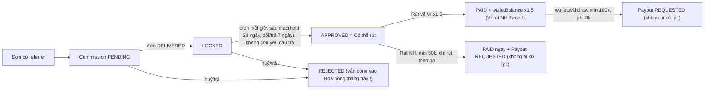
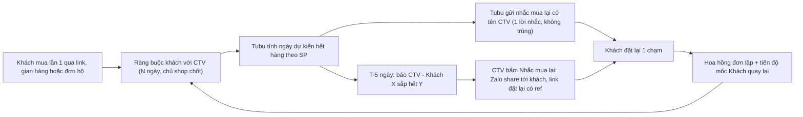

# A5 — Bề mặt đối tác: CTV/affiliate, đại lý, chủ nhãn, nhân sự

**Kết luận.** Bề mặt đối tác rộng và nhiều tính năng: dashboard CTV, gian hàng có mẫu dựng sẵn và nhiệm vụ, Content Kit, "lên đơn hộ", Academy; hub đại lý có dán đơn, mẫu đơn, đặt trước, công nợ, thưởng quý và thưởng mốc; cổng chủ nhãn; ca làm, chấm công và lương. Nhưng hiện tại nó **chưa đủ an toàn để mở rộng** và **chưa phục vụ north-star**.

- **Đường tiền của CTV không đáng tin.** Gian hàng mở trong Zalo không bao giờ ghi hoa hồng (lỗi chữ hoa/thường ở mã giới thiệu). Số "Hoa hồng tháng này" cộng cả đơn đã huỷ. Click và chuyển đổi luôn bằng 0. Lệnh rút về ngân hàng bị đánh dấu "Đã trả" ngay, dù không có quy trình chi trả nào. Rút hoa hồng về Ví được nhân 1,5, rồi Ví lại rút ra ngân hàng được, tức là in tiền.
- **Quyền của CTV quá rộng so với việc đăng ký chỉ 1 chạm.** CTV tự khai số tài khoản, nên VietQR của đơn khách chảy về tài khoản của họ. CTV xem được họ tên, SĐT, địa chỉ của khách; đổi được đơn sang "Đã giao"; đọc được bảng giá sỉ; và đăng sản phẩm chưa duyệt lên catalog công khai.
- **Đại lý** tự bấm "Báo đã CK" là xoá nợ, không cần ai xác minh. Nếu bản build thiếu Cloudinary, đại lý không nộp được hồ sơ.
- **Về mua lặp:** kênh CTV đang được thiết kế cho **một lần bán**. Công của CTV chỉ sống 3 ngày, không có sổ khách, không có nhắc mua lại qua CTV. Đơn "lên hộ" thuộc về tài khoản CTV, nên khách cuối không bao giờ vào vòng loyalty, còn CTV và đại lý làm nhiễu chính chỉ số north-star.

Khuyến nghị: sửa 11 lỗi P0 trước khi tuyển thêm CTV, rồi thiết kế lại hub CTV quanh "Khách của tôi" và nhắc mua lại.

## Hiện trạng

### Bản đồ bề mặt

| Bề mặt | Route / URL | Ai vào được | Việc chính | Backend (số endpoint¹) |
|---|---|---|---|---|
| Hub CTV | miniapp `/affiliate` | Mọi user; đăng ký 1 chạm → role `AFFILIATE` | Hoa hồng tháng/hôm nay, bậc, mốc xu, "Đang chờ/Có thể rút", rút tiền, mã + caption, link, lịch sử, theo gian hàng/sản phẩm | `affiliate` (14) |
| Lên đơn hộ khách | sheet trong `/affiliate` | AFFILIATE/ADMIN | Tạo đơn COD/CK giao cho khách, CTV hưởng hoa hồng | `POST /affiliate/orders` |
| Trình dựng gian hàng | `/storefront` | AFFILIATE/ADMIN | Mẫu theo danh mục, bộ sưu tập, lý do giới thiệu, hồ sơ, "Cấu hình Subdomain, Kho & VietQR", thống kê 30 ngày, 5 nhiệm vụ | `storefront` (20) |
| Gian hàng công khai | miniapp `/s/:slug`, web `/s/[slug]`, `*.tubutree.com` | Công khai | Xem SP, chia sẻ; (web) thẻ "Thanh toán trực tiếp cho Đối tác" | `GET /storefront/public/:slug` |
| Content Kit | sheet ở builder và PDP | AFFILIATE/STAFF/ADMIN | Bài mẫu, USP, FAQ, video + link ref | `content-kit` (3) |
| CTV Academy | `/academy`, `/academy/:courseId` | AFFILIATE/STAFF/ADMIN | Khoá/bài học, tự đánh dấu đã học | `academy` (10) |
| Hub đại lý | `/dealer` | Mọi user nộp hồ sơ → admin duyệt + chọn bậc → `DEALER` | Bảng giá sỉ, dán đơn, mẫu đơn, trả trước/ghi nợ, đơn, sổ nợ, báo cáo quý, phần thưởng | `dealer` (18) |
| Trang nhãn | `/brand/:slug` | Công khai | Theo dõi, KM, SP, "Chương trình đại lý", share-to-earn cho CTV | `brand` |
| Chủ nhãn | `/brand-owner` | Admin gán `Brand.ownerUserId` | Sửa hồ sơ nhãn + khuyến mãi | `brand` (27, gồm admin) |
| Cổng đối tác web | web `/merchant` | DEALER/**AFFILIATE**/ADMIN | Gian hàng, subdomain, VietQR, kho, SP riêng/bán lại, đơn + đổi trạng thái | `merchant` (9) |
| Nhân sự | `/staff`, `/my-payroll` | STAFF/ADMIN | Đăng ký ca, chấm công IP+GPS, xem lương, STK nhận lương | `staff` (37, gồm admin) |
| Admin trong app | `/admin`, `/admin/community` | ADMIN | Nhân sự, duyệt ca, lương, đổi vỏ; kiểm duyệt cộng đồng | `staff`, `feed` |

¹ Đếm bằng lệnh ở Phụ lục.

### Onboarding

| Vai trò | Cách trở thành | Có duyệt? | Mất bao lâu | Mở khoá ngay |
|---|---|---|---|---|
| CTV | Bấm "Đăng ký miễn phí ngay" (`affiliate.tsx:146-154`); chỉ đổi role (`affiliate.service.ts:45-54`) | Không. Không điều khoản, không thông tin thuế, không định danh | 1 chạm | Dashboard, lên đơn hộ, gian hàng công khai, VietQR, Content Kit, Academy; trên web `/merchant` còn đăng SP, xem đơn khách, đổi trạng thái đơn |
| Đại lý | Form 5 trường + 2 ảnh CCCD (`dealer.tsx:129-145`) | Admin web duyệt và bắt buộc chọn bậc (`admin.service.ts:206-253`) | UNKNOWN. App hứa "trong vòng 24 giờ" (`dealer.tsx:170`) nhưng không có thông báo khi duyệt | Bảng giá theo bậc, ghi nợ trong hạn mức |
| Chủ nhãn | Admin gán `ownerUserId` (`brand.service.ts:174`) | Làm tay | UNKNOWN | Sửa hồ sơ nhãn, KM |
| Nhân viên | Admin cấp theo SĐT (RoleGrant), áp khi login/refresh (`rbac.service.ts:24-41`) | Làm tay | Tới lần đăng nhập kế | Ca, chấm công, lương |

### Tiền của đối tác



| Dòng tiền | Trạng thái người dùng thấy | Khi nào về | Rút / phí |
|---|---|---|---|
| Hoa hồng CTV | "Đang chờ · đơn chưa giao", "Đang chờ · đang giữ", "Có thể rút", "Đã trả", "Từ chối" (`affiliate.tsx:45-51`) | ≥20 ngày sau khi giao (`affiliate.service.ts:719-725`, `seed.ts:35`) | Về NH: min 50k, 0đ phí, bắt rút toàn bộ. Về Ví: x1,5 (`seed.ts:37-38`) |
| Ví Tubu | Số dư | Ngay | Rút NH: min 100k, phí 3k (`wallet.service.ts:158-159`) |
| Thưởng mốc CTV | 4 mốc/tháng, trả bằng TubuXu | CTV tự bấm nhận | Không rút được |
| Thưởng quý đại lý | Báo cáo quý | Ngày 10 tháng đầu quý kế (`dealer.cron.ts:14`), trừ vào công nợ | Không có dòng tiền mặt |
| Phần thưởng mốc đại lý (tour/quà) | Chờ duyệt → Đã duyệt → Đã trao | Admin duyệt, trao offline | — |
| Lương nhân viên | Đang tính → Đã chốt → Đã trả + ảnh chứng từ | Admin đánh dấu đã trả | — |

### Vòng động lực

| Vòng | Cơ chế | Thưởng | Ghi chú |
|---|---|---|---|
| Bậc CTV | 5 bậc theo doanh số đã chốt trong tháng: 0 / 3 / 10 / 30 / 80 triệu (`ctv-milestones.ts:60-66`) | Chỉ là danh hiệu | Reset mỗi tháng; huy hiệu hiện công khai trên gian hàng |
| Mốc doanh số tháng | 4 mốc (`ctv-milestones.ts:76-105`) | Tổng 2.850.000 xu/tháng¹ | Phải tự bấm nhận; mốc tháng trước còn nhận được trong tháng này |
| Hành trình gian hàng | 5 nhiệm vụ (`storefront-quest.service.ts`) | Tổng 11.500 xu, 1 lần¹ | Farm được (A5-37) |
| Academy | Khoá → bài → tự đánh dấu | Không có | Không quiz, không chứng chỉ |
| Thưởng quý đại lý | 50 / 100 / 200 triệu → 2 / 3 / 4% (`dealer.service.ts:996-1003`) | Trừ công nợ | Có thu hồi khi huỷ/trả |
| Phần thưởng đại lý | Tour/quà theo quý hoặc năm | Admin duyệt | Hạn gửi yêu cầu 30 ngày sau kỳ |
| Nhân sự | Phạt đi trễ, phạt huỷ ca | — | Không có vòng thưởng |

## Phát hiện

| ID | Mức | Bề mặt/Trang | Phát hiện | Bằng chứng | Đề xuất | Công | Tác động north-star |
|---|---|---|---|---|---|---|---|
| A5-01 | P0 | Gian hàng CTV trong Zalo (`/s/:slug`) → checkout | Mua qua gian hàng trong Zalo **không bao giờ ghi hoa hồng**. Slug gian hàng là referralCode viết thường. Miniapp dùng slug làm referralCode, kể cả link chia sẻ `?ref=<slug>`. Trong khi đó BE tra `referralCode` **khớp chính xác**, mà mã được lưu viết hoa. Hệ quả: checkout không tìm ra người giới thiệu, "chạm 3 ngày" không được ghi, referrer = null. Đơn vẫn gắn `storefrontSlug`, nên "Thống kê 30 ngày" có đơn và doanh thu nhưng hoa hồng 0đ, còn mục "Theo gian hàng" trống. Web không bị vì tự `toUpperCase`. Chỉ thoát lỗi: gian hàng tạo trước bản vá hạ chữ (slug còn viết hoa) và mã giới thiệu toàn chữ số. | `storefront.service.ts:52`; `auth.service.ts:317`; `storefront-view.tsx:27,123`; `app.tsx:124-133,141-144`; `checkout.service.ts:57-62,101-109`; `affiliate.service.ts:80-84`; so với web `lib/storefront-context.ts:66,77` | Chuẩn hoá `toUpperCase()` ở BE (`resolveReferrer`, `recordTouch`) và ở FE. Backfill: đơn có `storefrontSlug` của gian hàng CTV mà `referrerUserId=null` thì gán referrer và tạo commission. Thêm test e2e: chia sẻ qua Zalo → đặt đơn → có commission. | S (+M backfill) | **Cao.** CTV bán qua gian hàng không được trả tiền → ngừng chia sẻ → mất kênh kéo khách mới và khách mua lại |
| A5-02 | P0 | Builder "Cấu hình Subdomain, Kho & VietQR" → web `/s/[slug]`, `/bank-payment` | CTV tự khai "Tài khoản nhận tiền (VietQR 0đ phí)", dẫn tới 2 hậu quả. (1) Trang công khai in thẻ "Thanh toán trực tiếp cho Đối tác… Tiền về trực tiếp tài khoản đối tác" kèm QR, tick xanh và "100% Chính hãng". (2) Mọi đơn chuyển khoản có `storefrontSlug` sinh VietQR trỏ **tài khoản của CTV** thay vì tài khoản Tubu. Điều này gồm đơn khách mua qua gian hàng và cả đơn "lên hộ", vốn tự gắn slug gian hàng của CTV. Đối soát chỉ chạy trên tài khoản Tubu, và theo comment trong code thì không có cron hết hạn đơn PENDING_PAYMENT. Kết quả: tiền khách vào túi CTV, đơn kẹt mãi. Ngoài ra địa chỉ và SĐT cá nhân của CTV bị công khai ở mục "Kho xuất hàng/Hotline". | `storefront-builder.tsx:853,895-940`; `storefront.service.ts:241-249`; web `s/[slug]/page.tsx:118-121,162-229,236`; `storefront-view.tsx:49-60`; `integrations/payment/bank-transfer.service.ts:38-51`; `affiliate.service.ts:278-282,314`; `checkout/dto/checkout.dto.ts:26-27` | BE bỏ qua/khoá các trường ngân hàng và kho khi `type='CTV'`. `getBankQr` chỉ dùng tài khoản gian hàng khi type MERCHANT có cờ hợp đồng do admin bật. Ẩn thẻ VietQR và tick xanh trên gian hàng CTV. Rà dữ liệu hiện có: gian hàng CTV nào đang có `bankAccountNo`. | S | Trung bình–cao: khách mất tiền → mất niềm tin → không quay lại |
| A5-03 | P0 | Web `/merchant`, tab "Đơn Hàng Thuộc Kho" | CTV (tự đăng ký) được gọi `PUT /merchant/orders/:id/status` với mọi đơn gắn slug gian hàng của mình, gồm cả đơn khách thật lẫn đơn "lên hộ". Bấm 3 nút là đơn sang DELIVERED; bảng chuyển trạng thái cho nhảy thẳng CONFIRMED→DELIVERED. Khi đó hệ thống khoá hoa hồng, cộng điểm, cấp voucher giới thiệu và báo khách "đã giao" dù hàng chưa giao. CTV cũng chuyển được đơn khách sang CANCELLED/RETURNED, kéo theo hoàn tiền và đảo điểm. | `merchant.controller.ts:178-180`; `merchant.service.ts:375-400,429-458`; `order-transition.ts:28-38`; `order-status.service.ts:116-119`; web `merchant/page.tsx:1255-1281` | Bỏ AFFILIATE khỏi `@Roles` của MerchantController, hoặc chỉ cho đọc. Chỉ cho đổi trạng thái khi `storefront.type=MERCHANT` và admin đã bật cờ "tự giao hàng". CTV xem trạng thái đơn (đã che PII) ngay trong app. | S | Gián tiếp: "giao ảo" phá niềm tin và làm sai số liệu mua lại |
| A5-04 | P0 | `GET /merchant/orders` (web) | Trả về và hiển thị họ tên, SĐT tài khoản và **địa chỉ giao đầy đủ** của mọi khách đã mua qua gian hàng CTV, cùng mọi đơn có SP "của gian hàng". CTV không giao hàng nên không cần những dữ liệu này. | `merchant.service.ts:404-427`; web `merchant/page.tsx:1212-1232` | Với CTV: chỉ hiện tên viết tắt và 3 số cuối SĐT, không có địa chỉ. Dữ liệu đầy đủ chỉ dành cho đối tác tự giao đã ký hợp đồng. | S | Gián tiếp (rủi ro pháp lý, niềm tin) |
| A5-05 | P0 | `GET /merchant/products` | Hàm `listMyProducts` trả `variations: true`, tức toàn bộ cột: `dealerPrices` của từng bậc đại lý, `affiliateRate`, `reservedStock`, `pancakeStock`. Dữ liệu này đi kèm mọi SP Tubu mà CTV đã thêm vào gian hàng hoặc thêm qua "bán lại". Vì đăng ký CTV chỉ 1 chạm, **bất kỳ ai cũng đọc được bảng giá sỉ**. | `merchant.service.ts:300-306`; `schema.prisma:616-617`; `merchant.controller.ts:180`; `affiliate.service.ts:45-54`; so với select an toàn ở `catalog.service.ts:32-41` | Dùng `select` whitelist giống `publicVariationSelect`. `dealerPrices` chỉ được trả ra từ DealerService. | S | Không trực tiếp; bảo vệ biên lợi nhuận và kênh đại lý |
| A5-06 | P0 | Web `/merchant` "Đăng sản phẩm mới" → catalog | SP đối tác được tạo với `isActive: true` + `PENDING_REVIEW`, tồn kho mặc định 100. Catalog và PDP chỉ lọc `isActive`, nên SP chưa duyệt hiện ngay trên web/app và mua được. SP bị REJECTED cũng vậy, vì bước duyệt chỉ đổi `approvalStatus`. Các SP này dùng pancakeId giả `MCH_…`. CTV đăng ký 1 chạm là đăng được. | `merchant.service.ts:212-257` (239-240, 249); `catalog.service.ts:56,102`; `admin.service.ts:713-727` | Để `isActive=false` tới khi APPROVED (và đặt lại false khi REJECTED), hoặc lọc `approvalStatus` ở mọi truy vấn công khai. Gỡ quyền tạo SP của AFFILIATE. | S | Gián tiếp: hàng chưa kiểm định dưới thương hiệu "xanh" → mất niềm tin mua lại |
| A5-07 | P0 | `/affiliate` "Rút hoa hồng" → Ví | Rút về Ví được cộng `walletBalance` x1,5 (giá trị seed), trong khi Ví là "VND thật" rút ngân hàng được (min 100k, phí 3k). Ví dụ: 1.000.000đ hoa hồng thành 1.497.000đ tiền mặt. Không có ràng buộc nào về nguồn tiền. | `affiliate.service.ts:527,579-606`; `seed.ts:38`; `wallet.service.ts:7-9,123-183` | Phần thưởng 0,5 đưa vào TubuXu (không rút được) hoặc vào một số dư "chỉ tiêu trong app"; hoặc bỏ hệ số. | S | Nếu đổi thành xu: CTV tiêu trong app nhiều hơn (+ mua lặp) |
| A5-08 | P0 | `/affiliate` rút về ngân hàng | Lệnh rút về NH đánh dấu các commission là `PAID` ("Đã trả") **ngay lúc gửi yêu cầu** và tạo Payout `REQUESTED`. Nhưng không có endpoint hay UI admin nào để duyệt, chuyển, từ chối hay hoàn Payout. CTV không có lịch sử lệnh rút; toast chỉ báo "Đã gửi yêu cầu rút." mà không có thời hạn. FE cũng không gửi Idempotency-Key, dù controller ghi chú là client bắt buộc gửi. | `affiliate.service.ts:639-653,670`; `affiliate.tsx:45-51,807`; `affiliate-api.ts:117-121`; `affiliate.controller.ts:69-78`; lệnh grep controller ở Phụ lục | Thêm trạng thái commission "Đang chi trả", chỉ sang PAID khi admin xác nhận đã chuyển (kèm mã giao dịch). Thêm hàng đợi Payout ở web admin, màn "Lệnh rút" có thời hạn dự kiến, và gửi Idempotency-Key. | M | Gián tiếp: CTV mất niềm tin → bỏ kênh |
| A5-09 | P0 | `/dealer` tab Công nợ | Nút "Báo đã CK" ghi ngay một dòng PAYMENT âm vào sổ nợ; chính code ghi chú "KHÔNG có xác nhận ngân hàng thật". Không có bước admin xác nhận, và BE không chặn số tiền lớn hơn dư nợ. Vì vậy đại lý xoá nợ bằng 1 chạm, rồi "Ghi công nợ" tiếp tới hạn mức, lặp vô hạn. Qua API còn đẩy được dư nợ xuống âm, tức hạn mức vô tận. | `dealer.service.ts:305-357` (321); `dealer.tsx:722-733,769-775`; `dealer-admin.controller.ts:27-73`; `dealer.service.ts:191-209` | Dòng PAYMENT tạo ở trạng thái chờ, chưa trừ nợ; kế toán xác nhận kèm mã giao dịch mới trừ. Chặn số tiền > dư nợ. Hiển thị STK/QR công ty. | M | Gián tiếp (bảo vệ vốn) |
| A5-10 | P0 (có điều kiện) | `/dealer` đăng ký | DTO bắt `cccdFrontUrl/BackUrl` là URL http(s) dài ≤1000 ký tự. Nhưng `ImageUpload` fallback sang **base64** khi thiếu `VITE_CLOUDINARY_*`, và biến này không có trong file .env nào của repo. Khi đó mọi hồ sơ đại lý bị lỗi 400, kèm thông báo validator tiếng Anh, nên không ai đăng ký đại lý được. Nếu bản build có Cloudinary unsigned thì ảnh CCCD lại là URL công khai. | `dealer/dto/dealer.dto.ts:24-25`; `image-upload.tsx:6-8,57-58,112-121`; `services/api.ts:97-102`; lệnh env ở Phụ lục | Upload CCCD qua API (signed, bucket riêng tư, xem bằng URL ký hạn). Thông báo lỗi tiếng Việt. Điền sẵn tên và SĐT từ Zalo, validate SĐT. | M | Gián tiếp (kênh đại lý) |
| A5-11 | P0 | `/affiliate` hero | "Hoa hồng tháng này" và "Hôm nay" là tổng mọi commission tạo trong kỳ, **kể cả REJECTED** (đơn huỷ/trả). Con số lớn nhất màn hình vì vậy không bao giờ giảm khi đơn bị huỷ, và lệch với "Đang chờ" và "Có thể rút". | `affiliate.service.ts:139-141,788-794`; `affiliate.tsx:304-313` | Lọc `status != REJECTED`; tách "Ước tính (đang chờ)" và "Đã chốt". | S | Gián tiếp (minh bạch → CTV tin và chia sẻ) |
| A5-12 | P1 | Ghi công CTV–khách | Công của CTV chỉ sống trong phiên hoặc trong "chạm" 3 ngày. `User.referredById` (người giới thiệu lúc đăng ký) có sẵn nhưng không được dùng để tính hoa hồng. Khách do CTV kéo về mà tự mở app mua lại sau 3 ngày thì CTV không được gì, nên CTV không có động lực chăm khách mua lần hai. | `checkout.service.ts:98-109`; `affiliate.service.ts:85-97`; `auth.service.ts:39,98` | Ràng buộc khách với CTV, ví dụ 90 ngày hoặc trọn đời, với % riêng cho đơn lặp (chủ shop chốt). Hiện cho CTV "khách này thuộc bạn tới ngày…". | M | **Rất cao:** biến CTV thành người chăm khách mua lần 2 |
| A5-13 | P1 | Hub CTV / lifecycle | Không có "Khách của tôi" (danh sách khách, lần mua cuối, SP sắp hết) và không có nút nhắc khách mua lại. REORDER_REMINDER của hệ thống (chu kỳ mặc định 60 ngày) gửi cho `orders.userId`. Vì vậy đơn "lên hộ" nhắc **CTV**, đơn sỉ nhắc **đại lý**, khách cuối không nhận gì, và lời nhắc cũng không mang tên hay link của CTV. | grep "khách của tôi" rỗng (Phụ lục); `lifecycle.service.ts:44,50-57,103` | Sổ khách CTV + nút "Nhắc mua lại" 1 chạm (chia sẻ Zalo hoặc ZNS có link ref). Báo CTV khi khách tới hạn. Loại đơn DEALER và `placedForCustomer` khỏi nhắc theo userId. | L | **Rất cao** |
| A5-14 | P1 | Sheet "Lên đơn hộ khách" | Đơn được tạo với `userId = CTV`, nên khách cuối không có tài khoản, không có điểm (`pointsEarned: 0`), không nhận thông báo, không được nhắc mua lại. Mỗi đơn phải gõ lại tên, SĐT, địa chỉ: không có sổ khách, không có "đặt lại đơn cũ". Không xem trước được phí ship, tổng tiền hay hoa hồng (chỉ có dòng "Phí ship tính khi tạo đơn"), trong khi đơn COD chốt CONFIRMED ngay. FE không gửi Idempotency-Key dù BE hỗ trợ, nên retry mạng có thể tạo đơn đôi và giữ kho 2 lần. | `affiliate.service.ts:284-317` (301, 308); `ctv-order-sheet.tsx:103-120,138-191,200-219,292-305`; `i18n/vi.ts:279`; `affiliate-api.ts:174-179` | Gắn đơn vào khách cuối theo SĐT (tạo tài khoản "bóng"), CTV là referrer. Cho chọn khách cũ và "Đặt lại". Thêm endpoint báo giá; màn thành công hiện hoa hồng dự kiến; gửi Idempotency-Key. | L | **Cao:** đơn lặp qua CTV mới đo và kích được |
| A5-15 | P1 | Thông báo cho CTV | Không có thông báo nào khi: có đơn/hoa hồng mới, hoa hồng chuyển "Có thể rút", lệnh rút được xử lý, lên bậc, đạt mốc. Mốc phải tự mở app để bấm nhận, và mốc tháng trước hết hạn vào cuối tháng. Thông báo duy nhất CTV nhận là lời nhắc hằng tuần thêm SP nổi bật. | grep `notify(` ở Phụ lục (chỉ `storefront-reminder.service.ts:77`); `affiliate.tsx:440` | 5 sự kiện in-app + ZNS; chấm đỏ ở mục "Cộng tác viên" trong Hồ sơ. | M | Cao gián tiếp: vòng "có đơn → chia sẻ tiếp" |
| A5-16 | P1 | `/affiliate` "Link chia sẻ", ô Click/Chuyển đổi | `trackClick` không được gọi ở đâu, `conversions` không bao giờ tăng, tham số `l=` trong link sao chép không được đọc. Vì vậy Click, Chuyển đổi và "x click · y đơn" luôn là 0. Nút "+ Tạo link" chỉ tạo thêm một link trang chủ giống hệt. Màn đăng ký hứa "theo dõi click & chuyển đổi" là sai. Empty state "Theo sản phẩm" bảo "chia sẻ link sản phẩm" nhưng không có chỗ tạo link sản phẩm. | `affiliate.service.ts:111-131`; grep trackClick (Phụ lục); `affiliate.tsx:99,264-272,312-313,595-607,746-749` | Gỡ khối link/click cho tới khi có tracking thật (sự kiện `ctv_link_click` trong sub-project 2), hoặc làm `/r/:code` + tạo link theo từng SP. | M | Trung bình (CTV biết cái gì bán được) |
| A5-17 | P1 | Sheet "Rút hoa hồng" | Ô "Số tiền" sửa được và có dòng "Tối đa X", ngụ ý rút một phần được. Nhưng BE chỉ nhận đúng toàn bộ số dư, nhập ít hơn là lỗi "Chỉ hỗ trợ rút toàn bộ…". Khi dashboard lỗi, ô mặc định là "0" và CTV phải tự đoán đúng số dư. | `affiliate.service.ts:570-574`; `affiliate.tsx:757-762,799,851-859` | Bỏ ô nhập: hiện số tiền cố định, phí, thời hạn; hoặc hỗ trợ rút một phần. | S | Thấp–trung bình |
| A5-18 | P1 | `/affiliate` caption gợi ý | Cả 3 caption bảo khách "Nhập mã {CODE} khi mua", nhưng checkout (app lẫn web) không có ô nhập mã giới thiệu, và caption **không chứa link**. Bài đăng mạng xã hội vì vậy không bao giờ được ghi công; khách gõ mã vào ô voucher sẽ bị báo sai mã. | `affiliate.tsx:538-542`; `checkout.tsx:150`; web `thanh-toan/page.tsx:92` | Caption tự chèn link ref (như ShareSheet), hoặc thêm ô "Mã người giới thiệu" ở checkout. | S | Trung bình |
| A5-19 | P1 | PDP khi CTV đang xem | Nút "Chia sẻ" mặc định của PDP gửi `/product/:slug` **không có `?ref=`**, kể cả khi người dùng là CTV. CTV cũng không thấy "% hoa hồng" trên PDP hay thẻ SP; chỉ picker gian hàng mới hiện. Hành động chia sẻ tự nhiên nhất vì vậy không ra tiền. | `product-detail.tsx:232-242,538-564`; `storefront-builder.tsx:698-702` | Với CTV: share mặc định gắn ref + badge "Hoa hồng tới X%" trên PDP và thẻ SP. Với khách thường: gắn ref để kích hoạt thưởng giới thiệu. | S | Trung bình–cao |
| A5-20 | P1 | Content Kit | Cùng một `shareLink` bị dùng cho 2 việc: làm `path` cho Zalo share (cần đường dẫn trong mini app) và làm nội dung "Sao chép link" + `{link}` trong caption (cần URL tuyệt đối). `app.miniapp_base_url` không có trong seed (mặc định rỗng), nên link sao chép ra là "/product/x?ref=…", vô dụng khi dán. Nếu set URL tuyệt đối thì path của Zalo lại sai. Kit rỗng thì chỉ còn nút chia sẻ. | `content-kit.service.ts:49-50,57-66`; `content-kit-sheet.tsx:85-90,98`; `docs/2026-07-05-batch2-deploy-UAT-runbook.md:126` | Trả 2 trường `sharePath` + `shareUrl`; khi kit rỗng thì tự sinh caption từ mô tả SP. | S | Trung bình |
| A5-21 | P1 | Link web của CTV (sao chép, QR) | Link "Sao chép" và QR dùng `VITE_WEB_BASE_URL`, fallback là `https://shop.tubutree.com`; không file env nào khai biến này, trong khi web deploy ở `app.tubutree.com`. Nếu shop. không trỏ về web thì mọi link chết. Nếu có trỏ thì middleware coi "shop" là subdomain gian hàng và rewrite "/" sang `/s/shop` (slug "shop" bị cấm), nên link `/?ref=…` ra 404. | `share-sheet.tsx:31-37,57`; `affiliate.tsx:606-607`; web `middleware.ts:25-41`; `identifier-validation.ts:13-16`; web `lib/site.ts:7`; `.env.vietnix.deploy:2` | Một nguồn cấu hình domain duy nhất (public config); thêm "shop" vào danh sách bỏ qua của middleware; QR nên mã hoá deep link Zalo. DNS thực tế: UNKNOWN. | S | Trung bình |
| A5-22 | P1 | Đăng ký CTV | "Đăng ký miễn phí ngay" chỉ đổi role: không điều khoản/quy chế CTV, không thông tin thuế hay định danh, không duyệt. Role này lại mở luôn gian hàng công khai, VietQR, đăng SP, xem và đổi trạng thái đơn trên `/merchant`. Đây là gốc của A5-02 đến A5-06. | `affiliate.tsx:146-154`; `affiliate.service.ts:45-54`; `storefront.service.ts:37-41`; `merchant.controller.ts:180` | Tách quyền: "CTV cơ bản" (link, lên đơn hộ) mở ngay; gian hàng công khai, ngân hàng, đăng SP cần duyệt và chấp nhận điều khoản. | M | Gián tiếp |
| A5-23 | P1 | Subdomain và tiêu đề gian hàng | CTV tự đặt subdomain (chỉ chặn 17 từ hệ thống¹) và tiêu đề tuỳ ý; trang hiện tick xanh và "CTV tuyển chọn Tubu". Vì vậy dựng được `innisfree.tubutree.com` hay "Tubu chính hãng" giả; sitemap còn liệt kê các gian hàng này. | `identifier-validation.ts:13-16,26-37`; `storefront-builder.tsx:862-871`; web `s/[slug]/page.tsx:118-136`; `storefront-view.tsx:44-47`; `storefront.service.ts:279-287` | Subdomain cần duyệt + blocklist thương hiệu; bỏ tick "verified" cho CTV. | S | Gián tiếp |
| A5-24 | P1 | "Lên đơn hộ" để tự mua | `placedForCustomer` cho phép tự giới thiệu: CTV "lên hộ" giao về chính mình vẫn hưởng hoa hồng. Vì đăng ký chỉ 1 chạm, mọi khách đều tự tạo được một "giá CTV" ngầm bằng đúng % hoa hồng, và đơn đó còn không tích điểm. Hệ quả là ăn mòn biên lợi nhuận và vòng loyalty. | `affiliate.service.ts:221-225,396-398,45-54` | Chủ shop chốt: hoặc biến thành chính sách "giá CTV" minh bạch, hoặc chặn đơn có địa chỉ/SĐT trùng CTV và giới hạn tần suất. | S | Trung bình (sai số liệu mua lặp) |
| A5-25 | P1 | Đổi vai trò (CTV ↔ đại lý/nhân viên) | `User.role` chỉ giữ 1 giá trị theo thứ hạng. CTV được duyệt làm đại lý hoặc được cấp STAFF thì `isAffiliate=false`: trang CTV hiện màn đăng ký, bấm đăng ký bị chặn "Tài khoản này không thể đăng ký CTV." Hoa hồng APPROVED còn lại và gian hàng không còn truy cập được từ UI. | `affiliate.service.ts:47-49,61`; `admin.service.ts:242`; `rbac.service.ts:6-12,39-41`; `affiliate.tsx:80` | Cho phép nhiều vai trò (flags hoặc bảng roles), hoặc giữ quyền CTV khi nâng vai trò. | M | Thấp–trung bình |
| A5-26 | P1 | Hạng thành viên (bị luồng đối tác ảnh hưởng) | Hạng xét `spent12m` = mọi đơn DELIVERED của userId, gồm cả **đơn sỉ đại lý** và **đơn lên hộ**. Đại lý và CTV vì vậy lên hạng cao (freeship, nhân điểm) nhờ doanh số không phải tiêu dùng của họ. | `loyalty.service.ts:216-224,238-241`; `dealer.service.ts:223-235`; `affiliate.service.ts:298-303` | Khi tính hạng chỉ lấy `type='RETAIL' AND placedForCustomer=false`. | S | Trung bình (ưu đãi hạng dành cho khách mua lặp thật) |
| A5-27 | P1 | Dữ liệu đơn của đối tác | "Đơn hàng của tôi" liệt kê mọi đơn theo userId, không lọc DEALER hay `placedForCustomer`. Mọi thông báo trạng thái đơn "lên hộ" gửi cho CTV. CTV bán nhiều sẽ bị spam, và các chỉ số "đơn/khách/tháng", "đơn thứ 2 trong 30 ngày" sẽ coi CTV và đại lý là "siêu khách". | `orders.service.ts:34-46`; `order-status.service.ts:128-130`; `affiliate.service.ts:301` | Tách tab "Đơn hộ khách" và "Đơn sỉ". Analytics (sub-project 2) loại DEALER và `placedForCustomer`, hoặc quy đơn về khách cuối. | S–M | **Cao về đo lường north-star** |
| A5-28 | P1 | `/dealer` Bảng giá | Giỏ sỉ (`qty`) là state của tab "Bảng giá", mà các tab render có điều kiện. Chuyển sang "Công nợ" hay "Đơn hàng" rồi quay lại là mất toàn bộ giỏ (ví dụ 30 dòng); rời trang cũng mất. | `dealer.tsx:225-228,261` | Đưa state lên `DealerHub` và lưu nháp. | S | Trung bình (đơn lặp B2B) |
| A5-29 | P1 | `/dealer` đặt trước hàng chưa về | Nghiệp vụ "đặt trước hàng chưa về" (quyết định 2026-09-12) có ở BE, nhưng nút tăng giảm số lượng chặn ở mức tồn (`max={row.stock}`), SP hết hàng không thêm được. Chỉ lách được qua "Dán đơn" hoặc mẫu đơn, và thanh tổng không báo phần nào sẽ là đặt trước. | `dealer.tsx:610,625`; `ui/quantity-selector.tsx:51-54`; `dealer.service.ts:210-222` | Bỏ giới hạn ở tồn (hoặc đặt trần đặt trước), thêm nhãn "Còn N · phần vượt sẽ đặt trước". | S | Trung bình |
| A5-30 | P1 | `/dealer`: minh bạch giá và điều khoản | Nhãn "-X%" trên mỗi dòng luôn là chiết khấu mặc định của bậc, nên sai khi admin đặt giá sỉ riêng (`dealerPrices[tier]`). Hub không hiện % chiết khấu, điều khoản NET 15/30 hay MOQ. `paymentTerms` và `minOrderVolume` có trong seed nhưng không dùng ở đâu: không có hạn trả, không cảnh báo quá hạn. Hero vẫn hứa "Giá sỉ đến 45%". | `dealer.service.ts:131-141,1285-1293`; `seed.ts:271-274`; grep ở Phụ lục; `dealer.tsx:117,190-214,619-621` | Tính % theo giá thực từng dòng. Thêm thẻ "Điều khoản của bạn" (chiết khấu, hạn mức, NET, hạn trả gần nhất). Áp NET/MOQ nếu chủ shop chốt. | M | Thấp–trung bình |
| A5-31 | P1 | `/dealer` tab Công nợ | Không có STK, QR hay nội dung chuyển khoản để trả nợ; nút "Báo đã CK" không nói chuyển vào đâu. | `dealer.tsx:752-785` | Thêm VietQR theo số dư (nội dung = mã đại lý) và cho upload chứng từ. | S | Thấp |
| A5-32 | P1 | Duyệt hồ sơ đại lý | Duyệt hay từ chối đều không gửi thông báo. `rejectionReason` được lưu nhưng `/dealer/me` không trả về, nên màn "bị từ chối" không nói vì sao. Màn chờ hứa "24 giờ… liên hệ qua Zalo" mà không có cơ chế nào. Form không điền sẵn tên/SĐT, không validate SĐT, và bỏ qua các trường BE có (ảnh cửa hàng, doanh số dự kiến). | `admin.service.ts:206-253`; `dealer.service.ts:101-122`; `dealer.tsx:78-106,121-127,161-175`; `dealer.dto.ts:26-28` | Gửi thông báo APPROVED/REJECTED (+ ZNS), trả lý do, có SLA thật, điền sẵn từ hồ sơ. | S | Thấp |
| A5-33 | P1 | Đại lý không có bậc | Admin gán role DEALER qua "đổi role theo SĐT" mà không cần chọn bậc, nên `tier=null`. Khi đó BE bỏ qua kiểm hạn mức (chỉ kiểm khi `onCredit && tier`) và áp chiết khấu mặc định 20%. Qua API, đại lý này ghi nợ không giới hạn; UI chỉ chặn vì hạn mức hiển thị là 0. | `admin.service.ts:277-302`; `dealer.service.ts:191,205,1295-1305`; `dealer.tsx:197,225` | Không có bậc thì BE chặn CREDIT; `setUserRole(DEALER)` bắt buộc chọn bậc. | S | Không |
| A5-34 | P1 | Mô hình "đối tác tự giao" (web `/merchant`, gian hàng MERCHANT) | Mọi đơn, kể cả đơn qua gian hàng MERCHANT hay đơn SP đối tác, vẫn đẩy Pancake về kho Tubu. Đồng thời `/merchant` báo đối tác "Chờ đóng gói — Cần xuất kho ngay" và cho họ đổi trạng thái. Không rõ ai giao: có thể giao 2 lần, hoặc không ai giao. | `checkout.service.ts:313`; web `merchant/page.tsx:229-233,1179`; `merchant.service.ts:217-218` | Chủ shop chốt có giữ mô hình Merchant không. Nếu giữ: đơn SP đối tác không đẩy Pancake, đối tác tự giao, đối soát tiền riêng. Pancake xử lý pancakeId giả thế nào: UNKNOWN. | L | Gián tiếp |
| A5-35 | P1 | `/brand-owner` Khuyến mãi | Chủ nhãn nhập mã giảm giá tuỳ ý (UI tự thừa nhận "Mã phải được Tubu tạo trước… thì mới dùng được"); BE lưu mà không kiểm mã có tồn tại hay còn hiệu lực. KM hiện công khai ngay theo ngày, không qua duyệt. Khách "chạm để chép" mã chết, hoặc đọc lời hứa "MUA 2 TẶNG 1" mà checkout không thực thi. | `brand-owner.tsx:183-195`; `brand.service.ts:50-54,199,399-405`; `brand-view.tsx:151-199` | Chọn mã từ danh sách voucher hợp lệ, hoặc để KM ở trạng thái chờ duyệt. | S | Trung bình (mã chết ở checkout = rớt đơn) |
| A5-36 | P1 | `/staff` chấm công | Heartbeat chạy 3 phút một lần; chỉ **một** lần xác minh IP/GPS thất bại là phiên tự đóng (OUT_OF_RANGE). Ví dụ máy rớt WiFi sang 4G, hay GPS trong nhà bị lệch. Nhân viên mất giờ công, và chỉ biết nếu đang mở màn hình. | `attendance.service.ts:153-173`; `verify.ts:19-30`; `staff.tsx:133-154` | Chỉ đóng khi N nhịp liên tiếp thất bại, hoặc chỉ cảnh báo và để quản lý duyệt; hiện lịch sử đóng phiên kèm lý do. | S | Không |
| A5-37 | P2 | Hành trình gian hàng (nhiệm vụ) | Nhiệm vụ "Đơn hàng đầu tiên" (5.000 xu) đếm mọi commission, kể cả REJECTED, tức cả đơn tự lên hộ rồi huỷ. "Thêm 5 SP" đếm item mà không loại trùng: `StorefrontItem` không có unique, nút "+ Thêm" không khoá. Kết quả: 5 nhiệm vụ = 11.500 xu mỗi tài khoản, farm được mà không cần bán. | `storefront-quest.service.ts:34-39,58,83`; `schema.prisma:589-602`; `storefront-builder.tsx:705` | Chỉ đếm commission APPROVED hoặc đơn DELIVERED; đếm productId khác nhau; thêm unique (collectionId, productId). | S | Không |
| A5-38 | P2 | Số liệu gian hàng/sản phẩm | "Theo gian hàng" không lọc trạng thái đơn và cộng cả commission REJECTED. "Thống kê 30 ngày" tính cả đơn PENDING_PAYMENT, và đếm đơn "lên hộ" như đơn gian hàng. "Theo sản phẩm" tính lại theo `affiliateRate` hiện tại chứ không phải lúc bán, và bỏ qua `affiliateBlocked`. Ba nơi cho ba con số khác nhau. | `affiliate.service.ts:278-282,728-751,754-785`; `storefront.service.ts:323-336` | Một hàm doanh số dùng chung, chỉ đơn không huỷ, đọc số tiền thật từ Commission. | S | Thấp |
| A5-39 | P2 | Builder gian hàng | Không có nút "Chia sẻ" (phải vào "Xem trước"); header chỉ hiện "/slug"; không có "Gỡ đăng". Mục Thống kê và Hành trình ẩn im lặng khi lỗi. Sheet "Cấu hình" không xoá được trường đã nhập (gửi `undefined`), đúng lỗi đã sửa ở hồ sơ. BE có combo và layout nhưng builder không tạo được, còn trang gian hàng thì bỏ qua. | `storefront-builder.tsx:185-192,252-254,435-452,569-573,623-624,822-831`; `storefront-view.tsx:65-68`; `storefront.controller.ts:35-45` | Thêm nút Chia sẻ, hiện link đầy đủ, thêm Gỡ đăng, hiện trạng thái lỗi; gửi chuỗi rỗng để xoá; hoặc bỏ combo/layout khỏi DTO. | S | Thấp |
| A5-40 | P2 | Thẻ SP trên gian hàng và trang nhãn | Hai trang tự vẽ thẻ SP thay vì dùng `ProductCard`, nên thiếu giá flash, % giảm và tim yêu thích. Khi có flash sale, giá trên gian hàng khác giá trên PDP. | `storefront-view.tsx:69-100`; `brand-view.tsx:209-232`; so với `product-card.tsx:30-39,92-96` | Dùng `ProductCard` chung (Design System v2). | S | Thấp–trung bình |
| A5-41 | P2 | Thanh "Đang xem cửa hàng" | Thanh chỉ ghi chung chung, không nói đang xem gian hàng của ai, không có lối quay lại gian hàng. "⤺ Về Tubu Tree" xoá luôn referralCode, nên CTV mất đơn. | `storefront-context-bar.tsx:22-39`; `store/storefront-context.ts:40-43` | "Đang mua qua gian hàng của {tên} · Quay lại"; giữ referralCode khi về trang chủ. | S | Thấp |
| A5-42 | P2 | Academy | Không có thưởng, chứng chỉ hay quiz; "đánh dấu đã học" là tự khai. Video mở bằng `<a target=_blank>` thay vì `openExternal/openWebview` như các nơi khác. `completeLesson` không kiểm bài có tồn tại/đã publish. Đại lý không vào được Academy. | `academy.tsx:200-226`; `zmp-bridge.ts:107-113`; `academy.service.ts:78-85`; `academy.controller.ts:7` | Thưởng xu khi xong khoá, quiz ngắn, mở video bằng webview, kiểm lessonId, cho đại lý vào. | S | Thấp |
| A5-43 | P2 | Báo cáo đại lý, trang nhãn | Thanh tiến trình báo cáo quý dùng `Math.round`: 99,5% hiện 100% trong khi vẫn ghi "Còn X". "Dư nợ hiện tại" hiện số âm màu xanh khi được cộng thưởng, khó hiểu. "Chương trình đại lý" (ngưỡng thưởng B2B) hiện trên trang nhãn cho mọi khách lẻ. | `dealer.tsx:755-760,842-844`; `dealer.service.ts:1048-1050`; `brand.service.ts:61-65`; `brand-view.tsx:238-257` | Dùng `floor` tối đa 99; hiện "Số dư có" khi số âm; chỉ hiện chương trình đại lý cho người đã đăng ký đại lý. | S | Không |
| A5-44 | P2 | Đơn và bảng giá đại lý | Đơn đại lý không có địa chỉ giao (`shippingAddress = {note:'Giao theo hợp đồng đại lý'}`). Bảng giá chỉ lọc `variation.isActive`, không lọc `product.isActive`/`approvalStatus`, nên có cả SP đối tác chưa duyệt. Đơn "Trả trước" chưa trả giữ kho mãi. | `dealer.service.ts:127-130,235`; `checkout/dto/checkout.dto.ts:26-27` | Cho chọn địa chỉ nhận (mặc định theo hợp đồng); lọc SP; hết hạn đơn trả trước chưa thanh toán. | S | Không |
| A5-45 | P2 | Nhập tài khoản ngân hàng | Có 3 UI nhập ngân hàng khác nhau: rút CTV gõ tay tên ngân hàng; lương hỏi "mã BIN Napas"; gian hàng hỏi BIN + tên. Không lưu STK cho lần rút sau. Ở trang lương, bấm "Lưu" khi form mở trước lúc dữ liệu tải xong có thể ghi đè STK cũ bằng chuỗi rỗng. Min và phí rút không thống nhất (hoa hồng→NH 0đ/min 50k, Ví→NH 3k/min 100k). | `affiliate.tsx:861-879`; `my-payroll.tsx:104-114,229`; `storefront-builder.tsx:898-917`; `payroll.service.ts:212-218`; `seed.ts:37`; `wallet.service.ts:158-159` | Một component chọn ngân hàng (danh sách VietQR) + STK đã lưu; không gửi chuỗi rỗng; một chính sách phí. | M | Không |
| A5-46 | P2 | Giao diện và cấu trúc thông tin | Có 3 ngôn ngữ thị giác: CTV màu cam `--primary-600 #e08c1c` với bóng cam, đại lý navy `#1f2a44`, nhân sự xanh lá. Preset màu gian hàng có cả xanh dương và tím. Trang CTV là một cuộn dài xếp nối: hero → bậc → mốc → KPI → các nút Rút/Lên đơn hộ/Gian hàng/Academy → mã + caption → link → lịch sử → theo gian hàng → theo sản phẩm; không tab, không tiêu đề trang. Trang nhãn dùng ký tự "↗", "✓", "+" thay cho icon lucide. | `tokens.css:23,78`; `affiliate.tsx:113-117,286-751`; `dealer.tsx:190`; `staff.tsx:159`; `storefront-builder.tsx:842-848`; `brand-view.tsx:274-278` | Một "Partner Hub" theo DS v2: token xanh tự nhiên, tab, tiêu đề, icon lucide. | M | Gián tiếp |
| A5-47 | P2 | `/brand/:slug` | Trang gọi `follow-state` và `share-to-earn` cả khi khách chưa đăng nhập (không `enabled` theo auth như `dealerQ`), gây 401 và một lượt refresh thừa. Lỗi theo dõi luôn báo "Cần đăng nhập". | `brand-view.tsx:32-33,42,53,56-61` | `enabled: authed`; thông báo lỗi theo mã lỗi thật. | S | Không |
| A5-48 | P2 | Trang đối tác khi phiên chưa khôi phục xong | `/dealer` gọi API không chờ auth. Đây đúng là lỗi đã sửa ở `/affiliate`: gọi trước khi restore xong sẽ 401 rồi kẹt vì không retry 4xx. `/staff`, `/my-payroll`, `/admin` kiểm role từ store, nên mở deep link lúc restore chưa xong sẽ thấy "Trang dành cho nhân viên" nhấp nháy. | `dealer.tsx:48`; `affiliate.tsx:54-57`; `staff.tsx:61-72`; `my-payroll.tsx:34-43`; `admin.tsx:70-81` | `enabled: authed` + skeleton trong lúc auth đang loading. | S | Không |
| A5-49 | P2 | Admin trong miniapp | Xác nhận cấp ADMIN và thu hồi quyền dùng `window.confirm`, khác pattern Sheet. Chọn người thắng sự kiện bằng cách gõ userId thô. Không có hàng đợi duyệt đại lý hay lệnh rút CTV trên mobile. | `admin.tsx:443,489`; `community-moderation.tsx:453-466` | Dùng Sheet xác nhận; chọn từ danh sách người tham gia; thêm tab "Đối tác chờ duyệt". | S | Không |
| A5-50 | P2 | Lên đơn hộ, thanh toán chuyển khoản | Nút ghi "Mở trang thanh toán (gửi khách)" nhưng trang chỉ có nút sao chép, không có nút gửi QR cho khách qua Zalo hay lưu ảnh. | `ctv-order-sheet.tsx:151-162`; `i18n/vi.ts:289`; `bank-payment.tsx:8,32` | Nút "Gửi link thanh toán cho khách" (Zalo share + trang thanh toán công khai theo token). | S | Thấp |
| A5-51 | P2 | Bậc CTV | Bậc reset mỗi tháng và chỉ là danh hiệu. Doanh số tính theo tháng được chốt (≥20 ngày sau khi giao), nên bán hôm nay thường tháng sau mới thấy lên mốc. Huy hiệu bậc công khai trên gian hàng để lộ khoảng doanh số của CTV. | `ctv-milestones.ts:6-16,60-66`; `affiliate.service.ts:187-197,719-725`; `storefront.service.ts:226-231` | Bậc trượt 90 ngày có quyền lợi thật; hiện song song "đang về" và "đã chốt"; ẩn huy hiệu nếu CTV muốn. | M | Trung bình (xem đề xuất retention) |
| A5-52 | P2 | `/brand-owner` | Cổng chủ nhãn chỉ sửa được hồ sơ và KM: không có số liệu bán, đơn, tồn kho, đánh giá hay followers theo thời gian. Màn 404 bảo "Liên hệ Tubu" nhưng không có nút liên hệ. | `brand-owner.tsx:19-44,117-162`; `brand.controller.ts:37-62` | Thêm thẻ số liệu tối thiểu + nút chat OA. | M | Thấp |
| A5-53 | P2 | Web `/merchant` | Lần đầu mở trang là tự tạo **và đăng** một gian hàng rỗng. Badge hiện enum thô "CTV/MERCHANT". Link `https://{subdomain}.tubutree.com` và `customDomain` phụ thuộc wildcard DNS (UNKNOWN), mà middleware chỉ lấy nhãn đầu của host nên custom domain dạng `shop.abc.vn` rewrite sai. | `merchant.service.ts:107-127` (117); web `merchant/page.tsx:162,186`; web `middleware.ts:25-41` | Không tự đăng; hiện nhãn tiếng Việt; tra host bằng `by-host` thay vì nhãn đầu. | S | Không |
| A5-54 | P2 | Thông báo rút tiền | Toast sau khi rút về Ví hiện số thô "Đã cộng 150000đ vào Ví Tubu (×1.5)", không định dạng. Rút NH không có thời hạn dự kiến. Bấm rút lần 2 (không có Idempotency-Key) hiện lỗi "Không có hoa hồng khả dụng để rút." ngay sau toast thành công. | `affiliate.service.ts:544,619,629`; `affiliate.tsx:807`; `affiliate-api.ts:117-121` | Format tiền, thêm ETA, gửi Idempotency-Key. | S | Không |

¹ Đếm bằng lệnh ở Phụ lục.

## Đề xuất hàng đầu cho redesign

Xếp theo tác động lên north-star (tỷ lệ khách có đơn thứ 2 trong 30 ngày, số đơn/khách/tháng).

1. **"Khách của tôi" + ràng buộc khách–CTV + nhắc mua lại qua CTV** (A5-12, A5-13).
   - Mỗi CTV có sổ khách: khách đã mua qua link/gian hàng/đơn hộ, SP đã mua, ngày dự kiến hết hàng.
   - Nút "Nhắc mua lại" 1 chạm, gửi link đặt lại có gắn ref.
   - Hoa hồng cho đơn lặp trong thời hạn ràng buộc.
   - *North-star:* trực tiếp. CTV là người có quan hệ cá nhân với khách, đúng mô hình "clienteling" của các chuỗi mỹ phẩm (nhân viên tư vấn giữ sổ khách và nhắc bổ sung).
2. **Làm đường tiền CTV đáng tin trước khi đòi CTV chăm khách** (A5-01, A5-11, A5-16, A5-08, A5-15, A5-38).
   - Sửa lỗi ghi công gian hàng và backfill.
   - Số liệu đúng, tách "đang về" và "đã chốt".
   - Quy trình chi trả có trạng thái.
   - Thông báo realtime khi có đơn và hoa hồng, như các chương trình affiliate của sàn lớn.
   - *North-star:* gián tiếp nhưng là điều kiện cần. CTV không được trả đúng thì sẽ không nuôi khách.
3. **"Lên đơn hộ" → "Đặt hàng cho khách" gắn khách cuối** (A5-14, A5-24, A5-27, A5-50).
   - Đơn thuộc khách theo SĐT (tài khoản "bóng", khách nhận ZNS và điểm khi mở app); CTV là referrer.
   - Chọn khách cũ, "Đặt lại đơn trước" 1 chạm, có báo giá trước, gửi link thanh toán cho khách.
   - *North-star:* trực tiếp. Đơn lần 2 của khách qua CTV mới đo và kích được, và CTV không còn làm nhiễu số liệu.
4. **Đóng quyền đối tác trước khi scale** (A5-02, A5-03, A5-04, A5-05, A5-06, A5-09, A5-22, A5-23).
   - Tách "CTV cơ bản" và "đối tác tự giao đã ký".
   - Gỡ `/merchant` và VietQR/kho khỏi CTV.
   - SP đối tác ẩn tới khi duyệt.
   - Thanh toán nợ đại lý cần kế toán xác nhận.
   - Đổi hệ số x1,5 thành xu (A5-07).
   - *North-star:* bảo vệ niềm tin, là nền cho mọi vòng mua lại.
5. **Công cụ bán theo sản phẩm** (A5-18, A5-19, A5-20, A5-21).
   - Nút chia sẻ mặc định có ref; "% hoa hồng" trên PDP và thẻ SP khi là CTV.
   - Caption luôn có link; Content Kit tự sinh khi rỗng.
   - Một domain và QR deep link duy nhất.
   - *North-star:* tăng đơn đầu được ghi công và link đặt lại dùng được.
6. **Đại lý: đặt lại nhanh, giá và điều khoản minh bạch** (A5-28 đến A5-33).
   - Giỏ bền, đặt trước ngay trên bảng giá, nút "Đặt lại đơn gần nhất".
   - Thẻ điều khoản (chiết khấu, NET, hạn trả) và QR trả nợ.
   - *North-star:* đơn lặp B2B, mức vừa.
7. **Một "Partner Hub" theo Design System v2** (A5-39, A5-40, A5-41, A5-46).
   - Tab "Tổng quan · Khách · Bán · Thu nhập · Học".
   - Token xanh tự nhiên thay cho cam/navy; dùng `ProductCard` chung (đúng giá flash); gian hàng hiện rõ đang mua qua ai.
   - *North-star:* gián tiếp (CTV thao tác nhanh hơn, khách không bị lệch giá).

## CTV là kênh giữ chân khách (đề xuất riêng)

Hiện tại kênh CTV chỉ phục vụ **đơn đầu**, vì 3 lý do: công của CTV hết sau 3 ngày (A5-12); không có công cụ nào giúp CTV biết khách nào sắp mua lại (A5-13); đơn CTV đặt hộ lại thuộc về CTV (A5-14). Với hàng tiêu hao như mỹ phẩm, nước giặt, bỉm sữa hay cà phê, CTV là người **biết khách dùng gì và khi nào hết**. Đó chính là tín hiệu mà vòng mua lại cần.



**Cơ chế cụ thể**

- **Ràng buộc khách–CTV.** Khi đơn đầu có referrer, lưu một bảng `customer_binding(customerId, ctvId, boundAt, expiresAt)`. Đơn trong thời hạn ràng buộc tính công cho CTV dù khách tự mở app; có thể dùng % riêng cho đơn lặp. Tái dùng `referredById` cho khách đăng ký qua link. Chủ shop chốt: thời hạn, %, và quy tắc khi khách bấm link CTV khác.
- **Sổ "Khách của tôi"** (tab mới trong hub CTV):
  - Mỗi khách hiện tên (che bớt), 3 số cuối SĐT, đơn gần nhất, SP và ngày dự kiến hết.
  - Chip trạng thái: "Sắp hết", "Quá hạn mua lại", "Đang đăng ký định kỳ".
  - Sắp xếp mặc định theo "cần nhắc hôm nay".
  - Không hiện địa chỉ (bài học từ A5-04).
- **"Nhắc mua lại" 1 chạm.** Mở Zalo share tới khách với caption soạn sẵn có tên CTV và **link đặt lại**, tức deep link dựng lại giỏ đơn trước, gắn ref, có thể kèm voucher nhỏ do CTV "tặng" lấy từ ngân sách hoa hồng. Chặn spam: tối đa 1 nhắc/khách/7 ngày, khách được từ chối nhận.
- **Nhắc hai kênh không trùng.** Khi lifecycle `REORDER_REMINDER` tới hạn với khách đã ràng buộc, hệ thống vừa báo CTV, vừa gửi khách một lời nhắc có tên và link của CTV, thay vì lời nhắc chung chung. Cần loại đơn `DEALER` và `placedForCustomer` khỏi truy vấn theo userId (A5-13).
  - Chu kỳ mặc định hiện là 60 ngày × 0,85 = khoảng 51 ngày (`lifecycle.service.ts:44`), **ngoài cửa sổ 30 ngày** của north-star. Nên tính chu kỳ theo từng SP (dung tích/ngày dùng), đồng bộ với sub-project 5.
- **CTV đặt định kỳ hộ khách.** Tận dụng module `subscriptions` sẵn có: CTV tạo "giao định kỳ" cho khách (khách xác nhận qua link). Mỗi kỳ giao là một đơn lặp tự động, có hoa hồng định kỳ. Đây là cơ chế đơn lặp mạnh nhất (kiểu Subscribe & Save) và gắn đúng người đang tư vấn.
- **Thưởng theo giữ chân, không chỉ theo doanh số.** Thêm mốc "N khách có đơn thứ 2 trong 30 ngày" và bậc CTV trượt 90 ngày có quyền lợi thật, ví dụ +1% hoa hồng cho đơn lặp. Hiện ngay trên dashboard chỉ số của riêng CTV: "Tỷ lệ khách quay lại 30 ngày". Đây là north-star thu nhỏ theo từng CTV.
- **Đo lường** (đầu vào cho sub-project 2):
  - Sự kiện: `ctv_share`, `ctv_link_open`, `ctv_reminder_sent`, `order_attributed{ctvId, isRepeat, bindingAgeDays}`.
  - Cohort theo CTV.
  - Loại đơn DEALER/placedForCustomer khỏi mẫu số "khách" (A5-27).
- **Lộ trình.** (1) Sửa P0 và ghi công. (2) Ràng buộc + sổ khách chỉ đọc + thông báo CTV. (3) Nhắc 1 chạm + link đặt lại. (4) Đặt định kỳ hộ khách + mốc giữ chân.

## Câu hỏi cho chủ shop

1. **Thời hạn ràng buộc khách–CTV** là bao lâu: 3 ngày như hiện tại, 30, 90 ngày hay trọn đời? Hoa hồng đơn lặp bằng hay thấp hơn đơn đầu? Khách bấm link của CTV khác thì tính cho ai?
2. **CTV có được tự mua cho mình qua "lên đơn hộ" để hưởng hoa hồng** (thành "giá CTV") không? Nếu có thì có giới hạn không (A5-24)?
3. **Hệ số x1,5 khi rút hoa hồng về Ví**: giữ và chuyển thành xu chỉ tiêu trong app, hay bỏ hẳn (A5-07)?
4. **Ai chi trả lệnh rút ngân hàng, và trong bao lâu?** Có khấu trừ thuế TNCN trên hoa hồng không? Cần kế toán xác nhận ngưỡng và tỷ lệ. Có cần CTV nộp CCCD/MST trước lần rút đầu không?
5. **Mô hình "đối tác tự giao hàng, nhận tiền trực tiếp" (Merchant) có còn cần không?** Nếu không: gỡ `/merchant` cho CTV, gỡ VietQR/kho khỏi gian hàng CTV, gỡ đăng SP riêng. Nếu có: ai giao đơn và tiền đối soát ra sao (A5-34)?
6. **CTV có được đăng sản phẩm riêng không?** Hay chỉ đại lý/đối tác đã ký?
7. **Công nợ đại lý:** ai xác nhận thanh toán (kế toán)? NET 15/30 có áp thật không (khoá ghi nợ khi quá hạn)? Có MOQ không? Đặt trước có giới hạn số lượng hay thời gian chờ không?
8. **Một người có được vừa là CTV vừa là đại lý/nhân viên không** (A5-25)?
9. **Bậc CTV** reset theo tháng hay trượt 90 ngày? Có quyền lợi thật (tăng % hoa hồng, ưu tiên hàng mới) hay chỉ là danh hiệu?
10. **Academy và Content Kit:** ai soạn nội dung, và có thưởng khi CTV học xong không? Hiện prod có khoá học/kit nào chưa (UNKNOWN)?
11. **Chủ nhãn** có được tự tạo mã giảm giá không? Khuyến mãi có cần Tubu duyệt trước khi hiện không (A5-35)?
12. **Domain web chính** là `app.` hay `shop.tubutree.com`? Có làm subdomain `*.tubutree.com` cho gian hàng không (A5-21, A5-53)?
13. **Chấm công:** một lần rớt IP/GPS thì đóng phiên hay chỉ cảnh báo (A5-36)?
14. **Gộp/bỏ trang** (ứng viên, chủ shop quyết):
    - Gộp `/affiliate` + `/storefront` + `/academy` thành một hub "Kênh CTV" có tab.
    - Bỏ khối "Link chia sẻ" (không tracking được) hoặc thay bằng "Tạo link sản phẩm".
    - Bỏ sheet "Cấu hình Subdomain, Kho & VietQR" khỏi builder CTV.
    - Giới hạn web `/merchant` cho đối tác đã ký, hoặc bỏ hẳn.
    - Gộp "Theo gian hàng" (CTV) với "Thống kê 30 ngày" (builder).
    - `/admin` trong app chỉ giữ ca và lương (việc cần trên điện thoại), chuyển duyệt đổi vỏ và cộng đồng sang web admin.

## Phụ lục: lệnh đã chạy và điều chưa xác minh

```bash
# Số dòng 11 trang trong phạm vi  → 6370 dòng
wc -l apps/miniapp/src/pages/{affiliate,storefront-builder,storefront-view,academy,dealer,brand-owner,brand-view,staff,my-payroll,admin,community-moderation}.tsx
# Số endpoint theo module → affiliate 14, storefront 20, academy 10, content-kit 3, dealer 18, brand 27, merchant 9, staff 37
for m in affiliate storefront academy content-kit dealer brand merchant staff; do grep -rhoE "@(Get|Post|Patch|Put|Delete)\(" apps/api/src/modules/$m --include=*.controller.ts | wc -l; done
# Số <Route path= trong app.tsx → 42
grep -c "<Route path=" apps/miniapp/src/components/app.tsx
# Thưởng nhiệm vụ gian hàng → 5 nhiệm vụ, 11500 xu; mốc CTV → 4 mốc, 2850000 xu/tháng
grep -oE "rewardXu: [0-9][0-9_]*" apps/api/src/modules/storefront/storefront-quest.service.ts | tr -d '_' | awk '{s+=$2;n++} END{print n, s}'
grep -oE "rewardXu: [0-9][0-9_]*" apps/api/src/modules/affiliate/ctv-milestones.ts | tr -d '_' | awk '{s+=$2;n++} END{print n, s}'
# trackClick / conversions → chỉ có định nghĩa ở affiliate.service.ts:123, không nơi nào gọi
grep -rn "trackClick\|conversions: { increment\|affiliateLink.update" apps/api/src apps/web/src --include=*.ts --include=*.tsx | grep -v "\.spec\."
grep -rn "shortCode\|get('l')" apps/web/src apps/miniapp/src apps/api/src --include=*.ts --include=*.tsx | grep -v "\.spec\."
# notify( trong module đối tác → chỉ storefront-reminder.service.ts:77
grep -rn "notify(" apps/api/src/modules/affiliate apps/api/src/modules/storefront apps/api/src/modules/academy apps/api/src/modules/content-kit apps/api/src/modules/brand apps/api/src/modules/merchant --include=*.ts | grep -v "\.spec\."
# Endpoint liên quan payout → chỉ POST /affiliate/payouts và WithdrawDto của wallet; không có route admin
grep -rn -i "payout\|withdraw" apps/api/src/modules --include=*.controller.ts
grep -rln -i "payout\|yêu cầu rút\|lệnh rút" apps/web/src          # → rỗng
# approvalStatus được lọc ở đâu → admin.service, merchant.service, storefront.service; KHÔNG có trong catalog/checkout
grep -rn "approvalStatus" apps/api/src --include=*.ts | grep -v "\.spec\."
# Biến môi trường miniapp → chỉ APP_ID, ZMP_TOKEN; không có VITE_* nào trong .env, .env.production.example, .env.vietnix.deploy
sed -E 's/=.*/=<redacted>/' apps/miniapp/.env
grep -o "^VITE_[A-Z_]*" .env .env.production.example .env.vietnix.deploy
# minOrderVolume / paymentTerms dùng ở đâu → rỗng
grep -rn "minOrderVolume\|paymentTerms" apps/api/src apps/miniapp/src apps/web/src --include=*.ts --include=*.tsx | grep -v "\.spec\."
# Sổ khách CTV → rỗng (chỉ còn các dòng customerSnapshot không liên quan)
grep -rn -i "khách của tôi\|my-customers\|myCustomers\|customers" apps/miniapp/src apps/api/src/modules/affiliate apps/api/src/modules/storefront --include=*.ts --include=*.tsx | grep -v "\.spec\."
# Số từ khoá subdomain bị cấm → 17
sed -n '13,16p' apps/api/src/modules/storefront/identifier-validation.ts | grep -o "'[a-z]*'" | wc -l
# Caption gợi ý có mã → 3; nút đổi trạng thái đơn ở /merchant → 3; trang có form nhập ngân hàng → 3
sed -n '538,542p' apps/miniapp/src/pages/affiliate.tsx | grep -c '\${referral}'
grep -c "newStatus: '" apps/web/src/app/merchant/page.tsx
grep -ln "accountNumber\|bankAccountNo\|setAccNo" apps/miniapp/src/pages/affiliate.tsx apps/miniapp/src/pages/my-payroll.tsx apps/miniapp/src/pages/storefront-builder.tsx | wc -l
# Form đăng ký đại lý → 5 ô nhập + 2 ảnh
sed -n '129,145p' apps/miniapp/src/pages/dealer.tsx | grep -c '<Input label='
sed -n '129,145p' apps/miniapp/src/pages/dealer.tsx | grep -c '<ImageUpload'
# Idempotency-Key ở miniapp → có ở checkout/dealer/refill/wallet/account-api; KHÔNG có ở affiliate-api.ts
grep -rn -i "idempotency" apps/miniapp/src --include=*.ts --include=*.tsx
# Đếm phát hiện theo mức của file này (xem tổng kết)
grep -cE "^\| A5-[0-9]+ \| P0" docs/audit-2026-09/05-ctv-dealer-staff.md
grep -cE "^\| A5-[0-9]+ \| P1 \|" docs/audit-2026-09/05-ctv-dealer-staff.md
grep -cE "^\| A5-[0-9]+ \| P2 \|" docs/audit-2026-09/05-ctv-dealer-staff.md
```

**Chưa xác minh được (UNKNOWN):**

- Giá trị config đang chạy trên prod: `affiliate.tubu_wallet_multiplier`, `app.miniapp_base_url`, `attendance.*`. Phân tích này dựa trên seed và giá trị mặc định trong code.
- Bản build miniapp đang chạy trên Zalo có `VITE_CLOUDINARY_*` / `VITE_WEB_BASE_URL` không (quyết định mức của A5-10 và A5-21).
- DNS của `shop.tubutree.com` và wildcard `*.tubutree.com`.
- Pancake xử lý đơn chứa SP có pancakeId giả `MCH_…` thế nào.
- Prod đã có gian hàng CTV nào khai STK chưa; đã có Payout REQUESTED tồn đọng chưa; đã có khoá học/Content Kit chưa.
- Chưa chạy UI trên thiết bị thật: mọi nhận định giao diện đều dựa trên đọc code, chưa có ảnh chụp màn hình.
