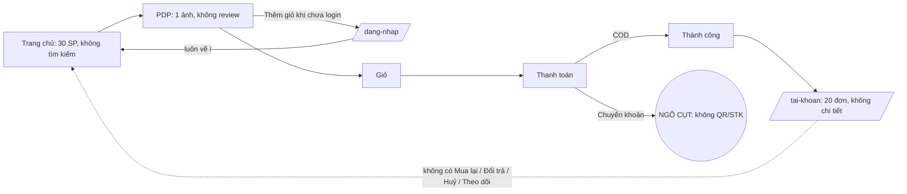

# A6 — Web (web shop · admin · cổng đối tác)

**Kết luận.** `apps/web` hiện là một web shop tối giản, một trang admin kiểu công cụ kỹ thuật và một cổng đối tác mới làm một nửa. Web shop còn xa mới ngang miniapp. Nó không có tìm kiếm, danh mục hay trang danh sách sản phẩm. Trang sản phẩm chỉ có một ảnh và không có đánh giá. Trang tài khoản gần như trống, không có nút "Mua lại". Khi khách chọn chuyển khoản thì bị kẹt vì không có mã QR. Admin có 17 tab xếp ngang và chủ yếu là các thao tác thêm/sửa/xoá rời rạc. Admin thiếu hẳn công cụ giữ chân khách: hồ sơ khách 360, phân khúc, cohort, chiến dịch, chu kỳ tiêu dùng. Nhiều thao tác liên quan đến tiền chạy mà không hỏi xác nhận. Lịch sử thao tác không xem được. Phân quyền chỉ có hai mức: toàn quyền hoặc không có gì. Chức năng quản trị lại bị chia ra ba nơi: web, miniapp và những thứ chỉ có trong API. Cổng đối tác đang cho CTV tự đổi trạng thái đơn và nhận tiền của khách trực tiếp. Tổng cộng có **7 lỗi P0** về tiền, kiểm duyệt sản phẩm và crash. Các lỗi này phải xử lý trước mọi đợt redesign. Không thấy lỗi N+1 ở các endpoint danh sách của admin đã kiểm, vì chúng đều nạp dữ liệu theo lô. Tuy vậy vẫn còn vài chỗ thiếu index và vài chỗ tải thừa dữ liệu. Về north-star, web hiện gần như không có cơ chế nào dẫn khách tới đơn thứ hai.

---

## Hiện trạng

### 1. Bản đồ route `apps/web` (12 `page.tsx` · 66 file · 12.542 dòng — lệnh ở mục 7)

| Route | Render | Truy cập | Nội dung chính | Ghi chú |
|---|---|---|---|---|
| `/` | SSR động (dùng `searchParams`) + fetch cache 300s | công khai | hero, 3 "trust pillar", chip nhãn theo `Product.brand`, lưới tối đa 30 SP | `apps/web/src/app/page.tsx:6-17`, `apps/web/src/lib/api.ts:48-49` |
| `/san-pham` (danh sách) | — | — | **không tồn tại** → 404 | chỉ có `app/san-pham/[slug]/page.tsx` |
| `/san-pham/[slug]` | ISR 300s | công khai; thêm giỏ phải đăng nhập | 1 ảnh, giá, chứng nhận, phân loại, số lượng, thêm giỏ, mô tả | `apps/web/src/app/san-pham/[slug]/page.tsx:8-88` |
| `/gio-hang` | client | Zalo | dòng giỏ, voucher, thanh freeship | `apps/web/src/app/gio-hang/page.tsx:18-180` |
| `/thanh-toan` | client | Zalo | địa chỉ (chỉ thêm mới), COD/CK, Điểm Xanh, thu gom tái chế | `apps/web/src/app/thanh-toan/page.tsx:32-272` |
| `/tai-khoan` | client, noindex | Zalo | tên, mã giới thiệu, điểm, ví, 20 đơn đầu | `apps/web/src/app/tai-khoan/page.tsx:19-104` |
| `/s/[slug]` | ISR 300s | công khai | gian hàng CTV/đối tác (+ subdomain rewrite) | `apps/web/src/app/s/[slug]/page.tsx`, `apps/web/src/middleware.ts:34-46` |
| `/brand/[slug]` | ISR 300s | công khai | trang nhãn | không có link nội bộ nào trỏ tới |
| `/dang-nhap`, `/dang-nhap/callback` | client | — | Zalo OAuth v4 + PKCE + state | `apps/web/src/lib/auth-context.tsx:102-148` |
| `/admin` | client, noindex | ADMIN | 17 tab | `apps/web/src/app/admin/page.tsx:112-130` |
| `/admin/pos` | client | STAFF/ADMIN | màn thu ngân tích điểm | `apps/web/src/app/admin/pos/page.tsx:21` |
| `/merchant` | client, noindex | DEALER/AFFILIATE/ADMIN | 5 tab | `apps/web/src/app/merchant/page.tsx:131, 249-274` |
| `sitemap.xml`, `robots.txt` | ISR 3600 | — | SP (lỗi, xem A6-14) + gian hàng | `apps/web/src/app/sitemap.ts`, `apps/web/src/app/robots.ts` |



### 2. Mức ngang nhau giữa web shop và miniapp (mua hàng + tài khoản)

| Năng lực | Miniapp | Web | Trạng thái |
|---|---|---|---|
| Duyệt / tìm / danh mục / sắp xếp | `/browse` (`apps/miniapp/src/components/app.tsx:156`) | chỉ có chip nhãn + 30 SP (`apps/web/src/app/page.tsx:14-17`) | Thiếu |
| PDP: gallery, đánh giá, yêu thích, đặt định kỳ, flash, mua ngay, chia sẻ | `apps/miniapp/src/pages/product-detail.tsx:19-38, 455` | 1 ảnh, không review (`apps/web/src/app/san-pham/[slug]/page.tsx:39-85`) | Thiếu |
| Giỏ + voucher | có | có (`apps/web/src/app/gio-hang/page.tsx:199-280`) | Tương đương (không có nhãn flash) |
| Checkout một phần / Mua ngay | `apps/miniapp/src/pages/checkout.tsx:86-101` | không | Thiếu |
| Phương thức thanh toán | COD, CK, Ví, Xu (`apps/miniapp/src/pages/checkout.tsx:250-262`) | COD, CK (`apps/web/src/app/thanh-toan/page.tsx:185-188`) | Thiếu Ví/Xu |
| Màn QR chuyển khoản | `/bank-payment/:code` (`apps/miniapp/src/pages/checkout.tsx:180-182`) | không | **P0** |
| Dùng Điểm Xanh / thu gom tái chế | có | có (`apps/web/src/app/thanh-toan/page.tsx:197-233`) | OK |
| Hoá đơn VAT, ghi chú đơn | `apps/miniapp/src/pages/checkout.tsx:44, 59` | không | Thiếu |
| Đơn: chi tiết, huỷ, đổi/trả, mua lại, theo dõi, trả tiền lại | `/order/:code` (`apps/miniapp/src/pages/order-detail.tsx:126`; `apps/miniapp/src/services/shop-api.ts:324-328`) | 20 đơn, không có chi tiết (`apps/web/src/app/tai-khoan/page.tsx:21, 74-87`) | Thiếu |
| Hạng, điểm danh, đổi quà, lịch sử điểm | `/loyalty` (`app.tsx:173`) | chỉ số dư điểm (`apps/web/src/app/tai-khoan/page.tsx:51`) | Thiếu |
| Ví / TubuXu | `/wallet` (`app.tsx:174`) | số dư ví; không có xu (`apps/web/src/lib/auth-context.tsx:13-21`) | Thiếu |
| Đặt định kỳ / địa chỉ / thông báo / yêu thích / giới thiệu | `app.tsx:175-189` | không (địa chỉ chỉ thêm được trong checkout) | Thiếu |
| Gian hàng CTV / trang nhãn | có ghi chú SP (`apps/miniapp/src/pages/storefront-view.tsx:93-96`) và nút theo dõi nhãn (`apps/miniapp/src/pages/brand-view.tsx:42-44`) | có trang, nhưng thiếu ghi chú và nút theo dõi; cả hai nơi đều chưa hiển thị combo | Có một phần |

### 3. Admin — năng lực hiện có (web)

| Tab (`apps/web/src/app/admin/page.tsx`) | Làm được gì | Giới hạn chính |
|---|---|---|
| Tổng quan KPI (377-523) | 4 thẻ số liệu cộng dồn từ trước tới nay, 6 đơn mới nhất, 2 banner cảnh báo | không lọc theo ngày, không có chỉ số giữ chân |
| Đại lý (241-361) | hàng chờ hồ sơ, xem CCCD, duyệt (nhập Tier ID tay) / từ chối | lý do từ chối cố định |
| Thưởng đại lý (`components/admin/dealer-claims-tab.tsx`) | duyệt, từ chối (bắt buộc lý do), đánh dấu đã trao | tốt |
| Đơn hàng (531-914) | tìm kiếm, lọc trạng thái, lọc thu gom, mở rộng dòng, chuyển trạng thái, xử lý thu gom, xác nhận CK cho đơn đại lý, xuất CSV | xem A6-19…A6-21 |
| Đổi / Trả (1006-1185) | hàng chờ, xem ảnh, duyệt / từ chối | hoàn tiền đơn COD hỏng (A6-06) |
| Hoàn tiền sàn ngoài (921-1004) | duyệt / từ chối (qua `prompt`) | bị cắt ở 100 dòng |
| Tích điểm tại quầy (`components/admin/pos-credits-tab.tsx`) + `/admin/pos` | sổ ghi 200 dòng, màn thu ngân chống bấm đôi | không huỷ được lượt tích sai |
| Người dùng (1189-1313) | danh sách 20 người/trang, cấp vai trò theo SĐT, xuất CSV (1 trang) | không có hồ sơ khách 360 |
| Cấu hình (1315-1377) | form Gomdon, form Loyalty, sửa JSON thô cho mọi khoá | xem A6-50 |
| Voucher (1389-1455) | **chỉ tạo mới**, phạm vi PUBLIC | không có danh sách, không sửa, không tắt |
| Nhãn hàng (1457-1730) | tạo, đăng/ẩn, xác minh, gán SP theo tên, KM, chương trình đại lý | SP hiện tối đa 20 |
| Duyệt SP đối tác (2668-2814) | duyệt / từ chối | **crash** (A6-07) |
| Flash Sale (1732-1875) | tạo đợt, bật/tắt, thêm item bằng variationId | nhập ID tay |
| FAQ, Content Kit, Academy, CSKH mẫu tin (1877-2666) | CRUD | Content Kit phải nhập Product ID tay |

**Chức năng quản trị nằm ngoài web admin:**
- Trong miniapp: nhân sự, ca làm, lương, đổi vỏ chai (`apps/miniapp/src/pages/admin.tsx:85-110`) và kiểm duyệt cộng đồng (`apps/miniapp/src/components/app.tsx:195`).
- Chỉ có trong API, không có UI ở đâu:
  - lịch sử trạng thái đơn (`apps/api/src/modules/admin/admin.controller.ts:301-304`);
  - nhập và xem lịch sử giá đại lý (331-340);
  - nhập số "đã bán" (343-355);
  - duyệt hiển thị đánh giá (`apps/api/src/modules/reviews/reviews.controller.ts:45-46`);
  - đồng bộ Pancake thủ công (`apps/api/src/modules/integrations/pancake/pancake.controller.ts:17-18`);
  - chấm công theo thời gian thực và checkout hộ (`apps/api/src/modules/staff/attendance/admin-attendance.controller.ts:17, 22`).

API có **102 route admin**, còn `admin-client.ts` khai 66 lời gọi `apiFetch` (lệnh ở mục 7). Riêng `importDealerPrices` và `importSoldExternal` đã khai nhưng không có UI nào gọi.

### 4. Admin — những gì một shop tập trung giữ chân khách cần nhưng CHƯA có

| Nhu cầu | Hiện có? | Bằng chứng |
|---|---|---|
| Hồ sơ khách 360 (đơn, điểm, xu, ví, hạng, định kỳ, ghi chú) | Không. Chỉ có bảng 5 cột; API không có `/admin/users/:id` | `apps/web/src/app/admin/page.tsx:1216-1226`; `apps/api/src/modules/admin/admin.controller.ts:253-256` |
| Phân khúc / cohort | Không | danh sách TABS `apps/web/src/app/admin/page.tsx:112-130` |
| Chiến dịch ZNS/OA có giới hạn tần suất | Không. `notify()` không giới hạn tần suất; mẫu tin không quản lý được | `apps/api/src/modules/notifications/notifications.service.ts:37-80`; `apps/api/prisma/schema.prisma:1996-2004` |
| Dashboard giữ chân (tỷ lệ mua lại 30 ngày, đơn/khách/tháng, LTV) | Không. KPI là tổng cộng dồn, gộp cả đơn đại lý | `apps/api/src/modules/admin/admin.service.ts:320-375` |
| Chu kỳ tiêu dùng theo SP | Không. Chỉ có 1 tham số toàn cục `reorder.default_cycle_days=60`, không được seed | `apps/api/src/modules/lifecycle/lifecycle.service.ts:44-46` |
| Cảnh báo tồn kho | Không (tìm `lowStock`/`stockAlert` = 0 kết quả) | lệnh ở mục 7 |
| Đổi trả / hoàn tiền | Có duyệt/từ chối; hoàn tiền COD hỏng; không có đổi hàng, không hoàn một phần | `apps/api/src/modules/orders/order-reversal.service.ts:50-68` |
| Ticket CSKH / hộp thư OA | Không. Chỉ có mẫu tin nhanh; `OaInboundMessage` không có UI | `apps/api/src/modules/cskh/cskh-admin.controller.ts:6-26`; `apps/api/prisma/schema.prisma:2209-2225` |
| Hộp cảnh báo vận hành (OPS_GOMDON_ALERT…) | Không có trên web; chỉ hiện trong miniapp | `apps/miniapp/src/pages/notifications.tsx:36-38` |
| Quản lý đặt định kỳ | Không | `apps/api/prisma/schema.prisma:2101-2124` (không có route admin) |
| Duyệt rút tiền (ví / CTV) | Không | `apps/api/src/modules/wallet/wallet.service.ts:170-184` |
| Chỉnh điểm/xu/ví thủ công, khoá tài khoản | Không (có `User.isBlocked` nhưng không có route) | `apps/api/prisma/schema.prisma:235` |
| Danh sách / tắt voucher | Không (cả API lẫn UI) | `apps/api/src/modules/admin/admin.controller.ts:325-328` |
| Quản lý sản phẩm (xem, ID, chu kỳ, hiển thị, SEO) | Không có tab | `apps/web/src/app/admin/page.tsx:112-130` |

### 5. Cổng đối tác `/merchant`

| Tab | Làm được gì | Vấn đề |
|---|---|---|
| Gian hàng & Subdomain (301-531) | tên, subdomain, màu, slogan, URL logo/bìa, đăng | không xoá được trường đã nhập (gửi `undefined`); subdomain không có hạ tầng (A6-35) |
| Tài khoản VietQR (533-655) | nhập STK nhận tiền trực tiếp | **đẩy tiền khách về TK CTV** (A6-03) |
| Kho hàng & Giao nhận (657-768) | địa chỉ tự do 3 cấp | hứa "tính phí ship" nhưng không có code làm việc đó (A6-35) |
| Quản lý Sản phẩm (771-1125) | đăng SP riêng (1 biến thể, ảnh bằng URL), gỡ SP bán lại | không thêm được SP bán lại, không sửa/xoá; SP "chờ duyệt" đã bán được luôn (A6-04) |
| Đơn hàng (1127-1303) | 20 đơn/trang, lọc 4 trạng thái, nút đóng gói → giao → **đã giao** | CTV tự chốt DELIVERED (A6-02); không có tổng tiền/COD/mã vận đơn; lộ thông tin cá nhân (A6-36) |

Hai trình chỉnh sửa cùng ghi vào một `Storefront`: miniapp dùng `storefront-builder.tsx` qua `/storefront/me`, web dùng `/merchant/store`. Hai đường này xử lý khác nhau khi xoá trường: `apps/api/src/modules/storefront/storefront.service.ts:139` đổi chuỗi rỗng thành `null`, còn `apps/api/src/modules/merchant/merchant.service.ts:154-169` thì không.

### 6. Kiểm tra N+1 và index trên API admin (mục 4 của brief)

| Endpoint | Có N+1? | Index dùng được | Nhận xét |
|---|---|---|---|
| `GET /admin/orders` (`admin.service.ts:383-410`) | Không (`include` nạp theo lô, sổ công nợ đại lý nạp 1 lượt) | lọc `status`: `@@index([status, createdAt])` `schema.prisma:856` ✓; lọc thu gom: `@@index([hasRecyclingPickup, gomdonStatus])` `:860` ✓ | Không lọc thì `ORDER BY createdAt` không có index riêng. Tìm kiếm dùng `ILIKE %…%` trên `code`, `gomdonPartnerCode`, `user.phone`, `user.fullName` (`admin-order-filter.ts:88-96`) mà không có trigram, nên sẽ quét toàn bảng |
| `GET /admin/users` (`admin.service.ts:256-269`) | Không | User chỉ có `@@index([referredById])` `schema.prisma:283` | `orderBy createdAt` và `count()` đều quét toàn bảng |
| `GET /admin/dealer-applications?status=` | Không | chỉ `@@index([userId])` `schema.prisma:1279` | lọc status + sort createdAt không có index |
| `GET /admin/return-requests?status=` (`admin.service.ts:44-86`) | Không (`withReturnContext` nạp theo lô) | `@@index([status])` `schema.prisma:1870` ✓ | ổn |
| `GET /admin/cashback/transactions?status=` (`cashback.service.ts:151-176`) | Không | `@@index([userId, status])` `schema.prisma:1238` ✗ khi chỉ lọc status | cắt ở 100 dòng mà không báo |
| `GET /admin/dealer-reward-claims` (`dealer.service.ts:790-820`) | Không | `@@index([status, createdAt])` `schema.prisma:515` ✓ | tốt |
| `GET /admin/loyalty/pos-credits?day=` (`loyalty.service.ts:1056-1076`) | Không | `(staffUserId, dayKey)`, `(memberId, dayKey)` `schema.prisma:956-957` ✗ khi chỉ lọc theo ngày | trần 200 dòng có báo trên UI |
| `GET /admin/dashboard/stats` | 11 truy vấn song song | — | `SUM(total)` cộng dồn từ trước tới nay (`admin.service.ts:339-342`), chi phí tăng tuyến tính theo số đơn |
| `GET /merchant/*` (`merchant.service.ts:12-23, 375-400`) | Không N+1 nhưng **tải thừa** | `storefrontSlug` `schema.prisma:853` ✓ | mọi request đều gọi `getOrCreateStore`, nạp toàn bộ collection + item + **toàn bộ cột product** (`product: true`); mở portal một lần nạp 3 lượt |
| Cron nhắc mua lại (`lifecycle.service.ts:49-114`) | **Có** (mỗi cặp user×variation: 1 `findUnique` + 1 lệnh ghi + `notify`) | — | có thêm lỗi "đói" hàng đợi (A6-31) |

### 7. Số liệu và lệnh kiểm chứng

```bash
find apps/web/src -type f | wc -l                                   # 66
find apps/web/src -type f \( -name "*.ts" -o -name "*.tsx" -o -name "*.css" \) | xargs wc -l   # 12542 total; admin/page.tsx 2833, merchant/page.tsx 1349
find apps/web/src/app -name page.tsx                                # 12 route
sed -n 112,130p apps/web/src/app/admin/page.tsx | grep -c "{ k: '"   # 17 tab
grep -c "<Route path=" apps/miniapp/src/components/app.tsx          # 42 route miniapp
# (chạy trong apps/api/prisma)
node -e "const s=require('fs').readFileSync('seed.ts','utf8');const m=s.match(/const PRODUCTS[\s\S]*?\n\];/);console.log((m[0].match(/\bslug:\s*'/g)||[]).length)"   # 44 SP seed
node -e "const s=require('fs').readFileSync('seed.ts','utf8');console.log(new Set([...s.matchAll(/\{\s*key:\s*'([a-z0-9_.]+)'/g)].map(m=>m[1])).size)"             # 104 khoá SystemConfig trong seed
# (chạy trong apps/api/src/modules) duyệt mọi *controller.ts, ghép @Controller('<base>') + @Get/@Post/@Put/@Patch/@Delete('<path>'), đếm path chứa segment "admin"
node -e "<walk *controller.ts; regex @Controller\(\s*'([^']*)'\s*\) + @(Get|Post|Put|Patch|Delete)\(\s*'?([^')]*)'?\s*\); filter /(^|\/)admin(\/|$)/>"   # 102 route admin
grep -c "apiFetch" apps/web/src/lib/admin-client.ts                 # 67 (66 lời gọi + 1 import)
grep -rnoE "\b(bg|text|border|from|via|to|ring|fill|stroke|accent|divide|outline)-(clay-800|leaf-300|leaf-500|leaf-800|primary-300|primary-500|primary-800)\b" --include=*.tsx apps/web/src | wc -l   # 19
node apps/web/node_modules/tailwindcss/lib/cli.js -c tailwind.config.ts -i src/app/globals.css -o <scratchpad>/web-tw.css
#   → .from-primary-300 / .via-leaf-800 / .text-leaf-800 / .text-clay-800 / .bg-leaf-500 … : 0 rule sinh ra
grep -rn "window.confirm\|window.prompt" apps/web/src/app apps/web/src/components | wc -l   # 9
grep -rn "onKeyDown\|keydown\|useHotkeys" apps/web/src | wc -l      # 0
grep -rn "ld+json\|canonical" apps/web/src | wc -l                  # 0
grep -rn "from 'next/image'" apps/web/src | wc -l                   # 0  (17 thẻ )
grep -c "^\s*test(" apps/e2e/tests/admin.spec.ts                    # 2 e2e cho web (chỉ tab Đại lý)
grep -rhn "^\s*test(\|^\s*it(" apps/web/src --include=*.spec.ts --include=*.spec.tsx | wc -l   # 135 unit test
grep -rn "paymentStatus: 'PAID'" apps/api/src/modules               # chỉ: dealer confirm, pancake BANK_TRANSFER, zalopay, gomdon-reconcile (điều kiện) — không có đường COD → PAID
grep -rn "payout\.\(update\|updateMany\|findMany\)" apps/api/src    # 0 — không có code nào xử lý Payout REQUESTED
grep -rn "lowStock\|low_stock\|stockAlert" apps/api/src            # 0
grep -rn "PENDING_PAYMENT" apps/api/src | grep -i "cron\|expire"    # chỉ 1 comment — không có cron hết hạn
```

**UNKNOWN**, chưa kiểm chứng được:
- vị trí pixel của CTA trên mobile 375px (chờ screenshot);
- trạng thái đối soát Pancake trên production;
- Zalo có chấp nhận `redirect_uri` động trên subdomain không;
- DNS wildcard `*.tubutree.com`;
- Pancake phản ứng thế nào với `variation_id` tổng hợp `MCH_…`;
- số đơn/khách thật trên production.

---

## Phát hiện

| ID | Mức | Bề mặt/Trang | Phát hiện | Bằng chứng | Đề xuất | Công | Tác động north-star |
|---|---|---|---|---|---|---|---|
| A6-01 | **P0** | `/thanh-toan`, `/tai-khoan` | Web cho chọn "Chuyển khoản ngân hàng", nhưng sau khi đặt đơn không hiện QR, STK, số tiền hay nội dung CK, và không có nút "Thanh toán ngay" ở đâu cả. API có sẵn `GET /payments/bank-qr/:code` mà web không gọi. Đơn nằm `PENDING_PAYMENT` và giữ tồn kho vô thời hạn, vì không có cron hết hạn. Đơn có thu gom tái chế thì chờ thanh toán mãi | `apps/web/src/app/thanh-toan/page.tsx:185-188, 127-153`; `apps/api/src/modules/integrations/payment/payment.controller.ts:30-34`; `apps/miniapp/src/pages/checkout.tsx:180-182`; `apps/api/src/modules/checkout/checkout.service.ts:134`; `apps/web/src/app/tai-khoan/page.tsx:74-87`; `apps/web/src/components/recycling-checkout.tsx:56-58` | Thêm trang `/don-hang/[code]/thanh-toan` hiện `qrImageUrl`, STK, số tiền, memo và nút sao chép, thăm dò `paymentStatus` định kỳ. Thêm "Thanh toán ngay" vào danh sách đơn. BE: cron huỷ `PENDING_PAYMENT` quá N giờ | M | Trực tiếp: khách không hoàn tất được đơn đầu tiên thì không bao giờ có đơn thứ hai |
| A6-02 | **P0** | `/merchant` → Đơn hàng | CTV (AFFILIATE) và đại lý tự bấm "Đã đóng gói → Bắt đầu giao → Đã giao" cho **mọi đơn gắn gian hàng của mình**, kể cả đơn do kho Tubu/Pancake giao. API còn nhận cả `CANCELLED`/`RETURNED`. Bảng chuyển trạng thái cho nhảy thẳng `PENDING_PAYMENT → DELIVERED`. Khi đơn sang DELIVERED, hệ thống khoá hoa hồng cho chính CTV đó, cộng điểm và thưởng giới thiệu. Đơn lệch với Pancake. UI còn dán nhãn "Chờ đóng gói · Cần xuất kho ngay" cho CTV | `apps/web/src/app/merchant/page.tsx:131, 227-234, 1255-1281`; `apps/api/src/modules/merchant/merchant.controller.ts:164-169, 178-181, 224-231`; `apps/api/src/modules/merchant/merchant.service.ts:375-400, 429-458`; `apps/api/src/modules/orders/order-transition.ts:20-36`; `apps/api/src/modules/orders/order-status.service.ts:116-119` | Chỉ cho đổi trạng thái khi merchant **là bên giao** (SP có `storefrontId` của họ, gian hàng loại MERCHANT). Bỏ quyền này với AFFILIATE. Merchant chỉ được `PACKED`/`SHIPPING` kèm mã vận đơn; `DELIVERED` phải đến từ hãng vận chuyển hoặc Pancake. Ẩn các nút này trên web | M | Gián tiếp: điểm và hoa hồng sai làm hỏng dữ liệu mua lại và niềm tin |
| A6-03 | **P0** | `/s/[slug]`, `/merchant` VietQR, API public | Trang gian hàng công khai hiện STK và QR "Thanh toán trực tiếp cho Đối tác" (không có số tiền, nội dung `DONHANG_<slug>`). API công khai trả về STK, địa chỉ kho và SĐT của CTV, tức là lộ thông tin cá nhân. `getBankQr` đẩy QR của đơn có `storefrontSlug` về TK của gian hàng. Web lại chỉ gắn `storefrontSlug` cho gian hàng **CTV**, tức đúng loại không nên thu tiền, còn đại lý MERCHANT thì không bao giờ được. Pancake đối soát theo TK của shop, nên đơn không bao giờ lên `PAID` | `apps/web/src/app/s/[slug]/page.tsx:191-229`; `apps/api/src/modules/storefront/storefront.service.ts:241-249`; `apps/api/src/modules/integrations/payment/bank-transfer.service.ts:7-9, 38-51`; `apps/web/src/app/merchant/page.tsx:581-584`; `apps/web/src/lib/storefront-context.ts:71-72`; `apps/miniapp/src/pages/storefront-builder.tsx:808-830` | Gỡ ngay khối VietQR trực tiếp. Bỏ các trường bank/kho/SĐT khỏi `getPublicBySlug`. `getBankQr` chỉ dùng TK shop. Nếu có marketplace thật thì cần thiết kế thu hộ và đối soát riêng (chủ shop quyết) | S (gỡ) / L (mô hình) | Gián tiếp: đơn không đối soát được thì khách bị gọi lại hoặc đơn bị huỷ, mất niềm tin mua lại |
| A6-04 | **P0** | Catalog công khai (web home, PDP, sitemap, giỏ), `/merchant` | SP do đối tác đăng được **bán ngay mà không cần duyệt**. SP merchant được tạo với `PENDING_REVIEW` + `isActive:true`, trong khi catalog công khai chỉ lọc `isActive`. Bị từ chối cũng không tắt `isActive`, nên SP vẫn bán. Chỉ trang gian hàng có lọc `APPROVED`. Form đăng SP còn điền sẵn "Thuần chay, Hữu cơ, Không thử nghiệm trên động vật". CTV (AFFILIATE) cũng đăng được. Portal lại hứa "kiểm duyệt trước khi hiển thị công khai" | `apps/api/src/modules/merchant/merchant.service.ts:238-240`; `apps/api/src/modules/catalog/catalog.service.ts:56, 102`; `apps/api/src/modules/admin/admin.service.ts:720-728`; `apps/api/src/modules/storefront/storefront.service.ts:258`; `apps/web/src/app/merchant/page.tsx:987, 1022` | Thêm `approvalStatus:'APPROVED'` vào mọi truy vấn công khai (list/detail/related/bought-together/for-you/suggest), vào `cart.addItem` và checkout. Khi reject thì đặt `isActive=false`. Bỏ chứng nhận điền sẵn | S | Bảo vệ niềm tin "thiên nhiên thật", điều kiện để khách quay lại |
| A6-05 | **P0** | Admin (không có), ví / CTV | **Rút tiền là ngõ cụt.** `wallet.withdraw` trừ ví ngay rồi tạo `Payout` `REQUESTED`; CTV rút cũng tạo `REQUESTED`. Không có endpoint hay UI nào (web hoặc miniapp) để xem, chuyển, đánh dấu `PAID` hoặc từ chối và hoàn ví. Tìm code cập nhật payout được 0 kết quả | `apps/api/src/modules/wallet/wallet.service.ts:170-184`; `apps/api/src/modules/affiliate/affiliate.service.ts:647`; `apps/api/prisma/schema.prisma:1154-1175`; `apps/web/src/app/admin/page.tsx:112-130` | Làm hàng chờ "Rút tiền" (lọc, xem STK, xuất file chuyển khoản hàng loạt, đánh dấu đã chuyển kèm mã GD, từ chối và hoàn ví), có audit và thông báo cho người rút | M | Trực tiếp với CTV: rút tiền chậm hay treo thì CTV bỏ đi, mất kênh kéo đơn lặp |
| A6-06 | **P0** | Admin → Đổi/Trả | Nút "Duyệt hoàn tiền" và dòng giải thích "Duyệt = hoàn tiền đúng kênh" **không hoàn tiền cho đơn COD**. `reverseFinancials` chỉ hoàn khi `paymentStatus` là `PAID`, nhưng không có đường code nào lật COD sang `PAID` khi giao; admin cũng đã bỏ việc ép `PAID` khi DELIVERED. Đơn CK chưa đối soát cũng bị như vậy. Khách vẫn nhận thông báo `RETURN_APPROVED` | `apps/web/src/app/admin/page.tsx:1040-1042, 1156-1162`; `apps/api/src/modules/orders/order-reversal.service.ts:50-68` (chú thích 57); `apps/api/src/modules/admin/admin.service.ts:150, 417-419`; `apps/api/src/modules/integrations/pancake/pancake.processor.ts:159-163`; lệnh grep ở mục 7 | BE: ghi `PAID` cho COD khi DELIVERED (hoặc theo đối soát COD của Pancake). Duyệt trả hàng phải hiện số tiền **thực hoàn** và kênh hoàn; nếu 0đ thì chặn lại, bắt nhập cách hoàn tay | S–M | Trực tiếp: trả hàng mà mất tiền thì khách gần như chắc chắn không mua lại |
| A6-07 | **P0** | Admin → Duyệt SP đối tác | Tab crash. API trả `{data, meta}` nhưng web khai kiểu là mảng rồi gọi `q.data?.map`, gây `TypeError`, cả trang rơi vào `app/error.tsx`. Tiêu đề luôn hiện "(0)". Không có test nào | `apps/web/src/lib/admin-client.ts:607-608`; `apps/web/src/app/admin/page.tsx:2669-2693`; `apps/api/src/modules/admin/admin.service.ts:694-710`; `apps/api/src/common/pagination.ts:25-27` | Dùng `asPage()` và "Tải thêm" như tab Đại lý; sửa lại type `AdminPendingProduct` cho khớp Prisma; thêm test | S | Không trực tiếp |
| A6-08 | P1 | Web shop (home) | Không có trang danh sách, tìm kiếm, danh mục, sắp xếp hay phân trang. Home chỉ lấy 30 SP (seed có 44) mà ghi "30 sản phẩm đang bán". API đã hỗ trợ `q/category/segment/sort/page`, `/search/suggest`, `/categories` | `apps/web/src/lib/api.ts:48-49`; `apps/web/src/app/page.tsx:14-17, 105`; `apps/api/src/modules/catalog/catalog.controller.ts:13-60`; `apps/api/src/modules/catalog/dto/product-query.dto.ts:4-12` | Tạo `/san-pham` SSR có lọc danh mục/nhu cầu/nhãn, sắp xếp, phân trang; thêm ô tìm kiếm ở header dùng suggest | M | Trực tiếp: khách cũ tìm lại đúng SP đã dùng là đường mua lại số 1 trên web |
| A6-09 | P1 | PDP `/san-pham/[slug]` | Chỉ có thumbnail dù có `images[]`. Không đánh giá (API trả 20 review), không giá gạch/%, không flash, không "Mua ngay", không "Đặt định kỳ", không yêu thích, không SP liên quan/mua kèm (API có). CTA nằm trong luồng, không dính khi cuộn trên mobile (pixel UNKNOWN) | `apps/web/src/app/san-pham/[slug]/page.tsx:32-85`; `apps/web/src/lib/api.ts:28-41`; `apps/api/src/modules/catalog/catalog.service.ts:94-99`; `apps/api/src/modules/catalog/catalog.controller.ts:32-42`; `apps/web/src/components/add-to-cart.tsx:90-115`; `apps/miniapp/src/pages/product-detail.tsx:19-36, 455` | Làm lại PDP: gallery, khối đánh giá, "Đặt định kỳ −X%", "Thường mua cùng", thanh CTA dính trên mobile | M–L | Trực tiếp: đặt định kỳ và mua kèm là đòn bẩy trực tiếp cho đơn lặp |
| A6-10 | P1 | `/tai-khoan` | Chỉ có tên, mã giới thiệu, số điểm, số dư ví và 20 đơn đầu. Đơn không mở được chi tiết; không huỷ, đổi/trả, theo dõi hay **"Mua lại"** dù API có. Không có xu, hạng, lịch sử điểm, đổi quà, địa chỉ, voucher, định kỳ, yêu thích, thông báo. Số dư lấy lúc đăng nhập, không cập nhật sau khi đặt đơn. Chip trạng thái màu xanh cho mọi trạng thái | `apps/web/src/app/tai-khoan/page.tsx:21, 44-58, 74-87`; `apps/web/src/lib/shop-client.ts:139-140`; `apps/api/src/modules/orders/orders.controller.ts:23-68`; `apps/web/src/lib/auth-context.tsx:13-21`; `apps/web/src/app/thanh-toan/page.tsx:98-101` | Làm "Tài khoản" đủ bộ: Đơn hàng (chi tiết, mua lại 1 chạm, trả tiền lại, đổi trả), Điểm/Xu/Hạng, Định kỳ, Địa chỉ, Voucher | L | Trực tiếp: "Mua lại" là hành động north-star, hiện web không có |
| A6-11 | P1 | `/thanh-toan` | Không có WALLET/XU (xu là tiền tiêu trong app, nên phần thưởng không dùng được trên web). Không ghi chú, không hoá đơn VAT, không checkout một phần hay "Mua ngay", dù DTO đều hỗ trợ | `apps/web/src/app/thanh-toan/page.tsx:185-188`; `apps/api/src/modules/checkout/dto/checkout.dto.ts:30, 40, 50-56`; `apps/miniapp/src/pages/checkout.tsx:44, 59, 250-262` | Thêm Ví/Xu (tự tắt khi không đủ), ghi chú, VAT, `itemIds` | M | Trực tiếp: tiêu được xu và ví khép kín vòng thưởng → mua lại |
| A6-12 | P1 | Đăng nhập | Chỉ có Zalo OAuth, không có mua không cần đăng nhập. Đăng nhập xong **luôn về `/`**, mất ngữ cảnh SP, giỏ hay admin. Tài khoản mới tạo từ link `?ref=` **không gửi `referralCode`** dù API hỗ trợ, nên mất `referredById` và mất thưởng giới thiệu | `apps/web/src/components/add-to-cart.tsx:42-44`; `apps/web/src/app/dang-nhap/page.tsx:15`; `apps/web/src/app/dang-nhap/callback/page.tsx:29`; `apps/web/src/lib/auth-context.tsx:129-133`; `apps/api/src/modules/auth/dto/zalo-oauth.dto.ts:14-17`; `apps/api/src/modules/auth/auth.service.ts:168-185` | Thêm `?next=` và quay lại đúng trang sau đăng nhập; gửi `referralCode` từ sessionStorage; chủ shop quyết có cho mua không cần đăng nhập (SĐT+OTP) không | S / M | Trực tiếp: vòng giới thiệu là nguồn khách mới cho CTV |
| A6-13 | P1 | Phiên web (mọi trang) | Mỗi lần tải trang đều gọi `/auth/refresh`, bị giới hạn 5 lần/phút/IP. **Bất kỳ lỗi nào (kể cả 429)** cũng xoá cờ phiên, nên các tab sau coi như chưa đăng nhập và phải đăng nhập lại qua Zalo. Admin và thu ngân dùng chung IP văn phòng/cửa hàng dễ chạm trần; trần chung toàn hệ thống là 60 req/phút/IP | `apps/api/src/modules/auth/auth.controller.ts:92-93`; `apps/api/src/app.module.ts:57`; `apps/web/src/lib/auth-context.tsx:87-99`; `apps/web/src/lib/client-api.ts:60-79` | Không xoá cờ khi gặp 429/5xx mà thử lại có giãn cách; giới hạn refresh theo cookie/user thay vì theo IP; nới trần cho ADMIN/STAFF | S | Không trực tiếp (vận hành) |
| A6-14 | P1 | SEO `sitemap.xml` | **Sitemap không có sản phẩm nào.** `getProducts({limit:'200'})` vượt `@Max(100)`; ValidationPipe `forbidNonWhitelisted` trả 400, lỗi bị nuốt và trả về `[]` | `apps/web/src/app/sitemap.ts:21`; `apps/api/src/common/pagination.ts:13-17`; `apps/api/src/main.ts:62-67`; `apps/web/src/lib/api.ts:51-52` | Lấy theo trang, `limit=100`, lặp tới hết; thêm `lastModified`; thêm `/brand/*` | S | Gián tiếp: khách cũ tìm lại SP qua Google |
| A6-15 | P1 | SEO / domain | `SITE_URL` mặc định là `https://shop.tubutree.com`, không nơi nào đặt `NEXT_PUBLIC_SITE_URL` (Dockerfile cũng không khai ARG), trong khi hạ tầng phục vụ `app.`. Vì vậy canonical, sitemap, robots và OG trỏ về một host không phục vụ. Middleware lại coi `shop` là subdomain gian hàng: trỏ `shop.` vào web thì trang chủ bị rewrite sang `/s/shop`. `NEXT_PUBLIC_APP_URL` được truyền vào nhưng không ai đọc | `apps/web/src/lib/site.ts:7`; `apps/web/src/middleware.ts:19-46`; `Caddyfile:6-16`; `docker-compose.vietnix.yml:77-79`; `apps/web/Dockerfile:21-24` | Chốt một domain; khai ARG/ENV `NEXT_PUBLIC_SITE_URL`; thêm `shop` (và domain chính) vào danh sách subdomain hệ thống của middleware | S | Không trực tiếp |
| A6-16 | P1 | SEO toàn site | Không có JSON-LD (Product/Offer/AggregateRating/Breadcrumb/Organization), không có canonical (link `?ref=` của CTV và `?brand=` sinh URL trùng). `/brand/[slug]` mồ côi: không có link nội bộ, không có trong sitemap. `Product.metaTitle/metaDesc` bị bỏ qua. Không có favicon/OG mặc định (không có `public/`) | lệnh grep ở mục 7 (0 kết quả); `apps/web/src/app/layout.tsx:8-14`; `apps/web/src/app/san-pham/[slug]/page.tsx:10-25`; `apps/web/src/app/sitemap.ts:16-42`; `apps/api/prisma/schema.prisma:364-365`; `apps/web/Dockerfile:35` | Thêm `alternates.canonical`, JSON-LD cho PDP/gian hàng/nhãn, dùng metaTitle/metaDesc, thêm icon/OG mặc định, link chip nhãn sang `/brand/[slug]` | M | Gián tiếp |
| A6-17 | P1 | Trust / pháp lý | Web **không có footer**: không tên doanh nghiệp, MST, địa chỉ, hotline, chính sách đổi trả/bảo mật/vận chuyển/thanh toán, không logo Bộ Công Thương (cần pháp chế xác nhận nghĩa vụ). Huy hiệu ✓ "đã xác minh" gắn cho **mọi** gian hàng CTV. Có các tuyên bố tuyệt đối: "100% Thuần Chay & Lành Tính — Đạt chuẩn kiểm định", "100% NGUYÊN BẢN VIỆT NAM", "100% Chính hãng" | `apps/web/src/app/layout.tsx:16-28`; `apps/web/src/app/page.tsx:28-31, 66-99`; `apps/web/src/app/s/[slug]/page.tsx:118-121, 232-250` | Thêm footer và các trang chính sách; chỉ gắn huy hiệu theo dữ liệu thật (`isVerified`); đưa các tuyên bố cho chủ shop duyệt | M | Gián tiếp: khách chỉ dám mua lại khi thấy shop đáng tin |
| A6-18 | P1 | Admin — cấu trúc | 17 tab xếp ngang trong khung `max-w-5xl`, không nhóm, không sidebar. Quản trị bị chia 3 nơi: web, miniapp (nhân sự, ca, lương, vỏ chai, cộng đồng) và **chỉ API** (lịch sử trạng thái đơn, giá đại lý, "đã bán", kiểm duyệt đánh giá, đồng bộ Pancake, chấm công theo thời gian thực) | `apps/web/src/app/admin/page.tsx:94-130, 198-217`; `apps/miniapp/src/pages/admin.tsx:85-110`; `apps/api/src/modules/admin/admin.controller.ts:301-304, 331-355`; `apps/api/src/modules/reviews/reviews.controller.ts:45-46`; `apps/web/src/lib/admin-client.ts:222-231` | Sidebar kiểu Shopify: Đơn hàng · Khách hàng · Sản phẩm · Marketing · Đối tác (CTV/Đại lý/Nhãn) · Nội dung · Cửa hàng/POS · Nhân sự · Cài đặt; gom các chức năng miniapp-admin và chỉ-API về đây | L | Gián tiếp: xử lý đơn và đổi trả nhanh hơn |
| A6-19 | P1 | Admin — danh sách | Không lọc theo ngày, phương thức TT, loại đơn (RETAIL/DEALER), gian hàng/CTV. Không sắp xếp, không thao tác hàng loạt, không lưu bộ lọc (URL chỉ giữ `tab`/`recycling`), không phím tắt (0 handler). **"Xuất CSV" chỉ xuất trang đang xem (20 dòng)**, cả với đơn lẫn người dùng | `apps/web/src/app/admin/page.tsx:139-157, 577-633, 625, 1203, 682-883`; `apps/web/src/lib/admin-client.ts:245-250` | Bảng dữ liệu chuẩn: bộ lọc gộp, lưu bộ lọc trên URL, chọn nhiều + thao tác hàng loạt (đóng gói/in/xuất), xuất toàn bộ theo bộ lọc (BE stream) | M | Gián tiếp |
| A6-20 | P1 | Admin + web | Cắt bớt mà không báo: hoàn tiền sàn ngoài tối đa 100 dòng; SP của một nhãn tối đa 20 (API mặc định `take 20`, không có meta); `/tai-khoan` 20 đơn; home 30 SP | `apps/api/src/modules/cashback/cashback.service.ts:151-155`; `apps/web/src/app/admin/page.tsx:925-1001, 1584`; `apps/api/src/modules/brand/brand.service.ts:282-291`; `apps/api/src/modules/brand/brand-admin.controller.ts:34-35`; `apps/web/src/lib/shop-client.ts:139-140` | Trả `{data, meta}` kèm phân trang hoặc "Tải thêm" ở mọi hàng chờ; hiện "x/tổng" | S | Gián tiếp |
| A6-21 | P1 | Admin → chi tiết đơn | Dòng mở rộng không có địa chỉ giao hàng, SĐT người nhận, phần tính tiền (tạm tính, giảm, điểm, phí ship, mã voucher), gian hàng/CTV ghi nhận, lịch sử trạng thái (API có) hay link Pancake. Nút "Xác nhận" hiện cả khi đơn đang `PACKED/SHIPPING/RETURNED` (chuyển lùi nên API từ chối) | `apps/web/src/app/admin/page.tsx:753-873, 806`; `apps/web/src/lib/admin-client.ts:40-80`; `apps/api/src/modules/admin/admin.controller.ts:301-304` | Trang/ngăn kéo chi tiết đơn: khách, địa chỉ, tiền, dòng thời gian (`status-history`), thao tác hợp lệ theo `ORDER_TRANSITIONS` | M | Gián tiếp |
| A6-22 | P1 | Admin — thao tác nguy hiểm | Không hỏi xác nhận khi: duyệt hoàn tiền đổi trả; duyệt hoàn tiền sàn ngoài; duyệt/từ chối đại lý; bật/tắt flash sale **đang chạy**; xoá item flash; xoá KM, chương trình đại lý, FAQ, mẫu tin, khoá học, bài học; gỡ SP khỏi nhãn; duyệt SP đối tác. Cấu hình JSON thô (kể cả `payment.bank_account_no` — nơi mọi khách chuyển tiền tới) lưu bằng một chạm, không so sánh trước/sau. Toàn web chỉ có 9 hộp `window.confirm/prompt` gốc | `apps/web/src/app/admin/page.tsx:347-355, 975-981, 1156-1169, 1589, 1602, 1707, 1841, 1855, 2000, 2176, 2516, 2635, 2749-2755, 1362-1372`; `apps/api/prisma/seed.ts:133-136` | Hộp thoại xác nhận của design system, nêu rõ số tiền/hậu quả; khoá cấu hình tiền sau bước nhập lại và so sánh trước/sau; thêm hoàn tác cho thao tác xoá nội dung | S–M | Không trực tiếp |
| A6-23 | P1 | Admin — lịch sử thao tác | Có ghi mà không xem được: `OrderStatusHistory` có endpoint nhưng không có UI; `SystemConfigHistory` được ghi nhưng không có đường đọc; lịch sử giá đại lý không có UI; đổi vai trò chỉ ghi log ứng dụng | `apps/api/src/modules/admin/admin.controller.ts:301-304, 337-340`; `apps/api/src/modules/system-config/system-config.service.ts:111`; `apps/api/src/modules/admin/admin.service.ts:316`; `apps/api/prisma/schema.prisma:2078-2088` | Hiện dòng thời gian trên đơn và khách; thêm trang "Nhật ký quản trị" (ai, làm gì, trước/sau), gồm cả config | M | Không trực tiếp |
| A6-24 | P1 | Admin — phân quyền | Web admin chỉ có mức toàn quyền ADMIN; STAFF chỉ vào được `/admin/pos`. Không có vai trò CSKH, kho, kế toán, marketing, nên nhân viên xử lý đổi trả buộc phải có quyền sửa cả STK nhận tiền. STAFF vào `/admin` thì gặp ngõ cụt, không có link sang POS | `apps/web/src/app/admin/page.tsx:194-195`; `apps/web/src/app/admin/pos/page.tsx:21`; `apps/api/src/modules/admin/admin.controller.ts:220`; `apps/api/prisma/schema.prisma:19-30` | Phân quyền theo tác vụ (orders.read/write, returns.approve, config.payment…); menu hiện theo quyền | L | Không trực tiếp |
| A6-25 | P1 | Admin → Voucher | Chỉ tạo được; không có danh sách, sửa, tắt hay số lượt dùng (API cũng không có). Phạm vi cố định PUBLIC, dù API hỗ trợ TIER/USER_GROUP. Nút tạo không khoá khi đang gửi; lỗi hiển thị màu xanh | `apps/web/src/app/admin/page.tsx:1389-1455` (1396, 1419, 1451-1452); `apps/api/src/modules/admin/admin.controller.ts:111-135, 325-328` | Thêm màn danh sách voucher (trạng thái, lượt dùng, doanh thu), tắt/sửa, nhắm theo hạng, phân khúc hay cá nhân | M | Trực tiếp: voucher nhắm đúng người là công cụ kéo khách quay lại chính |
| A6-26 | P1 | Admin → Flash Sale, Content Kit | Bắt nhập **Variation ID / Product ID** thô với gợi ý "lấy từ trang quản lý sản phẩm", nhưng admin **không có trang sản phẩm**. Danh sách SP của nhãn chỉ hiện tên, không có ID. Item flash hiện `Variation <id>` thay vì tên SP | `apps/web/src/app/admin/page.tsx:1862-1870, 1853, 2226-2245, 1586-1590, 112-130` | Tab Sản phẩm (tìm kiếm, biến thể, tồn kho, trạng thái, SEO, chu kỳ); dùng ô chọn SP có tìm kiếm thay cho nhập ID | M | Gián tiếp: flash sale và nội dung CTV kéo khách quay lại |
| A6-27 | P1 | Admin — module còn thiếu | Không quản lý được: đặt định kỳ (Subscription), hiển thị đánh giá (API có), chỉnh điểm/xu/ví để bù cho khách, khoá tài khoản (`isBlocked`), hàng chờ hoá đơn VAT | `apps/api/prisma/schema.prisma:2101-2124, 235`; `apps/api/src/modules/reviews/reviews.controller.ts:45-46`; `apps/api/src/modules/admin/admin.controller.ts:220-371` | Thêm các module này; riêng đặt định kỳ cần xem lịch chạy, lần lỗi, tạm dừng/tiếp tục | M–L | Trực tiếp: đặt định kỳ lỗi mà không ai thấy thì đơn lặp rơi mất |
| A6-28 | P1 | Admin → Tổng quan | Không có hồ sơ khách 360, phân khúc, cohort, tỷ lệ mua lại 30 ngày, đơn/khách/tháng, LTV. KPI "Doanh thu" là `SUM(total)` cộng dồn từ trước tới nay, gồm cả đơn chưa giao và đơn **đại lý/công nợ**; không chọn được khoảng thời gian | `apps/api/src/modules/admin/admin.service.ts:320-375` (339-342); `apps/web/src/app/admin/page.tsx:423-462, 1216-1226` | Làm cùng dự án con 2 (analytics): dashboard north-star, cohort theo tháng mua đầu, trang khách 360 | L | **Trực tiếp**: không đo được thì không cải thiện được |
| A6-29 | P1 | Admin — chiến dịch | Không có công cụ gửi ZNS/OA theo phân khúc. `notify()` không giới hạn tần suất, không giờ yên lặng, không lưu tuỳ chọn của người dùng. Không sửa được `NotificationTemplate` và không xem được `NotificationLog` (gửi lỗi) | `apps/api/src/modules/notifications/notifications.service.ts:37-80`; `apps/api/prisma/schema.prisma:1996-2017` | Công cụ chiến dịch: chọn phân khúc → mẫu ZNS/OA → giới hạn tần suất (vd ≤2/tuần/khách) → lịch gửi → theo dõi hiệu quả | L | **Trực tiếp**: kênh để kích hoạt đơn thứ hai |
| A6-30 | P1 | Admin — chu kỳ tiêu dùng | Nhắc mua lại dùng **một** chu kỳ toàn cục 60 ngày × 0,85 cho mọi SP (cà phê, bỉm, nước giặt, mỹ phẩm). Khoá này **không được seed**, nên không hiện trong tab Cấu hình, mà tab này lại không cho tạo khoá mới. Nhắc chỉ gửi INAPP, không qua ZNS | `apps/api/src/modules/lifecycle/lifecycle.service.ts:44-46`; `apps/api/prisma/seed.ts:639`; `apps/web/src/app/admin/page.tsx:1329-1331`; `apps/api/prisma/schema.prisma:340-395` (không có trường chu kỳ) | Thêm `Variation.consumptionDays` (có thể gợi ý từ dữ liệu mua lại thực tế); UI sửa hàng loạt; nhắc qua ZNS/OA có giới hạn tần suất | M | **Trực tiếp**: nhắc đúng thời điểm hết hàng là đòn bẩy mua lại mạnh nhất cho hàng tiêu dùng |
| A6-31 | P1 | Cron nhắc mua lại (liên khu vực BE) | SQL `GROUP BY … HAVING MAX(createdAt) <= ngưỡng LIMIT 500` không có `ORDER BY`, không loại các cặp đã nhắc, không giới hạn tuổi. Khi đã có ≥500 cặp (user×variation) cũ và đã nhắc, chúng chiếm hết 500 chỗ mỗi ngày và **không ai được nhắc nữa**. Thêm lỗi N+1 (3 truy vấn cho mỗi cặp) | `apps/api/src/modules/lifecycle/lifecycle.service.ts:49-59, 64-68, 76-114` | Lọc sẵn trong SQL: chưa nhắc sau `lastOrderAt`, trong khoảng [chu kỳ×ratio, chu kỳ×3], `ORDER BY lastOrderAt`; ghi theo lô | S | **Trực tiếp** |
| A6-32 | P1 | Admin — CSKH và cảnh báo | Không có hộp thư hay ticket CSKH: chỉ có mẫu trả lời nhanh, tin OA không khớp mẫu (`SKIPPED`) không ai thấy. Cảnh báo vận hành `OPS_*` và yêu cầu thưởng đại lý gửi dưới dạng thông báo in-app, **chỉ hiện trong miniapp**; web chỉ có 2 banner đếm số | `apps/api/src/modules/cskh/cskh-admin.controller.ts:6-26`; `apps/api/prisma/schema.prisma:2209-2225`; `apps/miniapp/src/pages/notifications.tsx:36-38`; `apps/web/src/app/admin/page.tsx:398-421` | Hộp thư OA gắn với hồ sơ khách 360 (SLA, người phụ trách, trạng thái); biểu tượng chuông cảnh báo vận hành trong web admin | M | Trực tiếp: trả lời nhanh giữ được khách sắp rời |
| A6-33 | P1 | Admin → Đơn CK bán lẻ | Chỉ đơn **đại lý** mới có "Xác nhận đã nhận chuyển khoản". Với đơn CK bán lẻ, "Xác nhận" chỉ đổi status mà `paymentStatus` vẫn `UNPAID`. Nếu Pancake chưa đối soát (prod: UNKNOWN), đơn không bao giờ `PAID`, huỷ/trả không hoàn tiền và thu gom không được đặt lịch | `apps/web/src/components/admin/dealer-payment-panel.tsx:19-29`; `apps/web/src/app/admin/page.tsx:806-814`; `apps/api/src/modules/admin/admin.service.ts:417-419`; `apps/api/src/modules/orders/order-reversal.service.ts:64-68` | Làm chung một "Xác nhận thanh toán" cho mọi đơn CK (có mã GD, audit) cùng hàng chờ "Chờ thanh toán" | S–M | Gián tiếp |
| A6-34 | P1 | `/merchant` — chức năng | Không thêm được SP bán lại (`addResellProduct` được import nhưng không dùng). SP riêng không sửa, xoá, cập nhật tồn kho hay giá; chỉ 1 biến thể; ảnh bằng URL. Bảng đơn **không có tổng tiền/COD/phương thức TT** (`PAYMENT_METHOD_LABELS` import nhưng không dùng), không nhập được mã vận đơn, bộ lọc thiếu `PENDING_PAYMENT/CANCELLED/RETURNED`. Không xoá được trường (gửi `undefined`) | `apps/web/src/app/merchant/page.tsx:34, 46, 326-334, 771-1125, 1173-1199`; `apps/api/src/modules/merchant/merchant.service.ts:151-169, 319-354` | Chốt phạm vi portal theo A6-02/03. Nếu giữ cho MERCHANT: CRUD SP đầy đủ, chọn SP bán lại, bảng đơn có tiền/COD/mã vận đơn | M | Gián tiếp |
| A6-35 | P1 | `/merchant`, `/s/[slug]` | Portal hứa sai. "Địa chỉ kho… dùng để tính phí ship… in trên vận đơn" không đúng, vì phí ship chỉ tính theo subtotal và hạng. Subdomain `https://{sub}.tubutree.com` được hiển thị và cổ vũ dùng, nhưng hạ tầng chỉ có `app.`/`api.`; đăng nhập Zalo trên subdomain dùng `redirect_uri` theo origin (có được Zalo chấp nhận không: UNKNOWN); header `x-tenant-subdomain` được set mà không ai đọc | `apps/web/src/app/merchant/page.tsx:177-189, 352-364, 692-695`; `apps/api/src/modules/checkout/checkout.service.ts:466-469`; `Caddyfile:6-16`; `apps/web/src/lib/auth-context.tsx:111`; `apps/web/src/middleware.ts:36` | Sửa lại lời hứa ngay; subdomain chỉ bật khi đã có DNS/SSL wildcard và callback OAuth | S | Không trực tiếp |
| A6-36 | P1 | `/merchant` → Đơn hàng | CTV thấy họ tên, SĐT, **địa chỉ đầy đủ** của mọi khách có đơn gắn gian hàng, kể cả khách gắn qua "chạm" 3 ngày mà có thể không biết mình đang mua qua CTV. API trả nguyên bản ghi `Order` (kể cả `invoiceRequest` có MST/email công ty, `note`, `idempotencyKey`) | `apps/api/src/modules/merchant/merchant.service.ts:404-427`; `apps/web/src/app/merchant/page.tsx:1212-1231`; `apps/api/src/modules/checkout/checkout.service.ts:103-110` | Chỉ `select` đúng các trường bên giao cần; với CTV thì che SĐT/địa chỉ (chủ shop quyết) | S | Gián tiếp (quyền riêng tư → niềm tin) |
| A6-37 | P1 | Bảo mật phiên web | CORS cho phép gửi kèm credentials từ `tubutree.com`, nơi **WordPress đang chạy riêng**, và từ mọi `*.tubutree.com`, kể cả `http`. Lớp chống CSRF của `/auth/refresh` chỉ dựa vào header `x-client` cộng allowlist. Cookie `SameSite=lax` và cùng site, nên một lỗ XSS hay tài khoản bị chiếm trên WordPress là đủ để lấy access token của admin đang đăng nhập web | `apps/api/src/main.ts:27, 36-44, 48`; `apps/api/src/modules/auth/refresh-cookie.ts:26-36, 66`; `docs/2026-09-08-review-progress.md:722` | Allowlist chính xác (`https://app.tubutree.com`), bỏ domain gốc, bỏ `http`; cân nhắc token CSRF riêng cho refresh | S | Không trực tiếp |
| A6-38 | P2 | Design tokens (toàn web) | Có 19 lớp dùng sắc độ không tồn tại (`leaf-800/500/300`, `primary-300/500/800`, `clay-800`); đã biên dịch Tailwind và xác nhận chúng sinh ra 0 rule. Tiêu đề hero "Sinh Học Thuần Khiết" có gradient **bắt đầu từ `leaf-900` kế thừa**, nên chữ gần như chìm vào nền xanh đậm. Admin và merchant dùng màu mặc định `green/emerald/indigo/purple/blue`. Font "Be Vietnam Pro" được khai nhưng không tải | `apps/web/tailwind.config.ts:11-44`; `apps/web/src/app/page.tsx:22-35, 58`; `apps/web/src/app/merchant/page.tsx:348, 441, 1259-1277`; `apps/web/src/app/admin/page.tsx:211`; `apps/web/src/app/layout.tsx:1-29` | Làm trong Design System v2: bảng token đủ bậc, lint cấm class ngoài token, tải `next/font` | S | Không trực tiếp |
| A6-39 | P2 | Hiệu năng | Không dùng `next/image` (17 thẻ ``, ảnh Pancake kích thước gốc, lazy cả hàng đầu). Home đọc `searchParams` nên render động mỗi request dù khai `revalidate=300`. Mỗi lần tải trang tốn một lượt `/auth/refresh` | `apps/web/src/components/product-card.tsx:20-26`; `apps/web/src/app/page.tsx:6-17`; `apps/web/src/lib/auth-context.tsx:87` | Allowlist host ảnh + `next/image`; tách bộ lọc home sang `/san-pham`; ưu tiên tải ảnh hàng đầu | M | Gián tiếp (tốc độ → chuyển đổi) |
| A6-40 | P2 | `/gio-hang` | Dòng SP không link về PDP. Nút "+" vẫn gửi request khi đã chạm tồn kho. Không hiện nhãn flash (API có `isFlash`), hết hàng hay giá đổi. Chip voucher chỉ hiện mã, không hiện giá trị. Xoá không hoàn tác được. Nút ± chỉ khoảng 28px | `apps/web/src/app/gio-hang/page.tsx:99-149, 124, 256-271`; `apps/web/src/lib/shop-client.ts:5-16`; `apps/api/src/modules/cart/cart.service.ts:34-58` | Làm lại dòng giỏ theo DS v2; hiện giá trị voucher và gợi ý "đủ điều kiện" | S | Gián tiếp |
| A6-41 | P2 | `/thanh-toan` | Không hiện dòng combo (quote có `comboDiscount`), nên các dòng cộng lại không ra tổng. `PRICE_CHANGED` hiện nguyên chữ tiếng Anh. Idempotency-Key không đổi sau lỗi (miniapp thì có). Địa chỉ hiện ", ," vì `district` rỗng. Không sửa, xoá hay đặt mặc định địa chỉ. Nút Đặt hàng không dính trên mobile. COD tối đa bị hard-code, bỏ qua `payment.cod_max_amount` | `apps/web/src/app/thanh-toan/page.tsx:38, 219-238, 263-267, 307, 343`; `apps/api/src/modules/checkout/checkout.service.ts:71, 127, 169`; `apps/miniapp/src/pages/checkout.tsx:186-191`; `apps/api/prisma/seed.ts:196` | Sửa từng điểm; dùng chung module tính tiền với miniapp | S | Gián tiếp |
| A6-42 | P2 | PDP | Giá lớn ở đầu trang không đổi theo phân loại đang chọn. Lỗi "thêm giỏ" hiện màu xanh (`text-leaf-700`). Khi không còn phân loại active thì CTA biến mất mà không có thông báo. Web không hiện flash sale dù giỏ tính giá flash | `apps/web/src/app/san-pham/[slug]/page.tsx:32, 62, 76`; `apps/web/src/components/add-to-cart.tsx:58, 118`; `apps/api/src/modules/cart/cart.service.ts:34-41` | Sửa khi làm lại PDP (A6-09) | S | Gián tiếp |
| A6-43 | P2 | `/s/[slug]`, `/brand/[slug]` | Bỏ qua `note` (lời giới thiệu của CTV cho từng SP, miniapp thì có hiện) và collection `COMBO`/`comboDiscountPct` (miniapp cũng chưa hiện). Không có thanh "Về gian hàng" khi sang PDP. Trang nhãn không có nút theo dõi, KM không hiện `couponCode`/CTA, không ghi "chạm" giới thiệu, không có giá gạch | `apps/web/src/app/s/[slug]/page.tsx:253-329`; `apps/web/src/lib/api.ts:101-126, 166-174`; `apps/web/src/app/brand/[slug]/page.tsx:79-134` | Hiện ghi chú CTV, khối "Mua combo −X%", thanh ngữ cảnh gian hàng, nút theo dõi nhãn | M | Gián tiếp: combo tăng giá trị đơn; lời CTV tạo lý do quay lại |
| A6-44 | P2 | Header / hero, `/merchant` | Khách lẻ bị dẫn vào cổng đối tác ("Kênh Đối Tác", "Mở gian hàng Đối tác") rồi gặp ngõ cụt "Đăng ký trong Mini App". `GET /merchant/store` tự **tạo và ĐĂNG** gian hàng trống cho mọi AFFILIATE/DEALER/ADMIN mở portal, và gian hàng này lọt vào sitemap | `apps/web/src/components/site-header.tsx:49-56`; `apps/web/src/app/page.tsx:54-60`; `apps/web/src/app/merchant/page.tsx:131-144`; `apps/api/src/modules/merchant/merchant.service.ts:78-127` (117); `apps/api/src/modules/storefront/storefront.service.ts:279-285` | Gỡ các lối vào này khỏi giao diện khách; GET không được tạo dữ liệu; gian hàng mới mặc định là nháp | S | Không trực tiếp |
| A6-45 | P2 | API admin/merchant — index | Thiếu index cho: danh sách đơn mặc định (sort `createdAt`), tìm kiếm `ILIKE %…%`, `dealer_applications.status`, `cashback_transactions.status`, `pos_point_credits.dayKey`, `users.createdAt`. Portal nạp toàn bộ storefront 3 lượt mỗi lần mở. Các endpoint danh sách admin không có N+1 (đã nạp theo lô) | `apps/api/prisma/schema.prisma:283, 851-860, 956-957, 1238, 1279`; `apps/api/src/modules/admin/admin-order-filter.ts:88-96`; `apps/api/src/modules/merchant/merchant.service.ts:12-23, 375-382` | Thêm `@@index([createdAt])`, `@@index([status, createdAt])` cho dealer_applications/cashback, `@@index([dayKey])`, `pg_trgm` cho tìm kiếm; `select` gọn trong `resolveMerchantOrderFilter` | S | Không trực tiếp |
| A6-46 | P2 | Admin — hiển thị | Vai trò, trạng thái hồ sơ đại lý, cashback và `paymentStatus` hiện enum thô. Bảng Người dùng thiếu padding. Không có skeleton. Lỗi ở tab Đơn hàng không có nút thử lại. Khung 1024px quá chật cho bảng 7 cột | `apps/web/src/app/admin/page.tsx:329, 962, 1221, 723-727, 675-679, 2816-2826, 198` | Bộ chip trạng thái và bảng dữ liệu chuẩn của DS v2 | S | Không trực tiếp |
| A6-47 | P2 | `next.config.mjs` | CSP Report-Only không khai `report-uri/report-to`, nên không bao giờ thu được báo cáo để quyết định bật chặn như chú thích dự định | `apps/web/next.config.mjs:29-48, 75` | Thêm endpoint thu báo cáo CSP; hẹn ngày chuyển sang chặn thật | S | Không trực tiếp |
| A6-48 | P2 | Kiểm thử | E2E web chỉ có 2 test (tab Đại lý). Không có e2e nào cho shop, checkout hay merchant, và không có test cho tab Duyệt SP đối tác (đã crash) | `apps/e2e/tests/admin.spec.ts`; lệnh ở mục 7 | E2E cho luồng mua (COD/CK/QR), `/tai-khoan`, `/merchant`, mọi tab admin, với mock đúng dạng API thật | M | Không trực tiếp |
| A6-49 | P2 | Admin — nhập ID thô | Duyệt đại lý bắt gõ Tier ID (không có danh sách bậc); lý do từ chối cố định "Không đạt yêu cầu". Gán "Chủ nhãn" bằng userId. Sổ POS lọc bằng userId | `apps/web/src/app/admin/page.tsx:321, 341-346, 1566-1576`; `apps/web/src/components/admin/pos-credits-tab.tsx:48-67` | Ô chọn có tìm kiếm (bậc, người dùng theo SĐT/tên); lý do từ chối bắt buộc nhập | S | Không trực tiếp |
| A6-50 | P2 | Admin → Cấu hình | Tất cả khoá (riêng seed đã có 104) hiện thành danh sách JSON phẳng, không nhóm, không tìm kiếm, không tạo được khoá mới. `payment.enabled_methods` và `payment.cod_max_amount` không có tác dụng (web hard-code COD/CK, BE hard-code 5 triệu) nên làm admin hiểu sai | `apps/web/src/app/admin/page.tsx:1315-1377`; `apps/api/prisma/seed.ts:195-196`; `apps/web/src/app/thanh-toan/page.tsx:185-188`; `apps/api/src/modules/checkout/checkout.service.ts:127` | Form theo nhóm cho các khoá quan trọng; nối hoặc gỡ các khoá không có tác dụng; có kiểm tra kiểu giá trị | M | Gián tiếp |
| A6-51 | P2 | `/admin/pos` | Không huỷ hay hoàn được lượt tích điểm nhập sai (API không có route). Sau khi tích xong phải bấm chuột "Khách tiếp theo", không có phím tắt | `apps/api/src/modules/loyalty/loyalty.controller.ts:87-107`; `apps/web/src/components/admin/pos-screen.tsx:105, 263` | Thêm route "huỷ lượt tích" có lý do và audit (quyền quản lý ca); Enter/Esc cho khách tiếp theo | S | Gián tiếp: điểm tại quầy nối khách offline vào vòng online |

**Tổng: 7 P0 · 30 P1 · 14 P2 (51 phát hiện).**

---

## Đề xuất hàng đầu cho redesign

Xếp theo tác động lên north-star.

1. **"Tài khoản & Đơn hàng" trên web đủ bộ, lấy "Mua lại" làm trung tâm** (A6-01, A6-10, A6-11, A6-06)
   - Chi tiết đơn có "Mua lại 1 chạm", đi thẳng tới checkout với `itemIds`.
   - Trả tiền lại bằng QR; đổi trả có hiện đúng số tiền hoàn.
   - Có Điểm, Xu, Hạng; thanh toán bằng Ví/Xu.
   - Tác động: tăng thẳng % khách có đơn thứ hai trong 30 ngày.
2. **Luồng khám phá và PDP kiểu Subscribe & Save** (A6-08, A6-09)
   - Tìm kiếm, danh mục, trang `/san-pham`.
   - PDP có đánh giá, lựa chọn "Đặt định kỳ −X%" ngay dưới giá, "Thường mua cùng", thanh CTA dính trên mobile.
   - Tác động: tăng đơn lặp tự động và giá trị đơn.
3. **Chu kỳ tiêu dùng theo SP và sửa cron nhắc mua lại** (A6-30, A6-31)
   - Thêm `consumptionDays` theo biến thể; nhắc qua ZNS/OA có giới hạn tần suất.
   - Đưa khoá cấu hình ra UI và sửa lỗi "đói" LIMIT 500.
   - Tác động: đây là đòn bẩy rẻ nhất để có đơn thứ hai với hàng tiêu dùng.
4. **Buồng lái giữ chân khách trong admin** (A6-28, A6-29, A6-25, A6-32; phụ thuộc dự án con 2)
   - Dashboard tỷ lệ mua lại 30 ngày, đơn/khách/tháng, cohort.
   - Trang khách 360.
   - Phân khúc → voucher nhắm theo hạng/nhóm → chiến dịch ZNS có giới hạn tần suất.
   - Hộp thư CSKH gắn với hồ sơ khách.
5. **Khoá các lỗ hổng tiền và quyền trong cổng đối tác / gian hàng trước khi mở rộng CTV** (A6-02, A6-03, A6-04, A6-05, A6-36)
   - CTV không được đổi trạng thái đơn, không nhận tiền trực tiếp.
   - Có hàng chờ rút tiền.
   - SP phải được duyệt mới lên kệ.
   - Tác động: giữ niềm tin, tránh làm hỏng dữ liệu mua lại.
6. **Admin theo kiểu Shopify: hiệu quả, không cầu kỳ** (A6-18…A6-24, A6-26, A6-27)
   - Sidebar nhóm chức năng.
   - Bảng dữ liệu chuẩn: lọc, sắp xếp, lưu bộ lọc, thao tác hàng loạt, xuất toàn bộ.
   - Hộp xác nhận nêu rõ hậu quả; dòng thời gian audit; phân quyền theo tác vụ.
   - Gom admin trong miniapp và các chức năng chỉ-API về một chỗ; thêm tab Sản phẩm.
7. **Đăng nhập, domain và SEO nền** (A6-12, A6-13, A6-14, A6-15, A6-16, A6-17)
   - Quay lại đúng trang sau đăng nhập; gửi `referralCode` khi đăng ký.
   - Sửa lỗi 429 làm mất phiên.
   - Chốt `SITE_URL`; sửa sitemap; thêm JSON-LD và canonical.
   - Thêm footer pháp lý.
   - Tác động: khách mới vào được và khách cũ tìm lại được qua tìm kiếm.

---

## Câu hỏi cho chủ shop

1. **Mô hình thu tiền với đối tác:** CTV có bao giờ được nhận tiền khách trực tiếp không? Đại lý hay đối tác có được tự bán hàng của họ trên Tubu (marketplace) không? Nếu có thì ai giao hàng, ai thu tiền, đối soát và phí sàn thế nào? Câu trả lời quyết định việc gỡ hay làm lại A6-03, A6-04 và tab SP riêng.
2. **Vai trò của web shop:** chỉ là kênh SEO và khách mới, rồi đẩy sang miniapp; hay phải ngang miniapp hoàn toàn? Câu trả lời quyết định phạm vi của A6-10 và A6-11.
3. **Mua không cần đăng nhập** (SĐT + OTP, tự nối tài khoản sau) hay chỉ đăng nhập Zalo?
4. **Domain chính thức** của web là `shop.` hay `app.tubutree.com`? Subdomain cho gian hàng CTV có làm thật không (DNS/SSL wildcard, callback Zalo), hay bỏ hẳn?
5. **CTV có được xem** họ tên, SĐT, địa chỉ của khách mua qua mình không? Có cần khách đồng ý không?
6. **Các tuyên bố "100% thuần chay / đạt chuẩn kiểm định / nguyên bản Việt Nam / chính hãng / đóng gói phân huỷ sinh học"** có chứng từ không? Giữ, sửa hay gỡ? Có cần footer pháp lý và đăng ký Bộ Công Thương cho web không?
7. **Phân vai nội bộ:** cần tách CSKH, kho, kế toán, marketing không? Ai được sửa STK nhận tiền, và có cần hai người duyệt không?
8. **Rút tiền ví/CTV** hiện đang được chuyển tay thế nào? Mong muốn SLA bao lâu?
9. **Hoàn tiền đơn COD khi đổi trả:** vào Ví Tubu hay chuyển khoản? Có hoàn một phần hoặc đổi hàng không?
10. **Chu kỳ tiêu dùng:** có sẵn số liệu chu kỳ theo nhóm hàng (cà phê, bỉm, nước giặt, mỹ phẩm…) để làm mặc định không?
11. **Ứng viên gộp hoặc bỏ trang** (chủ shop quyết):
    - Bỏ `/merchant` cho AFFILIATE; CTV chỉ dùng trình tạo gian hàng trong miniapp, portal web chỉ giữ cho MERCHANT nếu còn marketplace. Lý do: hai trình chỉnh sửa trùng nhau và có rủi ro P0.
    - Bỏ nút "Mở gian hàng Đối tác" ở hero và "Kênh Đối Tác" ở header khỏi giao diện khách.
    - Gỡ khối VietQR trực tiếp trên `/s/[slug]`.
    - Gộp tab admin:
      - FAQ + CSKH mẫu tin → "CSKH";
      - Content Kit + Academy → "CTV";
      - Đại lý + Thưởng đại lý → "Đại lý";
      - Nhãn hàng + Duyệt SP đối tác + (mới) Sản phẩm → "Sản phẩm";
      - Voucher + Flash Sale → "Marketing";
      - Hoàn tiền sàn ngoài + Tích điểm tại quầy → "Ví & Điểm".
    - Chuyển admin trong miniapp (nhân sự, ca, lương, vỏ chai, kiểm duyệt cộng đồng) về web admin.
12. Có đồng ý để **dự án con 7 (Web admin)** kéo theo các thay đổi BE (route mới cho payout, subscription, voucher list, customer 360, audit) không, hay tách sang dự án BE riêng?
