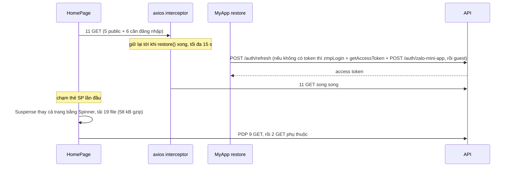

# A7 — Chất lượng kỹ thuật người dùng cảm nhận được & nền đo lường (analytics baseline)

**Kết luận.** Bundle không phải nút thắt. Có code-splitting theo route (40 trang `lazy`, chỉ Home tải sẵn). Entry là một file 505,10 kB (158,70 kB gzip), phần lớn là react-dom, zmp-sdk (bên trong đóng gói sẵn zod 48 KiB) và axios. Cả gói chỉ 1,38 MB, rất xa mọi giới hạn của Zalo. Thứ khách cảm thấy chậm là các **thác request**. Mọi request, kể cả API public của danh mục, đều bị giữ lại cho tới khi chuỗi đăng nhập xong. Lần đầu chạm vào mỗi trang, cả màn bị thay bằng spinner trong lúc tải chunk (PDP cần 19 file, 58 kB gzip, không có prefetch). Điểm yếu thật nằm ở **độ bền**, với 4 chỗ app "nói dối" hoặc đi vào ngõ cụt. (1) Phiên khách (guest) bị **đổi sang tài khoản khác** ngay lúc bấm "Đặt hàng" nên đơn hỏng: P0 có điều kiện. (2) Refresh token lỗi giữa phiên là cả app chuyển về "đã đăng xuất", Giỏ hiện "trống" và Đơn hàng hiện "chưa có đơn". (3) Mất mạng thì query bị *paused* và trang hiện trạng thái rỗng, không có báo mất mạng. (4) Tải chunk lỗi là sập toàn app. Không có telemetry lỗi nào, nên không ai biết những chuyện này đang xảy ra. Throttle theo IP (5 lần đăng nhập/phút/IP) là quả mìn nằm chờ ở Wi-Fi cửa hàng, CGNAT và Cloudflare. Ảnh do người dùng tải lên đang rơi về base64: đánh giá có ảnh bị từ chối, avatar mất âm thầm, feed cộng đồng phình to. Backend phần lớn có giới hạn và có index. Rủi ro lớn nhất ở đường nóng là `/me/coupons`, vốn nạp coupon cá nhân của **mọi** khách ở mỗi lượt xem PDP. Về analytics: **không có gì** ngoài vài số liệu CTV, mà chính các số đó cũng sai (conversions luôn bằng 0). DB có đủ dữ liệu để back-fill chỉ số mua lặp, nhưng có 5 khiếm khuyết định danh/nguồn sẽ làm sai north-star nếu tính thô. Tôi đề xuất bộ tối thiểu 18 sự kiện (10 phía BE là nguồn sự thật, 8 phía FE) kèm công thức KPI và SQL back-fill. Tổng: **24 phát hiện, gồm 1 P0, 9 P1 và 14 P2**.

> **Quy ước đường dẫn.** `pages/…`, `components/…`, `services/…`, `store/…`, `utils/…`, `css/…`, `i18n/…`, `hooks/…` là tương đối với `apps/miniapp/src/`. `api/<module>/…` là `apps/api/src/modules/<module>/…`. `schema.prisma` là `apps/api/prisma/schema.prisma`. File khác ghi đường dẫn đầy đủ từ gốc repo. Thư viện trong `node_modules/.pnpm/<gói>@<phiên bản>…/node_modules/<gói>/` được viết tắt thành `<gói>@<phiên bản>/…`. Số dòng theo nhánh `feat/complete-wip-2026-09` (commit `1e7fda7`). Mọi con số đếm lấy từ lệnh ở **Phụ lục** (mã C1…C29). Các file `integrations/gomdon/**` đang được agent khác sửa nên không dùng làm bằng chứng. Tôi không chạy app trên máy thật, không đo DevTools và không chạm DB.

---

## Hiện trạng

### 1. Bundle miniapp (build vào thư mục scratch, `www/` không bị động tới)

Lệnh: `cd apps/miniapp && npx vite build --outDir <scratch>/miniapp-build --emptyOutDir`. Kết quả: exit 0, 2.531 module, 41,9 giây, 104 file đầu ra (C1).

| Chỉ số | Giá trị | Nguồn |
|---|---|---|
| Tổng dung lượng gói | **1.380.070 byte (≈1,38 MB)**; 101 JS + 1 CSS + 1 PNG + `index.html` | C3 |
| Tải lần đầu (trước khi vẽ Home) | entry JS **505,10 kB / 158,70 kB gzip** (trên đĩa 508.205 B; gzip -9 157.880 B; brotli 135.879 B) + CSS 108,71 kB / 16,66 kB gzip + logo PNG 55,27 kB → **≈669 kB thô, ≈231 kB nếu gzip** | C1, C3 |
| Code-splitting | **Có**: 40 `lazy()`, 42 `<Route>`; `HomePage` import tĩnh | `components/app.tsx:7, 35-74`; C5 |
| Chunk JS < 1 kB | 44 (đa số là icon lucide tách lẻ, vd `minus`, `check`, `plus`, `x`) | C6 |
| Chunk lazy dùng chung lớn nhất | `index.Bt3t5KDo` 78,84 kB / 28,69 kB gzip: @react-spring (≈41 KiB) + @use-gesture (≈20 KiB) + resize-observer-polyfill (7,7 KiB), tức lớp hoạt ảnh Sheet của zmp-ui | C2 |
| Lần chạm đầu (tải thêm sau khi chạm) | PDP **19 file, 158.805 B thô / 58.085 B gzip**; Giỏ 14 file / 48.082 B gzip; Thanh toán 8 file / 56.513 B gzip; Danh mục 4 file / 13.486 B gzip | C4 |
| Giới hạn gói Zalo | Kết quả tìm kiếm trỏ tới thread cộng đồng Zalo "Lỗi The file size is too large" ([miniapp.zaloplatforms.com/community/787296985963104833](https://miniapp.zaloplatforms.com/community/787296985963104833)) ghi: tổng `www` ≤ 10 MB, mỗi file ≤ 3 MB. Trang không render được nội dung để đọc trực tiếp, nên giới hạn này **CHƯA XÁC MINH** trên tài liệu chính thức. Kể cả nếu giới hạn thật nhỏ hơn vài lần thì gói hiện tại (1,38 MB, file lớn nhất 508 KB) vẫn an toàn. | WebSearch/WebFetch |

**Thành phần entry theo sourcemap** (C2: build lại với `--sourcemap`, quy byte đã minify về gói nguồn; KiB = 1.024 B):

| Gói | KiB | Có cần? | Nhận xét / phương án |
|---|---|---|---|
| react-dom | 128,2 | Có | Đổi sang Preact/compat sẽ bớt ~100 KiB, nhưng rủi ro với zmp-ui. Không khuyến nghị. |
| zmp-sdk | 119,8 | Có | Trong đó `apis/external/zod` 47,8, `apis/constants.js` 13,4, `common/token.js` 7,9. App chỉ dùng storage, vibrate, login, share, phone, location, openChat, openWebview (C27), nhưng zod đóng gói sẵn không tree-shake được. Import theo đường dẫn API lẻ có bớt được không: UNKNOWN, cần thử. |
| axios | 42,2 | Không bắt buộc | Kéo theo cả adapter `fetch` lẫn `xhr`. Một wrapper `fetch` ~3 KiB thay được, nhưng phải viết lại interceptor 401/`authReady` và các chỗ `isAxiosError` (`components/app.tsx:5`, `store/auth.ts:2`). |
| @tanstack/query-core + react-query | 38,1 + 2,7 | Có | — |
| zmp-ui (phần trong entry) | 27,6 | Có | Còn 3 chunk lazy nữa (78,8 / 27,8 / 3,7 kB) |
| `i18n/vi.ts` | 11,0 | Có | Có thể tách theo trang, lợi ích nhỏ |
| lucide-react | 10,8 (28 icon) | Có | Tree-shake tốt |
| react-router, @remix-run/router, react-router-dom | 8,5 + 10,1 + 1,1 | Có | Kéo vào qua `ZMPRouter` |
| react-transition-group | 8,5 | Có | zmp-ui cần |
| Code app trong entry, không kể `vi.ts` (home, app, flash-sale, onboarding, product-card, services…) | 62,9 | Có | Home tải sẵn là hợp lý. Tổng phần `node_modules` trong entry: 411,5 KiB. |

Các chunk lazy đáng chú ý: `qr-code` 24,62 kB (thư viện `qrcode` 22,5 KiB, dùng ở thẻ thành viên Điểm Xanh và share sheet); `game` 36,28 kB (code trang 30,5 KiB). Không có dependency thừa kiểu moment/lodash (`apps/miniapp/package.json:16-28`).

<details>
<summary><b>Bảng đầy đủ 104 file đầu ra</b> (raw / gzip, theo log của Vite, sắp giảm dần; C1)</summary>

| File | Raw | Gzip |
|---|---|---|
| `assets/index.CZ6yYkb8.module.js` | 505.10 kB | 158.70 kB |
| `assets/index-Do6wzfGI.css` | 108.71 kB | 16.66 kB |
| `assets/index.Bt3t5KDo.module.js` | 78.84 kB | 28.69 kB |
| `assets/tubu-logo-Byq5sWhB.png` | 55.27 kB | — |
| `assets/game.CcGneUct.module.js` | 36.28 kB | 9.84 kB |
| `assets/affiliate.BwnN88za.module.js` | 34.92 kB | 9.73 kB |
| `assets/product-detail.5Is8VMqw.module.js` | 28.43 kB | 8.98 kB |
| `assets/checkout.Bj_OIJs0.module.js` | 28.42 kB | 8.76 kB |
| `assets/index.nt_11XOG.module.js` | 27.79 kB | 9.45 kB |
| `assets/storefront-builder.DJ24Q5Zt.module.js` | 27.77 kB | 7.61 kB |
| `assets/dealer.CHv3Ccy9.module.js` | 27.61 kB | 8.43 kB |
| `assets/admin.BCTN5ZZD.module.js` | 25.00 kB | 7.17 kB |
| `assets/qr-code.DjcJpz1h.module.js` | 24.62 kB | 9.69 kB |
| `assets/loyalty.7dhuSEAx.module.js` | 23.17 kB | 6.32 kB |
| `assets/geo-picker.D7H-PekB.module.js` | 18.38 kB | 6.05 kB |
| `assets/staff.CwnCnlia.module.js` | 16.43 kB | 5.62 kB |
| `assets/post-detail.DxPxR4Wy.module.js` | 15.74 kB | 4.56 kB |
| `assets/order-detail.DI09y9Yd.module.js` | 15.14 kB | 4.89 kB |
| `assets/wallet.DLoBEHK3.module.js` | 14.05 kB | 4.65 kB |
| `assets/brand-story.BR9qAQ1E.module.js` | 13.67 kB | 4.50 kB |
| `assets/cart.CyQ_aGI2.module.js` | 11.51 kB | 4.07 kB |
| `assets/profile.Cn54wkj-.module.js` | 11.06 kB | 4.26 kB |
| `assets/community-moderation.C2XlNJOi.module.js` | 9.76 kB | 2.84 kB |
| `assets/edit-profile.sDJQHr46.module.js` | 9.08 kB | 3.82 kB |
| `assets/image-upload.DunUd1Oi.module.js` | 8.70 kB | 3.33 kB |
| `assets/brand-view.-w5Vr0GU.module.js` | 8.62 kB | 3.23 kB |
| `assets/notifications.BT9RZxV2.module.js` | 8.37 kB | 3.24 kB |
| `assets/brand-owner.BPhk_A_8.module.js` | 8.25 kB | 3.07 kB |
| `assets/post-composer.CvWt-ahd.module.js` | 7.97 kB | 3.02 kB |
| `assets/browse.DSUir83m.module.js` | 7.66 kB | 3.18 kB |
| `assets/my-payroll.BL0n4SA7.module.js` | 7.52 kB | 2.98 kB |
| `assets/feed.De2yUmSZ.module.js` | 7.48 kB | 2.64 kB |
| `assets/about.DCZ1tuD0.module.js` | 7.33 kB | 3.24 kB |
| `assets/storefront-view.D93oMSFo.module.js` | 6.58 kB | 2.65 kB |
| `assets/addresses.DkzFnb8u.module.js` | 6.39 kB | 2.51 kB |
| `assets/voucher-sheet.BMoIleJ-.module.js` | 6.36 kB | 2.55 kB |
| `assets/community-events.D3E-eTcd.module.js` | 6.24 kB | 2.09 kB |
| `assets/bank-payment.CcFUq2Tl.module.js` | 6.18 kB | 2.44 kB |
| `assets/cashback.BQc37Vhb.module.js` | 5.82 kB | 2.35 kB |
| `assets/academy.CtzSnFQL.module.js` | 5.78 kB | 2.19 kB |
| `assets/refill.dUXqWJWi.module.js` | 5.62 kB | 2.15 kB |
| `assets/subscriptions.CylDqkAD.module.js` | 5.50 kB | 2.21 kB |
| `assets/beta.DtgraKv4.module.js` | 4.98 kB | 2.03 kB |
| `assets/ai-advisor.FNd-blfl.module.js` | 4.73 kB | 1.90 kB |
| `assets/post-card.Cq-EGU19.module.js` | 4.26 kB | 1.75 kB |
| `assets/settings.DeAXKyeF.module.js` | 3.80 kB | 1.68 kB |
| `assets/group-buy.BquR55To.module.js` | 3.77 kB | 1.81 kB |
| `assets/index.BjdYMV9a.module.js` | 3.67 kB | 1.74 kB |
| `assets/content-kit-sheet.jBDCFPY5.module.js` | 3.61 kB | 1.44 kB |
| `assets/orders.5tyZzbiE.module.js` | 3.49 kB | 1.59 kB |
| `assets/community-leaderboard.Rd0bpTLz.module.js` | 3.00 kB | 1.17 kB |
| `assets/week.B4TYYmuL.module.js` | 2.48 kB | 1.10 kB |
| `assets/share-sheet.CLQBers8.module.js` | 2.28 kB | 1.26 kB |
| `assets/dealer-api.DLf8OTIt.module.js` | 2.28 kB | 1.16 kB |
| `assets/rank-badge.C211GAAY.module.js` | 2.02 kB | 0.76 kB |
| `assets/time-input.Agh8DmRg.module.js` | 1.74 kB | 0.79 kB |
| `assets/useInfiniteQuery.C1xIHk7w.module.js` | 1.62 kB | 0.70 kB |
| `assets/storefront-api.COtHxLnM.module.js` | 1.19 kB | 0.41 kB |
| `assets/quantity-selector.0CPDwPUW.module.js` | 1.14 kB | 0.62 kB |
| `assets/shopping-bag.BA7o7ekj.module.js` | 0.93 kB | 0.47 kB |
| `assets/receipt.BYf-V3ge.module.js` | 0.83 kB | 0.39 kB |
| `assets/not-found.COzltpRE.module.js` | 0.82 kB | 0.58 kB |
| `assets/use-public-config.D7jSlrjB.module.js` | 0.80 kB | 0.50 kB |
| `assets/wishlist.ljgX_0Gd.module.js` | 0.78 kB | 0.58 kB |
| `assets/storefront-context-bar.CW_R_JVR.module.js` | 0.72 kB | 0.44 kB |
| `assets/payroll-api.BSaJLfHq.module.js` | 0.71 kB | 0.32 kB |
| `assets/store.iLLjvuGQ.module.js` | 0.68 kB | 0.40 kB |
| `assets/settings.9scalsiK.module.js` | 0.67 kB | 0.37 kB |
| `assets/trophy.D9nG2Rht.module.js` | 0.66 kB | 0.38 kB |
| `assets/eye-off.DBaa3_aO.module.js` | 0.61 kB | 0.39 kB |
| `assets/truck.BR4Q0qyv.module.js` | 0.59 kB | 0.38 kB |
| `assets/badge-percent.B1-fNeZI.module.js` | 0.57 kB | 0.35 kB |
| `assets/landmark.BS8fW8Fl.module.js` | 0.56 kB | 0.36 kB |
| `assets/file-text.BmJi9EOA.module.js` | 0.56 kB | 0.36 kB |
| `assets/calendar-clock.CHALyvUi.module.js` | 0.56 kB | 0.36 kB |
| `assets/share-2.BXehYptt.module.js` | 0.54 kB | 0.34 kB |
| `assets/pin.C9WZiWma.module.js` | 0.53 kB | 0.34 kB |
| `assets/gift.jfBU_xId.module.js` | 0.53 kB | 0.36 kB |
| `assets/checkout-selection.BMs7nr5W.module.js` | 0.52 kB | 0.31 kB |
| `assets/trash-2.Btsz2x84.module.js` | 0.51 kB | 0.32 kB |
| `assets/order-status.B1QYQEKT.module.js` | 0.51 kB | 0.28 kB |
| `assets/shield-check.Bqo8TfI9.module.js` | 0.50 kB | 0.36 kB |
| `index.html` | 0.48 kB | 0.30 kB |
| `assets/pencil.BIDWFm6U.module.js` | 0.46 kB | 0.33 kB |
| `assets/book-open.Cq8ggJ0f.module.js` | 0.46 kB | 0.32 kB |
| `assets/repeat.sJnDADCI.module.js` | 0.45 kB | 0.31 kB |
| `assets/triangle-alert.CJ7WjENG.module.js` | 0.44 kB | 0.32 kB |
| `assets/map-pin.Bt0plbW8.module.js` | 0.44 kB | 0.33 kB |
| `assets/leaf.mZi1M8bm.module.js` | 0.44 kB | 0.34 kB |
| `assets/copy.iEpHzhc7.module.js` | 0.42 kB | 0.32 kB |
| `assets/message-square.RPxbB2mm.module.js` | 0.41 kB | 0.31 kB |
| `assets/refill-api.OosTaG5E.module.js` | 0.40 kB | 0.25 kB |
| `assets/brand-owner-api.DG5VC4Rh.module.js` | 0.39 kB | 0.21 kB |
| `assets/circle-check.DwLI1CMk.module.js` | 0.36 kB | 0.28 kB |
| `assets/trending-up.DUOxzvb8.module.js` | 0.35 kB | 0.28 kB |
| `assets/clock.BVzPnTHp.module.js` | 0.35 kB | 0.28 kB |
| `assets/x.CLeimDwG.module.js` | 0.33 kB | 0.26 kB |
| `assets/subscriptions-api.BOXNKo1F.module.js` | 0.33 kB | 0.20 kB |
| `assets/plus.ZNrRHbKw.module.js` | 0.33 kB | 0.26 kB |
| `assets/chevron-down.S5oBizxd.module.js` | 0.31 kB | 0.25 kB |
| `assets/minus.Clqg-GgW.module.js` | 0.30 kB | 0.25 kB |
| `assets/check.DrLV828A.module.js` | 0.30 kB | 0.25 kB |
| `assets/groupbuy-api.CyTrE5J_.module.js` | 0.23 kB | 0.18 kB |
| `assets/use-debounced.CZqSR29Y.module.js` | 0.20 kB | 0.17 kB |

</details>

### 2. Hiệu năng runtime (đọc code)

**Cấu hình React Query** (`components/app.tsx:76-95`)

| Tuỳ chọn | Giá trị | Ghi chú |
|---|---|---|
| `staleTime` mặc định | 10.000 ms | 16 query tự override: 30 s ×3, 60 s ×8, 5 phút ×3, `Infinity` ×2 (C29). Home (3 mục SP) và infinite query Danh mục **không** override, trái với comment `components/app.tsx:90-91`. |
| `retry` | 4xx: không; lỗi khác: 1 lần | `components/app.tsx:81-85` |
| `refetchOnWindowFocus` | `false` | `components/app.tsx:86` |
| `refetchOnMount` / `refetchOnReconnect` / `gcTime` | mặc định: true / true / 5 phút | — |
| `networkMode` | mặc định `'online'`: mất mạng thì query **paused** | `@tanstack/query-core@5.100.14/build/modern/retryer.js:10-11` |
| Polling | giờ vàng 60 s (`components/flash-sale.tsx:27`, `pages/product-detail.tsx:118`); QR chuyển khoản 4 s tới khi PAID (`pages/bank-payment.tsx:25`) | — |
| Prefetch / `placeholderData` / `initialData` | **0 kết quả** | C8 |

**Request khi render lần đầu** (cache lạnh, đã đăng nhập; đếm thủ công từ code sau khi gộp queryKey trùng; tổng `useQuery*` toàn app = 133, C7). Với các trang mua hàng, số liệu khớp bảng của A2 (`02-purchase-funnel.md:54-64`).

| Trang | Request | Phụ thuộc tuần tự | Bằng chứng |
|---|---|---|---|
| Home | **11**: `/products`×3, `/brands`, `/flash-sales/active` (public) + `/cart`, `/me/notifications`, `/products/for-you`, `/flash-sales/upcoming`, `/me/wishlist/ids`, `/me` (OnboardingGate) | tất cả chờ đăng nhập (W1) | `pages/home.tsx:34-65`; `components/flash-sale.tsx:23-28, 269-274`; `components/wishlist-heart.tsx:24-29`; `components/onboarding.tsx:67` |
| PDP | **9 song song + 2 phụ thuộc**: `/products/:slug`, `/reviews`, `/reviews/can-review`, `/me/coupons`, `/affiliate/me`, `/cart`, `/flash-sales/active`, `/config/public`, `/me/wishlist/ids`, sau đó `/related`, `/bought-together` | chunk (19 file) → 9 → 2 (W2, W3) | `pages/product-detail.tsx:58-119`; `components/reviews-section.tsx:33-38` |
| Thanh toán | **5 + 1**: `/cart`, `/me/addresses`, `/me/wallet`, `/me/loyalty`, `/config/public`, sau đó `POST /checkout/quote` | addresses → effect `setAddressId` → quote (W4) | `pages/checkout.tsx:49, 73-83, 107-120` |
| Chi tiết đơn | 1 + 1 (`/orders/me/returns` khi DELIVERED) | W5 | `pages/order-detail.tsx:45-53` |
| Vườn Xanh | **12** song song | — | `pages/game.tsx:66-81` |
| CTV | **8** (+1 cổng `affiliate-me`) | — | `pages/affiliate.tsx:57, 164-171` |
| Điểm Xanh | 6 | — | `pages/loyalty.tsx:56-61` |
| Cá nhân | 4 | — | `pages/profile.tsx:96-123` |
| Ví | 3 | — | `pages/wallet.tsx:26-28` |
| Cộng đồng | 2 | — | `pages/feed.tsx:51-65` |
| Giỏ / Đơn hàng / Thông báo | 1 mỗi trang | — | `pages/cart.tsx:62`; `pages/orders.tsx:37-46`; `pages/notifications.tsx:72` |

**Các thác (waterfall) tuần tự**



- **W1: mọi request chờ đăng nhập**, kể cả `@Public`. Bằng chứng: `services/api.ts:25-36, 54-62`; `store/auth.ts:118-163`; `api/catalog/catalog.controller.ts:13-51`.
- **W2: chunk rồi mới tới dữ liệu.** Không prefetch route nào. `Suspense` bọc cả `AnimationRoutes`, fallback là Spinner (`components/app.tsx:100-106, 153`). `ZMPRouter` dùng `BrowserRouter` không bật `v7_startTransition` (`zmp-ui@1.11.14/esm/components/router/ZMPRouter.js:72-80`), nên trang đang xem bị thay bằng spinner, rồi tới skeleton, rồi mới có nội dung.
- **W3–W5:** PDP `related`/`bought-together` chờ `product.isSuccess`, dù chỉ cần slug (`pages/product-detail.tsx:93-102`). Thanh toán chờ addresses rồi mới quote. Chi tiết đơn tải đơn xong mới tới yêu cầu đổi trả.
- **W6 (BE):** "Dành cho bạn" chạy 5 query tuần tự (`api/catalog/catalog.service.ts:160-203`).

**Ảnh** (C10, quét AST): 39 thẻ ``. Cả 39 có `alt` (18 rỗng, hầu hết là avatar/thumbnail cạnh chữ); 13 có `loading="lazy"`, 26 không có thuộc tính `loading` (vd ảnh trong thẻ bài cộng đồng `components/community/post-card.tsx:27, 51`); 10 có `width/height`. PDP: ảnh đầu `eager`, còn lại `lazy`, không `fetchpriority`/`srcset` (`pages/product-detail.tsx:798-811`). **Không có transform/CDN nào.** Thumbnail là URL gốc từ Pancake (`api/integrations/pancake/pancake-sync.service.ts:131-140`; A2-49 đã nêu). Dung lượng ảnh SP thật: UNKNOWN (cần dữ liệu prod). Logo 1059×384 PNG 55 kB hiển thị cao 30 px (`pages/home.tsx:15, 83`).

**Virtualization:** không có. 0 kết quả cho `react-window`/`virtuoso`/`IntersectionObserver` (C8). Danh sách phân trang bằng nút "Xem thêm": Danh mục 30/trang (`pages/browse.tsx:18`), Đơn 20/trang (`pages/orders.tsx:27`), Cộng đồng cursor ≤ 50 (`api/feed/community-feed.service.ts:327`), Thông báo 50 (`api/notifications/notifications.service.ts:98-104`). Với quy mô catalog hiện tại thì chưa cần virtualization.

**Cảm nhận tốc độ:** skeleton dùng rộng, 124 lần trong 37 file, so với 3 Spinner (C9). Skeleton khớp bố cục thật (vd `PdpSkeleton` ở `pages/product-detail.tsx:938-957`). Ngoại lệ đáng kể là fallback route (W2) và màn Cá nhân khi đang đăng nhập (`pages/profile.tsx:161`).

### 3. Độ bền

**Xử lý lỗi thống nhất:** `getErrorMessage` được dùng 171 lần, `<ErrorState>` 55 lần (C18). Không có component nào tự diễn dịch AxiosError, trừ auth store (`store/auth.ts:107, 154`).

**Người dùng thấy gì theo từng mã lỗi**

| Tình huống | Nguồn câu chữ | Khách thấy | Tự thử lại |
|---|---|---|---|
| 401 sau khi refresh hỏng | passport mặc định (`apps/api/src/common/guards/jwt-auth.guard.ts:8-20`), FE in thẳng (`services/api.ts:101-102`) | "Unauthorized"; cả app chuyển `idle` (A7-03) | 1 lần refresh+retry (`services/api.ts:77-88`) |
| 403 | `apps/api/src/common/guards/roles.guard.ts:20` | "Bạn không có quyền truy cập tài nguyên này." | không |
| 409 (Prisma) | `apps/api/src/common/filters/prisma-exception.filter.ts:59-63` | "Dữ liệu trùng (vi phạm ràng buộc duy nhất)." (câu kỹ thuật) | không |
| 429 | `@nestjs/throttler@6.5.0/dist/throttler.exception.js:5` | "ThrottlerException: Too Many Requests" | không (4xx) |
| 400 validation | class-validator mặc định; 739/749 decorator không có message Việt, không `exceptionFactory` (C21) | tiếng Anh, vd "each value in images must be shorter than or equal to 500 characters" | không |
| 5xx | `i18n/vi.ts:24` | "Máy chủ đang bận, thử lại nhé." | 1 lần |
| Timeout 15 s (`services/api.ts:6`) | `i18n/vi.ts:23` | "Hơi chậm tí, bạn đợi nhé", trong khi request đã thất bại | 1 lần |
| Mất mạng, request đang bay | `i18n/vi.ts:21` | "Có vẻ mất mạng…" | 1 lần |
| Mất mạng, query chưa chạy | — | query paused nên trang hiện **rỗng** (A7-04) | tự chạy lại khi có mạng |
| Lỗi render / tải chunk | `components/error-boundary.tsx:52-54` | toàn màn "Đã có lỗi xảy ra", nút reload cả app | — |
| Đăng nhập hỏng hẳn | `store/auth.ts:154` → `pages/profile.tsx:180` | message axios thô ("Network Error", "Request failed with status code …") | nút "Thử lại" |

**Mạng chậm/offline.** Timeout 15 s (`services/api.ts:6`). Không có banner offline. Nơi duy nhất đọc `navigator.onLine` là `getErrorMessage` (`services/api.ts:104-108`, C18). Khi query paused, `isLoading = isPending && isFetching` (`@tanstack/query-core@5.100.14/build/modern/queryObserver.js:308-310`) nên cả `isLoading` lẫn `isError` đều false, và các trang rơi vào nhánh rỗng (A7-04).

**Race khi refresh token.** Chống refresh trùng ở 2 lớp: `services/api.ts:38, 79-81` và `store/auth.ts:70-80`. BE xoay refresh token dùng 1 lần; nếu một token bị dùng lại thì BE thu hồi **toàn bộ** phiên của user (`api/auth/auth.service.ts:217-233`). Luồng bình thường không có race gây đăng xuất. Các lỗ còn lại:
- (a) Nếu restore() quá 15 s, request đi mà không kèm token. Code tự ghi nhận điều này ở `services/api.ts:26-36`.
- (b) Response của `/auth/refresh` bị mất do timeout, lần sau FE gửi lại token cũ. BE coi đó là dùng lại và thu hồi mọi phiên (cả web). Giữa phiên, FE rơi vào `idle` (A7-03).
- (c) `ensurePhone` đổi user (A7-01).

**Error boundary.** Chỉ có một boundary ở gốc (`components/app.tsx:148`). Nó chỉ `console.error` (`components/error-boundary.tsx:26-28`), dùng màu cứng `#16a34a` thay vì token (`:62`), và câu chữ gõ cứng (`:52-54`). Web thì có `app/error.tsx` và `app/global-error.tsx`.

**Zalo SDK ngoài Zalo / khi SDK lỗi**

| API | Bọc ở | Khi lỗi / ngoài Zalo |
|---|---|---|
| `login` + `getAccessToken` | `services/zmp-bridge.ts:39-71` (timeout 3 s mỗi lệnh; bỏ ngay nếu timeout hoặc -1401) | rơi xuống tài khoản khách (`store/auth.ts:144-155`). Máy yếu phản hồi quá 3 s ngay trong Zalo cũng thành khách (A7-01). |
| `getStorage`/`setStorage` | `store/auth.ts:20-52` | zmp-sdk tự fallback sang localStorage (có `apis/common/apis/general/storage/localStorage.js` trong bundle, C2) |
| `vibrate` | `utils/haptic.ts:12-16` | lỗi bị nuốt |
| `getPhoneNumber` | `services/zmp-bridge.ts:77-84` | trả `null`, vẫn đặt đơn không kèm SĐT |
| `getLocation` | `services/zmp-bridge.ts:90-98` | trả `null` |
| `openShareSheet` | `services/zmp-bridge.ts:159-169` (không catch) | caller nuốt lỗi nên **không có gì xảy ra** (A7-23). Riêng Ví có fallback. |
| `openChat` (OA) | `services/zmp-bridge.ts:133-136` (không catch) | unhandled rejection (`pages/order-detail.tsx:489`) |
| `openWebview` | `services/zmp-bridge.ts:107-113` | fallback `location.href` |

### 4. A11y cơ bản

| Hạng mục | Kết quả | Nguồn |
|---|---|---|
| `alt` ảnh | 39/39 có `alt` (18 rỗng) | C10 |
| Nút chỉ có icon | 43 nút; 25 có tên truy cập, **18 không** (16 `<Button>` zmp-ui, 1 icon `Copy` 15 px bấm được nhưng không phải nút ở màn QR chuyển khoản, 1 `Box`) | C11; `pages/bank-payment.tsx:211` |
| Sheet/modal | Mọi overlay dùng `Sheet` của zmp-ui (23 file); Sheet có **0** thuộc tính `role`/`aria-*`/`focus`. `Modal` của zmp-ui có `role="dialog"` nhưng app không dùng lần nào. | C17; `zmp-ui@1.11.14/esm/components/modal/content.js:113-115` |
| Phóng to | `user-scalable=no, maximum-scale=1.0` | `apps/miniapp/index.html:5-8` |
| Cỡ chữ | Cài đặt dùng CSS `zoom` 0,92 / 1 / 1,1, tức tối đa **+10%**. `font-scale.ts` đặt fontSize inline nhưng bị `!important` trong CSS đè. | `css/tokens.css:131-143`; `utils/font-scale.ts:7-11` |
| Chữ < 12 px | 25 cỡ chữ inline (9,5–11 px), vd nhãn bottom nav 10,5 px | C16; `components/bottom-nav.tsx:109` |
| Trạng thái tab | bottom nav là `role="button"`, không có `aria-current` | `components/bottom-nav.tsx:59-60, 97-98` |

### 5. i18n & câu chữ

| Chỉ số | Giá trị | Nguồn |
|---|---|---|
| File i18n | 1 (`i18n/vi.ts`, 453 dòng); 35/121 file có import | C12 |
| Tỉ lệ chuỗi đi qua `vi.*` | 425 tham chiếu, so với **1.408** literal tiếng Việt gõ cứng, tức **≈23%** | C12 (AST, bỏ comment) |
| File gõ cứng nhiều nhất | admin 105, game 103, affiliate 85, dealer 77, loyalty 60, staff 58, profile 57 | C12 |
| Thuật ngữ lệch (chỉ đếm chuỗi UI) | "TubuXu" 17 / "Tubu Xu" 2 (`components/affiliate/milestone-copy.ts:27`, `pages/affiliate.tsx:367`); "voucher" 16 / "mã giảm giá" 10 (sheet chọn mã dùng "mã giảm giá", `components/checkout/voucher-sheet.tsx:90`); "hoàn tiền" 15 / "cashback" 1; "CTV" 15 / "cộng tác viên" 1 | C13 |
| Kiểu bỏ dấu | huỷ 21 / hủy 17; xoá 16 / xóa 11; khoá 10 / khóa 1; hoá đơn 4 / hóa đơn 1 | C14 |
| Dấu chấm lửng | "..." 10 / "…" 18 | C13 |
| Emoji (bỏ các dòng bắt đầu bằng `//`, `*`, `/*`) | 317 lần trong 45 file; ngoài game/loyalty/wheel vẫn có ở bank-payment 8, browse 6, wallet 6, post-detail 6… | C15 |
| Lỗi chính tả | Quét tự động (từ lặp, khoảng trắng, dấu câu) không thấy lỗi rõ ràng. Không có công cụ kiểm tra chính tả. | C15 |

### 6. Hiệu năng backend ở endpoint phía khách

| Endpoint | Hàm | Index khớp `where`/`orderBy` | Có giới hạn? | Nhận xét |
|---|---|---|---|---|
| `GET /products` | `api/catalog/catalog.service.ts:54-85` | brand ✓ `[brand]`; category/segment ✓ GIN; `q` ✗ (ILIKE `%q%`); sắp theo createdAt/basePrice/ratingAvg ✗ | take ≤ 100 ✓ | Đọc mọi cột Product + Variation cho một thẻ; `count()` cả ở Home; ORDER BY thiếu khoá phụ (A2-15) |
| `GET /products/:slug` | `:87-104` | slug unique ✓; Review `[productId]` ✓ | take 20 ✓ | 20 review thừa (A2-38) |
| `GET /products/:slug/bought-together` | `:119-147` | variations `[productId]` ✓, order_items `[variationId,…]` ✓, `[orderId]` ✓; `orders.createdAt` ✗ | LIMIT 6 | CTE quét đơn 90 ngày ở **mỗi lượt xem PDP**, không cache (A7-15) |
| `GET /products/for-you` | `:156-217` | OrderItem→Order `[userId,status]` ✓ | take 200 ✓ | 5 query tuần tự; loại SP đã mua (A1/A2/A3 đã nêu) |
| `GET /me/coupons` | `api/loyalty/loyalty.service.ts:485-496` | **Coupon không có index nào ngoài `code`** (`schema.prisma:1008-1029`) | **✗** | Nạp coupon còn hạn của mọi khách (A7-09) |
| `GET /cart` | `api/cart/cart.service.ts:17-107` | ✓ | theo giỏ | Tính giá đầy đủ, dù ở Home/Danh mục/PDP chỉ lấy để hiện badge (A7-17) |
| `GET /orders` | `api/orders/orders.service.ts:34-46` | `[userId,status]` ✓ | take ≤ 100 ✓ (FE dùng 20) | ổn |
| `GET /me/notifications` | `api/notifications/notifications.service.ts:98-104` | `[userId]` ✓ | take 50 ✓ | ổn |
| `GET /feed` | `api/feed/community-feed.service.ts:314-367` | `[status,createdAt]` ✓; sort "popular" theo `_count` ✗; `q` ILIKE trên `body` ✗ | ≤ 50 ✓, cursor | payload base64 (A7-07) |
| `GET /flash-sales/active` | `api/flash-sale/flash-sale.service.ts:61` | FlashSale `[isActive,startAt,endAt]` ✓ | theo đợt | refetch 60 s ở mọi trang có thẻ SP |
| `POST /orders/:code/repurchase` | `api/orders/orders.service.ts:139-151` | ✓ | — | N+1 tuần tự (mỗi món: `findUnique` + `addItem` ≈ 9 query); câu chữ/UX ở A2-05 |
| `GET /storefront/me/stats` (CTV) | `api/storefront/storefront.service.ts:319-327` | `[storefrontSlug]` ✓ | **✗** | nạp mọi đơn từ trước tới nay (A7-18) |

Quét AST toàn bộ 17 module phía khách (C20). Các `findMany`/`groupBy` không có `take` đa số bị chặn bởi `id in [...]` hoặc là bảng tham chiếu nhỏ (hạng, danh mục, nhiệm vụ). Chỗ không giới hạn thật: `loyalty.service.ts:488` (coupon), `storefront.service.ts:324` (đơn), `loyalty-expiry.service.ts:104` (sổ điểm, trong cron). `await` trong vòng lặp phía khách chỉ có repurchase (`orders.service.ts:142-144`), `generateCode` (`checkout.service.ts:503`, thường 1 vòng) và `consumeQuota` trong transaction (`checkout.service.ts:159`, cố ý tuần tự). Các chỗ còn lại nằm trong cron nhắc/remarketing và cũng là cố ý.

### 7. Nền đo lường (analytics baseline)

#### 7.1 Hiện có gì

- **Analytics sản phẩm: không có.** 0 SDK trong các `package.json` và 0 lời gọi `track/logEvent/gtag/posthog…` trong `apps/miniapp/src`, `apps/web/src`, `apps/api/src` (C19). API không có request log (C22); chỉ có access log Apache trên VPS (`ops/vietnix-vhost-api.conf.phase2`, `CustomLog`). Khớp A3-29 và A6-28.
- **Các "stats" đang có:**
  - `admin.getDashboardStats`: chỉ có tổng từ trước tới nay (`api/admin/admin.service.ts:320-375`).
  - Dashboard CTV (`api/affiliate/affiliate.service.ts:133-170`): `totalConversions` luôn bằng 0, vì `AffiliateLink.conversions` chỉ được đọc (`:152, :166`) mà không nơi nào tăng (C25).
  - Thống kê gian hàng (`api/storefront/storefront.service.ts:319-360`; `api/affiliate/affiliate.service.ts:728-751`).
  - Báo cáo quý đại lý (`api/dealer/dealer.service.ts:519`).
  - `AffiliateClick` chỉ ghi khi đi qua link web `/r/:code` (`api/affiliate/affiliate.service.ts:121-131`); `convertedOrderId` không nơi nào ghi (`schema.prisma:1073`, C25).

#### 7.2 Dữ liệu phía server dùng được để back-fill

| Nguồn | Có gì | Back-fill được | Lỗ hổng |
|---|---|---|---|
| `orders` (`schema.prisma:795-862`) | userId, type, status, total, paymentMethod, couponCode, pointsUsed, referrerUserId, storefrontSlug, placedForCustomer, createdAt, deliveredAt | **north-star** (đơn 2 ≤ 30 ngày), đơn/khách/tháng, repeat 30/60/90, thời gian tới đơn 2, cohort mua, AOV | đơn lên hộ ghi userId của CTV; guest tách riêng; không có source/platform; không có paidAt (A7-10) |
| `order_items` (`:864-889`) | variationId, productSlug, quantity, total, flashSaleItemId | khoảng mua lại **theo SKU**, để thay chu kỳ chung 60 × 0,85 ngày (`api/lifecycle/lifecycle.service.ts:43-45`) | không lưu nguồn thêm vào giỏ |
| `order_status_history` (`:1841-1854`) | from/to, actorType, createdAt | lead time giao, tỉ lệ huỷ/hoàn, mốc DELIVERED | không ghi lúc tạo đơn; không ghi khi lật PAID ở ZaloPay/chuyển khoản (`api/integrations/payment/zalopay.service.ts:150-161`, `api/integrations/pancake/pancake.processor.ts:181-189`) |
| `pos_point_credits` (`:942-959`) | memberId, orderTotal, receiptId, createdAt | mua tại quầy của hội viên (omnichannel) | không có dòng hàng |
| `points_transactions` (`:895-917`), `coin_transactions` (`:980-992`) | delta, reason, refType/refId, createdAt | chi phí thưởng, tỉ lệ tiêu, hết hạn điểm | `reason` là chuỗi tự do |
| `loyalty_check_ins` (`:925-937`) | 1 dòng/ngày/khách | DAU của đòn bẩy điểm danh, streak | — |
| `notification_logs` (`:2006-2018`) | templateCode, channel, status SENT/FAILED/READ (READ chỉ có với in-app), sentAt | độ phủ theo template, tỉ lệ đọc in-app | không biết ZNS có được mở/click không; không nối tin với đơn |
| `refresh_tokens` (`:288-299`) | 1 dòng mỗi lần cấp token (đăng nhập và mỗi lần refresh; `api/auth/auth.service.ts:272-274`), không bao giờ xoá (C26) | **proxy DAU/WAU/MAU và retention hoạt động**, vì mỗi lần mở app đều refresh (`store/auth.ts:120-128`) | một phiên dài sinh nhiều dòng (TTL 15 phút); không phân biệt web/miniapp |
| `pancake_webhook_events`, `gomdon_webhook_events` (`:2024-2060`) | payload thô, receivedAt | thời gian vận chuyển, đối soát chuyển khoản | JSON thô |
| `coupon_redemptions` (`:1031-1043`) | couponId, orderId, userId, redeemedAt | voucher → đơn, voucher của đơn 2 | lý do voucher chỉ nằm trong `code`/`scopeMeta` |
| `subscriptions` (`:2101-2120`) | status, intervalWeeks, createdAt, nextRunAt, lastOrderId | số gói đang chạy | không có lịch sử trạng thái; chỉ giữ đơn **cuối**; đơn định kỳ chỉ nhận ra qua `note` (`api/subscriptions/subscriptions.service.ts:253`) |
| `reorder_reminders` (`:1882`), `carts` (`:732`) | remindedAt, lastOrderAt; updatedAt, abandonRemindedAt | ai đã được nhắc mua lại hoặc nhắc giỏ | bị ghi đè mỗi chu kỳ |
| game: `game_spins` (`:1895`), `mission_progress` (`:1955`), `game_quiz_attempts`, `water_gifts` | dòng theo lượt | một phần hoạt động game | **điểm danh vườn và tưới cây không có lịch sử**, chỉ ghi đè `lastCheckInAt`/`lastWateredAt` (`api/game/game-economy.service.ts:101-113`, `api/game/game.service.ts:246-251`) |
| `feed_posts` (`:1594`), `reviews` (`:1971`), `wishlists` (`:2090`), `flash_sale_reminders` (`:687`), `bottle_returns`, `group_buy_members`, `user_lesson_progress` | createdAt theo user | mức tham gia từng đòn bẩy | `FeedPost.viewCount` không được tăng (`api/feed/community-feed.service.ts:379-382`) |
| `affiliate_clicks` (`:1065-1077`), `cashback_clicks` (`:1199-1213`), `referral_touches` (`:519-531`) | click link web CTV, click hoàn tiền, chạm giới thiệu | CTR link CTV trên web | mở mini app qua `?ref=` không ghi click; `referral_touches` chỉ 1 dòng/khách, bị ghi đè |
| `users` (`:215-285`) | createdAt, `zaloId` (`guest_…` = khách vãng lai), referredById, tierId | cohort đăng ký, tỉ lệ khách vãng lai | không gộp guest sang Zalo |
| Log Apache trên VPS | đường dẫn, IP, UA, thời điểm | lượt xem PDP ẩn danh theo slug | không có userId; phải parse |

**SQL back-fill tối thiểu.** Đây là phác thảo **CHƯA CHẠY** vì không được chạm DB. Tên bảng/cột khớp với raw SQL đang có ở `api/catalog/catalog.service.ts:123-138`. Giờ lưu UTC, nên phải quy về giờ VN.

```sql
-- NS-1 + repeat 30/60/90 + thời gian tới đơn 2, theo cohort tháng của đơn đầu.
-- Loại đơn đại lý, đơn CTV lên hộ (userId là CTV), đơn huỷ/hoàn.
WITH v AS (
  SELECT o."userId",
         (o."createdAt" AT TIME ZONE 'UTC') AT TIME ZONE 'Asia/Ho_Chi_Minh' AS t,
         ROW_NUMBER() OVER (PARTITION BY o."userId" ORDER BY o."createdAt", o.id) AS n
  FROM orders o
  WHERE o.type = 'RETAIL' AND o."placedForCustomer" = false
    AND o.status NOT IN ('CANCELLED', 'RETURNED')
), f AS (
  SELECT a."userId", a.t AS t1, b.t AS t2
  FROM v a LEFT JOIN v b ON b."userId" = a."userId" AND b.n = 2
  WHERE a.n = 1
)
SELECT date_trunc('month', t1) AS cohort, COUNT(*) AS new_buyers,
       AVG(CASE WHEN t2 <= t1 + interval '30 days' THEN 1.0 ELSE 0 END) AS repeat_30d,
       AVG(CASE WHEN t2 <= t1 + interval '60 days' THEN 1.0 ELSE 0 END) AS repeat_60d,  -- chỉ đọc cohort đủ 60 ngày
       AVG(CASE WHEN t2 <= t1 + interval '90 days' THEN 1.0 ELSE 0 END) AS repeat_90d,  -- chỉ đọc cohort đủ 90 ngày
       percentile_cont(0.5) WITHIN GROUP (ORDER BY t2 - t1) AS median_time_to_2nd
FROM f
WHERE t1 < now() AT TIME ZONE 'Asia/Ho_Chi_Minh' - interval '30 days'
GROUP BY 1 ORDER BY 1;

-- NS-2: đơn / khách mua / tháng
SELECT date_trunc('month', ("createdAt" AT TIME ZONE 'UTC') AT TIME ZONE 'Asia/Ho_Chi_Minh') AS m,
       COUNT(*)::numeric / COUNT(DISTINCT "userId") AS orders_per_buyer
FROM orders
WHERE type = 'RETAIL' AND "placedForCustomer" = false AND status NOT IN ('CANCELLED', 'RETURNED')
GROUP BY 1 ORDER BY 1;

-- Proxy hoạt động (DAU) trước khi có sự kiện app_opened
SELECT date_trunc('day', ("createdAt" AT TIME ZONE 'UTC') AT TIME ZONE 'Asia/Ho_Chi_Minh') AS d,
       COUNT(DISTINCT "userId") AS dau_proxy
FROM refresh_tokens GROUP BY 1 ORDER BY 1;
```

#### 7.3 Năm khiếm khuyết định danh và nguồn phải sửa trước khi tin số liệu

1. **Đơn CTV lên hộ ghi `userId` là CTV** (`api/affiliate/affiliate.service.ts:298-316`). Một CTV lên hộ 20 khách sẽ trông như một khách mua lặp siêu hạng. Hệ quả: phải loại các đơn này, hoặc khoá theo SĐT người nhận trong `shippingAddress`.
2. **Guest và Zalo không bao giờ gộp** (`api/auth/auth.service.ts:30-36, 72-86`). Một người có thể có 2 user, nên tỉ lệ mua lặp bị đếm thấp hơn thực.
3. **`Order` không có `source`/`platform`** (`schema.prisma:795-862`). Không tách được web / miniapp / POS / định kỳ / "Mua lại".
4. **Không có `paidAt`** và việc lật PAID không để lại vết. Không đo được bước "thanh toán" của phễu chuyển khoản.
5. **Game không có lịch sử** điểm danh/tưới. Không đo được hiệu quả của đòn bẩy game lên đơn 2.

#### 7.4 Đề xuất: bộ sự kiện TỐI THIỂU cho dự án con 2

Bộ này đặt tên khớp với danh sách ở A3 H6 (`03-retention-loops.md:304-321`). Khác biệt là mỗi sự kiện có thuộc tính, nơi phát và KPI đi kèm. Các sự kiện còn lại của H6 để giai đoạn sau.

**Nguyên tắc**
- Sự kiện tiền/đơn/sổ cái phát ở **BE**, ghi vào bảng `analytics_events` **trong cùng transaction** với nghiệp vụ (outbox). Như vậy không mất, không trùng, không bị chặn.
- **FE chỉ phát sự kiện ý định/hiển thị**, gom lô qua `POST /events` (tối đa 50 sự kiện, `sendBeacon` khi `visibilitychange`). Endpoint cần throttle riêng theo thiết bị, không dùng hạn mức 60/phút/IP mặc định.
- Sổ cái điểm/xu **không cần sự kiện mới**. Dùng view trên `points_transactions`/`coin_transactions`.

**Phong bì chung (mọi sự kiện):** `event_id` (uuid, để chống trùng), `event_name`, `occurred_at` + `received_at`, `user_id` (có thể null), `anonymous_id` (= `tubu_device_id`, `store/auth.ts:16-28`; BE nhận qua header `X-Device-Id`), `session_id` (FE sinh ở `app_opened`), `platform` (miniapp / web / admin / pos / system), `app_version` (hash build), `entry_source` (organic / zns / oa / inapp_notification / share_product / share_referral / ctv_storefront / brand_page / qr), `notification_id` (id của NotificationLog, nhúng vào deep link dạng `?nid=`), `ref_code`, `storefront_slug` (lấy từ `store/storefront-context.ts`), `props` (jsonb).

| # | Sự kiện | Nơi phát | Thuộc tính riêng | KPI tính được |
|---|---|---|---|---|
| 1 | `app_opened` | FE `components/app.tsx:116-145` (lúc mount, và khi `visibilitychange` sau ≥ 30 phút ở nền) | entry_source, notification_id, deeplink_path, is_guest, auth_result (refresh / zalo / guest / error) | DAU/WAU/MAU; retention theo hoạt động; tỉ lệ mở từ thông báo; số phiên trước đơn 2 |
| 2 | `screen_viewed` | FE, route tracker đặt trong `<ZMPRouter>` (`components/app.tsx:152-204`, dùng `useLocation`) | route (dạng mẫu), prev_route, ms_to_content | các bước phễu, ngõ cụt, thời gian tải cảm nhận |
| 3 | `product_viewed` | FE `pages/product-detail.tsx:88-92` (khi `product.isSuccess`) | product_id, variation_id, price, is_flash, in_stock, list_source (home_featured / home_newest / home_segment / for_you / browse / search / related / bought_together / flash / community / notification / share / wishlist / buy_again), position | PDP → giỏ theo nguồn; bề mặt nào sinh ra đơn 2 |
| 4 | `search_performed` | FE `pages/browse.tsx:91-107` (khi trang 1 trả về với `debouncedQ`) | q, results_count, brand, segment, sort | tỉ lệ tìm không ra; tìm → đơn |
| 5 | `add_to_cart` | BE `api/cart/cart.service.ts:111-135` (+ trường mới `add_source` trong `AddItemDto`) | variation_id, product_id, qty, unit_price, is_flash, add_source (pdp / buy_now / repurchase / wishlist / ctv_sheet / reorder_notification) | PDP → giỏ, giỏ → đơn; tỉ lệ dùng "Mua lại" |
| 6 | `checkout_started` | FE `pages/checkout.tsx:116-120` (lần quote thành công đầu tiên) | item_count, subtotal, is_subset, entry (cart / buy_now / repurchase) | giỏ → thanh toán; bỏ ở bước thanh toán |
| 7 | `order_placed` | BE `api/checkout/checkout.service.ts:86` (sau commit); `api/subscriptions/subscriptions.service.ts:224-280`; `api/affiliate/affiliate.service.ts:290-320`; đơn đại lý | order_id, total, subtotal, discount, shipping_fee, item_count, payment_method, coupon_code, points_used, order_source (checkout / buy_now / repurchase / subscription / ctv_assisted / dealer), customer_key (user_id; với đơn lên hộ là hash SĐT người nhận), order_index, days_since_prev_order | **NS-1** % đơn 2 ≤ 30 ngày; **NS-2** đơn/khách/tháng; repeat 30/60/90; thời gian tới đơn 2; AOV; tỉ trọng đơn định kỳ |
| 8 | `order_place_failed` | BE, các nhánh throw trong `quote`/`placeOrder` (`api/checkout/checkout.service.ts:65-120`) | step (quote / place), error_code (PRICE_CHANGED / OUT_OF_STOCK / ADDRESS_INVALID / BALANCE / VALIDATION / THROTTLED) | tỉ lệ lỗi ở bước thanh toán, theo nguyên nhân |
| 9 | `order_paid` | BE `api/integrations/payment/zalopay.service.ts:150-161`, `api/integrations/pancake/pancake.processor.ts:181-189`, `api/dealer/dealer.service.ts:933`; COD thì phát khi DELIVERED | order_id, method, amount, secs_from_placed | tỉ lệ hoàn tất chuyển khoản; thời gian tới lúc trả tiền |
| 10 | `order_status_changed` | BE `api/orders/order-status.service.ts:73-100` (+ `api/orders/orders.service.ts:84`, `api/admin/admin.service.ts:137`, `api/dealer/dealer.service.ts:938`) | order_id, from, to, actor_type, reason | tỉ lệ giao/huỷ/hoàn (đơn "hợp lệ" cho north-star); lead time; `to=DELIVERED` là lúc bắt đầu đếm đồng hồ tiêu dùng |
| 11 | `notification_sent` | BE `api/notifications/notifications.service.ts:37-86` | notification_id, template_code, channel (INAPP / ZNS), status, campaign, ref_type, ref_id | độ phủ; kết hợp #12 ra CTR; đơn trong 7 ngày sau tin |
| 12 | `notification_opened` | FE `pages/notifications.tsx:72-79` (khi chạm) + `app_opened.notification_id` (deep link ZNS/OA) | notification_id, template_code, channel | CTR; gán đơn cho tin |
| 13 | `subscription_changed` | BE `api/subscriptions/subscriptions.service.ts:56` (tạo) + tạm dừng/tiếp tục/huỷ + chạy kỳ (`:224-280`) | subscription_id, action (created / paused / resumed / cancelled / order_created / order_failed), variation_id, interval_weeks, reason, order_id | tỉ lệ dùng S&S; giữ gói tới kỳ 3; % đơn lặp đến từ S&S |
| 14 | `engagement_action` | BE `api/game/game-economy.service.ts:101-113` (điểm danh vườn), `api/game/game.service.ts:163-262` (tưới), `:147` (quay), `api/loyalty/loyalty.service.ts:757` (điểm danh Điểm Xanh), `api/feed/community-feed.service.ts:470, 633`, `api/reviews/reviews.service.ts:75`, `api/flash-sale/flash-sale.service.ts:265` | action, streak_days, ref_id | DAU theo từng đòn bẩy; chênh lệch tỉ lệ đơn 2 giữa nhóm tham gia và không tham gia |
| 15 | `coupon_applied` | BE `api/cart/cart.service.ts:168-175` + bản ghi `CouponRedemption` lúc đặt đơn | coupon_code, coupon_reason (birthday / winback / game / groupbuy / public / second_order), discount, order_id | voucher → đơn; chi phí khuyến mãi trên mỗi đơn 2 tăng thêm |
| 16 | `share_clicked` | FE `pages/product-detail.tsx:232-241`, `pages/affiliate.tsx:276-283`, `pages/wallet.tsx:95-107`, `components/share-sheet.tsx:63`, `components/content-kit-sheet.tsx:85` | share_type (product / referral / storefront / content_kit), target_id, result (opened / failed / copied) | chia sẻ → chạm → đơn đầu của người được mời |
| 17 | `referral_touched` | BE `api/affiliate/affiliate.service.ts:93` (vẫn upsert, nhưng thêm event để giữ lịch sử) | referrer_user_id, kind (ctv / brand), storefront_slug, is_new_user | gán đơn cho CTV/nhãn; giới thiệu → đơn 2 |
| 18 | `client_error` | FE `components/error-boundary.tsx:26-28` + `window.onerror`/`unhandledrejection` + `getErrorMessage` (`services/api.ts:97-113`) | kind (render / chunk_load / api), route, status, endpoint, message_hash | tỉ lệ phiên có lỗi; lỗi nào chặn phễu (bổ trợ cho Sentry) |

**KPI → sự kiện → đòn bẩy**

| KPI | Công thức | Sự kiện | Đòn bẩy liên quan |
|---|---|---|---|
| NS-1: % khách có đơn 2 ≤ 30 ngày | Trong số `customer_key` có đơn hợp lệ đầu tiên ở cohort C: tỉ lệ có đơn hợp lệ thứ 2 ≤ 30 ngày sau đơn đầu. Chỉ tính cohort đã đủ 30 ngày. | 7, 10 | tất cả |
| NS-2: đơn / khách / tháng | số đơn hợp lệ trong tháng / số `customer_key` có mua trong tháng (và một biến thể: chia cho số khách đang hoạt động 90 ngày) | 7, 10 | tất cả |
| Repeat 60/90; thời gian tới đơn 2 (trung vị, p75); đường cong sống sót | như NS-1 | 7 | nhắc mua lại, S&S |
| Retention theo cohort | ma trận cohort tháng của đơn đầu × tháng k có đơn (mua) hoặc có `app_opened` (hoạt động) | 1, 7 | game, điểm danh, cộng đồng |
| Phễu từng bước | `app_opened` → `product_viewed` → `add_to_cart` → `checkout_started` → `order_placed` → `order_paid` → `order_status_changed(DELIVERED)`, cắt theo `entry_source`/`list_source` | 1–10 | purchase-flow (dự án con 4) |
| Phễu đơn 2 | DELIVERED → `notification_sent`(reorder/second_order) → `notification_opened` → `add_to_cart`(repurchase / reorder_notification) → `order_placed`(order_index = 2) | 5, 7, 10–12 | nhắc mua lại, đơn thứ 2 |
| S&S | tỉ lệ khách mua có gói; tỉ lệ gói còn chạy sau kỳ 1/2/3; % đơn lặp có `order_source=subscription` | 7, 13 | Subscribe & Save |
| Hiệu quả voucher/thưởng | tỉ lệ dùng voucher theo `coupon_reason`; chi phí / đơn 2 tăng thêm | 7, 15 (+ sổ cái) | Điểm Xanh, voucher tự động |
| Hiệu quả CTV/giới thiệu | chia sẻ → chạm → đơn đầu → đơn 2 của người được mời | 7, 16, 17 | CTV, giới thiệu |
| Chất lượng | tỉ lệ phiên có `client_error`; `order_place_failed` theo mã lỗi | 8, 18 | hardening (dự án con 8) |

---

## Phát hiện

| ID | Mức | Bề mặt/Trang | Phát hiện | Bằng chứng | Đề xuất | Công | Tác động north-star |
|---|---|---|---|---|---|---|---|
| A7-01 | **P0** (có điều kiện) | Đăng nhập → Thanh toán | Phiên **khách (guest)** bị đổi sang tài khoản khác đúng lúc bấm "Đặt hàng". `ensurePhone()` đăng nhập lại bằng Zalo và nhận token của một user **khác** (tài khoản Zalo). Trong khi đó `addressId` và giỏ vẫn thuộc user khách, nên BE trả "Địa chỉ giao hàng không hợp lệ." và đơn không đặt được. Đơn cũ, điểm, giỏ của tài khoản khách bị bỏ lại, vì BE chỉ gộp theo SĐT khi `!zaloId`, mà khách thì có `zaloId='guest_…'`. Phiên khách phát sinh khi đăng nhập Zalo lỗi hoặc chậm quá 3 s lúc mở app. Sau đó `restore()` ưu tiên refresh token đã lưu, nên thiết bị kẹt ở tài khoản khách lâu dài. | `store/auth.ts:166-177`; `pages/checkout.tsx:698-699`; `api/checkout/checkout.service.ts:402-405`; `api/auth/auth.service.ts:30-36, 72-86, 88-99`; `services/zmp-bridge.ts:52-66`; `store/auth.ts:120-150` | (1) `ensurePhone` **không được đổi user**: thêm `POST /me/phone {phoneToken, zaloAccessToken}` để gắn SĐT vào user hiện tại. (2) Khi đăng nhập Zalo thành công trên thiết bị đang có phiên khách, BE gộp khách sang Zalo (giỏ, địa chỉ, đơn, sổ điểm/xu) với bằng chứng là deviceId + refresh token của khách. (3) `restore()`: nếu user là khách mà Zalo đã khả dụng thì thử nâng cấp. | M | Trực tiếp: mất đơn (có thể là đơn 2) của nhóm khách vãng lai. Danh tính tách đôi làm tỉ lệ "đơn 2 ≤ 30 ngày" bị đếm thấp. |
| A7-02 | P1 (thành **P0** nếu bật proxy Cloudflare) | Hạ tầng / đăng nhập | Throttle theo **IP**. Mặc định 60 req/phút **mỗi handler, mỗi IP**; 5/phút cho mỗi endpoint `/auth/zalo-mini-app`, `/auth/guest`, `/auth/refresh`. Tracker là `req.ip`, lưu trong RAM. Mọi người sau cùng một IP công cộng dùng chung quota: Wi-Fi cửa hàng (chấm công **bắt buộc** IP văn phòng), CGNAT di động. Ở đỉnh mở app (sau đợt ZNS, đầu ca), người thứ 6 trong cùng phút nhận 429 ở `/auth/refresh` và phải rơi sang `/auth/zalo-mini-app` (quota riêng, cũng 5/phút). Quá khoảng 10–15 lượt mở/phút/IP thì cả ba cửa (refresh, Zalo, guest) đều trả 429, và app kết thúc ở `status:'error'`: không dùng được. Refresh giữa phiên chỉ có một cửa `/auth/refresh`, nên chạm A7-03 sớm hơn nữa. Ops README gợi ý có thể bật proxy cam Cloudflare. Nếu bật, `trust proxy 1` sẽ lấy IP edge của Cloudflare, và gần như toàn bộ khách dùng chung một quota. | `apps/api/src/app.module.ts:57, 107`; `api/auth/auth.controller.ts:52, 66, 79, 92`; `apps/api/src/main.ts:57`; `@nestjs/throttler@6.5.0/dist/throttler.guard.js:141-151`; `api/staff/attendance/attendance.service.ts:29-39`; `ops/README-vietnix-deploy.md:35-37`; `store/auth.ts:118-155` | Tracker cho `/auth/*` là hash(deviceId/zaloId trong body) + IP, nâng hạn mức riêng cho `/auth/refresh` (token đã là bí mật, dùng 1 lần); storage Redis (đã có trong compose); nếu dùng Cloudflare thì đọc `CF-Connecting-IP`. FE: gặp 429 thì chờ `Retry-After` rồi thử lại, không rơi xuống guest. | S–M | Đỉnh mở app sau chiến dịch nhắc mua lại chính là lúc đòn bẩy giữ chân cần phiên chạy. Đăng nhập lỗi là mất trọn phiên đó. |
| A7-03 | P1 | Phiên / toàn app | Refresh giữa phiên thất bại vì bất kỳ lý do nào (mạng chập, timeout 15 s, 429, BE phát hiện dùng lại token sau khi response bị mất). Khi đó handler 401 đặt `user:null, status:'idle'` cho **toàn app** và không thử đăng nhập ngầm như `restore()`. Access token chỉ sống 15 phút nên đường này chạy thường xuyên. Kết quả: Giỏ hiện "Giỏ hàng trống", Đơn hàng hiện "Chưa có đơn", Cá nhân hiện "Đã đăng xuất"; mọi query `enabled: authed` ngừng chạy. | `store/auth.ts:202-214`; `apps/api/src/config/env.validation.ts:24-27`; `api/auth/auth.service.ts:217-233`; `pages/cart.tsx:118-152`; `pages/orders.tsx:86-103`; `pages/profile.tsx:157-180` | Lỗi không phải 401/403: giữ user, chuyển trạng thái `degraded`, thử lại có backoff. Lỗi 401/403: chạy lại chuỗi đăng nhập ngầm (Zalo, rồi guest cùng deviceId) rồi retry request. Trang phải phân biệt "chưa đăng nhập/lỗi" với "rỗng". | M | Khách thấy giỏ và đơn "biến mất" thì mất niềm tin, và mất luôn lối "Mua lại" từ đơn cũ. |
| A7-04 | P1 | Offline / mạng yếu | Không có trạng thái offline. React Query mặc định `networkMode:'online'`, nên khi mất mạng query bị **paused** (`isLoading=false`, `isError=false`, `data=undefined`) và các trang rơi vào nhánh "rỗng": các mục Home biến mất, Giỏ "trống", Đơn hàng "Chưa có đơn". Không có banner mất mạng. | `@tanstack/query-core@5.100.14/build/modern/queryObserver.js:308-310`, `retryer.js:10-11`; `components/app.tsx:76-95`; `pages/home.tsx:444`; `pages/cart.tsx:141-152`; `pages/orders.tsx:86-103`; `services/api.ts:104-108` (nơi duy nhất đọc `onLine`, C18) | Banner offline toàn cục qua `onlineManager`. Component trạng thái dùng chung của DS v2 coi `fetchStatus==='paused' && !data` là "Mất kết nối — sẽ tự tải lại". Cân nhắc `networkMode:'offlineFirst'` + lưu cache danh mục. | S–M | Tránh "giỏ trống giả" khi 3G/4G chập chờn, để khách không bỏ giỏ. |
| A7-05 | P1 | Điều hướng | Tải chunk lazy thất bại (mạng chập đúng lúc chạm vào trang chưa mở lần nào) thì lỗi đi qua Suspense lên ErrorBoundary **duy nhất ở gốc**, và toàn app thành màn "Đã có lỗi xảy ra" với nút duy nhất là reload cả app. `lazy()` không retry; không có boundary theo route. | `components/app.tsx:35-74, 148, 153`; `components/error-boundary.tsx:30-35` | `lazyWithRetry` (thử 2 lần, rồi reload 1 lần có cờ chống lặp); ErrorBoundary theo route, giữ BottomNav, có nút "Tải lại trang này". | S | Mỗi đơn đi qua 3–4 chunk lazy (PDP → Giỏ → Thanh toán). Sập giữa đường là mất đơn. |
| A7-06 | P1 | Quan sát lỗi | Không có telemetry lỗi nào. ErrorBoundary chỉ `console.error`; không có `window.onerror`/`unhandledrejection`; không có SDK nào ở cả 3 app; API không có request log. Lỗi thật trên máy khách hoàn toàn vô hình, nên mục tiêu "không bug" không đo được. | `components/error-boundary.tsx:26-28`; C18 (0 handler), C19 (0 SDK), C22 (0 logger) | Sentry hoặc GlitchTip tự host cho miniapp + web + api (gắn release theo hash build, lọc PII). Tối thiểu: `POST /client-errors` + sự kiện `client_error` (§7.4). | S–M | Gián tiếp: tìm ra nhanh các lỗi đang chặn đơn 2. |
| A7-07 | P1 | Ảnh người dùng tải lên | Cloudinary chưa được cấu hình: bản build trong `www` có `S=void 0, R=void 0`, và không file env/tài liệu nào có `VITE_CLOUDINARY_*`. Mọi ảnh vì thế rơi về **data URL base64**. (a) Đánh giá có ảnh bị BE từ chối vì `@MaxLength(500)` mỗi ảnh, khách thấy lỗi tiếng Anh. (b) Avatar bị BE từ chối vì `IsUrl`; FE âm thầm gửi lại không kèm avatar rồi báo "Đã cập nhật hồ sơ", ảnh mất khi mở lại app. (c) Bài cộng đồng: DTO chỉ kiểm `IsString`, nên base64 được lưu thẳng vào `feed_posts.images` và trả nguyên trong feed (tới 50 bài/trang, body cho phép 10 MB). (Phần đại lý: A5-10.) | `components/image-upload.tsx:6-8, 110-121, 316-336`; C23; `api/reviews/dto/review.dto.ts:6`; `api/users/dto/update-me.dto.ts:13-16`; `pages/edit-profile.tsx:97-105, 109-124`; `api/feed/community-feed.controller.ts:16, 24`; `api/feed/community-feed.service.ts:327, 356-361`; `apps/api/src/main.ts:58` | Endpoint upload phía server (presigned R2/S3 hoặc Cloudinary có ký) kèm resize. BE chặn `data:` ở mọi trường ảnh. Assert biến môi trường lúc build (A7-08). | M | Đánh giá có ảnh (+10 điểm, social proof) và cộng đồng (bề mặt giữ chân) hoạt động lại; feed tải nhanh. |
| A7-08 | P1 | Build / deploy | Build thiếu `VITE_API_BASE_URL` sẽ âm thầm trỏ về `http://localhost:3001/api`. `.env` của miniapp chỉ có `APP_ID`, `ZMP_TOKEN`; script `deploy` (`zmp deploy -M production`) không đặt biến này. Cả bản build scratch lẫn `www` hiện tại đều chứa `http://localhost:3001/api`. Chỉ cần deploy sai một lần là mọi request hỏng. Ghi chú deploy có nhắc, nhưng không có chốt chặn. | `services/api.ts:5`; `apps/miniapp/package.json:10`; C23–C24; `docs/2026-09-27-wip-completion-deploy-notes.md:634-640` | Chốt trong `vite.config.mts`: `mode==='production'` mà biến thiếu hoặc là localhost thì throw. Thêm `.env.production` (URL prod, Cloudinary). CI kiểm chuỗi `localhost` trong `www`. | S | Tránh sự cố toàn phần (0 đơn). |
| A7-09 | P1 | BE `/me/coupons` (PDP, sheet voucher, Điểm Xanh) | `getAvailableCoupons` nạp **mọi coupon còn hạn của mọi khách** rồi lọc bằng JS. Coupon cá nhân (`USER_GROUP` + `scopeMeta.userId`) được tạo cho từng khách ở 6 chỗ (voucher tự động, game ×2, mua chung, CTV, loyalty), nên bảng lớn dần theo số khách. `Coupon` không có index nào ngoài `code`. Endpoint được gọi ở mỗi lượt xem PDP của khách đã đăng nhập (staleTime 10 s). | `api/loyalty/loyalty.service.ts:485-496`; `api/coupons/coupon-scope.ts:20-35`; `api/vouchers/vouchers.service.ts:57`; `api/game/game.service.ts:489`; `api/game/game-garden.service.ts:344`; `api/groupbuy/groupbuy.service.ts:281`; `api/affiliate/affiliate.service.ts:491`; `api/loyalty/loyalty.service.ts:599`; `schema.prisma:1008-1029`; `pages/product-detail.tsx:58-64` | Thêm cột `ownerUserId` (nullable) cho coupon cá nhân, `@@index([ownerUserId, endAt])`, `@@index([scope, endAt])`; lọc `OR` ngay trong DB; cache coupon PUBLIC. | M | Giữ PDP nhanh khi số khách tăng; PDP nằm trên đường của mọi đơn. |
| A7-10 | P1 | Dữ liệu cho north-star | Không có analytics sản phẩm (0 SDK, 0 lời gọi; A3-29). Dữ liệu đơn hiện có **sẽ làm sai** chỉ số nếu back-fill thô: (1) đơn CTV lên hộ ghi `userId` là CTV; (2) guest và Zalo không bao giờ gộp; (3) `Order` không có `source`/`platform`, đơn định kỳ chỉ nhận ra qua chuỗi `note`, còn `Subscription.lastOrderId` chỉ giữ đơn cuối; (4) không có `paidAt`, việc lật PAID ở ZaloPay/chuyển khoản không ghi `order_status_history`; (5) điểm danh vườn và tưới cây không có lịch sử. | `api/affiliate/affiliate.service.ts:298-316`; `api/auth/auth.service.ts:30-36, 72-86`; `schema.prisma:795-862, 2101-2120`; `api/subscriptions/subscriptions.service.ts:253, 280`; `api/integrations/payment/zalopay.service.ts:150-161`; `api/integrations/pancake/pancake.processor.ts:181-189`; `api/game/game-economy.service.ts:101-113`; `api/game/game.service.ts:246-251`; C19 | Trước khi dựng dashboard: thêm `Order.source`, `Order.platform`, `Order.paidAt`, `Order.subscriptionId`, `Order.endCustomerKey` (hash SĐT người nhận cho đơn lên hộ); gộp guest (A7-01); bảng `analytics_events` + 18 sự kiện ở §7.4; chạy SQL back-fill ở §7.2 để có baseline ngay. | L | Điều kiện tiên quyết để đo đúng north-star. Không có nó, mọi quyết định về đòn bẩy chỉ là đoán. |
| A7-11 | P2 | Điều hướng (cảm nhận) | Lần đầu mở mỗi trang, cả trang bị thay bằng Spinner 60vh (Suspense bọc `AnimationRoutes`, không `startTransition`), rồi tới skeleton, rồi mới có nội dung. Không prefetch chunk hay dữ liệu nào (C8). Chạm thẻ SP lần đầu phải tải 19 file / 58 kB gzip. (Bổ sung cho A2-49.) | `components/app.tsx:100-106, 153`; `zmp-ui@1.11.14/esm/components/router/ZMPRouter.js:72-80`; C4, C8 | Prefetch chunk PDP/Giỏ/Thanh toán khi rảnh sau lần vẽ đầu và ở `onTouchStart` của thẻ SP; `startTransition` khi điều hướng; seed cache PDP bằng dữ liệu thẻ (`placeholderData`). | S | Rút ngắn Home → PDP → Giỏ ở mọi đơn, kể cả đơn 2. |
| A7-12 | P2 | Mọi request lúc mở app | Interceptor giữ **mọi** request, kể cả `@Public` như `/products`, `/brands`, `/flash-sales/active`, tới khi `restore()` xong (tối đa 15 s). Khách cũ chờ một lượt `/auth/refresh`; khách mới chờ `zmpLogin` + `getAccessToken` + `/auth/zalo-mini-app` (BE còn gọi Zalo Graph) rồi mới tải sản phẩm Home. `index.html` không có `preconnect` tới API. | `services/api.ts:25-36, 54-62`; `store/auth.ts:118-163`; `api/catalog/catalog.controller.ts:13-51`; `apps/miniapp/index.html:1-15` | Đánh dấu request public (`config.public=true`) để không chờ `authReady`; thêm `<link rel="preconnect" href="https://api.tubutree.com">`. | S | Gián tiếp: mỗi phiên quay lại thấy sản phẩm sớm hơn một vòng mạng. |
| A7-13 | P2 | Cấu hình React Query | `staleTime` mặc định 10 s áp cả cho 3 mục SP ở Home và infinite query Danh mục, trái với comment "catalog override 60s". Mỗi lần quay lại Home refetch khoảng 8 request; quay lại Danh mục thì refetch tuần tự **mọi trang đã tải**. | `components/app.tsx:86-92`; `pages/home.tsx:43-55`; `pages/browse.tsx:91-107`; C29 | Catalog để 60–300 s; `maxPages` cho infinite query; lưu cache catalog giữa các phiên. | S | Gián tiếp. |
| A7-14 | P2 | Bundle đầu | Entry 505,10 kB (158,70 kB gzip) là một file: react-dom 128 KiB, zmp-sdk 120 KiB (zod 48), axios 42, query-core 38, zmp-ui 28, `vi.ts` 11. CSS 108,7 kB (toàn bộ `zaui.css`). Logo PNG 1059×384 nặng 55 kB nhưng hiển thị cao 30 px. 44 chunk JS < 1 kB. Tổng 1,38 MB, xa giới hạn Zalo. | C1–C3, C6; `apps/miniapp/src/app.tsx:3` (import toàn bộ `zaui.css`); `pages/home.tsx:15, 83` | Thay axios bằng wrapper `fetch` (bớt ~40 KiB); logo SVG/WebP (bớt ~50 kB); `manualChunks` gom icon; thử import zmp-sdk theo API lẻ (hiệu quả UNKNOWN). | S–M | Nhỏ: mở app nhanh hơn trên máy yếu (chưa đo). |
| A7-15 | P2 | BE PDP | Mỗi lượt xem PDP: 3 lần tra `product` theo slug (chi tiết, related, bought-together) và một CTE quét đơn 90 ngày cho "Thường mua kèm", **không cache** dù kết quả đổi rất chậm. | `api/catalog/catalog.service.ts:87-147` | Gộp related + bought-together theo `productId`; cache bought-together 1–6 giờ (Redis) hoặc tính sẵn ban đêm. | S | Nhỏ, gián tiếp. |
| A7-16 | P2 | BE danh mục & Home | `list()` đọc mọi cột Product (gồm `description` kiểu Text, `ingredients` Json) và mọi cột Variation chỉ để dựng một thẻ. Mỗi mục Home (limit 6) vẫn chạy `count()`. "Dành cho bạn" chạy 5 query tuần tự. Tìm kiếm `ILIKE '%q%'` không có trigram/unaccent (A2-13 nêu phía UX). Tổng cộng Home cần 11 request rời rạc. | `api/catalog/catalog.service.ts:54-85, 67-71, 156-217`; `pages/home.tsx:43-65` | `select` đúng trường của thẻ; bỏ `count` khi không phân trang; endpoint BFF `/home`; `pg_trgm` + `unaccent`. | M | Gián tiếp: Home, nơi mọi phiên mua lại bắt đầu, vẽ nhanh hơn. |
| A7-17 | P2 | BE giỏ | `GET /cart` luôn tính giá đầy đủ (upsert giỏ, include `product` mọi cột, tra flash, validate coupon, đọc config), nhưng ở Home, Danh mục và PDP chỉ được gọi để lấy `itemCount` cho badge. | `api/cart/cart.service.ts:17-107`; `pages/home.tsx:34`; `pages/browse.tsx:52`; `pages/product-detail.tsx:103-107` | Thêm `GET /cart/count` (một aggregate); `select` đúng trường cần trong `getCart`. | S | Không trực tiếp. |
| A7-18 | P2 | BE truy vấn không giới hạn | `storefront/me/stats` nạp mọi đơn từ trước tới nay của gian hàng kèm items vào RAM rồi mới lọc 7/30 ngày. Cron hết hạn điểm nạp toàn bộ sổ điểm của user. `refresh_tokens` không bao giờ được dọn (mỗi lần refresh thêm một dòng). | `api/storefront/storefront.service.ts:319-327`; `api/loyalty/loyalty-expiry.service.ts:103-109`; `api/auth/auth.service.ts:272-274`; C26 | Tổng hợp bằng SQL có mốc ngày; dọn/partition `refresh_tokens` sau khi đã có bảng `sessions` cho analytics (bảng này hiện là proxy DAU, §7.2). | S–M | Không trực tiếp. |
| A7-19 | P2 | Cuộn Home / Danh mục / Cộng đồng | `PullToRefresh` gắn cố định listener `touchmove` **non-passive** vào vùng cuộn, nên trình duyệt phải chờ JS ở mỗi nhịp cuộn; dễ giật trên Android yếu. | `components/pull-to-refresh.tsx:68-71` | Chỉ gắn listener non-passive khi `touchstart` bắt đầu ở đỉnh; hoặc dùng `overscroll-behavior` + listener passive. | S | Không trực tiếp. |
| A7-20 | P2 | Câu chữ lỗi | Lỗi lộ ra bằng tiếng Anh hoặc câu kỹ thuật, vì FE in thẳng message 4xx của BE. 401 → "Unauthorized". 429 → "ThrottlerException: Too Many Requests". 400 → message tiếng Anh của class-validator (739/749 decorator không có message Việt). Đăng nhập lỗi → message axios thô. Timeout hiện "Hơi chậm tí, bạn đợi nhé" dù request đã thất bại. | `services/api.ts:101-102`; `apps/api/src/common/guards/jwt-auth.guard.ts:8-20`; `@nestjs/throttler@6.5.0/dist/throttler.exception.js:5`; `apps/api/src/main.ts:62-68`; `store/auth.ts:107, 154`; `pages/profile.tsx:180`; `i18n/vi.ts:23`; C21 | `getErrorMessage` map 401/403/429/400 sang câu Việt, chỉ hiện message BE khi có `code` nghiệp vụ; `ValidationPipe({exceptionFactory})` Việt hoá; auth store lưu mã lỗi thay cho `err.message`. | S | Gián tiếp (niềm tin). |
| A7-21 | P2 | A11y | 18/43 nút chỉ-icon không có tên truy cập, vd ‹ › đổi tháng, ± số vỏ chai, icon Copy 15 px ở màn QR chuyển khoản vốn không phải nút. Sheet của zmp-ui (dùng ở 23 file) không có `role="dialog"`/`aria-modal`/quản lý focus. Viewport chặn phóng to. Cỡ chữ "Lớn" chỉ +10%. 25 cỡ chữ inline < 12 px. Tab bottom nav thiếu `aria-current`. | C10, C11, C16, C17; `pages/bank-payment.tsx:211`; `pages/admin.tsx:185, 189`; `pages/refill.tsx:95, 105`; `apps/miniapp/index.html:5-8`; `css/tokens.css:131-143`; `components/bottom-nav.tsx:109` | DS v2: `IconButton` bắt buộc `aria-label` (lint `jsx-a11y`); Sheet wrapper có role, bẫy focus và trả focus; bỏ `user-scalable=no`; bậc cỡ chữ 1,15 / 1,3 / 1,5; sàn 12 px. | M | Không trực tiếp (mở rộng tệp khách lớn tuổi). |
| A7-22 | P2 | i18n & câu chữ | `vi.ts` chỉ phủ khoảng 23% chuỗi UI (425 tham chiếu so với 1.408 literal gõ cứng). Thuật ngữ lệch: "TubuXu" / "Tubu Xu", "voucher" / "mã giảm giá". Kiểu bỏ dấu lẫn lộn: huỷ 21 / hủy 17, xoá 16 / xóa 11, khoá 10 / khóa 1. "..." / "…". 317 emoji ngoài comment trong 45 file, kể cả màn không phải game. ("Ví & HH": xem A1.) | C12–C15; `components/affiliate/milestone-copy.ts:27`; `pages/affiliate.tsx:367`; `i18n/vi.ts:124, 187`; `components/checkout/voucher-sheet.tsx:90` | Lập bảng thuật ngữ + quy ước bỏ dấu (kiểu mới: hủy, xóa, khóa, hóa); chuyển copy vào `vi.ts` theo từng trang khi làm DS v2; lint cảnh báo literal tiếng Việt trong JSX. | M (làm dần) | Không trực tiếp. |
| A7-23 | P2 | Chia sẻ / SDK Zalo | Chia sẻ thất bại (ngoài Zalo hoặc SDK lỗi) bị nuốt im lặng ở PDP, trang CTV, content kit, share sheet: khách bấm "Chia sẻ" mà không có gì xảy ra, cũng không có phương án chép link (chỉ Ví có fallback). `openOAChat` không bắt lỗi. | `pages/product-detail.tsx:232-241`; `pages/affiliate.tsx:276-283`; `components/content-kit-sheet.tsx:85-90`; `components/share-sheet.tsx:63`; `pages/wallet.tsx:95-107`; `services/zmp-bridge.ts:133-136, 159-169`; `pages/order-detail.tsx:489` | Hàm chung `shareOrCopy()` (thử share sheet, lỗi thì chép link + snackbar); bắt lỗi `openChat`. | S | Nhỏ: giữ vòng giới thiệu/CTV chạy. |
| A7-24 | P2 | Số liệu CTV hiện có | Các số liệu duy nhất đang có cũng sai hoặc thiếu. `AffiliateLink.conversions` không nơi nào tăng nên `totalConversions` luôn bằng 0. `AffiliateClick.convertedOrderId` không nơi nào ghi. Mở mini app qua link chia sẻ (`?ref=`, `/s/:slug`) không được ghi thành click. `ReferralTouch` chỉ 1 dòng/khách và bị ghi đè. | `api/affiliate/affiliate.service.ts:121-131, 150-153, 166`; `schema.prisma:519-531, 1065-1077`; C25 | Ghi conversion khi tạo commission; thêm sự kiện `referral_touched`; đếm lượt mở app có `ref`. | S | Gián tiếp: đo được CTV nào sinh ra khách mua lặp. |

---

## Đề xuất hàng đầu cho redesign

Xếp theo tác động lên north-star.

1. **Nền đo lường v0, làm trước mọi redesign** (A7-10, A7-24, phần gộp danh tính của A7-01). Sửa 5 khiếm khuyết dữ liệu ở §7.3, dựng `analytics_events` với 18 sự kiện ở §7.4, chạy SQL back-fill ở §7.2 để có baseline "đơn 2 ≤ 30 ngày" ngay tuần đầu. Có baseline thì mới so được trước/sau cho các dự án con 3–7. Kèm theo đó là khoảng mua lại theo SKU (từ `order_items`) để thay chu kỳ nhắc chung 51 ngày.
2. **Phiên đăng nhập không bao giờ làm mất khách** (A7-01, A7-02, A7-03). Không đổi danh tính khi xin SĐT; gộp guest sang Zalo; refresh lỗi thì thử lại im lặng, không đẩy về "đã đăng xuất"; throttle theo thiết bị thay vì IP. Mọi phiên mua lại đều bắt đầu bằng đăng nhập.
3. **Trạng thái trung thực trong DS v2** (A7-03, A7-04, A7-20). Một component `StateView` duy nhất cho loading / paused-offline / auth-error / error / empty, cộng banner offline. Quy tắc cứng: **không bao giờ** hiện "rỗng" khi chưa có dữ liệu thật. Câu chữ lỗi tiếng Việt theo mã lỗi.
4. **Đường ống ảnh** (A7-07 + A2-49). Upload phía server, resize và WebP qua CDN, BE chặn `data:`. Việc này mở lại đánh giá có ảnh, sửa avatar, làm feed cộng đồng nhẹ, và cho thẻ/giỏ/PDP dùng ảnh đúng cỡ.
5. **Điều hướng tức thì** (A7-05, A7-11, A7-12, A7-13). `lazyWithRetry` + boundary theo route; prefetch chunk PDP/Giỏ/Thanh toán; `startTransition`; request public không chờ đăng nhập; `placeholderData` từ thẻ SP; staleTime hợp lý cho catalog.
6. **Telemetry + chốt build** (A7-06, A7-08). Sentry/GlitchTip + web-vitals + sự kiện `client_error`; assert `VITE_API_BASE_URL`/`VITE_CLOUDINARY_*` lúc build. Nhờ đó mục tiêu "không bug" đo được, và không còn rủi ro deploy trỏ localhost.
7. **Đường nóng BE trước khi tăng trưởng** (A7-09, A7-15, A7-16, A7-17). Coupon theo chủ sở hữu có index; cache "Thường mua kèm"; BFF `/home`; `/cart/count`.

## Câu hỏi cho chủ shop

1. **Định nghĩa chính thức của north-star.** (a) Đơn CTV lên hộ tính cho người nhận (theo SĐT) hay loại ra? (b) Đơn đại lý có loại không? (c) Đơn huỷ/hoàn có loại không? (d) "30 ngày" đếm từ lúc *đặt* hay lúc *giao* đơn 1? (e) Mua tại quầy (`pos_point_credits`) có tính là một đơn không? (f) "Khách" là tài khoản hay là người (gộp theo SĐT)?
2. **Gộp tài khoản khách sang Zalo** có được làm tự động khi cùng thiết bị đăng nhập Zalo không? Lưu ý thiết bị dùng chung như tablet cửa hàng có thể gộp nhầm.
3. **Lưu ảnh ở đâu:** Cloudinary (trả phí khi vượt gói miễn phí) hay VPS/R2 kèm proxy resize? Ngân sách mỗi tháng là bao nhiêu?
4. Có định bật **proxy Cloudflare (mây cam)** cho `api.tubutree.com` không? Câu trả lời quyết định cách lấy IP thật và cấu hình throttle (A7-02).
5. **Theo dõi lỗi và sự kiện hành vi:** dùng Sentry SaaS (dữ liệu ra nước ngoài) hay tự host trên VPS (RAM giới hạn)? Có cần thông báo quyền riêng tư / xin đồng ý theo Nghị định 13/2023 trước khi ghi sự kiện không? Giữ sự kiện thô bao lâu (vd 13 tháng)?
6. **Ngân sách hiệu năng:** có chấp nhận mục tiêu như entry ≤ 120 kB gzip, chạm thẻ → PDP có nội dung ≤ 1 s trên 4G không? Máy Android tầm thấp nào sẽ là máy chuẩn để đo?
7. **Mục tiêu a11y:** có hỗ trợ chữ tới 150% không? Câu trả lời ảnh hưởng thang chữ của DS v2.
8. Bản mini app đang chạy trên Zalo được build với `VITE_API_BASE_URL` và `VITE_CLOUDINARY_*` nào? Repo không có thông tin này (UNKNOWN), và nó quyết định mức của A7-07/A7-08.

---

## Phụ lục — lệnh đã chạy

`<scratch>` = `C:\Users\longlh\AppData\Local\Temp\claude\D--tubutree-mini-app\abec95ad-ce9b-437a-bb81-ca4d25661ff8\scratchpad`. Các script `.cjs` nằm trong `<scratch>` (không nằm trong repo).

```bash
# C1 — build vào scratch (www/ không đổi); log: <scratch>/miniapp-build.log
cd apps/miniapp && npx vite build --outDir "<scratch>\miniapp-build" --emptyOutDir
#   → exit 0; "2531 modules transformed"; "built in 41.91s"; 104 dòng file đầu ra (bảng ở §1)
# C2 — build kèm sourcemap + quy byte về gói
npx vite build --outDir "<scratch>\miniapp-build-sm" --emptyOutDir --sourcemap
node sm-attrib.cjs miniapp-build-sm/assets "index."          # react-dom 128.2 KB, zmp-sdk 119.8 KB, axios 42.2 KB, …
node sm-files.cjs miniapp-build-sm/assets index.CZ6yYkb8.module.js zmp-sdk   # zod 47.8 KB, constants 13.4 KB …
node -e "…cộng byte theo nguồn: src/ (trừ vi.ts) | vi.ts | node_modules…"   # 62.9 / 11.0 / 411.5 KiB
# C3 — tổng dung lượng và nén
du -sb <scratch>/miniapp-build                                  # 1380070
for f in top-chunks; do wc -c; gzip -9 -c | wc -c; node brotli; done   # entry 508205 / 157880 / 135879
# C4 — file cần tải thêm ở lần điều hướng đầu (đọc __vite__mapDeps trong entry)
node -e "…regex import(\"./product-detail…\"),__vite__mapDeps([…])…"
#   → product-detail 19 files raw 158805 gzip 58085; cart 14/129862/48082; checkout 8/161980/56513; browse 4/37317/13486
# C5 — lazy/route
grep -c "= lazy(" apps/miniapp/src/components/app.tsx          # 40
grep -c "<Route " apps/miniapp/src/components/app.tsx          # 42
# C6 — chunk < 1 kB
awk trên danh sách file của log (C1)                            # 44
# C7 — số useQuery*
grep -rE "\buse(Infinite)?Quer(y|ies)\(" --include=*.ts* apps/miniapp/src | grep -v spec | wc -l   # 133
# C8 — prefetch / placeholder / virtualization
grep -rnE "prefetch|ensureQueryData|prefetchInfiniteQuery|requestIdleCallback|modulepreload" …    # 0
grep -rnE "placeholderData|initialData|keepPreviousData" …                                         # 0
grep -rn "virtual|react-window|react-virtuoso|IntersectionObserver" …                               # 0
# C9 — skeleton vs spinner
grep -rhoE "<(Skeleton|ProductGridSkeleton|[A-Z][a-zA-Z]*Skeleton)\b" --exclude=skeleton.tsx … | wc -l   # 124 (37 file)
grep -rn "<Spinner" …                                            # 3 (app.tsx:103, ai-advisor.tsx:154, profile.tsx:161)
# C10 — ảnh (AST TypeScript)
node img-alt.cjs apps/miniapp/src   # {"img":39,"emptyAlt":18,"exprAlt":14,"strAlt":7,"lazy":13,"noLoading":26,"withDims":10}
# C11 — nút chỉ-icon không có tên (AST)
node a11y-icon-buttons.cjs apps/miniapp/src --list   # total 43, labelled 25, unlabelled 18 (danh sách file:line)
# C12 — i18n (AST, bỏ comment)
node i18n-count.cjs apps/miniapp/src   # 121 file; 35 import vi; 1408 literal; 425 vi.* → 23.2%
# C13 — thuật ngữ (AST: JSX text + literal có khoảng trắng/dấu, bỏ import path)
node -e "…"   # voucher 16 / mã giảm giá 10; TubuXu 17 / Tubu Xu 2; hoàn tiền 15 / cashback 1; CTV 15 / cộng tác viên 1
grep -rhoE '\.\.\.["<]' --include=*.tsx apps/miniapp/src | wc -l   # 10;   grep -rhoE '…' --include=*.tsx apps/miniapp/src | wc -l   # 18
# C14 — kiểu bỏ dấu (AST, chuỗi UI)
node -e "…"   # huỷ 21 / hủy 17; xoá 16 / xóa 11; hoá đơn 4 / hóa đơn 1; khoá 10 / khóa 1
# C15 — emoji ngoài comment; quét lỗi chính tả (từ lặp/khoảng trắng/dấu câu)
node -e "…\p{Extended_Pictographic}…"   # 317 trong 45 file (game.tsx 107, vi.ts 32, onboarding 21, loyalty 13, …)
# C16 — cỡ chữ inline < 12px
grep -rhoE "fontSize: ?[0-9.]+" … | awk '$2<12'   # 25 (10px ×6, 10.5px ×2, 11px ×15, 9.5px ×2)
# C17 — Sheet a11y
grep -c "role|aria-|focus|tabIndex" zmp-ui/esm/components/sheet/{content,sheet,action-sheet,index}.js   # 0 0 0 0
grep -rln "<Sheet" apps/miniapp/src | wc -l   # 23;   grep -rn "<Modal" … | wc -l   # 0
# C18 — xử lý lỗi
grep -rn "getErrorMessage(" … | wc -l   # 171;  grep -rn "<ErrorState" … | wc -l   # 55
grep -rn "unhandledrejection|window.onerror|addEventListener('error'" apps/miniapp/src | wc -l   # 0
grep -rnE "onLine|offline|networkMode|onlineManager" apps/miniapp/src   # chỉ services/api.ts:104-108 và vi.ts:21
# C19 — analytics
grep -niE "posthog|mixpanel|amplitude|segment|@sentry|firebase|gtag|opentelemetry|prom-client|datadog|newrelic|@vercel/analytics|umami|plausible" package.json apps/*/package.json packages/*/package.json | wc -l   # 0
grep -rniE "posthog|mixpanel|amplitude|@sentry|firebase|gtag\(|dataLayer|trackEvent|logEvent|analytics\.(track|page|identify)" apps/miniapp/src apps/web/src apps/api/src | wc -l   # 0
# C20 — Prisma không take / await trong vòng lặp (AST) cho 17 module phía khách
node prisma-scan.cjs apps/api/src/modules/<m> --only-unbounded | --only-loops
# C21 — validator
grep -rhoE "@(IsString|IsInt|…)\(" apps/api/src | grep -v "@IsOptional(" | wc -l   # 749
grep -rhoE "@(…)\([^)]*message" apps/api/src | wc -l                              # 10
grep -rn "exceptionFactory" apps/api/src | wc -l                                 # 0
# C22 — request log API
grep -rniE "morgan|pino|winston|LoggingInterceptor|RequestLogger|nestjs-pino|access.?log" apps/api/src apps/api/package.json   # (rỗng)
# C23 — biến môi trường Cloudinary / API
grep -oE '^[A-Z_]+=' apps/miniapp/.env                         # APP_ID= ZMP_TOKEN=
Grep "CLOUDINARY" toàn repo (trừ node_modules)                  # chỉ apps/miniapp/src/components/image-upload.tsx
grep -oE ",S=[^,;]*|,R=[^,;]*|,T=!!S" apps/miniapp/www/assets/image-upload.*.js   # ,S=void 0 ,R=void 0 ,T=!!S
# C24 — base URL trong bản build
grep -ohE "https?://[a-zA-Z0-9.:-]+/api" <scratch>/miniapp-build/assets/*.js apps/miniapp/www/assets/*.js
#   → cả hai: http://localhost:3001/api (cùng h5.zalo.me/api, payment-mini.zalo.me/api của SDK)
# C25 — số liệu CTV
Grep "conversions" apps/api/src (trừ spec)       # chỉ affiliate.service.ts:152, 166 (đọc)
Grep "convertedOrderId" apps/api/src (trừ spec)  # 0 lần ghi
# C26 — dọn refresh token
Grep "refreshToken\.deleteMany|refresh_tokens" apps/api/src   # 0
# C27 — zmp-sdk được import ở đâu
grep -rn "from 'zmp-sdk" apps/miniapp/src   # app.tsx, settings.tsx, zmp-bridge.ts, store/auth.ts, utils/haptic.ts
# C28 — throttler
sed -n 141,151p @nestjs/throttler@6.5.0/dist/throttler.guard.js   # getTracker → req.ip; key = Class-Handler-name-tracker
sed -n 5p @nestjs/throttler@6.5.0/dist/throttler.exception.js     # 'ThrottlerException: Too Many Requests'
# C29 — staleTime override
grep -rn "staleTime:" apps/miniapp/src | grep -v spec | grep -v components/app.tsx | wc -l   # 16
```
